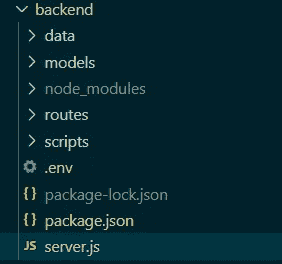

# 如何创建用于 React 应用程序的节点全局变量

> 原文：<https://levelup.gitconnected.com/how-to-create-node-global-variables-to-use-in-react-app-9df1514a4eb7>

## 修复返回未定义的 process.env.VARIABLE_NAME


Avery 应用程序有自己的敏感凭证，我们无法以某种方式将它们存储在变量中而不将其暴露给外界。本文是一篇简短的教程，介绍如何在 React 应用程序中声明和使用敏感的环境变量。

我们开始吧！

# ***步骤#1:*** 安装 ***dotenv*** 包

为此，我们将安装`doenv`包，允许我们在`.env`文件中使用变量。像任何其他包一样，我们所需要的就是使用`npm install`或`yarn`:

```
npm install ***dotenv*** --save
```

# ***步骤#2:* 创建*。env* 文件放在正确的位置，并在那里列出你的变量**

现在我们已经安装了 ower 依赖项，我们可以继续创建 ***。env*** 在你的项目的根更确切地说是在同一层次的`package.json`文件中。位置对这个作品来说非常重要。

这里有一个例子:



**里面的*。env*** 文件，我们如下声明我们的变量:

```
**REACT_APP**_DB_URI=*mongodb://localhost:27017/myDB* **REACT_APP**_PORT=5000
```

**/！\ —** 注意，对于每个变量，我们在每一行的末尾使用前缀`React_APP`和**而不是**逗号`,`。

# ***步骤#3:*** 导入 dotenv 配置

现在我们有了变量，我们准备使用它们。但是，在此之前，我们需要导入 ***dotenv*** 包配置以便我们的 ***。可以找到并读取 env* 和**文件。下面是导入配置需要添加的内容:

```
require('dotenv').config();
```

# ***步骤#4:*** 使用变量

就是这样。我们的变量和配置都已经设置好了。要使用它们，我们需要这样称呼它们:

```
process.env.VARIABLE_NAME
```

# 第五步:真实的例子

这是我的 express 服务器，我在其中使用数据库的 URI:

本文到此为止，谢谢！

我希望你和你的家人无论在哪里都平安无事！

***坚持住。明天会更好！***

**FAM**

**关注我上** [**中**](https://medium.com/@famzil/) **，**[**Linkedin**](https://www.linkedin.com/in/fatima-amzil-9031ba95/)**，** [**【脸书**](https://www.facebook.com/The-Front-End-World) **，**[**Twitter**](https://twitter.com/FatimaAMZIL9)**查看更多文章。**

