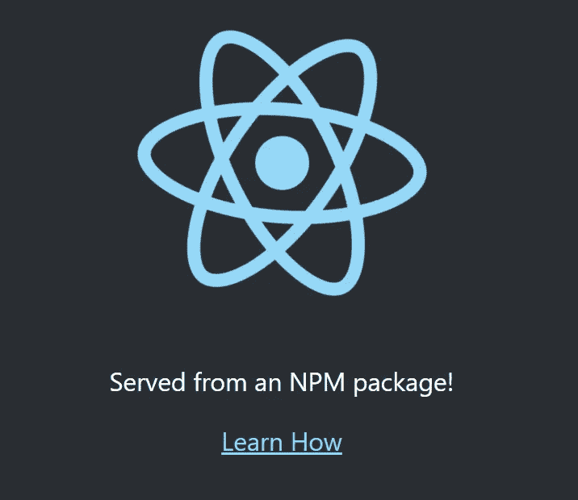

# 如何从 React 应用程序创建 NPM 包

> 原文：<https://levelup.gitconnected.com/how-to-create-npm-package-out-of-react-app-7556b9b47bce>

在这篇文章中，我们将看看如何在 React 应用程序的基础上创建一个 NPM 包。具体来说，我们将使用 [Create-React-App](https://create-react-app.dev/) 的构建输出，并创建一个将路径导出到`index.html`和`build`文件夹的包。这使得静态文件可以从后端提供，比如`express`。尽管这个例子使用了 React，但我认为这种技术应该适用于所有前端框架，因为它们最终都会生成 HTML、JS 和 CSS 以供浏览器呈现。

你可能会问:

> 你为什么想要创建一个包？

好问题！在大多数情况下，你的应用程序是在线部署的，并被视为一个网站，因此用户只需访问一个已知的 URL，而不是下载一个包。在我的例子中，这个应用程序充当了一个接口，通过 HTTP 与运行在本地机器上的服务器进行通信。需要知道它们之间的 API，并耦合更改。

在普通网站中，UI 和服务器都在您的控制之下，因此当您重新部署界面以使用需要新端点的新功能时。您还可以保证服务器得到更新，以公开特性所需的新端点。但是，当服务器运行在 localhost 上时(这是 post 范围之外的其他原因所必需的)，您不能保证它会被更新。

这一要求使得将界面作为网站托管的传统做法不受欢迎。这将要求用户知道他们运行的是哪个版本的服务器，然后确保他们将相同的版本放在 URL 中，如`www.react-ui.com/admin/v2.20.1/home`，由于版本不匹配，可能会有许多用户错误，由于只有部分 API 支持，这些错误很难诊断。

相反，通过从本地服务器提供 UI 来消除这类错误。这个服务器知道自己的版本，它可以使用标准的 NPM 软件包版本请求正确的用户界面，这样就可以保证它们是相同的，并减轻客户的负担。你可以认为这类似于一个电子应用程序，它可以有一个用户界面和类似浏览器的功能，但也使用较低级别的节点功能，但这是一个更轻的解决方案，仍然使用正常的浏览器体验。这篇文章将关注用户界面，因为这是非传统的部分，也是有趣的部分。

既然我们清楚了为什么需要这个包。让我们看看如何创建包。

# 目标是什么？

首先，让我们看看在 Express 上托管一个应用程序需要什么，并与 CRA 的输出进行比较。

在 CRA 网站上，您可以看到如何从 express 输出服务器。

[](https://create-react-app.dev/docs/deployment#other-solutions) [## 创建 React 应用程序通过运行一个命令设置一个现代化的 web 应用程序。

### “npm 运行构建”创建一个“构建”目录，其中包含应用程序的生产构建。设置您最喜欢的 HTTP 服务器，以便…

创建-反应-应用程序.开发](https://create-react-app.dev/docs/deployment#other-solutions) 

如何用 Express 托管 React app

注意，这里我们需要的唯一信息是提供静态文件的/build 文件夹的路径和路由所有请求的 index.html 的路径。

**建立文件夹:** `path.join(__dirname, ‘build’)`
**索引文件:** `path.join(__dirname, ‘build’, ‘index.html’)`

接下来，让我们看看如何从包中获取这些信息。

## 创建新的 React 应用程序。

首先创建一个新的 react 应用程序

```
npx create-react-app cra-package --template typescript
```

如果我们进入项目`cd cra-package`，然后构建应用`npm run build`，注意上面提到的`/build`文件夹和`index.html`文件。

现在我们需要创建一个这个构建文件夹内容的包，但是它也必须导出这些特殊的路径，并且不管它安装在本地机器的什么位置或者在`node_modules`中都能工作。

首先让我们编写一个脚本来创建`package`文件夹。

在`cra-package`的根目录下创建一个新的文件夹`scripts`，其中将包含一个生成包文件夹的脚本。

运行以下命令

```
mkdir scripts
cd scripts
npx tsc --init
```

调整`tsconfig.json`,只编译我们现在要创建的`createPackage.ts`。

用以下内容创建`createPackage.ts`:

要点似乎被媒体剪辑了。这里是直接链接
[https://gist . github . com/mattmazzola/97 C1 B4 fa 2036 F5 B9 ada 78131 e 79 E4 BC 1](https://gist.github.com/mattmazzola/97c1b4fa2036f5b9ada78131e79e4bc1)

接下来让我们创建这个脚本所依赖的`index.ts`脚本。

类似地，在`cra-package`的根目录下创建一个新文件夹`packageScripts`来表示我们将放入包中的脚本。这是一个单独的文件夹，因为它有单独的`tsconfig.json`设置。

我们将再次使用 typescript 并利用编译过程输出到`package`文件夹中。

```
mkdir packageScripts
cd ./packageScripts
npx tsx --init
```

创建一个`index.ts`文件来表示我们包的主脚本。

添加这些内容:

注意我们使用了`__dirname`这是让包工作的原因，不管它安装在哪里，也不依赖于硬编码的路径。

参见:[https://nodejs.org/api/modules.html#modules_dirname](https://nodejs.org/api/modules.html#modules_dirname)

## 创建并运行两个 typescript 项目的 NPM 脚本

在 package.json 中添加一个 NPM 脚本，以实际利用您刚刚创建的这两个脚本，并创建`package`文件夹。

```
"builduipackage": "tsc -p ./packageScripts/tsconfig.json --outDir ./package && tsc -p ./scripts/tsconfig.json && node ./scripts/createPackage.js",
```

提醒一下，`packageScripts`的第一次编译有效地将输出复制到包文件夹中，然后`createPackage.ts`脚本的执行有效地将`build`文件夹复制到`package`文件夹中，并创建一个新的`package.json`，它重用了根的名称，但是由于没有依赖项，所以删除了依赖项。

现在,`package`文件夹已经具备了作为 NPM 包发布的所有要求。你可以从那个文件夹中手动运行`npm publish`，或者更好的是设置一个 CD 管道来发布和自动化版本控制，但这是另一篇文章的主题，因为有很多这样的文章。

对于本文，我们将通过运行`npm pack`创建一个本地包文件来进行本地测试。

接下来，让我们创建一个简单的服务器来测试我们的包功能。

## 创建 express 服务器来服务 React 应用程序

```
git init express-server
cd express-server
npm init -y
npm i typescript express
npm i -D @types/express
npx tsc --init
```

2.修改`tsconfig.json`以编译到构建文件夹。

```
"outDir": "./build"
```

3.安装上面创建的本地包文件。如:(文件路径可能不同)

```
npm i E://Repos/cra-package/package/cra-package-0.1.0.tgz
```

确保在`package.json`中添加条目，例如:

```
"cra-package": "file:../cra-package/package/cra-package-0.1.0.tgz",
```

添加`src/index.ts`来表示我们的服务器，使用 React 文档中给出的示例的稍微修改的版本，但是使用我们的包路径。

index.ts

我们使用包装上的`directoryPath`和`defaultFilePath`。

现在让我们添加 npm 脚本来运行服务器！

```
"start": "node build/index.js"
```

运行`build` (tsc)然后启动服务器。您应该看到默认的 React 应用程序显示在您的浏览器上。如果你愿意，你可以编辑 React 应用程序并重新发布以查看更改。

现在，您有了一个创建版本化 react 应用程序的流程，该应用程序利用了 NPM 发布的版本。



希望你能从这篇文章中学到一些东西。

如果你对代码感兴趣，或者我在文章中犯了一个错误，这里有两个 repos 来测试你自己的最终设置。

*   [https://github.com/mattmazzola/cra-package](https://github.com/mattmazzola/cra-package)
*   [https://github.com/mattmazzola/express-package-host](https://github.com/mattmazzola/express-package-host)

# 录像

文件的一些脚本可能还不清楚，所以这里有一个视频。