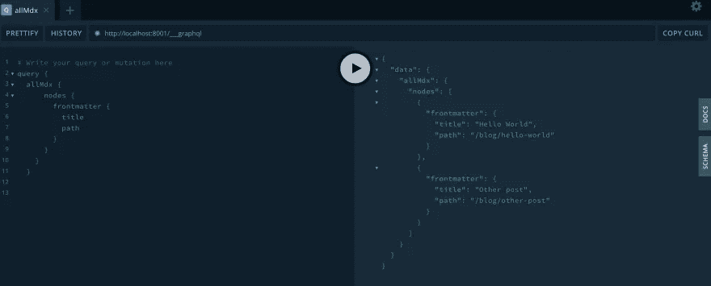
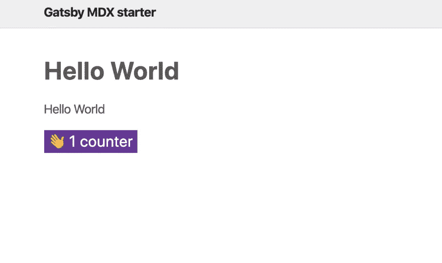

# 如何使用 MDX 在 Gatsby 中动态创建页面

> 原文：<https://levelup.gitconnected.com/how-to-create-pages-dynamically-in-gatsby-using-mdx-66faa175944e>


由[埃斯特扬森斯](https://unsplash.com/@esteejanssens)拍摄的照片

在本帖中，我们将探讨如何在 Gatsby 中使用 MDX 以编程方式创建页面。

# 装置

要启动并运行，我们需要安装几个插件

## 1.MDX 相关插件

```
npm i gatsby-plugin-mdx @mdx-js/mdx @mdx-js/react
```

然后我们需要在`gatsby-config.js`里面配置 gatsby-plugin-mdx

```
plugins: [
  {
    resolve: 'gatsby-plugin-mdx',
    options: {
      defaultLayouts: {
        default: require.resolve('./src/components/Layout.js'),
      },
    },
  },
];
```

首先，我们需要解析插件`gatsby-plugin-mdx`,因为我们还想传入 options 对象，它定义了我们想在 MDX 文件中使用的布局。

注意:`require.resolve`给我们绝对路径名。

因此，我们加载的任何 MDX 文件都将被加载到我们在`gatsby-config`中定义的 Layout.js 模板中。

现在我们已经安装了插件，它将在我们在 gatsby-config 中定义的 pages 或 posts 目录中查找 mdx 文件。

## 2.源文件相关插件。

为了让帖子页进入盖茨比，我们将使用另一个插件`gatsby-source-filesystem`

```
npm i gatsby-source-filesystem
```

把它们放到数据层，这样我们就可以访问它们了。gatsby 源文件系统是使用本地文件作为 graphql 数据层的一部分的一种方式。

一旦安装完成，我们需要更新 gatsby 配置来解析源文件系统插件

```
plugins: [
  {
    resolve: 'gatsby-plugin-mdx',
    options: {
      defaultLayouts: {
        default: require.resolve('./src/components/Layout.js'),
      },
    },
  },
  {
    resolve: 'gatsby-source-filesystem',
    options: {
      name: 'posts',
      path: `${__dirname}/content/posts`,
    },
  },
];
```

因此，它将加载它在路径`/content/posts`中找到的任何东西作为数据层的一部分，并且因为我们安装了 gatsby MDX 插件，它将寻找 MDX 文件并将这些文件转换成 GraphQL 节点。

# 什么时候应该使用 MDX？

使用 MDX 的全部原因是因为我们希望在标记生成的页面中添加某种交互性。

# 引导程序

既然我们添加了配置来查找系统中的文件并将它们转换成 GraphQL 节点，我们将需要使用 gatsby API `createPages`通过在`gatsby-node.js`中配置来以编程方式生成那些 post 文件作为页面。

gatsby 本身有几个可用的 API，可以用来扩展 gatsby 的工作方式，在这些 API 中，您可以导出一个与 Gatsby 寻找的挂钩同名的函数。因此，gatsby 将在构建阶段执行这些指令。

在这种情况下，我们想要创建页面，所以我们使用`exports.createPages`，因为我们要加载数据，所以我们使函数异步。

gatsby 将为我们提供几个实用方法，如 actions、graphql helper 和 reporter(如果您想在控制台中放些东西，可以使用它们，这是 Gatsby 内部的一种 console.log)

```
// gatsby-node.js
exports.createPages = async ({ actions, graphql, reporter }) => {
  const result = await graphql(`
    query {
      allMdx {
        nodes {
          frontmatter {
            path
          }
        }
      }
    }
  `); if (result.errors) {
    reporter.panic('failed to create posts ', result.errors);
  } const pages = result.data.allMdx.nodes; pages.forEach(page => {
    actions.createPage({
      path: page.frontmatter.path,
      component: require.resolve('./src/templates/postTemplate.js'),
      context: {
        pathSlug: page.frontmatter.path,
      },
    });
  });
};
```

在 createPage 函数中，我们将使用 GraphQL 助手通过传递一个 GraphQL 查询从数据层获取节点，如您在上面的代码片段中所见。

然后，我们使用`actions.createPage`创建页面，遍历这些以数组形式返回的页面，以编程方式生成它们，如下面的截图所示



`actions.createPage`接受一个 options 对象作为参数，它有 3 个属性:路径、组件和上下文。
`Path`就是我们在 mdx 中定义的 frontmatter。
`Component`获取您想要用于这些页面的模板的路径。下面是一个用作页面模板的样本片段。

```
import { graphql } from 'gatsby';
import { MDXRenderer } from 'gatsby-plugin-mdx';
import React from 'react';import Layout from '../components/Layout';export const query = graphql`
  query($pathSlug: String!) {
    mdx(frontmatter: { path: { eq: $pathSlug } }) {
      frontmatter {
        title
        path
      }
      body
    }
  }
`;const Post = ({ data: { mdx: post } }) => {
  const { title } = post.frontmatter;
  const { body } = post;
  return (
    <div>
      <Layout>
        <h1>{title}</h1>
        <MDXRenderer>{body}</MDXRenderer>
      </Layout>
    </div>
  );
};export default Post;
```

`Context`接受一个以 pathSlug 为属性的对象，这是我们传递给上面查询的值。

添加完上面的内容后，现在我们可以向 MDX 页面添加交互性，如下所示

```
---
path: '/blog/hello-world'
date: '2020/01/01'
title: 'Hello World'
summary: 'hello world post'
---import Counter from '../../../src/components/Counter';Hello World<Counter />
```



**在这篇文章之后，你可以在这里** **找到一个 starter repo** [**，它显示了 mdx 页面的用法**](https://github.com/gabroun/gatsby-mdx-starter)