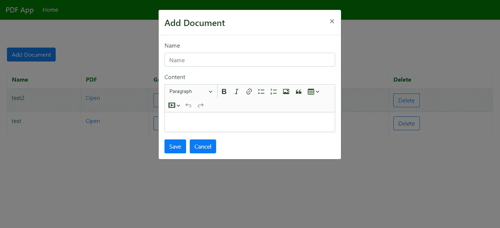
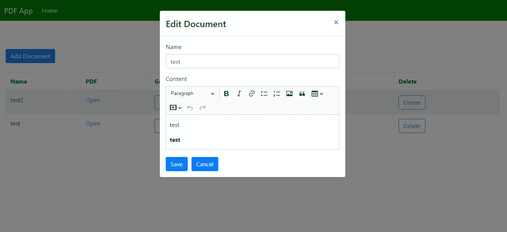
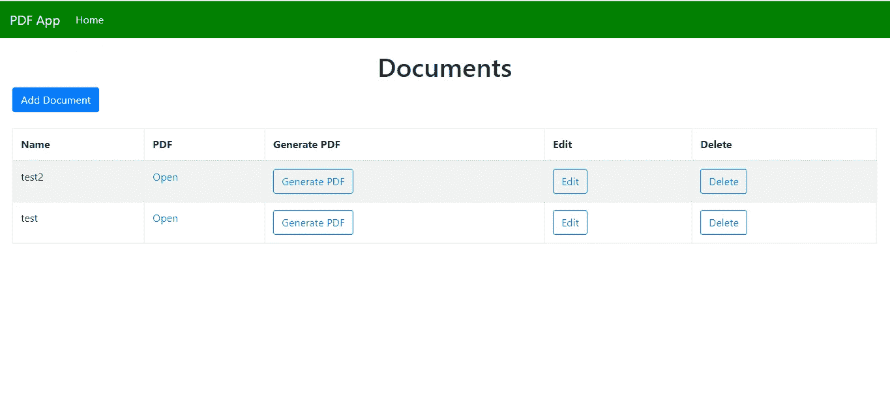
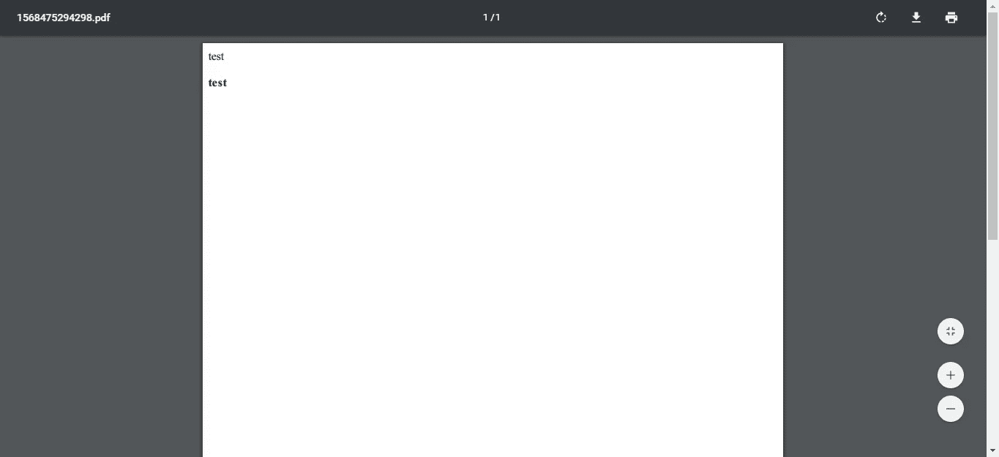

# 如何用 Node.js 创建 pdf

> 原文：<https://levelup.gitconnected.com/how-to-create-pdfs-with-node-js-c2eb94034f01>


每个人都使用 pdf——不言而喻，它是最常见的文档格式之一。因此，许多应用程序的一个功能是从其他类型的文档创建 pdf。通过使用第三方库，在 Node.js 中创建 pdf 很容易，我们可以轻松地将该功能添加到我们自己的应用程序中。

在本文中，我们将构建一个应用程序，让用户在富文本编辑器中输入他们的文档，并从中生成 PDF。我们将使用 Express 作为后端，React 作为前端。

# 后端

我们将从后端开始。首先，我们将创建一个项目目录，其中包含一个`backend`文件夹。然后在`backend`文件夹中，运行`npx express-generator`创建快递 app。然后运行`npm i`安装软件包。

接下来，我们安装自己的软件包。我们需要 Babel 使用最新版本的 JavaScript 运行应用程序，CORS 用于前端的跨域请求，HTML-PDF 用于将 HTML 字符串转换为 PDF，Multer 用于文件上传，Sequelize 用于 ORM，SQLite3 用于我们的数据库。

我们通过运行`npm i @babel/cli @babel/core @babel/node @babel/preset-env cors html-pdf sequelize sqlite3 multer`来安装这些。

之后，我们将`package.json`的`scripts`部分改为:

```
"start": "nodemon --exec npm run babel-node --  ./bin/www",
"babel-node": "babel-node"
```

这让我们可以用 Babel 而不是常规的节点运行时来运行我们的应用程序。

然后我们需要在`backend`文件夹中创建一个`.babelrc`文件，并添加:

```
{
    "presets": [
        "[@babel/preset-env](http://twitter.com/babel/preset-env)"
    ]
}
```

这指定我们用最新版本的 JavaScript 运行我们的应用程序。

接下来，我们添加数据库代码。运行`backend`文件夹中的`npx sequelize-cli init`生成序列代码。

我们现在应该在项目中有一个`config.js`。在那里加上:

```
{
  "development": {
    "dialect": "sqlite",
    "storage": "development.db"
  },
  "test": {
    "dialect": "sqlite",
    "storage": "test.db"
  },
  "production": {
    "dialect": "sqlite",
    "storage": "production.db"
  }
}
```

这为我们的数据库声明了 SQLite。

接下来，通过运行以下命令来创建我们的模型和迁移:

```
npx sequelize-cli model:create --name Document --attributes name:string,document:text,pdfPath:string
```

这将创建一个`Document`模型和`Documents`表格。

为了创建我们的数据库，我们运行:

```
npx sequelize-cli db:migrate
```

现在我们需要创建我们的路线。在`routes`文件夹中创建一个`pdf.js`文件，并添加:

```
var express = require("express");
var pdf = require("html-pdf");
const models = require("../models");
var multer = require("multer");
const fs = require("fs");
var router = express.Router();
const storage = multer.diskStorage({
  destination: (req, file, cb) => {
    cb(null, "./files");
  },
  filename: (req, file, cb) => {
    cb(null, `${file.fieldname}_${+new Date()}.jpg`);
  }
});const upload = multer({
  storage
});router.get("/", async (req, res, next) => {
  const documents = await models.Document.findAll();
  res.json(documents);
});router.post("/", async (req, res, next) => {
  const document = await models.Document.create(req.body);
  res.json(document);
});router.put("/:id", async (req, res, next) => {
  const id = req.params.id;
  const { name, document } = req.body;
  const doc = await models.Document.update(
    { name, document },
    { where: { id } }
  );
  res.json(doc);
});router.delete("/:id", async (req, res, next) => {
  const id = req.params.id;
  await models.Document.destroy({ where: { id } });
  res.json({});
});router.get("/generatePdf/:id", async (req, res, next) => {
  const id = req.params.id;
  const documents = await models.Document.findAll({ where: { id } });
  const document = documents[0];
  const stream = await new Promise((resolve, reject) => {
    pdf.create(document.document).toStream((err, stream) => {
      if (err) {
        reject(reject);
        return;
      }
      resolve(stream);
    });
  });const fileName = `${+new Date()}.pdf`;
  const pdfPath = `${__dirname}/../files/${fileName}`;
  stream.pipe(fs.createWriteStream(pdfPath));
  const doc = await models.Document.update(
    { pdfPath: fileName },
    { where: { id } }
  );
  res.json(doc);
});router.post("/uploadImage", upload.single('upload'), async (req, res, next) => {
  res.json({
    uploaded: true,
    url: `${process.env.BASE_URL}/${req.file.filename}`
  });
});module.exports = router;
```

在前 4 条路线中，我们对`Documents`表执行标准的 CRUD 操作。我们有 GET 用于获取所有的`Documents`，post 用于从 POST 参数创建一个`Document`，PUT 用于通过 ID 更新一个`Document`，DELETE 用于通过 ID 查找删除一个`Document`。我们在`document`字段中有 HTML，用于稍后生成 PDF。

`generatePdf`是允许我们构建 PDF 的函数。我们从 URL 获取 ID，然后使用 HTML-PDF 包生成 PDF。我们通过用 HTML-PDF 包将 HTML 文档转换成文件流对象来生成 PDF。然后，我们将流写入一个文件，并将文件的路径保存在带有 URL 参数中的 ID 的`Document`模型中。

我们也有一个`uploadImage`路线，让用户用 CKEditor 上传图片。插件期望函数返回的响应中有`uploaded`和`url`。

然后我们需要在`backend`目录下添加一个`files`文件夹。

接下来在`app.js`中，我们将现有代码替换为:

```
var createError = require("http-errors");
var express = require("express");
var path = require("path");
var cookieParser = require("cookie-parser");
var logger = require("morgan");
var cors = require("cors");var indexRouter = require("./routes/index");
var pdfRouter = require("./routes/pdf");var app = express();// view engine setup
app.set("views", path.join(__dirname, "views"));
app.set("view engine", "jade");app.use(logger("dev"));
app.use(express.json());
app.use(express.urlencoded({ extended: false }));
app.use(cookieParser());
app.use(express.static(path.join(__dirname, "public")));
app.use(express.static(path.join(__dirname, "files")));
app.use(cors());app.use("/", indexRouter);
app.use("/pdf", pdfRouter);// catch 404 and forward to error handler
app.use(function(req, res, next) {
  next(createError(404));
});// error handler
app.use(function(err, req, res, next) {
  // set locals, only providing error in development
  res.locals.message = err.message;
  res.locals.error = req.app.get("env") === "development" ? err : {};// render the error page
  res.status(err.status || 500);
  res.render("error");
});module.exports = app;
```

我们用以下内容公开文件夹:

```
app.use(express.static(path.join(__dirname, "files")));
```

并暴露出`pdf`路线:

```
var pdfRouter = require("./routes/pdf");
app.use("/pdf", pdfRouter);
```

# 前端

既然后端已经完成，我们可以开始前端了。使用创建 React 应用程序创建 React 应用程序。我们在项目的根文件夹中运行`npx create-react-app frontend`。

然后我们安装我们的软件包。我们将使用 CKEditor 作为富文本编辑器，Axios 作为 HTTP 请求，Bootstrap 作为样式，MobX 作为简单的状态管理，React Router 作为将 URL 路由到组件，Formik 和 Yup 分别作为表单值处理和表单验证。

运行`npm i @ckeditor/ckeditor5-build-classic @ckeditor/ckeditor5-react axios bootstrap formik mobx mobx-react react-bootstrap react-router-dom yup`安装所有软件包。

安装好软件包后，我们就可以开始了。在`App.js`中，我们将现有代码替换为:

```
import React from "react";
import HomePage from "./HomePage";
import { Router, Route } from "react-router-dom";
import { createBrowserHistory as createHistory } from "history";
import TopBar from "./TopBar";
import { DocumentStore } from "./store";
import "./App.css";
const history = createHistory();
const documentStore = new DocumentStore();function App() {
  return (
    <div className="App">
      <Router history={history}>
        <TopBar />
        <Route
          path="/"
          exact
          component={props => (
            <HomePage {...props} documentStore={documentStore} />
          )}
        />
      </Router>
    </div>
  );
}export default App;
```

这将我们的顶部酒吧和路线添加到主页。

在`App.css`中，我们将现有代码替换为:

```
.page {
  padding: 20px;
}.content-invalid-feedback {
  width: 100%;
  margin-top: 0.25rem;
  font-size: 80%;
  color: #dc3545;
}nav.navbar {
  background-color: green !important;
}
```

这为我们的页面添加了一些填充，为富文本编辑器设计了验证消息的样式，并改变了`navbar`的颜色。

接下来，我们创建用于添加和编辑文档的表单。在`src`文件中创建一个`DocumentForm.js`并添加:

```
import React from "react";
import * as yup from "yup";
import Form from "react-bootstrap/Form";
import Col from "react-bootstrap/Col";
import Button from "react-bootstrap/Button";
import { observer } from "mobx-react";
import { Formik, Field } from "formik";
import { addDocument, editDocument, getDocuments, APIURL } from "./request";
import CKEditor from "[@ckeditor/ckeditor5-react](http://twitter.com/ckeditor/ckeditor5-react)";
import ClassicEditor from "[@ckeditor/ckeditor5-build-classic](http://twitter.com/ckeditor/ckeditor5-build-classic)";const schema = yup.object({
  name: yup.string().required("Name is required")
});function DocumentForm({ documentStore, edit, onSave, doc }) {
  const [content, setContent] = React.useState("");
  const [dirty, setDirty] = React.useState(false); const handleSubmit = async evt => {
    const isValid = await schema.validate(evt);
    if (!isValid || !content) {
      return;
    }
    const data = { ...evt, document: content };
    if (!edit) {
      await addDocument(data);
    } else {
      await editDocument(data);
    }
    getAllDocuments();
  }; const getAllDocuments = async () => {
    const response = await getDocuments();
    documentStore.setDocuments(response.data);
    onSave();
  }; return (
    <>
      <Formik
        validationSchema={schema}
        onSubmit={handleSubmit}
        initialValues={edit ? doc : {}}
      >
        {({
          handleSubmit,
          handleChange,
          handleBlur,
          values,
          touched,
          isInvalid,
          errors
        }) => (
          <Form noValidate onSubmit={handleSubmit}>
            <Form.Row>
              <Form.Group as={Col} md="12" controlId="name">
                <Form.Label>Name</Form.Label>
                <Form.Control
                  type="text"
                  name="name"
                  placeholder="Name"
                  value={values.name || ""}
                  onChange={handleChange}
                  isInvalid={touched.name && errors.name}
                />
                <Form.Control.Feedback type="invalid">
                  {errors.name}
                </Form.Control.Feedback>
              </Form.Group>
            </Form.Row> <Form.Row>
              <Form.Group as={Col} md="12" controlId="content">
                <Form.Label>Content</Form.Label>
                <CKEditor
                  editor={ClassicEditor}
                  data={content || ""}
                  onInit={editor => {
                    if (edit) {
                      setContent(doc.document);
                    }
                  }}
                  onChange={(event, editor) => {
                    const data = editor.getData();
                    setContent(data);
                    setDirty(true);
                  }}
                  config={{
                    ckfinder: {
                      uploadUrl:
                        `${APIURL}/pdf/uploadImage`
                    }
                  }}
                />
                <div className="content-invalid-feedback">
                  {dirty && !content ? "Content is required" : null}
                </div>
              </Form.Group>
            </Form.Row> <Button type="submit" style={{ marginRight: 10 }}>
              Save
            </Button>
            <Button type="button">Cancel</Button>
          </Form>
        )}
      </Formik>
    </>
  );
}export default observer(DocumentForm);
```

我们将 React 引导程序`Form`包装在`Formik`组件中，以从 Formik 获取表单处理函数，我们直接在 React 引导程序表单字段中使用该函数。

我们不能用 CKEditor 做同样的事情，所以我们为富文本编辑器编写自己的表单处理程序。我们在`CKEditor`中设置`data`属性来设置富文本编辑器的输入值。当用户试图编辑现有文档时，使用`onInit`函数，因为我们必须通过运行`setContent(doc.document);`来设置编辑器初始化的`data`属性。`onChange`属性是每当更新时设置`content`的处理函数，因此`data`属性将具有最新的值，当用户单击保存时我们将提交该值。

我们使用 CKFinder 插件来上传图片。为了使它工作，我们将图片上传 URL 设置为后端上传路径的 URL。

表单验证模式由我们在代码顶部创建的 Yup `schema`对象提供。我们检查`name`字段是否存在。

`handleSubmit`功能是向后端提交数据。我们检查`content`和`evt`对象以查看两个字段是否都存在，因为我们不能将 Formik 表单处理程序直接合并到`CKEditor`组件中。

如果一切都有效，那么我们根据`edit`属性是否为`true`来添加新文档或更新文档。

当保存成功时，我们调用`getAllDocuments`，通过运行`documentStore.setDocuments(response.data);`将最新的文档填充到我们的 MobX 存储中。

接下来，我们通过在`src`文件夹中创建`HomePage.js`来构建我们的主页，并添加:

```
import React, { useState, useEffect } from "react";
import { withRouter } from "react-router-dom";
import DocumentForm from "./DocumentForm";
import Modal from "react-bootstrap/Modal";
import ButtonToolbar from "react-bootstrap/ButtonToolbar";
import Button from "react-bootstrap/Button";
import Table from "react-bootstrap/Table";
import { observer } from "mobx-react";
import { getDocuments, deleteDocument, generatePDF, APIURL } from "./request";function HomePage({ documentStore, history }) {
  const [openAddModal, setOpenAddModal] = useState(false);
  const [openEditModal, setOpenEditModal] = useState(false);
  const [initialized, setInitialized] = useState(false);
  const [doc, setDoc] = useState([]); const openAddTemplateModal = () => {
    setOpenAddModal(true);
  }; const closeAddModal = () => {
    setOpenAddModal(false);
    setOpenEditModal(false);
  }; const cancelAddModal = () => {
    setOpenAddModal(false);
  }; const cancelEditModal = () => {
    setOpenEditModal(false);
  }; const getAllDocuments = async () => {
    const response = await getDocuments();
    documentStore.setDocuments(response.data);
    setInitialized(true);
  }; const editTemplate = d => {
    setDoc(d);
    setOpenEditModal(true);
  }; const onSave = () => {
    cancelAddModal();
    cancelEditModal();
  }; const deleteSingleDocument = async id => {
    await deleteDocument(id);
    getAllDocuments();
  }; const generateSinglePdf = async id => {
    await generatePDF(id);
    alert("PDF Generated");
    getAllDocuments();
  }; useEffect(() => {
    if (!initialized) {
      getAllDocuments();
    }
  }); return (
    <div className="page">
      <h1 className="text-center">Documents</h1>
      <ButtonToolbar onClick={openAddTemplateModal}>
        <Button variant="primary">Add Document</Button>
      </ButtonToolbar> <Modal show={openAddModal} onHide={closeAddModal}>
        <Modal.Header closeButton>
          <Modal.Title>Add Document</Modal.Title>
        </Modal.Header>
        <Modal.Body>
          <DocumentForm
            onSave={onSave.bind(this)}
            cancelModal={cancelAddModal.bind(this)}
            documentStore={documentStore}
          />
        </Modal.Body>
      </Modal> <Modal show={openEditModal} onHide={cancelEditModal}>
        <Modal.Header closeButton>
          <Modal.Title>Edit Document</Modal.Title>
        </Modal.Header>
        <Modal.Body>
          <DocumentForm
            edit={true}
            doc={doc}
            onSave={onSave.bind(this)}
            cancelModal={cancelEditModal.bind(this)}
            documentStore={documentStore}
          />
        </Modal.Body>
      </Modal>
      <br />
      <Table striped bordered hover>
        <thead>
          <tr>
            <th>Name</th>
            <th>PDF</th>
            <th>Generate PDF</th>
            <th>Edit</th>
            <th>Delete</th>
          </tr>
        </thead>
        <tbody>
          {documentStore.documents.map(d => {
            return (
              <tr key={d.id}>
                <td>{d.name}</td>
                <td>
                  <a href={`${APIURL}/${d.pdfPath}`} target="_blank">
                    Open
                  </a>
                </td>
                <td>
                  <Button
                    variant="outline-primary"
                    onClick={generateSinglePdf.bind(this, d.id)}
                  >
                    Generate PDF
                  </Button>
                </td>
                <td>
                  <Button
                    variant="outline-primary"
                    onClick={editTemplate.bind(this, d)}
                  >
                    Edit
                  </Button>
                </td>
                <td>
                  <Button
                    variant="outline-primary"
                    onClick={deleteSingleDocument.bind(this, d.id)}
                  >
                    Delete
                  </Button>
                </td>
              </tr>
            );
          })}
        </tbody>
      </Table>
    </div>
  );
}export default withRouter(observer(HomePage));
```

我们有一个 React 引导表，用于列出带有编辑或删除文档按钮的文档，以及一个生成 PDF 的按钮。此外，每行都有一个打开 PDF 的 ppen 链接。我们有一个按钮在桌面上创建 PDF。

当页面加载时，我们调用`getAllDocuments`并在 MobX 存储中填充它们。我们用`openAddTemplateModal`、`closeAddModal`、`cancelAddModal`、`cancelEditModal`功能打开和关闭添加和编辑模式。

接下来在`src`文件夹中创建`request.js`并添加:

```
export const APIURL = "[http://localhost:3000](http://localhost:3000)";
const axios = require("axios");export const getDocuments = () => axios.get(`${APIURL}/pdf`);export const addDocument = data => axios.post(`${APIURL}/pdf`, data);export const editDocument = data => axios.put(`${APIURL}/pdf/${data.id}`, data);export const deleteDocument = id => axios.delete(`${APIURL}/pdf/${id}`);export const generatePDF = id => axios.get(`${APIURL}/pdf/generatePdf/${id}`);
```

添加在后端向我们的路由发出请求的功能。

然后我们创建我们的 MobX 商店。在`src`文件夹中创建`store.js`，并将:

```
import { observable, action, decorate } from "mobx";class DocumentStore {
  documents = [];setDocuments(documents) {
    this.documents = documents;
  }
}DocumentStore = decorate(DocumentStore, {
  documents: observable,
  setDocuments: action
});export { DocumentStore };
```

我们有函数`setDocuments`将照片数据放入商店，这是我们在`HomePage`和`DocumentForm`中使用的，我们在导出之前实例化了它，这样我们只需要在一个地方完成它。

此区块:

```
DocumentStore = decorate(DocumentStore, {
  documents: observable,
  setDocuments: action
});
```

将`DocumentStore`中的`documents`数组指定为可由组件观察变化的实体。`setDocuments`函数被指定为可用于设置存储器中的`documents`数组的函数。

接下来，我们通过在`src`文件夹中创建一个`TopBar.js`文件来创建顶栏，并添加:

```
import React from "react";
import Navbar from "react-bootstrap/Navbar";
import Nav from "react-bootstrap/Nav";
import { withRouter } from "react-router-dom";function TopBar({ location }) {
  return (
    <Navbar bg="primary" expand="lg" variant="dark">
      <Navbar.Brand href="#home">PDF App</Navbar.Brand>
      <Navbar.Toggle aria-controls="basic-navbar-nav" />
      <Navbar.Collapse id="basic-navbar-nav">
        <Nav className="mr-auto">
          <Nav.Link href="/" active={location.pathname == "/"}>
            Home
          </Nav.Link>
        </Nav>
      </Navbar.Collapse>
    </Navbar>
  );
}export default withRouter(TopBar);
```

这包含了 React 引导程序`Navbar`来显示一个带有主页链接和应用程序名称的顶栏。我们只显示本地存储器中的`token`。我们检查`pathname`，通过设置`active`道具来突出显示正确的链接。

接下来在`index.html`中，我们将现有代码替换为:

```
<!DOCTYPE html>
<html lang="en">
  <head>
    <meta charset="utf-8" />
    <link rel="shortcut icon" href="%PUBLIC_URL%/favicon.ico" />
    <meta name="viewport" content="width=device-width, initial-scale=1" />
    <meta name="theme-color" content="#000000" />
    <meta
      name="description"
      content="Web site created using create-react-app"
    />
    <link rel="apple-touch-icon" href="logo192.png" />
    <!--
      manifest.json provides metadata used when your web app is installed on a
      user's mobile device or desktop. See [https://developers.google.com/web/fundamentals/web-app-manifest/](https://developers.google.com/web/fundamentals/web-app-manifest/)
    -->
    <link rel="manifest" href="%PUBLIC_URL%/manifest.json" />
    <!--
      Notice the use of %PUBLIC_URL% in the tags above.
      It will be replaced with the URL of the `public` folder during the build.
      Only files inside the `public` folder can be referenced from the HTML.Unlike "/favicon.ico" or "favicon.ico", "%PUBLIC_URL%/favicon.ico" will
      work correctly both with client-side routing and a non-root public URL.
      Learn how to configure a non-root public URL by running `npm run build`.
    -->
    <title>PDF App</title>
    <link
      rel="stylesheet"
      href="[https://stackpath.bootstrapcdn.com/bootstrap/4.3.1/css/bootstrap.min.css](https://stackpath.bootstrapcdn.com/bootstrap/4.3.1/css/bootstrap.min.css)"
      integrity="sha384-ggOyR0iXCbMQv3Xipma34MD+dH/1fQ784/j6cY/iJTQUOhcWr7x9JvoRxT2MZw1T"
      crossorigin="anonymous"
    />
  </head>
  <body>
    <noscript>You need to enable JavaScript to run this app.</noscript>
    <div id="root"></div>
    <!--
      This HTML file is a template.
      If you open it directly in the browser, you will see an empty page.You can add webfonts, meta tags, or analytics to this file.
      The build step will place the bundled scripts into the <body> tag.To begin the development, run `npm start` or `yarn start`.
      To create a production bundle, use `npm run build` or `yarn build`.
    -->
  </body>
</html>
```

这增加了引导 CSS 并改变了标题。

写完所有代码后，我们就可以运行我们的应用程序了。在运行任何东西之前，通过运行`npm i -g nodemon`来安装`nodemon`，这样当文件改变时，我们就不必自己重启后端了。

然后通过运行`backend`文件夹中的`npm start`和`frontend`文件夹中的`npm start`来启动后端，如果要求您从不同的端口运行它，请选择“是”。

然后你会得到:

