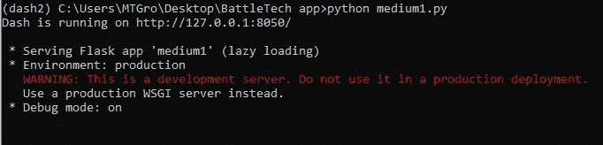
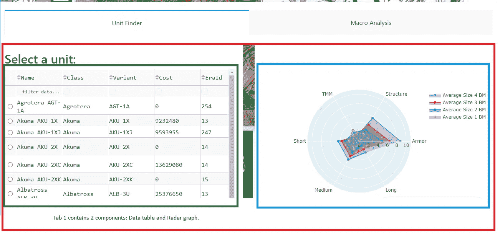

# 如何使用 Dash 2.0 创建强大的 Web 应用和仪表盘

> 原文：<https://levelup.gitconnected.com/how-to-create-powerful-web-apps-and-dashboards-using-dash-2-0-a05db174f20d>

## 使用 Python 设计多页面 Web 应用程序


由[布鲁克·卡吉尔](https://unsplash.com/@brookecagle?utm_source=medium&utm_medium=referral)在 [Unsplash](https://unsplash.com?utm_source=medium&utm_medium=referral) 拍摄

# 不熟悉 Dash 或 Python？

自从我创建了[pythondashboards.com](http://pythondashboards.com)来帮助人们学习 [Dash 框架](https://dash.plotly.com/)以来，已经有一年多了，到目前为止，我的教程已经获得了超过 30 万的浏览量。我真诚地感谢所有支持我并发现我的内容有帮助的人。我感谢反馈，并将继续发布内容来帮助初学者和其他人掌握 Dash 库。


读者的评价。作者图片

在本文中，我先来看看 Dash 2！Plotly 最近宣布了它，并提供了预发布版本。它是 99%向后兼容的，但是当在 Dash 2.0 中启动旧的 1.x 代码时，你仍然会看到一些警告。

## 入门指南

创建一个新的 Python 环境，然后用:`pip install dash==2.0.0rc2`安装 Dash 2。

对于完全的初学者，我将解释如何创建一个简单的 Dash 2.0 web 应用程序，然后看一个使用多个页面和选项卡的复杂示例！

如果你是一个短跑初学者或者需要复习，这是最适合你的文章。它分为 5 个主要部分:

1.什么是破折号
2。仪表板基础知识
3。创建一个简单的 Dash 应用程序
4。造型仪表板应用程序
5。创建一个复杂的 Dash 应用程序 BattleTech 应用程序(在我的 github 上找到完整的代码)

[如果你已经是 Dash 专业人士，只想看看 2.0 中的新功能，请查看公告页面](https://go.plotly.com/announcing-dash-2)。


BattleTech 应用(图片由作者提供)

# Dash 是什么？

Dash by Plotly 是一个基于 Flask、Plotly.js 和 React.js 编写的强大的 Python 框架，它将这些技术的复杂性抽象为易于应用的组件。任何有一点 Python 和 HTML 经验的人都会觉得 Dash 使他们能够毫不费力地创建基于 web 的交互式应用程序，如网站和仪表盘。引用 Dash 文档“Dash 非常简单，您可以在一个下午的时间内围绕您的 Python 代码绑定一个用户界面。”

Dash 是一个强大的工具，非常适合 Python 程序员。它有一个不断增长的社区，充满了热情的开发者和创造者。由于该框架是开源的，[社区开发了一些非常酷的组件，可以集成到任何 Dash 应用程序中](https://plotly.com/dash-community-components/)！此外，正如我们在 2.0 版本中看到的，Plotly 团队正在继续开发和改进 Dash，以进一步简化用户体验。

# 仪表板基础

虽然 Dash 的设计考虑到了分析，但是[完全可以使用 Dash 来设计博客、联盟营销或电子商务等网站](https://medium.com/swlh/how-to-start-a-business-in-an-afternoon-using-python-and-dash-48a8cb08f290)。使用 Dash，您不需要从头开始编写任何 HTML 或 CSS，尽管理解每种语言的基础对用户界面设计肯定有帮助。

Dash 应用程序主要由两部分组成:

1.布局

2.复试

## 仪表板布局

布局由组件树组成，描述应用程序的外观以及用户如何体验内容。如果熟练掌握 JavaScript 和 React.js，可以构建自己的组件；然而，Dash 附带了多个组件库，如 **dash_core_components** 、 **dash_html_components** 和 **Dash DataTable** 。

***Dash 2.0***中新增，用户现在可以创建[一体化组件(AIOC)](https://dash.plotly.com/all-in-one-components) ，本质上是用纯 Python 编写的可共享组件。稍后我会介绍更多关于 AIOC 的内容。

**dash_html_components** 库几乎为每个 html 标签都提供了一个组件。 **dash_core_components** 库包括更高级别的交互式组件，如按钮、输入字段、图表和下拉菜单。Dash DataTable 使得将可过滤的、分页的数据表集成到你的应用程序中变得容易。查看文档以获得核心组件库的完整列表。

## Dash 回调

回调是让 Dash 应用程序交互的逻辑所在。现在，只要理解回调是 Python 函数，只要输入组件的属性改变，就会自动调用它。例如，想象一个网站上的按钮。单击时，会在后台触发一个回调，触发按钮的功能。可以链接回调，使一个更改触发整个应用程序的多个更新。

基本上，回调由 ***输入*** 和 ***输出*** 组成。该功能通过 app.callback [decorator](https://www.python-course.eu/python3_decorators.php) 实现。输入和输出只是用户可以与之交互的组件的属性。例如，输入可以是从下拉列表中选择的选项，输出可以是可视化。假设我有一个州的下拉列表，当我选择 CA 时，加利福尼亚会在地图上突出显示。

***Dash 2.0 中新增的*** ，`app.callback`接受各种输入和输出参数形状，如字典、分组元组等等。这使得回调签名比 Dash 1 灵活得多。例如:

```
[@app](http://twitter.com/app).callback( 
    output={'x':Output(...), 'y':Output(...)},
    inputs=dict(a=Input(...), b=Input(...)),
def callback(a, b):
    return dict(x=a *a, y=a * b)
```

# 创建一个简单的 Dash 2.0 应用

看一些代码，基础知识会更有意义，所以让我们按照以下四个步骤构建一个简单的 Dash 应用程序:

步骤 1:
导入依赖项，如 Dash 和组件库。

***在 Dash 2.0 中新增，*** 导入被简化。在 Dash 1 中，每个应用程序都有几行相同的样本导入。Dash 2 合并了包，允许在一行中完成导入:

```
from dash import Dash, Input, Output, State, html, dcc, dash_table, callback
```

注意**回调**包含在依赖项中。使用 ***回调*** 装饰器是 Dash 1 中常用的 ***app.callback*** 的替代方法。当构建 All in One 组件时，使用 alternative decorator 非常有用。

步骤 2:
使用这段代码实例化应用程序:

```
app = Dash(__name__)
```

步骤 3:
使用 [Dash HTML 组件](https://dash.plotly.com/dash-html-components)定义布局。

```
app.layout = html.Div(id = 'div1', children = [html.H1("My first Dash app!")])
```

步骤 4:
使用下面的样板代码运行服务器。Dash 使用 Flask 作为其服务器后端，因此您可以将 *debug=True* 传递到服务器调用中以启用一些诊断。

```
if __name__ == "__main__":
     app.run_server(debug = True) 
```

综合起来，代码将如下所示:

```
#step 1
from dash import Dash, Input, Output, State, html, dcc, dash_table, callback#step 2
app = Dash(__name__)#step 3
app.layout = html.Div(id = ‘div1’, children = [html.H1("My first Dash 2.0 app!")])#step 4
if __name__ == "__main__":
     app.run_server(debug = True)
```

注意在步骤 3 中 **app.layout** 是我们开始构建 Dash 应用组件树的地方。通常的做法是以 html 开始布局。Div 组件，因为 HTML < div >标签充当容器并定义 HTML 文档中的分部或部分。

注意这个 **html。Div** 组件的属性: **id** 和**子级**。

它们是所有 Dash HTML 组件的属性。在后面的例子中，我们将在回调中使用 id 值，并使用回调来动态加载孩子。我在这个例子中添加了孩子，但是默认情况下，我们不需要显式声明 *children=* ，因为这个例子中的代码非常简单。代码可以简单地是 **html。Div([html。H1(……)])**。

**html。H1** 组件在 **html 中。Div** 为文本创建一个*一级*标题。

## 运行应用程序

通过键入以下内容，在控制台中运行应用程序:

```
$ python medium1.py
```

然后在 web 浏览器中访问 [http://127.0.0.1:8050/](http://127.0.0.1:8050/) 。控制台中将显示以下内容:



Dash 应用程序运行(图片由作者提供)

当您转到该 URL 时，您应该会看到如下所示的页面:


Dash 2.0 应用程序(图片由作者提供)

在引擎盖下，Python 代码基本上被转换成 HTML，如下所示:

```
<div><h1>My first Dash app!</h1></div>
```


[https://developer.mozilla.org/en-US/docs/Glossary/Element](https://developer.mozilla.org/en-US/docs/Glossary/Element)

如果你将它复制到一个文本文件中并保存为一个*。你会在你的 Dash 应用中看到同样的东西！*

使用 HTML 组件来定义 Dash 应用程序的外观。以下是一些常见的 HTML 组件。我建议阅读 Dash html 组件文档，通过将这些组件添加到我们刚刚创建的示例应用程序中来研究它们，看看它们如何影响布局:


常见 html 组件(图片由作者提供)

# 设计 Dash 应用程序

大多数 HTML 组件都有一个样式参数，允许你传递一个带有 CSS 的字典来修改组件的外观。例如，如果我们想在第一个应用程序示例中添加一个 ***背景图像*** ，我们可以在 html.Div 中添加 ***样式*** 。代码如下所示:

```
html.Div(**style={
        'background-image': 'url("/assets/btimage1.png")',
        'background-position': 'center',
        }**
        ,id = 'div1'
        , children = [
            html.H1("My first Dash 2.0 app!")
            , html.Br()
            , html.H1("This app has been styled with an image.")
            , html.Br()
            , html.H1("This text is black.")
            , html.Br()
            , html.H1(**style = {'color':'red'}**
                       , children=["This text is red."])

          ]#end children
       )#end div
```

注意，我给 html 添加了样式。H1 的成分也一样。输出结果是这样的(图像可能有所不同):


带造型的 Dash 应用程序(图片由作者提供，包含来自 BattleTech universe 的图片[1])

## 什么是 CSS？

级联样式表(CSS)通常是外部文件，可以描述 webapp 中的 HTML 元素在设备上的显示方式。样式表很有用，因为它们可以一次影响多个页面，因此如果在后台使用多个页面，可以节省大量时间和精力。CSS 本质上允许我们定义 Dash 应用程序的风格，它影响用户界面在不同屏幕尺寸上的显示方式。

## 仪表板引导组件

除了 Dash 的核心库，我还使用 Dash Bootstrap 组件库来简化网站[响应式设计](https://en.wikipedia.org/wiki/Responsive_web_design)。类似于 Dash HTML 组件库允许您使用 Python 应用 HTML，Dash Bootstrap CSS 组件库允许您应用受 Bootstrap CSS 框架影响的 Bootstrap 前端组件。引用文档:

> “dash-bootstrap-components 依赖 Twitter Bootstrap。要使用这个包，请将引导样式表注入到应用程序中。为了方便起见，主题模块中包含了到托管在 [**bootstrapcdn**](https://www.bootstrapcdn.com/) 上的引导 CSS 的链接。

**使用 pip 安装 Dash 引导组件库:**

```
pip install dash-bootstrap-components
```

[bootstrap CSS 中的响应式*网格系统*和方便的*容器*包装器允许大量定制](https://medium.com/swlh/dashboards-in-python-for-beginners-using-dash-responsive-mobile-dashboards-with-bootstrap-css-2a0d05a53cf6)。它有助于使网站在移动设备上看起来更好，这在当今很重要。点击这里查看我的深入教程:

[](https://medium.com/swlh/dashboards-in-python-for-beginners-using-dash-responsive-mobile-dashboards-with-bootstrap-css-2a0d05a53cf6) [## Python 中的仪表盘，适合使用 Dash 的初学者——带有引导 CSS 的响应式移动仪表盘…

### 使用 Python 构建移动就绪的仪表盘和应用程序！Dash 和 Bootstrap CSS 组件使其易于制作…

medium.com](https://medium.com/swlh/dashboards-in-python-for-beginners-using-dash-responsive-mobile-dashboards-with-bootstrap-css-2a0d05a53cf6) 

Bootstrap 的[网格系统](https://dash-bootstrap-components.opensource.faculty.ai/docs/components/layout/)使用一系列容器、行和 12 列，用户可以在其中布置和对齐内容。这些已经作为组件包含在**dash-bootstrap-components***库中，分别为`Container`、`Row`、`Col`*

## *网格系统的一个简单例子*

*要将应用程序配置为使用默认的引导 CSS 主题运行，当我们实例化 Dash 应用程序时，您将需要包含这段样板代码，因为我们需要将 stypesheet 注入 Dash 应用程序:*

```
*app = Dash(__name__, external_stylesheets =[dbc.themes.BOOTSTRAP])*
```

*注意这是设置外部样式表的地方。如果我们使用自己的定制 CSS 样式表，它将取代 *dbc.themes.BOOTSTRAP* 。*

*导入依赖项时，包含**dash _ bootstrap _ components**库，并将其别名为 **dbc** 。*

```
*import dash_bootstrap_components as dbc
from dash import Dash, Input, Output, State, html, dcc, dash_table, callback#step 2
app = Dash(__name__)#step 3
app.layout = html.Div([ 
         html.H1("Bootstrap Grid System Example")
         , dbc.Row(dbc.Col(html.Div(dbc.Alert("This is one column", color= "primary")))
                   )#end row 1
         , dbc.Row([
              dbc.Col(html.Div(dbc.Alert("One of three columns", color= "primary")))
              , dbc.Col(html.Div(dbc.Alert("One of three columns", color= "primary")))
              , dbc.Col(html.Div(dbc.Alert("One of three columns", color= "primary")))
              ]) #end row 2
         ]) #end div#step 4
if __name__ == "__main__":
     app.run_server(debug = True)*
```

**

*Boot Strap Grid Dash 应用程序(图片由作者提供)*

# *一个复杂的应用程序示例—设计 BattleTech Alpha Strike 应用程序*

*既然我们已经建立了如何使用简单的 html 和 bootstrap 组件创建应用程序布局，现在是时候看看一个使用回调的更复杂的例子了。这是我为游戏 BattleTech Alpha Strike 创建的一个应用程序，用来帮助我分析我的力量。*

**

*作者提供的 BattleTech 应用图片*

*应用程序的文件结构如下所示:*

**

*文件结构(作者图片)*

*我将分解每个文件夹的用途、内容，并解释我是如何将所有代码放在一起的。*

## *资产文件夹*

*正如我们在前面的例子中看到的，资产文件夹被 Dash 用来存储静态文件，比如图像。如果您想让 Dash 正确地识别静态数据，您必须始终将它们存储在名为 assets 的文件夹中。*

## *数据库文件夹*

*支持该应用的数据库和其他数据文件(csv、xlsx 等)包含在这里，还有一个包含数据转换代码的 python 文件。*

*数据集来自 [Battletech 主单位列表](http://www.masterunitlist.info/)。从 Kaggle.com 可以下载到[的一组数据。](https://www.kaggle.com/bendgame/battletechbattlemech-unit-data)*

## *标签文件夹*

*为了避免用所有的应用程序代码创建一个单一的长文件，我把代码分成易于管理的文件。需要添加新标签页吗？轻松点。只需添加一个新的选项卡文件，并更新 index.py 文件来查找新的选项卡。*

# *编写应用程序*

*在创建应用程序布局和回调之前，我们需要确保数据按照我们想要的方式进行转换。[许多数据转换在我以前写的一篇文章中有深入的描述，所以我只简单介绍一下](https://medium.com/codex/exploring-the-battlemechs-from-the-battletech-master-unit-list-using-python-58f83a7098b3)。*

## *命名规格*

*使用回调，我们将为组件分配一个 ID。当给一个组件分配一个 ID 时，我发现有一个命名约定很有帮助。我总是用小写字母和破折号分开单词。*

*例如，这是我的命名约定。*

## *Transformations.py*

*转换可以分为以下几个部分:*

1.  *将数据读入熊猫数据框。*
2.  *删除不需要的列。*
3.  *设置数据类型*
4.  *计算应用程序中可视化的值。*

```
*import pandas as pd
import re
import plotly.graph_objs as go
from dash import Dash, callback, html, dcc, dash_table, Input, Output#read the data
df = pd.read_csv(r"BTdata.csv", header = 0)#drop unwanted columns
df = df.drop(columns=['Unnamed: 0'])#set data types
df['Type']=df['Type'].astype(str)
df['Abilities']=df['Abilities'].astype(str)
df['Move']=df['Move'].astype(str)
df['Type'] = [v.replace('bm', 'BM') for v in df['Type']]df = df.sort_values('Name')
df = df.reset_index()
df = df.drop(columns=['index'])#create subsets of battlemechs by size
bmm1 = df.loc[(df['BFSize']==1) & (df['BFType']=='BM')]
bmm2 = df.loc[(df['BFSize']==2) & (df['BFType']=='BM')]
bmm3 = df.loc[(df['BFSize']==3) & (df['BFType']=='BM')]
bmm4 = df.loc[(df['BFSize']==4) & (df['BFType']=='BM')]#calucalte mean values for each subset
me1 = pd.DataFrame(dict(
    r=[bmm1['BFArmor'].mean().round(2), bmm1['BFStructure'].mean().round(2), bmm1['BFTMM'].mean().round(2),  bmm1['BFDamageShort'].mean().round(2), bmm1['BFDamageMedium'].mean().round(2), bmm1['BFDamageLong'].mean().round(2)],
    theta=['Armor','Structure','TMM', 'Short','Medium','Long']))me2 = pd.DataFrame(dict(
    r=[bmm2['BFArmor'].mean().round(2), bmm2['BFStructure'].mean().round(2), bmm2['BFTMM'].mean().round(2),  bmm2['BFDamageShort'].mean().round(2), bmm2['BFDamageMedium'].mean().round(2), bmm2['BFDamageLong'].mean().round(2)],
    theta=['Armor','Structure','TMM', 'Short','Medium','Long']))me3 = pd.DataFrame(dict(
    r=[bmm3['BFArmor'].mean().round(2), bmm3['BFStructure'].mean().round(2), bmm3['BFTMM'].mean().round(2),  bmm3['BFDamageShort'].mean().round(2), bmm3['BFDamageMedium'].mean().round(2), bmm3['BFDamageLong'].mean().round(2)],
    theta=['Armor','Structure','TMM', 'Short','Medium','Long']))me4 = pd.DataFrame(dict(
    r=[bmm4['BFArmor'].mean().round(2), bmm4['BFStructure'].mean().round(2), bmm4['BFTMM'].mean().round(2),  bmm4['BFDamageShort'].mean().round(2), bmm4['BFDamageMedium'].mean().round(2), bmm4['BFDamageLong'].mean().round(2)],
    theta=['Armor','Structure','TMM', 'Short','Medium','Long']))*
```

*请注意，BattleMech 数据集分为四组，每种尺寸一组。然后对于每一组，计算平均值*

## *侧板. py*

*侧面板可以分为四个部分，在 app 的整体布局中起着核心作用。在最高层，侧面板是由 html 组成的。包装 **html 的 Div。Img** 和 **dcc。排**组件。该行包含两个 **dbc。Col** 组件。第一列是 *width= 2* ，包含可以影响选项卡 2 上数据表可视化效果的过滤器。第二列是 *width= 10* ，包含选项卡呈现的空间。*

**

*sidePanel.py 文件高级组件。作者图片*

*用于过滤应用程序中数据的组件包括一个 **dcc。检查表**、 **dcc。滑块**和 **dcc.Dropdown.** 每个部分使用 **dbc。卡**组件作为容器。使用像卡片这样的容器可以帮助防止应用程序“抖动”，这是一个结构不良的引导组件可能发生的问题。*

```
*import plotly
import dash_bootstrap_components as dbc 
import pandas
from dash import Dash, callback, html, dcc, dash_table, Input, Output, State, MATCH, ALL
from tabs import tab1, tab2                    
from database import transformsdf = transforms.df
min_p=df.Points.min()
max_p=df.Points.max()def side_panel():
    sp = **html.Div([**
      **html.Img**(src= "/assets/BattleTech_Logo.png")
      , **dbc.Row([dbc.Col(**
        html.Div([dbc.Card(dbc.CardBody([
         html.H2('Filters')
         ,dcc.Checklist(id='battlemech-only'
           , options = [{'label':' Only BattleMechs '
                , 'value':'Y'}]
           ) #end checklist
          , html.H5('Points Slider')
          , dcc.RangeSlider(id='points-slider'
            , min = min_p
            , max= max_p
            , marks = {0: '0',
                    20: '20',
                    40: '40',
                    60: '60',
                    80: '80',
                    100: '100',
                    }
            , value = [1,100]
            ) #end slider            
          , html.H5('Role')
          , dcc.Dropdown(id = 'role-drop'
            , options= [{'label':i, 'value': i} 
                    for i in sorted(df['Role'].unique())]
            , multi = True
            )
            ]))        
        ], style={'marginBottom': 50, 'marginTop': 25
                , 'marginLeft':15, 'marginRight':15}
        ) #end div  
            **, width=2
        )#end col 1**

#card wraps tab display
    **, dbc.Col**(html.Div( children=[
         dbc.Card(dbc.CardBody([
           dcc.Tabs(id="tabs", value='tab-1', children=[
             dcc.Tab(label='Unit Explorer', value='tab-1')
             , dcc.Tab(label='Macro Analysis', value='tab-2')
            ])
           ]))#end card
        , html.Div(id='tabs-content')
        **]), width=10)** #end col 2
        ])#end row 
    ],style={
        'background-image': 'url("/assets/btimage1.png")',
        'background-position': 'center',
        **}) #end div**

    return sp*
```

*注意为 **dcc 设置的 *id* 。为 **dcc 设置的标签**和*值*。标签**。这些是我将编写的回调的*输入*，以使标签交互并返回一个布局。作为回调的输出，我将使用来自 **html 的 *id* 值“tabs-content”。Div(id='tabs-content')** 。如果我在没有回调的情况下运行应用程序，它看起来会像这样:*

**

*空白标签(作者图片)*

## *选项卡> tab1.py*

*第一个选项卡包含 **dash_table。数据表**组件，显示单位并允许用户选择一个。[数据表旁边是 **go。来自 Plotly 库**](https://plotly.com/python/reference/scatterpolar/#scatterpolar)的散点图图形对象。它在 **dcc 内。绘制**组件，并显示所选单元与每个尺寸的平均单元相比的情况。布局使用 1 个 **dbc。带 2 个 **dbc 的**排。Col** ，每个*宽度=6* 。*

**

*表 1 数据表和雷达图(图片由作者提供)*

```
*import plotly
import dash_bootstrap_components as dbc 
import pandas as pd
from database import transforms
import plotly.graph_objects as go
from dash import Dash, callback, html, dcc, dash_table, Input, Output, State, MATCH, ALLdf = transforms.dfdef tab1():
    PAGE_SIZE = 15
    layout =  html.Div(children =[dbc.Row(
     [dbc.Col(dbc.Card([dbc.CardBody(
      [html.H2('Select a unit:'), dash_table.DataTable(
        id='table-sorting-filtering'
        , columns=[{'name': i, 'id': i} for i in df.columns]
        , style_table={'height':'600px'
            ,'overflowX': 'scroll'}
        , style_data_conditional=[
             {'if': {'row_index': 'odd'}
             , 'backgroundColor': 'rgb(248, 248, 248)'
            }]
        , style_cell={
            'height': '30'
            # all three widths are needed
            , 'minWidth': '120px'
            , 'width': '120px'
            , 'maxWidth': '190px'
            , 'textAlign': 'left'
            , 'whiteSpace': 'normal'
        }
        , style_cell_conditional=[
            {'if': {'column_id': 'Name'},
            'width': '900px'},
            # {'if': {'column_id': 'title'},
            # 'width': '18%'},
        ],
        page_current= 0,
        row_selectable="single",
        page_size= PAGE_SIZE,
        page_action='custom',
        filter_action='custom',
        filter_query='',
        sort_action='custom',
        sort_mode='multi',
        sort_by=[]
        )#end data table
        ])])#end card
        , width=6)#end col#Column for radar Graph                    
    ,  dbc.Col(dbc.Card(dbc.CardBody(html.Div(id = 'radar-graph'))), width=6) ])#end row   
    ])#end div return layoutlayout = tab1()*
```

*注意 [**散点图**](https://plotly.com/python/reference/scatterpolar/#scatterpolar) 是 **html 的子元素。Div** 。当用户在数据表上选择 unit 时，它由回调动态生成。数据表设置为对结果进行分页，每页显示 15 条记录。它还允许多重排序和过滤。选项卡的逻辑和回调位于 index.py 文件中。*

## *选项卡> tab2.py*

*第二个选项卡显示更宏观的分析，显示一些散点图，使用侧面板中的控件可以过滤这些散点图。布局相当简单，因为图形是由回调动态生成的。*

**

*Tab2(作者图片)*

*布局由一对 **dbc 组成。卡**组件堆叠在一个 **html 中。Div** 。注意，在创建卡片时，您需要将内容传递给 **dbc。卡体**组件。*

```
*import dash_bootstrap_components as dbc 
import pandas as pd
import plotly.graph_objs as go
from database import transforms
import plotly.express as px
from dash import Dash, callback, html, dcc, dash_table, Input, Output, State, MATCH, ALLdef tab2():
    df = transforms.df
    layout = html.Div([
     dbc.Card(dbc.CardBody(html.Div(
            id='table-paging-with-graph-container'
            , className="five columns"
     ))) #end card
     , dbc.Card(dbc.CardBody(html.Div(id = 'scatter-matrix-container')))
    ])#End div
    return layoutlayout = tab2()*
```

## *创建 index.py*

*index.py 文件包含实例化应用服务器的代码，以及使应用交互的回调。这是将在控制台中运行的文件。app.layout 返回 sidepanel.layout*

*回想一下我们在创建第一个示例应用程序时遵循的前两个步骤。*

```
*import plotly
import dash_bootstrap_components as dbc
from dash import Dash, callback, html, dcc, dash_table, Input, Output, State, MATCH, ALL
import plotly.express as px
import pandas as pd
import plotly.graph_objects as gofrom tabs import sidepanel, tab1, tab2
from database import transformsapp = Dash(__name__, external_stylesheets = [dbc.themes.BOOTSTRAP])server = app.serverapp.config.suppress_callback_exceptions = Trueapp.layout = sidepanel.layout*
```

*包括上面的样板代码来运行多页应用程序。注意这是设置外部样式表的地方。因为我使用的是 Bootstrap CSS，所以我像使用[dbc.themes.BOOTSTRAP]一样设置它*

## *添加回调*

*回调中指定为输入和输出的值是特定组件的属性。这就是 Dash 提供魔力的地方…引用他们的文档:*

> *每当输入属性改变时，回调装饰器包装的函数将被自动调用。Dash 向函数提供输入属性的新值作为输入参数，Dash 用函数返回的内容更新输出组件的属性。*

*[***Dash 2.0 中的新功能，用户现在可以创建长回调***](https://dash.plotly.com/long-callbacks)*，它可以使用作业队列来处理长时间运行的回调，避免超时等浏览器问题。你需要一个队列后端，如[磁盘缓存](http://www.grantjenks.com/docs/diskcache/index.html)或[芹菜](https://docs.celeryproject.org/en/stable/getting-started/introduction.html)和 [Redis](https://redis.io/) 。**

## **控制选项卡内容**

**该回调使用来自 **dcc 的*值*。Tab** 决定返回哪个 html 值作为*id*“tabs-content”的子元素**

```
**#callback to control the tab content

[@app](http://twitter.com/app).callback(Output('tabs-content', 'children'),
             [Input('tabs', 'value')])
def render_content(tab):
    if tab == 'tab-1':
        return tab1.layout
    elif tab == 'tab-2':
       return tab2.layout**
```

## **控制数据表**

**Tab one 使用 Dash 组件库[数据表](https://dash.plot.ly/datatable)。虽然数据集只有大约 6k 行，但我决定使用 Pandas 进行后端分页和过滤。这看起来像很多代码，但是请记住，大部分代码直接来自 Dash 文档。可以将附加输入添加到回调中，以应用侧面板控制的过滤。**

```
**operators = [['ge ', '>='],
             ['le ', '<='],
             ['lt ', '<'],
             ['gt ', '>'],
             ['ne ', '!='],
             ['eq ', '='],
             ['contains '],
             ['datestartswith ']]def split_filter_part(filter_part):
    for operator_type in operators:
        for operator in operator_type:
            if operator in filter_part:
                name_part, value_part = filter_part.split(operator, 1)
                name = name_part[name_part.find('{') + 1: name_part.rfind('}')]
                value_part = value_part.strip()
                v0 = value_part[0]
                if (v0 == value_part[-1] and v0 in ("'", '"', '`')):
                    value = value_part[1: -1].replace('\\' + v0, v0)
                else:
                    try:
                        value = float(value_part)
                    except ValueError:
                        value = value_part
                        # word operators need spaces after them in the filter string,
                # but we don't want these later
                return name, operator_type[0].strip(), value
    return [None] * 3[@app](http://twitter.com/app).callback(
    Output('table-sorting-filtering', 'data')
    , [Input('table-sorting-filtering', "page_current")
     , Input('table-sorting-filtering', "page_size")
     , Input('table-sorting-filtering', 'sort_by')
     , Input('table-sorting-filtering', 'filter_query')
     , Input('battlemech-only', 'value')
     , Input('points-slider', 'value')
     , Input('role-drop', 'value')
    ])
def update_table(page_current, page_size, sort_by, filter, bmcheck, points, role): 
    filtering_expressions = filter.split(' && ')
    dff = transforms.df
    print(bmcheck)
    low = points[0]
    high = points[1]dff = dff.loc[(dff['Points'] >= low) & (dff['Points'] <= high)]

    if bmcheck == ['Y']:
        dff = dff.loc[dff['Type'] == 'BM']
    else:
        dff
    if role is None or role == []:
        dff
    else:
        dff = dff.loc[dff['Role'].isin(role)]

    for filter_part in filtering_expressions:
        col_name, operator, filter_value = split_filter_part(filter_part)
        if operator in ('eq', 'ne', 'lt', 'le', 'gt', 'ge'):
            # these operators match pandas series operator method names
            dff = dff.loc[getattr(dff[col_name], operator)(filter_value)]
        elif operator == 'contains':
            dff = dff.loc[dff[col_name].str.contains(filter_value)]
        elif operator == 'datestartswith':
            # this is a simplification of the front-end filtering logic,
            # only works with complete fields in standard format
            dff = dff.loc[dff[col_name].str.startswith(filter_value)]
    if len(sort_by):
        dff = dff.sort_values(
            [col['column_id'] for col in sort_by],
            ascending=[
                col['direction'] == 'asc'
                for col in sort_by
            ],
            inplace=False
        )
    page = page_current
    size = page_size

    return dff.iloc[page * size: (page + 1) * size].to_dict('records')**
```

## **生成散点图**

**该回调基于数据表中选择的单位生成可视化。它使用两个输入属性" *derived_virtual_data* 和" derived_virtual_selected_rows ",这两个属性在数据表中选择一行时填充。它们允许回调从内存中访问数据。**

```
**[@app](http://twitter.com/app).callback(
    Output('radar-graph', 'children')
    , [Input('table-sorting-filtering', "derived_virtual_data"),
        Input('table-sorting-filtering', "derived_virtual_selected_rows")
     ])
def update_radar(rows, derived_virtual_selected_rows):
    if derived_virtual_selected_rows is None:
        derived_virtual_selected_rows = []

    dff = transforms.df if rows is None else pd.DataFrame(rows)

    try:
        bm = rows[derived_virtual_selected_rows[0]]
        adf = pd.DataFrame(dict(
        r=[bm['Armor'], bm['Structure'], bm['TMM'],  bm['Short'], bm['Medium'], bm['Long']],
        theta=['Armor','Structure','TMM', 'Short','Medium','Long']))
    except:
        bm = []

    fig = go.Figure()fig.add_trace(go.Scatterpolar(
        r=transforms.me4['r'],
        theta=transforms.me4['theta'],
        fill='toself',
        name='Average Size 4 BM'
    ))
    fig.add_trace(go.Scatterpolar(
        r=transforms.me3['r'],
        theta=transforms.me3['theta'],
        fill='toself',
        name='Average Size 3 BM'
    ))
    fig.add_trace(go.Scatterpolar(
        r=transforms.me2['r'],
        theta=transforms.me2['theta'],
        fill='toself',
        name='Average Size 2 BM'
    ))
    fig.add_trace(go.Scatterpolar(
        r=transforms.me1['r'],
        theta=transforms.me1['theta'],
        fill='toself',
        name='Average Size 1 BM'
    ))
    try:
        fig.add_trace(go.Scatterpolar(
            r=adf['r'],
            theta=adf['theta'],
            fill='toself',
            name=bm['Name']
        ))
    except:
        fig.update_layout(
        polar=dict(
        radialaxis=dict(
        visible=True,
        range=[0, 11]
        )),
        showlegend=True
        )fig.update_layout(
    polar=dict(
        radialaxis=dict(
        visible=True,
        range=[0, 11]
        )),
    showlegend=True
    )return [dcc.Graph(id = 'graph2', figure=fig)]**
```

**请注意，总共创建了 5 个图形，每个战斗机甲尺寸一个，允许用户进行更细致的比较。**

## **散点图回调**

**这些回调实际上是相同的，只是使用了不同的 Plotly Express 图。第一个是一个简单的 **px.scatter** 图。第二个是 **px.scatter_matrix** 图。他们使用的输入是侧面板中的组件，这些组件在应用过滤器时调整图形。**

```
**[@app](http://twitter.com/app).callback(Output('table-paging-with-graph-container', "children"),
[ Input('battlemech-only', 'value')
    , Input('points-slider', 'value')
    , Input('role-drop', 'value')
])
def update_graph(bmcheck,points, role):
    dff = transforms.df
    low = points[0]
    high = points[1]dff = dff.loc[(dff['Points'] >= low) & (dff['Points'] <= high)]

    if bmcheck == ['Y']:
        dff = dff.loc[dff['Type'] == 'BM']
    else:
        dff
    if role is None or role == []:
        dff
    else:
        dff = dff.loc[dff['Role'].isin(role)]

    fig = px.scatter(dff, x='Points', y='total', color="Points", marginal_y="box"
              ,  marginal_x="box", trendline="ols", hover_data = ['Name', 'Abilities']
              )

    return html.Div([
        dcc.Graph(
            id='rating-price'
            , figure=fig
        )
    ])[@app](http://twitter.com/app).callback(Output('scatter-matrix-container', "children"),
[     Input('battlemech-only', 'value')
     , Input('points-slider', 'value')
     , Input('role-drop', 'value')
    ])
def update_graph(bmcheck, points, role):
    dff = transforms.df
    low = points[0]
    high = points[1]dff = dff.loc[(dff['Points'] >= low) & (dff['Points'] <= high)]

    if bmcheck == ['Y']:
        dff = dff.loc[dff['Type'] == 'BM']
    else:
        dff
    if role is None or role == []:
        dff
    else:
        dff = dff.loc[dff['Role'].isin(role)]

    fig = px.scatter_matrix(dff, dimensions=["Points", "Size", "Armor", "Structure","TMM", "Short", "Medium", "Long"], color="Role" ,height = 1200)return html.Div([dcc.Graph(figure = fig)])**
```

## **索引结束. py**

**请记住将此添加到应用程序的末尾，以便在应用程序运行时创建服务器。**

```
**if __name__ == '__main__':
    app.run_server(debug = True, port = 8050)**
```

> **恭喜你！你离掌握 Dash 和 Dash 2.0 又近了一步！**

**如果你想学习如何管理它们，或者想看更复杂的例子，详细介绍大量不同的组件，请查看我的其他 Dash 教程！**

**[](/the-easiest-way-to-host-a-multi-page-dashboard-using-python-dash-and-linux-for-beginners-78a78e821ba) [## 对于初学者来说，使用 Python、Dash 和 Linux 托管多页仪表板的最简单方法

### 使用 uWSGI 和 Nginx 在 CentOS 上托管 Dash 应用程序

levelup.gitconnected.com](/the-easiest-way-to-host-a-multi-page-dashboard-using-python-dash-and-linux-for-beginners-78a78e821ba) [](https://towardsdatascience.com/the-auto-sommelier-how-to-implement-huggingface-transformers-and-build-a-search-engine-9e0f401b1bda) [## 自动侍酒师——如何实现 HuggingFace Transformers 并构建搜索引擎

### 享受一些葡萄酒，现代自然语言处理，简单的代码，情节和破折号

towardsdatascience.com](https://towardsdatascience.com/the-auto-sommelier-how-to-implement-huggingface-transformers-and-build-a-search-engine-9e0f401b1bda) 

[在我的 Github 上找到完整的代码！](https://github.com/bendgame/BattletechApp)

[](https://github.com/bendgame/BattletechApp) [## GitHub - bendgame/BattletechApp

### 在 GitHub 上创建一个帐户，为 bendgame/BattletechApp 的开发做出贡献。

github.com](https://github.com/bendgame/BattletechApp) 

# 谢谢大家！

*   *如果你喜欢这个，* [*在 Medium 上关注我*](https://medium.com/@erickleppen) *了解更多*
*   [*通过订阅*](https://erickleppen.medium.com/membership) 获得对我的内容的完全访问和帮助支持
*   *我们连线上*[*LinkedIn*](https://www.linkedin.com/in/erickleppen01/)
*   *用 Python 分析数据？查看我的* [*网站*](https://pythondashboards.com/)

[**—埃里克·克莱本**](http://pythondashboards.com)

1.  机甲战士、战斗机甲、机甲和 Aerotech 是 Topps Company，Inc. 的注册商标。保留所有权利。**