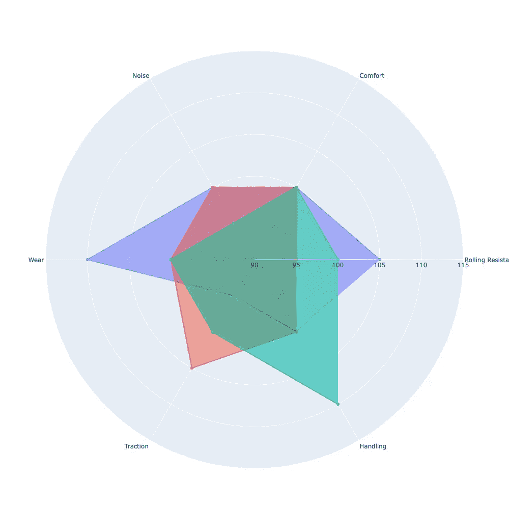

# 如何用 Python 创建雷达图

> 原文：<https://levelup.gitconnected.com/how-to-create-radar-charts-in-python-9d476258e7cd>

## 构建雷达图以可视化您的数据

雷达图(也称为蜘蛛图)允许我们在二维空间比较定量特征(多元数据)。也就是说，我们相互比较范畴组的数值。

为了更好地可视化，通常会对值进行缩放。这样可以更好的对比。

作为演示的例子，我们可以考虑轮胎设计参数。轮胎设计中的许多参数之间存在权衡。例如，降低油耗的改进会导致牵引性能的损失。或者如果你提高了操控性，你会失去舒适性，等等。

假设我们开发了三种不同设计的产品，并通过测试获得了这些设计的性能参数。我们可以用雷达图来比较设计。

雷达图。图片由作者提供。

每种设计都用不同的颜色表示。万一我们用鼠标悬停，会给出详细的数据。

感谢阅读。如果您有任何问题或意见，请随时写信给我！

# 阅读更多内容…

 [## Python 中的饼状图(Matplotlib、Seaborn、Plotly)

### 用 Python 实现饼状图

towardsdev.com](https://towardsdev.com/pie-charts-in-python-matplotlib-seaborn-plotly-f60995160c33)  [## Python 中的折线图(Matplotlib、Seaborn、Plotly)

### 折线图在 Python 中的实现

towardsdev.com](https://towardsdev.com/line-chart-in-python-matplotlib-seaborn-plotly-f576c630e97d) 

# 参考

 [## 雷达图-维基百科

### 雷达图是一种以三维或二维图表的形式显示多元数据的图形方法

en.wikipedia.org](https://en.wikipedia.org/wiki/Radar_chart)  [## 雷达

### 雷达图(也称为蜘蛛图或星形图)以二维形式显示多元数据…

plotly.com](https://plotly.com/python/radar-chart/) 

# 分级编码

感谢您成为我们社区的一员！更多内容见[级编码出版物](https://levelup.gitconnected.com/)。
跟随:[推特](https://twitter.com/gitconnected)，[领英](https://www.linkedin.com/company/gitconnected)，[通迅](https://newsletter.levelup.dev/)
**升一级正在改造理工大招聘➡️** [**加入我们的人才集体**](https://jobs.levelup.dev/talent/welcome?referral=true)