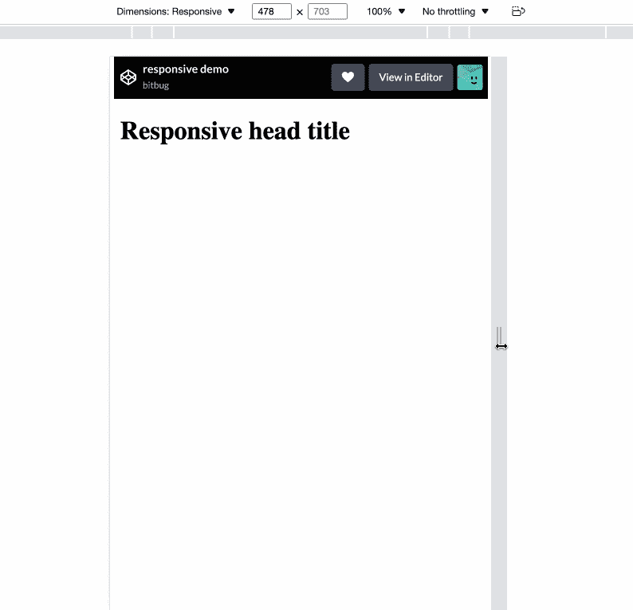
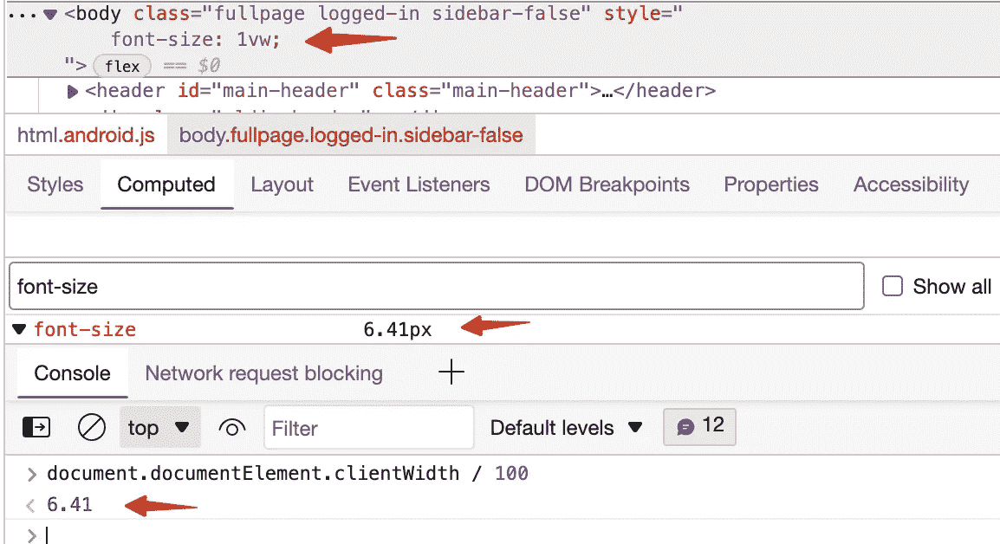
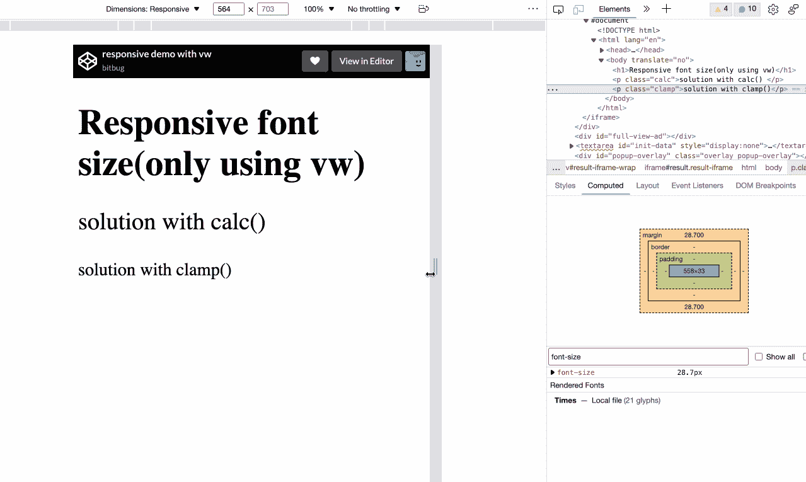

# 如何只用 CSS 创建响应性网站

> 原文：<https://levelup.gitconnected.com/how-to-create-responsive-website-only-with-css-df4e8a1e8e4e>

## 用 vw 和 rem 构建响应页面。


[UX 店](https://unsplash.com/@uxstore?utm_source=medium&utm_medium=referral)在 [Unsplash](https://unsplash.com?utm_source=medium&utm_medium=referral) 上拍摄的照片

## 前言

从手机浏览器或应用程序访问的网站越来越多。对于我来说，在我空闲的时候，我基本上是从我的手机访问网站。手机浏览器对用户来说很方便，但对开发者来说很痛苦，因为有太多不同尺寸的屏幕。例如，iPhone 有 7 种不同的尺寸。为了更好的体验，不同的屏幕尺寸需要不同的显示效果。与 iPhone SE 相比，iPhone Pro 需要显示更大的字体和填充。

常见的方法是使用媒体查询来改变 html 的字体大小，以反映更小或更大的屏幕尺寸。我们可以用`rem`作为每个元素的长度单位。

例如，我们可以将一级标题设为`2rem`，如果 html 字体大小为`16px`，那么 h1 标签字体大小将为`32px` (1rem = 16px)。而在更大的屏幕上，我们只需要通过媒体查询来改变基本字体大小。

```
html {
  font-size: 16px;
}
h1 {
  font-size: 2rem;
}
[@media](http://twitter.com/media) screen and (min-width: 500px) {
  html {
    font-size: 20px;
  }
}[@media](http://twitter.com/media) screen and (min-width: 600px) {
  html {
    font-size: 24px;
  }
}
```

当我们缩放屏幕时，标题字体大小也会改变:



通过使用媒体查询，我们必须指定规则来应用不同的字体大小，并且效果看起来不太平滑。屏幕调整大小时如何平滑调整字体大小？

## 使用视口单元 vw

视口单位始终代表屏幕大小，`1vw`等于视口宽度的百分之一，这意味着如果我们使用`vw`设置字体大小，它将始终与视口的大小相关:

```
1vw = document.documentElement.clientWidth / 100
```

我们可以在 chrome devtools 上测试，通过设置主体`font-size: 1vw`，实际值将与`document.documentElement.clientWidth / 100`相同:



通过使用`vw`我们可以使页面具有响应性，但是有一个问题是我们不能缩放文本。上面的演示表明`1vw`在手机屏幕上会很小，在 PC 桌面浏览器会额外。

解决方法是使用 CSS 函数，如`calc()`、`clamp()`:

```
<h1>Responsive font size(only using vw)</h1>
<p class="calc">solution with calc() </p>
<p class="clamp">solution with clamp()</p>// CSS 
h1 {
  font-size: 10vw;
}
.calc {
  font-size: calc(10px + 5vw);
}
.clamp {
  font-size: clamp(20px, 5vw, 2rem);
}
```

我们直接设置元素的字体大小，而不是仅仅为了测试而设置 html 的字体大小。在实际项目中，建议设置 html 字体大小，因为我们可以使用`rem`作为元素框大小或其他长度。它将如下所示:



`clamp()`可能更有用，它支持三个参数，最小值、首选值和最大值。语法是:

```
clamp(MIN, VAL, MAX) is resolved as Math.max(MIN, Math.min(VAL, MAX))
```

所以我们可以利用这个特性为手机浏览器和桌面浏览器创建响应式网站。

在 [Codepen.io](https://codepen.io/bitbug/full/wvmVmZw) 中有一个演示，你可以通过调整浏览器窗口大小来测试它。

## 结论

我们使用 viewport 单元`vw`和 CSS 函数 [clamp()](https://developer.mozilla.org/en-US/docs/Web/CSS/clamp) 通过设置页面基本字体大小来创建一个响应式网页，页面中的每个元素都使用`rem`作为长度单位。我在许多项目中使用这种方法，希望这能帮助你。

感谢你的阅读，我期待着你更多实用技巧的关注:

[](/dont-use-transform-to-center-element-b378587ad1db) [## 不要使用变换使元素居中

### 一种更好的方法来使我们不知道大小的元素居中

levelup.gitconnected.com](/dont-use-transform-to-center-element-b378587ad1db) [](/how-to-implement-scroll-to-top-with-only-css-ae27cb9d4678)[](/how-to-implement-scroll-to-top-with-only-css-ae27cb9d4678) [## 如何只用 CSS 实现滚动到顶部](/how-to-implement-scroll-to-top-with-only-css-ae27cb9d4678) [](/how-to-implement-scroll-to-top-with-only-css-ae27cb9d4678)

### [使用 sticky 进行布局，使用](/how-to-implement-scroll-to-top-with-only-css-ae27cb9d4678)标签进行滚动

levelup.gitconnected.com

[](/how-to-construct-an-element-border-without-using-csss-border-4a5c9fc7c9e6) [## 如何在不使用 CSS 边框的情况下构造元素边框

### 4 实现边框效果的方法

levelup.gitconnected.com](/how-to-construct-an-element-border-without-using-csss-border-4a5c9fc7c9e6)