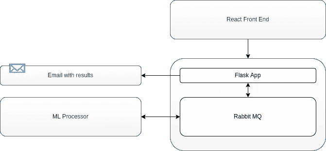
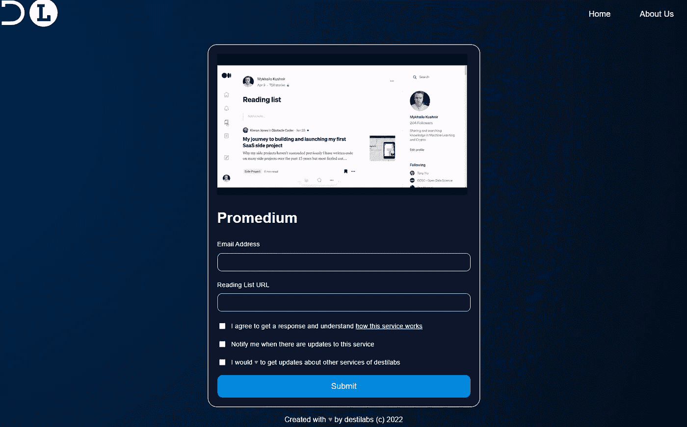

# 如何在 24 小时内创造 SaaS？第一部分

> 原文：<https://levelup.gitconnected.com/how-to-create-saas-within-24-hours-part-1-46ab9d32d1f6>

## 超高速发展

快速原型开发似乎是现代软件工程师最需要的技能之一。从假设验证到早期融资，快速提供可行解决方案的能力可以带来多种好处。作为一名编码爱好者，我正试图开发一些工具，每当我有了另一个“发现”的时刻，它们可以帮助我更快地从想法迭代到产品。


Akram Huseyn 在 [Unsplash](https://unsplash.com/s/photos/clock?utm_source=unsplash&utm_medium=referral&utm_content=creditCopyText) 上拍摄的照片

我的最新尝试——建立在我在文章“你的中等阅读清单的零元分类”中描述的基础上。那里的解决方案有助于在网络抓取和一点机器学习的帮助下清理媒体上的阅读列表。虽然它在一定程度上引起了关注者的兴趣，但我的部分读者并不熟悉 python 或编程本身。然而，我不想将他们排除在聚会之外，所以我决定为他们建立一个工具。这是我的计划:

1.  为一个个人网站购买一个域名，在那里我会托管我为自己使用和娱乐而创建的所有小产品；
2.  构建基于 React 的客户端应用程序来处理主要用例；
3.  构建基于 Flask 的后端应用程序来启动前端；
4.  尝试异步实现通信，因为这将降低 POC 的托管成本；
5.  大量使用框架和 docker，因为它允许跳过车轮重新发明；

> 这是它的结果:[promedium.destilabs.com](https://www.promedium.destilabs.com/)

# 整体架构



解决方案架构

假设您想快速构建廉价的原型——设计异步管道！所有现有的现代云提供商都提供按需实例，当请求到来时，代码的一个实例就开始运行，处理它，然后释放大量所需的资源。如果你正在构建 SaaS 的第一次迭代，你不会马上有大量的流量(否则，恭喜你)，所以异步的做事方式会节省你宝贵的成本。

出于这个原因，我喜欢通过基于队列的工具如 Rabbit MQ 来保持应用程序内部的通信。我的商业案例定义为“解析客户的阅读列表，分类并返回标签”。没有人会要求立即得到回复，所以我可以推迟一段时间，在 100%在线解决方案上省下一些钱。

# 前端

请记住，我的目标是重用尽可能多的预构建组件。谢天谢地，现代前端充满了这些。挑战在于选择一个正确的。因为我对 UX 没有什么特别的要求，所以我的技术非常简单:用 material-UI 和 FormSpree 的一些预建表单来实现 React 18。以下是我所做的鸟瞰图:

1.  *使用 create-react-app 创建样板 react app:*

```
npx create-react-app my-app
cd my-app
npm start
```

更多详情:[创建一个新的 React 应用](https://en.reactjs.org/docs/create-a-new-react-app.html)

*2。在 FormSpree 上创建一个表单，并将其集成到您的代码中*

对于习惯于 Python 和 ML 代码的人来说，构建表单并验证它似乎很困难，但是我已经设法编译了一些像样的东西。在未来的迭代中，我会研究更多预定义的解决方案，并希望听到读者对代码的反馈。

*3。创建一些关于如何使用你的 SaaS 的说明*

对于客户来说，早期的原型通常很难使用，因为创建者愿意在解决方案的速度和准备程度之间进行权衡。然而，这并不意味着你没有义务使 UX 尽可能简单。我已经录制了一个小演示视频作为指导，并将其转换为 gif 动画。我还留下了简单的旧文本，以便更清楚地说明这个工具将做什么。最终的界面是这样的:



前介质界面

> **估计:**假设您已经安装了 NodeJS，并且至少对 React 基础知识有所了解，那么完成这一部分最多需要 4 个小时。

# 后端

我的后端解决方案延续了整体简单的趋势。通向隐藏魔法的途径是通过一个充当监听器服务的 flask 应用程序。它的目标是捕捉请求进行处理，并在这些请求完成后发送电子邮件。

这里有一个很好的起点:[docker-rabbit MQ-example](https://github.com/dmaze/docker-rabbitmq-example)。这个存储库为您提供了一个基本的例子，可以将类似于{"message": 0}的内容推送到您选择的 Rabbitmq 交换。还有一个非常简单的测试过程(假设您安装了 docker 和 docker-compose):

[](https://github.com/dmaze/docker-rabbitmq-example/blob/master/docker-compose.yml) [## docker-rabbit MQ-example/docker-compose . yml at master dmaze/docker-rabbit MQ-example

### 此时您不能执行该操作。您已使用另一个标签页或窗口登录。您已在另一个选项卡中注销，或者…

github.com](https://github.com/dmaze/docker-rabbitmq-example/blob/master/docker-compose.yml) 

> **估计:**假设你有 Docker 和 Docker-Compose，这应该很容易。我刚刚克隆了存储库，对其进行了更改，以监听来自队列的消息，并实现了一个在用 ML 处理消息后进行响应的功能。总体和悲观的估计将是大约 6 小时左右。

# ML 处理器

ML 总是一把重枪，这是你在产品开始时想要避免的。即使它是您产品的核心，托管一个现代变压器也是非常昂贵的，但是您可以通过…非技术方法来降低成本。例如，我打算为我的第一批服务采纳者提供一个尚未公开的功能——对他们的媒体阅读列表进行分类和排序。相反，我还没有要求任何付款，只需要一个电子邮件地址，因为这样，我可以在当天晚些时候向他们传达服务结果。服务的性质不需要立即响应，从托管成本的角度来看，将它转变为我自己的利益是有帮助的。

因此，我的 ML 处理器实际上会被本地托管在我自己的机器上。正如上面的架构所建议的，它将从 Rabbit MQ 读取一条消息，执行 ML 魔术，并将一个响应推回到另一个队列中。通过队列的持久性可以获得一个额外的好处，因为在失败的情况下，当失败的原因被修复时，我可以回推初始消息并处理它。

ML 预处理器代码的本质仍然在 promedium 存储库中。

[](https://github.com/destilabs/promedium) [## GitHub - destilabs/promedium:改善媒体用户体验的工具库

### 改善媒体用户体验的工具库

github.com](https://github.com/destilabs/promedium) 

> 估计:因为我在这里主要是用拥抱脸变形金刚，所以这是一个相当简单的任务。在本地托管系统也为我节省了一些时间和金钱。总体估计大约需要 2 小时。

# 第 1 部分概述

虽然本教程是为快速开发而创建的，但我想讲述的过程还有很多，所以本文是该系列两篇文章中的第一篇。在下一部分中，我将向您展示我是如何托管上述所有部分的，以及我计划如何继续 Promedium 的开发。这一部分的摘要应该是这样的:

*   寻找不必要的功能，并放弃他们的原型 SaaS。Ycombinator 告诉我们，在最好的情况下，创始人应该能够不用一行代码就能构建一些东西。那么我们有什么资格争论呢？
*   如果您的业务案例没有立即得到响应，请使用异步设计。即使这样，在你和客户之间寻找一个潜在的妥协，你会给他们独家服务，他们会同意等待。
*   使用像 create-react-app 这样的构造函数或 git 中的存储库，并对您希望包含在 SaaS 中的技术进行基本设置。在早期阶段避免复杂性可以让您在未来进行扩展。
*   有可能在 24 小时内构建一个工作原型软件即服务。

*让我知道你对这篇文章的想法，并订阅以获得关于本系列下一部分的通知。*