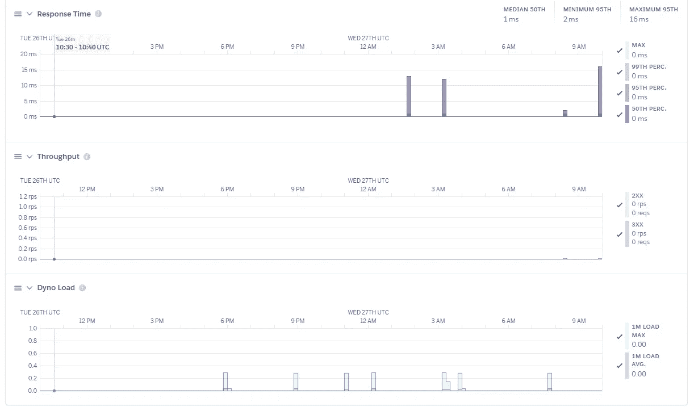
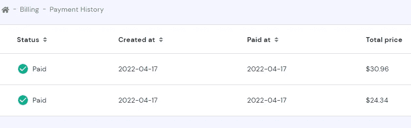

# 如何在 24 小时内创造 SaaS？第二部分

> 原文：<https://levelup.gitconnected.com/how-to-create-saas-within-24-hours-part-2-6a60a5898882>

超快速 DevOps


[贾森·汤普森](https://unsplash.com/@jasonlthompson?utm_source=unsplash&utm_medium=referral&utm_content=creditCopyText)在 [Unsplash](https://unsplash.com/s/photos/great-canyon?utm_source=unsplash&utm_medium=referral&utm_content=creditCopyText) 上拍照

欢迎继续[的上一篇帖子](/how-to-create-saas-within-24-hours-part-1-46ab9d32d1f6)！我将在这一部分展示我是如何托管所有开发的应用程序的，以及它花了我多少钱。在本文的最后，我还将分享我使用 CI/CD 进行扩展的计划。

在进入有用的部分之前，让我重申一下到目前为止已经完成的工作:

*   首先，一个名为[promedium.destilabs.com](https://www.promedium.destilabs.com/)的网站被创建。这个工具可以帮助你使用机器学习更好地理解你的中级阅读列表书签中有哪些感兴趣的主题。
*   其次，创建了一些后端应用程序来维护完整的解决方案。

然而，开发应用程序和与最终用户共享它们是不一样的。

# 部署

对于 Promedium，我使用 Heroku 作为部署平台。虽然它不是最受欢迎的提供商，并且在使用 Azure Cloud、Google Cloud Provider 和 AWS 的一些经验之后，我发现它对于快速原型和低配置任务仍然非常有用。

要完成这一部分，您需要安装 [Heroku CLI](https://devcenter.heroku.com/articles/heroku-cli) 。

如今发布应用程序与 Docker 紧密相关，这应该是我们都应该遵守的标准。然而，Heroku 提供了一个抽象，让你不用 Docker 工具就可以发布容器。假设您也在 create-react-app 的基础上构建了一个新的应用程序，以下是如何在 Heroku CLI 中发布该应用程序:

```
heroku create $APP_NAME — buildpack mars/create-react-app
git push heroku main
heroku open
```

理想情况下，你的应用程序的根文件夹中的这三行应该给你一个全功能的网站，它托管在 Heroku 上，隐藏在一个定制的 Heroku 域后面。当然，您的应用程序也应该构建成功( **npm 运行构建**)，并且理想情况下没有安全问题( **npm 运行审计**)。

> **评估:**如果您有一个完整的应用程序，没有构建失败，那么按照描述发布它应该不会花费您太多时间。对我来说，大约是 1 小时。此外，要注意 Heroku 的随机存取内存(RAM)有 500MB 的限制，所以不可能在那里托管一个很大的 ML 模型。
> 
> 费用:Heroku 的免费层可以为你提供很好的服务，但是我建议你使用 Heroku Hobby 来解锁 SSL 证书和你的应用程序 100%的正常运行时间。这将花费你 7 美元，并且会给你的项目带来极大的动力。



启动并运行！

# 领域

我构建和发布项目的目标不仅仅是一项服务。我正在创办一家名为 **DestiLabs、**的网络公司，很自然，我搜索的域名是 destilabs.com。我选择 Hostinger 作为域名提供商纯粹是因为他们提供的价格比竞争对手低。以下是我必须配置的三样东西:

1.  购买域
2.  @destilabs.com 的设置电子邮件地址
3.  为 promedium.destilabs.com 配置子域以托管 Promedium 工具。下面是[关于如何做的精彩指导](https://devcenter.heroku.com/articles/custom-domains#add-a-custom-domain-with-a-subdomain)。

我也鼓励您使用 SSL，因为它会让客户更加信任您的新应用程序。例如，在 Heroku 上，可以访问“设置→ SSL”部分下的配置。

> **估计:**不同域名提供商的子域配置可能有点困难，所以多分配一点时间。我想你应该能在 2 小时左右完成。
> 
> **费用:**我已经预付了未来两年的域名和电子邮件使用费 55.3 美元



未来两年的域名和电子邮件成本

**总成本:**假设这项服务的资源将在未来两年内使用，我将在这项服务上花费约 220 美元。我现在不打算将其货币化，我的主要目标是品牌知名度和客户获取。因此，至少可以说，为这些支付 220 美元是一个非常适中的价格。

# 扩展策略

因为我仍然是这个项目的单个开发人员，所以我必须对它的规模保持聪明。我不能花太多时间测试，所以它应该是自动化的。如果我想在某个时候委托他们，一些编码标准也应该被维护。考虑到这一点，我决定目前的功能水平足以获得反馈，同时，我应该花一些时间在技术债务上:

*   用 Jest 单元测试和自动化剧作家覆盖项目；
*   修复一些视觉问题，使网站响应屏幕大小；

在这篇博客的后续文章中，我将分享更多的进展以及我是如何实现的。

# 摘要

独自建造项目既快又便宜。当然，你必须知道你在做什么，你的技术栈应该由敏捷和可配置的工具组成。虽然这可能具有挑战性且不明显，但好处大于缺点:

*   在你的投资组合中有一个托管的 SaaS 对你的职业选择是一个巨大的加分；
*   你可以测试你的产品假设，赚取。你是产品、首席执行官、设计师和一个典型工程团队的其他成员，在你的主要工作场所，你通常不同意；
*   个人发展提升你的科技技能。你最好理解工程团队各个部分必须处理的所有细微差别；

让我知道你对我构建 Promedium 的旅程有什么想法，以及你会做些什么不同的事情。

您可能也会感兴趣:

[](/how-to-create-saas-within-24-hours-part-1-46ab9d32d1f6) [## 如何在 24 小时内创造 SaaS？第一部分

### 超高速发展

levelup.gitconnected.com](/how-to-create-saas-within-24-hours-part-1-46ab9d32d1f6) [](/how-to-write-a-good-machine-learning-headline-on-medium-c1b9d0805634) [## 如何在 Medium 上写好机器学习标题

### 经过科学验证的见解。算是吧。

levelup.gitconnected.com](/how-to-write-a-good-machine-learning-headline-on-medium-c1b9d0805634) [](/how-i-scrape-lots-of-sites-with-one-python-script-9fba09d5c9be) [## 我如何用一个 python 脚本抓取大量网站

### 代码可配置执行的能力。

levelup.gitconnected.com](/how-i-scrape-lots-of-sites-with-one-python-script-9fba09d5c9be)