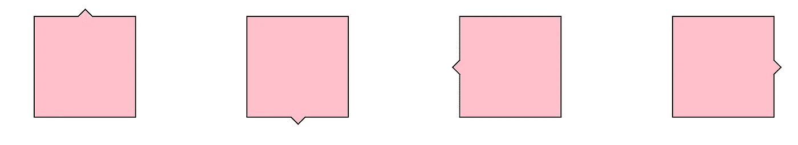
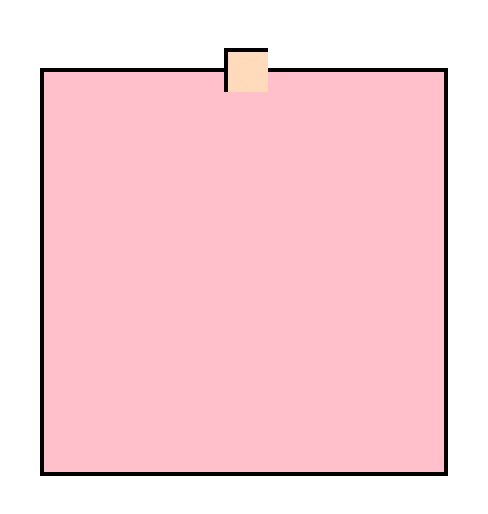
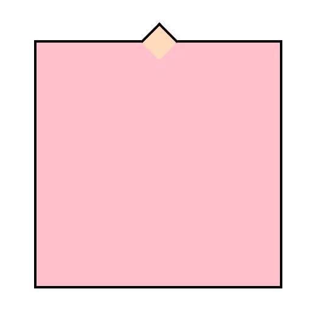
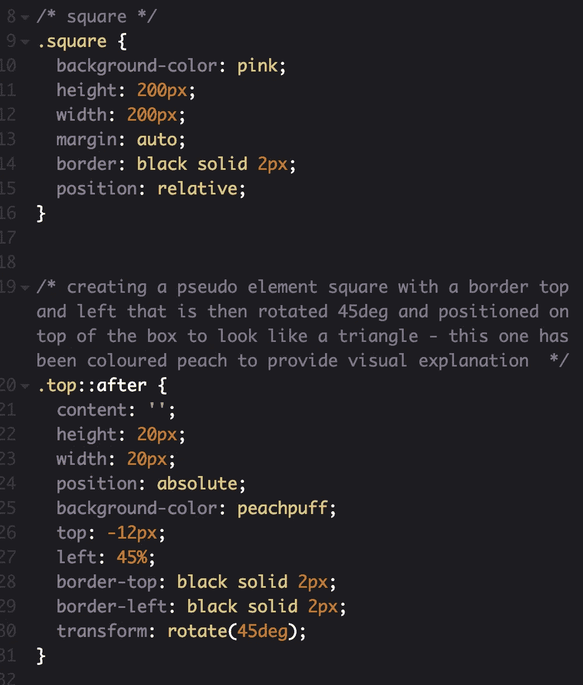

# 如何用 CSS 创建简单的三角形边框

> 原文：<https://levelup.gitconnected.com/how-to-create-simple-triangle-borders-with-css-665d26372825>

[Icons8 团队](https://unsplash.com/photos/OLzlXZm_mOw?utm_source=unsplash&utm_medium=referral&utm_content=creditCopyText)在 [Unsplash](https://unsplash.com/search/photos/woman-computer?utm_source=unsplash&utm_medium=referral&utm_content=creditCopyText) 上的照片

作为一名新的前端 web 开发人员，在我的第一个 web 角色中，我遇到的一些任务花费了我太多的时间。我花了一个小时左右的时间在谷歌上搜索和测试不同的方法来实现我的最终目标，但通常都没有达到我开始时的目标。

带三角形边框的正方形——常用于气泡、引号或下拉菜单/导航中。

对我来说，下一步是向更高级的开发人员寻求帮助，通常修复是如此简单，几乎令人尴尬！

尝试制作一个三角形边框(或者一个有三角形的边框)就是这些任务中的一个。在网上搜索之后，我发现了这么多不同的方法来做这件事，但是它们都有点太复杂或者不完全符合我的要求。我在谷歌上看到的许多文章都建议你必须使用两个伪元素(::before 和::after)来制作一个具有不同颜色边框和背景的三角形，但有一种更简单的方法可以做到这一点。

那么一个更资深的开发者是怎么建议我做这个三角形的呢？

*   使用::after 伪元素创建一个两边都有边框的正方形，然后将其旋转到正确的位置。

用于创建正方形以制作三角形边框的伪元素。

现在已经使用 transform 旋转了伪元素，并将其放置在正确的位置。

CSS 创建正方形及其三角形边框。

太简单了。

我的问题的答案往往如此简单，以至于我在寻找更复杂的解决方法时忽略了它们。

我希望有人可以使用这篇文章/例子来帮助他们制作一个简单的 CSS 三角形边框

在我的[代码笔上查看这个详细的例子。](https://codepen.io/hollyb/pen/YRzRgy)

如果你想了解更多——查看我的文章[使用伪元素创建边框。](https://medium.com/@hollybourneville/creating-border-lines-using-pseudo-elements-in-css-a460396299e8)