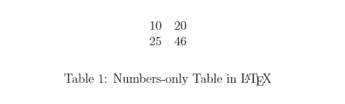
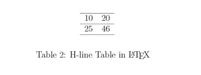
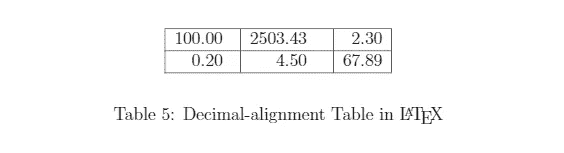
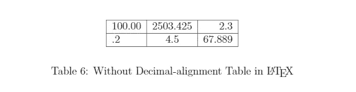
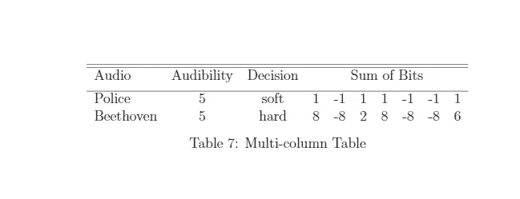
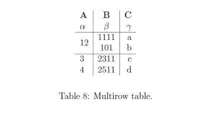
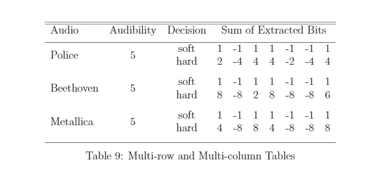
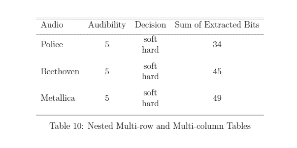

# 如何用 LaTeX 创建表格(通俗地说)

> 原文：<https://levelup.gitconnected.com/how-to-create-tables-in-latex-in-laymans-terms-391f8478aa80>

为什么我们需要在 ***LaTeX*** 中使用命令和环境来创建表格，而有人已经花了很大代价来生成内置函数，这些函数给出了一个漂亮的用户界面(UI)来创建令我们满意的表格，就像在 ***中一样？***

实际上，我们只需点击几下鼠标就可以创建自己的表格。嗯，它不总是关于编码，有时，它是关于创造自己的满足感；此外，有时复杂的表格会使我们的 word 文档突然分崩离析，需要特别注意不要让文档变得完全奇怪。虽然据说 ***LaTeX*** 表格是用于技术文档的，但我个人认为在 ***LaTeX*** 中创建表格可以帮助个人理解您在 UI 上的点击是如何公正地对待文档以创建漂亮的表格的底层机制(代码和内置函数)。所以，简单地说，点击 UI 就相当于在后台解释或编译代码。因此，您将在本文中看到其中的一些代码。我的目标是让这篇文章尽可能的清晰明了，这样任何零编码经验的人都可以利用 ***LaTeX*** 中的这个漂亮特性。

# **速度跑乳胶基础:**

> **\** *的意思是**的开始*一个 *命令****\****后面跟着* **【花括号】，** *一起表示一个*环境*正在被调用例如* ***\某物{某物}**** ***\ use package { multi row }****用于调出一些内置包，帮助* **LaTeX** *理解用于多行表格的命令。类似地，也使用其他包。* ***\ begin { document }****表示我们希望* **LaTeX** *在执行该命令的瞬间启动我们的文档。* ***\ end { document }****表示我们希望我们的文档到此结束。* ***%****前面的任何一行都表示一个*注释行*

*现在，对于表格，除了典型的数学软件包之外，我们还需要一些软件包。*

> ***\ use package { amsmath }**
> **\ use package { book tabs }**
> **\ use package { multi row }**
> **\ use package { float }**
> **\ restylefloat { table }**
> **\ use package { siunitx } %需要对齐***
> 
> ***\ si setup {
> round-mode = places，% round numbers
> round-precision = 2，% to 2 places
> }***

*我们将一个一个地检查它们。 **\usepackage{amsmath}** 用于某些数学术语(二重或三重积分)。 **\usepackage{booktabs}** 是为了创建漂亮的表格，而且它们也很吸引人。然后， **\usepackage{multirow}** 和 **\restylefloat{table}、**用于创建多行表格。 **\usepackage{float}** 需要以某种方式定位工作台。*零件*的其余部分需要用于数字的*十进制对齐*-相对于小数点对齐数字。你不需要强记这些，只是暂时忽略它们，或者将它们复制粘贴到你的 ***TeX*** 编辑器中。*

*首先，我们需要创建一个**表格环境**，然后创建一个**表格环境**。前者用于标题，后者用于输入值和边距(水平线和垂直线)。它们是这样的:
\ begin { Table }[…]
\ caption { Table 1 }
\ begin { tabular } {…}
。
。
。
\ end {表格}
\ end {表格}*

# *没有边距的表格:*

> **\begin{table}[h！]
> \ begin { center }
> \ caption { LaTeX }
> \ label { Table 1 }
> \ begin { Table } { c c }
> 10&20 \ \
> 25&46 \ \
> \ end { Table }
> \ end { center }
> \ end { Table }**

**

*为了更好地理解，让我们将代码片段分解一下。 ***\begin{table}[h！】*** 表示我们创建表格的开始，这里**【h！】**指浮点说明符“此处，强行”。 *h 代表这里，还有！是强行形成的。*这基本上意味着我们希望我们的表被创建在我们的 ***LaTeX*** 源代码的位置。我们也可以使用其他的浮点说明符- *t 表示页面的顶部，b 表示页面的底部，p 表示只用于浮点的特殊页面*。***\ begin { center }***用于居中对齐某些内容，比如本例中的标题:***\ caption { Numbers-only Table in \ LaTeX }。\label{Table 1}*** 是给我们的表加标签。***\ begin { tabular } { c c }***是至关重要的原文。它启动表格环境。花括号中的 **c** 表示居中对齐，c 的数量表示列数。 **{c c}** 用于两个居中对齐的列， **{c c c c}** 用于四个居中对齐的列， **{r r}** 用于两个右对齐的列， **{l l l}** 用于三个左对齐的列， **{l c r}** 用于三个列:分别为左对齐、居中对齐和右对齐。然后，我们需要为我们的表插入值。随后的列值由一个&符号(&)分隔。对于行分隔符，使用\作为分隔符。*

> *\\ =行分隔符
> & =列分隔符*

**10&20
25&46**

*10 作为第一列值插入。然后,“与”符号(&)将移到下一列。插入 20 作为第二列值。之后，为了移动到下一行(第二行)，我们需要使用一个双反斜杠。对于第 2 行的值(第 1 列-第 2 行的值和第 2 列-第 2 行的值)，我们需要再次插入值，在它们之间插入&符号。最后三个命令(\end… commands)只是为了完成我们在代码开始时启动的环境。*

# *带边距的表格:*

## ***1。水平线:***

> **\begin{table}[h！]
> \ begin { center }
> \ caption { H-line Table in \ LaTeX }
> \ label { Table 2 }
> \ begin { Table } { c c c }* ***\ hline*** *10&20 \ \* ***\ hline*** *25&**

**

*前两个表格的主要区别是水平边距。我们可以在表格的顶部、中部或底部创建它们，方法是在所需的位置声明。对于双水平边距，我们可以用
**\hline \hline。**你可以看看' ***hhline'*** 套餐看起来比较花哨的余量。*

## ***2。垂直线:***

> **\begin{table}[h！]
> \ begin { center }
> \ caption { V-line Table in \ LaTeX }
> \ label { Table 3 }
> \ begin { tabular } {****|****c****|****c***|***}
> 10&20 \ \**

**

*对于垂直边距，我们需要指定一点不同于水平线的情况。我们可以在表格环境声明代码中插入垂直制表符 **|** 来指定垂直边距。*

> ****\ begin { tabular } { | c | c | }****=分栏分隔* ***3*** *垂直边距* ***\ begin { tabular } { c c }****=分栏分隔* ***无*** *任何垂直边距**

## *3.整箱桌子:*

*对于有盒子的桌子，我们需要同时使用 **\hline** 和 **|** 。*

> **\begin{table}[h！]
> \ begin { center }
> \ caption { Full-box Table in \ LaTeX }
> \ label { Table 3 }
> \ begin { tabular } {****| c | c |****}* ***\ hline* *10&20 \ \****

**

## ***4。十进制对齐的表格:***

*对于十进制对齐，我们需要使用 **S** 而不是 **c** 或 **l、**或 **r** 。这也将值四舍五入到某个位置。这在我在本文的包部分提到的序言代码片段中已经指出。我们也可以通过设置 **round-precision = 3 来改变这个值。***

> ***\usepackage{siunitx} %需要对齐
> \ si setup {
> round-mode = places，% round numbers
> round-precision = 2，% to 2 places
> }***

*这里，我们使用两位四舍五入的数字。*

> **\begin{table}[h！]
> \ begin { center }
> \ caption { Decimal-alignment Table in \ LaTeX }
> \ label { Table 8 }
> \ begin { tabular } {****| S | S | S |****}
> \ hline
> 100.00&2503.425&2.3 \ \
> \ hline【t30.2】**

**

## ***5。没有小数点对齐的表格:***

*如果没有十进制对齐，表格看起来就不像一个完整的表格。感觉好像少了点什么。例如，只需查看下表，其中有一个简单的左对齐、中对齐和右对齐的**表。除了下面的代码行之外，一切都是一样的:
**\ begin { tabular } { | l | c | r | }*****

**

# *多栏表格:*

*会有这样的情况，我们必须合并多个列，因为它们将有相同的标题。*

***命令:***

> ****\多列{列数} {对齐} {内容}****

***例:**
**\ multi column {5} {c} {Hello}**
这里，{ 5 }表示要合并 5 列，{ c }表示合并单元格的标题居中对齐，{ Hello }是合并单元格的标题。*

***代码:***

> **\begin{table}[h！]
> \ caption {多栏表格}
> \居中
> \ begin { tabular } { l c rrrrrrr }
> \ hline \ hline
> Audibility&Decision&****\ Multi column { 7 } { c } { Sum of Bits }****\ \【1ex】
> \ hline&**

**

*这里，**\ multi column { 7 } { c } { Sum of Bits }**是新的命令环境，其中 **{7}** 意味着我们需要 7 列合并成一列。然后， **{c}** 表示该合并单元格(列)的中心对齐，**{位之和}** 是该列的输入。 **\\[1ex]** 用于在\multicolumn…命令后插入一个长度为 1 的垂直空格。**第一行(音频可听度决定位的总和)和第二行(警察 5 软…..)通过使用\\[1ex]增加。如果需要，我们可以使用\\[1.5ex]获得更多空间。***

# *多行表格:*

*在这种情况下，我们需要在序言中使用\usepackage{multirow}。*

***命令:***

> ****\多行{行数} {宽度} {内容}****

***例子:
\multirow{2}{*}{12}** 是指我们要合并任意宽度的 2 行，值为 12 的情况。 **{2}** 表示 2 行， **{*}** 表示合并行的任意宽度， **{12}** 是该行的内容。 ***** 基本上是指*自动生成*宽度。***

****代码:****

> ***\begin{table}[h！]
> \ begin { center }
> \ caption {多行表格。}
> \ label { tab:table 1 }
> \ begin { tabular } { l | C | r }
> \ textbf { A }&\ textbf { B }&\ textbf { C } \ \
> $ \ alpha $&$ \ beta $&$ \ gamma $ \ \
> \ hline* *\ multi row { 2 } { * } { 12 }***

****

**第一排:A B C
第二排:α β γ
**第三排:12 1111 a
第四排:12 101 b**
第五排:3 2311 c
第六排:4 2511 d**

****\multirow{2}{*}{12}** 表示我们正在合并 2 行，合并行的宽度是任意的，内容是 12。因为我们刚刚合并了第一列的 2 行(第 3 行和第 4 行)，所以我们必须跳过第 1 列的第 4 行值，在代码:
**\ multi row { 2 } { * } { 12 }&1111&a \ \***=第 3 行的 3 列值:****12 1111 a*
&** *=第 4 行第 1 列的一个* ***空白*** *已经与第 3 行第 1 列合并(* ***12*** *)和* ***一个与号(& )*** *，后跟第 2 列值(* ***101*****

# **多行和多列表格:**

## **个人:**

**这里，multirow 和 multicolumn 命令是单独使用的，它们彼此不交互，不像在嵌套的情况下它们是相互依赖的。**

> ***\ begin { table }【H】
> \ caption {多行多列表格}
> \ centering
> \ begin { tabular } { l c rrrrrrrrr }
> \ hline \ hline
> 音频&可听度&&****\多列{ 7 } { c } {提取的比特数之和} \ \[1ex]***
> & &硬&2&-4&4&4&-2&-4&4 \ \[1.5 ex]
> ***\ multi row { 2 } { * } {贝多芬}****&****\ multi row { 2 } { * } { \(5) [1.5 ex]* ***\ multi row { 2 } { * } { Metallica }****&****\ multi row { 2 } { * } { \(5 \)}****&软&1&-1&1&-1&*****

****

## **嵌套:**

> ***\ begin { table }[H]
> \ caption {嵌套多行多列表格}
> \居中
> \ begin { tabular } { l c rrrrrrrr }
> \ hline \ hline
> 音频&可听度&判定&\ Multi column { 7 } { c } { Sum of Extracted Bits } \ \[1ex]
> \ hline
> \ Multi row { 2 } { * } { Police }&\ Multi row [1.5 ex]
> \ multi row { 2 } { * } { Metallica }&\ multi row { 2 } { * } { \(5 \)}&软&****\ multi column { 7 } { c } { multi row { 2 } { * } { 49 } }****\ \
> &&硬&\ \【1.5 ex】【T31***

****

**这里，粗体行指示嵌套的列-行的代码。
**\multicolumn { 7 } { c } { multi row { 2 } { * } { 34 } }**指的是嵌套节，其中 **\multirow{2}{*}{34}嵌套在\ multi column 命令的内容中。
\multirow{2}{*}{34}是\multicolumn{7}{c}的内容..}****

**这是一篇很长的文章，我不想再延长了。如果我得到了积极的反馈，我会继续写关于 ***乳胶*** 的清晰文章。感谢您阅读我的文章。**

*****LaTeX* 源代码:**[https://drive . Google . com/drive/folders/1gp 8 gpznnjzyp 9 MQ-xzh 0 BP-bi 8 hfkwbl？usp =分享](https://drive.google.com/drive/folders/1gP8GPZnNjZyP9Mq-XZH0Bp-BI8Hfkwbl?usp=sharing)**