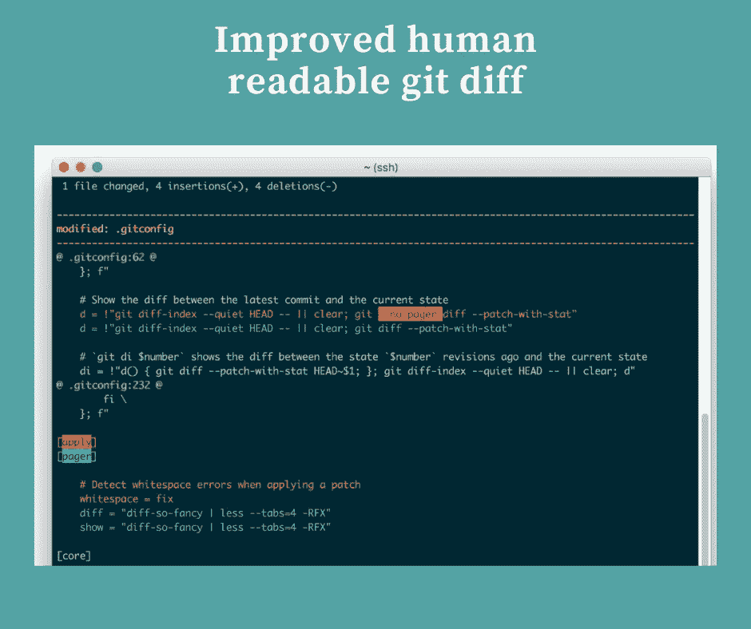
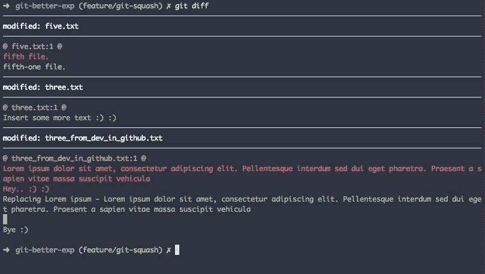

# 如何定制 git diff 以更快地发现变化

> 原文：<https://levelup.gitconnected.com/how-to-customize-git-diff-to-spot-changes-faster-42acd0e8f515>



git diff 是 git 中最有用的特性之一。自定义 diff 会让你的生活更轻松。

**Diff-so-fancy** 是一款 git 工具，可以帮助你做出好看的 Diff。这个工具可以帮助你在没有任何人为错误的情况下发现差异。

您可以在此 [**回购**](https://github.com/so-fancy/diff-so-fancy) 中查看该套餐

让我们深入了解一下

## 装置

Diff-so-fancy 在 brew、npm 中可用，也作为 Debian Linux 的一个包

```
brew install diff-so-fancy npm i diff-so-fancy --global
```

## 使用

我将解释使用 diff-so-fancy 的几种方法。你可以选择你做这件事的方式。

默认情况下，diff-so-fancy 永远不会更改任何默认的 diff 选项。你应该明确地提到它。

```
git diff | diff-so-fancy
```

上面的命令将使用 diff-so-fancy 来显示差异。



如果您想将 diff-so-fancy 作为默认的比较查看器，可以使用

```
git config --global core.pager "diff-so-fancy | less --tabs=4 -RFX"
```

现在你可以使用 **git diff** 来使用 diff-so-fancy。

现在出于某种原因，您可能希望使用默认的 git diff 来查看更改，即使是在设置了 diff-so-fancy 之后。

在这种情况下，您可以使用

```
git --no-pager diff
```

上述命令将绕过 diff-so-fancy。因此将使用默认的 diff 视图。

## 从默认选项中删除 diff-so-fancy

要从默认的 git diff 中删除 diff-so-fancy，可以将分页器设置为

```
git config --global core.pager 'less'
```

Git 使用分页器来显示内容。Pager 用于类似于 **git-diff、** **git-log 的命令中。**默认情况下，Git 使用一个名为**少于**的分页器。

所以在上面的命令中，我将默认的分页器设置为 Git。

与众不同的是，它没有多少选择。你可以在回购协议中看到这一点。

感谢你的阅读，希望你学到了新的东西:)

如果你已经来了这么久，那么我想你会对 Git 更感兴趣。可以订阅我的简讯[**Git better**](https://gitbetter.substack.com/)**获取 Git 的招数、技巧、高级话题。**