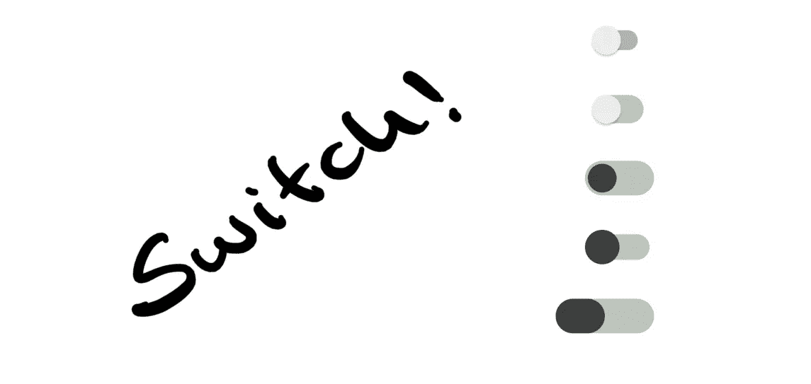
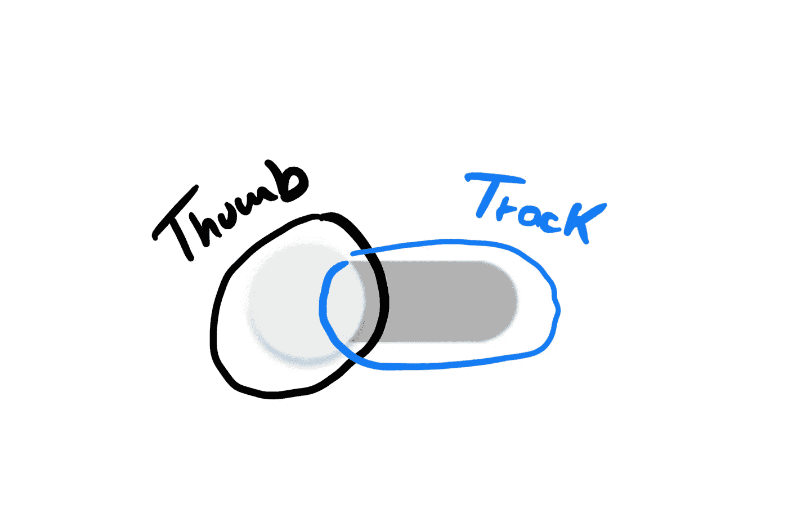
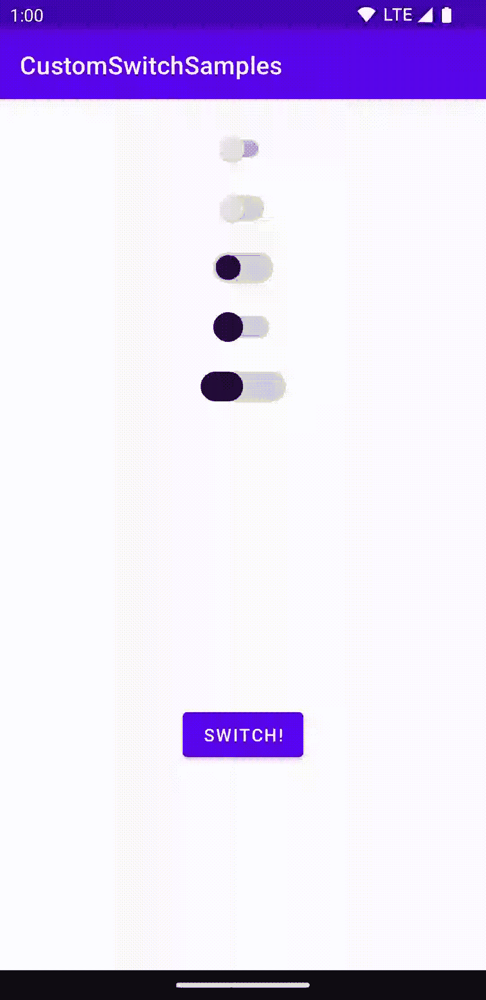

# 如何自定义 Android 中的开关滑块

> 原文：<https://levelup.gitconnected.com/how-to-customize-the-switch-slider-in-android-860bb42efe86>

## 关于如何定制这种按钮以及如何实现它的想法

转换思路由[米格尔](https://medium.com/u/a8017db3e1f1?source=post_page-----860bb42efe86--------------------------------)

要制作一个可识别的应用程序，显示一个品牌而不是一般的东西，我们需要自定义视图。

在安卓系统中，谷歌以[材质设计](https://m2.material.io/design)的形式提供了可识别为谷歌品牌的基本视图。虽然在我看来这种设计语言很漂亮，但它可能会让你的应用程序感觉像是“谷歌制造的”。

在这篇文章中，我想分享你如何定制一个开关按钮，首先看看开关是由哪些部分组成的，然后看看一些设计思路，最后看看如何在 Android 上实现。

# 了解交换机视图

开关是一个视图，它充当一个按钮，重新组合真/假子句的逻辑。每当用户看到它，他可以立即明白他面前的是一个布尔选项，这些是唯一可用的选项。

这就是为什么它是一个有用的设置视图，因为我们有打开或关闭 Wi-Fi 的选项，没有中间点。

你可以争辩说一个[复选框](https://m2.material.io/components/checkboxes)执行同样的功能，但是这种视图更适合于属于列表的项目，把它们看作彼此之间没有关系的独立组件是很奇怪的。

交换机包含下图所示的两个主要组件。

开关组件

**拇指**是将要在水平轴上移动的可移动部件，而**轨道**是拇指可移动的空间。两个组件都定义了开关的状态，这是一个很好的设计实践，为每个状态更改两个组件的颜色。

在 Android 中，两者都是完全可定制的，你可以使用不同的颜色、大小、拇指运动的动画，甚至是图像。

# 设计建议

这里我想分享一些代码中的简单设计，让你学习如何在 Android 中实现开关定制。

> 如果你也对设计感兴趣，但更严重的是，我建议你阅读尼克·巴比奇的这篇文章，他分享了一些美丽的设计理念。

对于定制，我们将使用 [SwitchCompat](https://developer.android.com/reference/androidx/appcompat/widget/SwitchCompat) 视图，以及两个 drawables，分别对应于 thumb 和 track。

在这种情况下，我想创建一个比轨道小的拇指，来创建这个开关。

切换样本

为此，我们需要一个带有透明笔划的拇指，这样它就能制造出它的半径小于轨迹高度的假象。我们可以用下面的代码实现这种行为。

此代码对开关的两种状态使用不同的颜色，轨道也是如此。

轨道与此没有很大的不同，我们有相同的结构，但没有透明的笔画，并且宽度更大。轨道的颜色也比拇指的颜色浅，所以它不会弹出。

在这里你可以看到一些我通常使用的开关修改。在下面的 repo 中，你可以看到它们是如何在 XML 文件中实现的。

切换运行中的样本

 [## GitHub-moli dev 8/CustomSwitchSamples

### 此时您不能执行该操作。您已使用另一个标签页或窗口登录。您已在另一个选项卡中注销，或者…

github.com](https://github.com/molidev8/CustomSwitchSamples) 

# 奖金

下周，我将发表另一篇文章，讲述如何将 XML 配置转化为定制视图，以便它们更具可重用性，因为我今天不想混淆概念。

所以如果你对这个话题感兴趣，请下周继续关注。

**注意:**一旦这个故事发布，我会在这里添加一个参考。

如果你想阅读更多这样的内容，并支持我，不要忘记检查我的个人资料，或给媒体一个机会，成为会员，以获得我和其他作家的无限故事。每月只有 5 美元，如果你使用这个[链接](https://medium.com/@molidev8/membership)，我会得到一小笔佣金。

 [## 通过我的推荐链接加入 Medium—Miguel

### 阅读米格尔的每一个故事(以及媒体上成千上万的其他作家)。你的会员费直接支持米盖尔…

medium.com](https://medium.com/@molidev8/membership) 

# 分级编码

感谢您成为我们社区的一员！在你离开之前:

*   👏为故事鼓掌，跟着作者走👉
*   📰查看[升级编码出版物](https://levelup.gitconnected.com/?utm_source=pub&utm_medium=post)中的更多内容
*   🔔关注我们:[Twitter](https://twitter.com/gitconnected)|[LinkedIn](https://www.linkedin.com/company/gitconnected)|[时事通讯](https://newsletter.levelup.dev)

🚀👉 [**加入升级人才集体，找到一份神奇的工作**](https://jobs.levelup.dev/talent/welcome?referral=true)