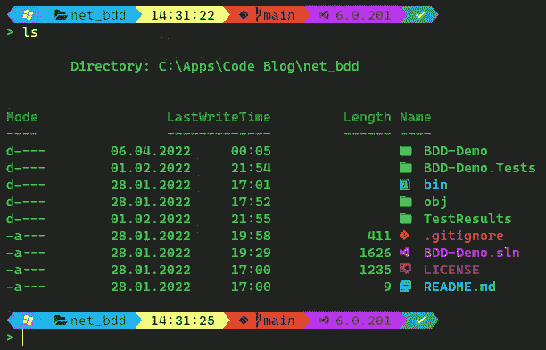
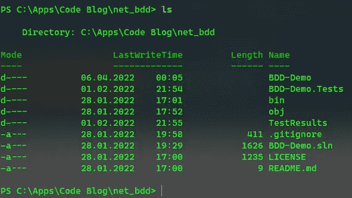
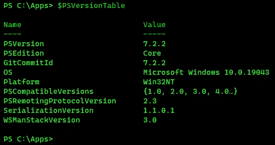
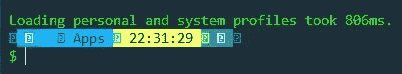
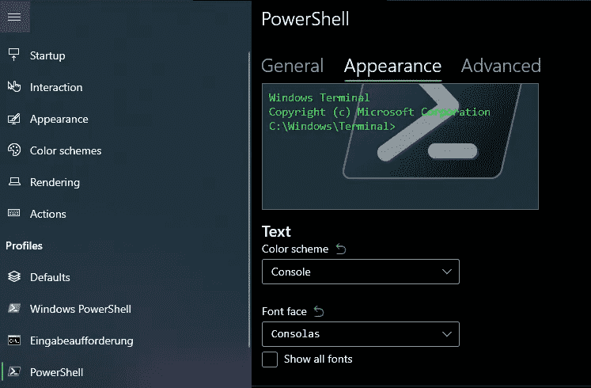
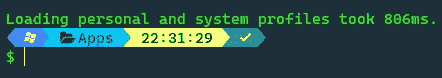
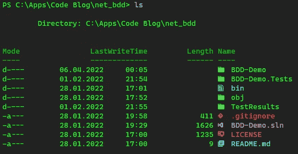

# 如何在终端中自定义命令提示符和图标

> 原文：<https://levelup.gitconnected.com/how-to-customize-your-command-prompt-and-icons-in-your-terminal-f88ea15a5d58>

## 让它闪闪发光！

## 你使用终端吗？你厌倦了枯燥的命令提示符吗？看完这个教程你就不会了！



在本教程中，我将向您展示如何在您的终端中定制您的命令提示符。我的例子可以在 [Windows](https://ohmyposh.dev/docs/installation/windows) 终端和 PowerShell 内核上运行，但是你也可以在你的 [MacOS](https://ohmyposh.dev/docs/installation/macos) 或者 [Linux](https://ohmyposh.dev/docs/installation/linux) 系统上运行。目前支持的 Shell 列表包括 PowerShell、cmd、zsh、bash、fish 和 nu。我将一步一步地向您展示如何转变这一点



原始 PowerShell 用户界面

变成那样！


自定义的 PowerShell UI

## 安装 PowerShell 和 Windows 终端

首先，确保你已经安装了 **PowerShell Core** 。使用命令`$PSVersionTable`可以检查这一点。



PowerShell 中的版本检查

如有必要，按照以下步骤之一安装 **PowerShell 核心**。使用 [msi 包](https://docs.microsoft.com/en-us/powershell/scripting/install/installing-powershell-on-windows?view=powershell-7.2#msi)
手动安装使用 winget `winget install Microsoft.PowerShell`
安装使用[微软商店](https://www.microsoft.com/store/productId/9MZ1SNWT0N5D)安装

下一步，你需要安装 **Windows 终端**，如果你还没有安装的话。用 [msi 包](https://github.com/microsoft/terminal/releases/tag/v1.12.10732.0)手动安装
用 winget `winget install Microsoft.WindowsTerminal`安装
用[微软商店安装](https://www.microsoft.com/store/productId/9N0DX20HK701)

一切都安装好了吗？那我们继续有趣的部分🎉

## 更改命令提示符

定制你的命令提示符的工具是[我的天哪](https://ohmyposh.dev/docs)。你可以在 [Windows](https://ohmyposh.dev/docs/installation/windows) 上用 winget、scoop 或 chocolatey 这样的包管理器安装它。对于 [Linux](https://ohmyposh.dev/docs/installation/linux) 和 [MacOS](https://ohmyposh.dev/docs/installation/macos) 检查安装说明。还有一个安装软件的 PowerShell 命令。

❗以下命令是针对 **PowerShell** 和 **Windows 的！**

接下来，我们需要初始化 oh-my-posh。它将加载默认主题，我们稍后会更改。使用命令
`notepad $PROFILE`编辑您的 PowerShell 配置文件，并插入以下代码。

```
oh-my-posh init pwsh --config <path-to-theme-file> | Invoke-Expression
```

现在你需要选择一个[主题文件](https://ohmyposh.dev/docs/themes)。有很多选项可供选择，所以挑选你最喜欢的并下载 JSON 文件。如果你愿意，你也可以使用我当前的主题。将 JSON 文件存储在您的计算机上，将路径插入到上面的命令中，然后保存您的配置文件。使用`. $PROFILE`重新加载您更改的设置。您定制的命令提示符现在应该是可见的。

❗把你的路径放在引号("")中，如果它包含空格。不然主题就找不到了。

❗如果您无法编辑您的个人资料，文件可能已丢失。执行`$PROFILE`找到期望的路径，然后在该位置创建一个空文件。默认文件名为`Microsoft.PowerShell_profile.ps1`，默认位置为`C:\Users\<user>\Documents\PowerShell`。

❗如果 PowerShell 阻止脚本执行，请查看以下链接来解决问题。

[](https://stackoverflow.com/a/68505597) [## 运行“set-execution policy-Scope Process-execution policy bypass”是否安全

### 保存当前执行策略...$ curr policy = Get-execution policy #...并临时将策略设置为“绕过”…

stackoverflow.com](https://stackoverflow.com/a/68505597) 

要使提示真正成为你自己的，查看一下关于主题的文档。例如，您可以插入片段来显示[当前播放的 Spotify 歌曲](https://ohmyposh.dev/docs/segments/spotify)，[当前。NET 版本](https://ohmyposh.dev/docs/segments/dotnet)，git 的[版本控制信息，或者](https://ohmyposh.dev/docs/segments/git)[最后一条命令](https://ohmyposh.dev/docs/segments/executiontime)的执行时间。编辑您当前的主题文件或从头创建一个新的。如有疑问，请阅读文档。挺好的😊

我的提示包含 6 个部分:

🔹 [OS](https://ohmyposh.dev/docs/segments/os) 段(Windows 图标)
🔹[路径](https://ohmyposh.dev/docs/segments/path)段(显示当前文件夹)
🔹[时间段](https://ohmyposh.dev/docs/segments/time)段(显示当前时间)
🔹 [git](https://ohmyposh.dev/docs/segments/git) 段(显示当前分支，仅在 git 文件夹中可见)
🔹[点网](https://ohmyposh.dev/docs/segments/dotnet)段(显示当前。NET 版，只在。网络文件夹)
🔹[退出](https://ohmyposh.dev/docs/segments/exit)段(显示最后一条命令的状态)


我当前的命令提示符

## 更改字体

建议使用书呆子字体，这样你定制的命令提示符就不会显示任何错误。



没有书呆子字体的提示

检查这个[存档](https://www.nerdfonts.com/font-downloads)的字体，选择你最喜欢的，下载，安装，并在你的 shell 中设置为默认字体。在 Windows 终端中，进入“设置”，选择您的配置文件，进入“外观”选项卡，并从列表中选择已安装的字体。如果字体不可用，可能需要重新启动终端。



在 Windows 终端中设置自定义字体

更改后，您的提示符应该显示正确的字符和图标。



用书呆子字体提示

## 更改图标(仅限 PowerShell！)

与前面的步骤相比，更换**图标**相当容易。您只需要在 PowerShell 中执行命令`Install-Module -Name Terminal-Icons -Repository PSGallery`，并将命令`Import-Module -Name Terminal-Icons`添加到您的配置文件中。然后开始一个新的 PowerShell 会话或使用`. $PROFILE`重新加载配置文件，图标应该已经改变。



图标已更改的 PowerShell 用户界面

## 结论

PowerShell 命令提示符的定制不仅仅是一个光学上的改进。根据您配置的内容和您的工作流，好处可能非常巨大。

查看[我的奢华](https://ohmyposh.dev/docs)、[书呆子字体](https://www.nerdfonts.com/)和[终端图标](https://github.com/devblackops/Terminal-Icons)来定制你想要的提示！ [Scott Hanselman](https://www.hanselman.com/blog/my-ultimate-powershell-prompt-with-oh-my-posh-and-the-windows-terminal) 也写了关于这个话题的博客，并创建了一个很好的指南。如果你有更详细的问题，请查看。

如果你喜欢这篇文章，我会很高兴得到掌声👏(你知道可以拍几次吗？😎)另外，如果你还没有跟上我，我也很感激。

🌲 [linktr.ee](https://linktr.ee/xeladu) | ☕ [咖啡](https://www.buymeacoffee.com/xeladu) |🎁[捐赠](https://www.paypal.com/donate/?hosted_button_id=JPWK39GGPAAFQ) |💻GitHub |🔔[订阅](https://xeladu.medium.com/subscribe)

顺便说一句:如果你还没有 Medium 会员，我建议你使用我的◀推荐链接，因为它会让你访问 Medium 上的所有内容，并以一小部分费用支持我，而不会为你带来任何额外费用。谢谢大家！✨

## 相关故事

[](/how-to-fix-a-broken-branch-after-a-git-merge-or-git-rebase-4ca61c0cb6fd) [## 如何在 git 合并或 git 重置后修复一个损坏的分支

### 本指南向您展示了如何使用断开分支的原始更改来创建新分支。

levelup.gitconnected.com](/how-to-fix-a-broken-branch-after-a-git-merge-or-git-rebase-4ca61c0cb6fd) [](https://xeladu.medium.com/app-management-with-winget-on-windows-e668086a03f7) [## 如何使用 winget 安装、更新和删除您的 Windows 应用程序

### 如何用 Windows 包管理器(winget)安装应用程序，如何保持应用程序更新，以及如何使用…

xeladu.medium.com](https://xeladu.medium.com/app-management-with-winget-on-windows-e668086a03f7) [](/speed-up-old-notebooks-with-google-chromeos-flex-3db16509b013) [## 如何用新的谷歌 ChromeOS Flex 加速旧笔记本

### 我将向您展示如何在旧的 Windows 笔记本上安装谷歌 ChromeOS Flex，并解释其优点和缺点。

levelup.gitconnected.com](/speed-up-old-notebooks-with-google-chromeos-flex-3db16509b013)