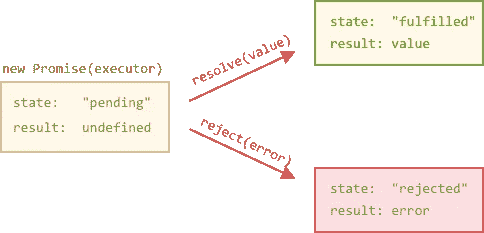
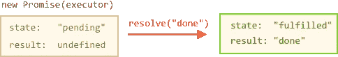

# 如何处理 JavaScript 中的异步代码

> 原文：<https://levelup.gitconnected.com/how-to-deal-with-asynchronous-code-in-javascript-e9f437b46832>

> JavaScript 默认为 ***同步*** 并且是单线程的。
> 这意味着代码不能创建新的线程，它会在 ***提升*** 之后按顺序执行你的代码块。

像 C、Java、C#、PHP、Go、Ruby、Swift 和 Python 这样的编程语言在默认情况下都是同步的，其中一些语言通过使用线程和产生新的进程来处理异步。

这是一个同步代码的例子

```
const a = 1;
console.log(a + 1);
console.log('3');
handleSomething();
```

一行行代码被一个接一个地连续执行。

由于 JavaScript 诞生于浏览器内部，它的主要工作，在开始时，是响应用户的动作，如`onClick`、`onMouseOver`、`onChange`、`onSubmit`等等。它如何用同步编程模型做到这一点呢？

在某些情况下，例如当你想从一个服务器获取一些数据时(这可能需要一段未知的时间),如果你的程序在等待获取数据时完全冻结，效率会非常低。因此，通常不这样做，而是在后台运行获取任务。
这意味着如果一行中有两个函数，而函数 A 是 ***异步的*** ，那么函数 B 将在函数 A 仍在运行时执行。在这种情况下，如果函数 B 依赖于函数 A 获取的数据，你就会遇到问题。

> 异步意味着事情可以独立于主程序流发生。

# 复试

这个问题用 ***回调*** 解决了。

回调是一个简单的函数，作为一个值传递给另一个函数，只在事件发生时执行。有了回调，你可以保证函数 B 只在函数 A 完成它的任务后被调用，因为函数 A 实际上是负责调用函数 B 的人。

```
// doSomething => functionA
// callback => functionBfunction doSomething (options, callback) {
    callback (options);
}doSomething(options, callback);
```

回调对于简单的情况很有用，但是每个回调都会增加一层嵌套，当你有很多回调的时候，代码会很快变得复杂。

```
window.addEventListener('load', () => {
  document.getElementById('button').addEventListener('click', () => {
    setTimeout(() => {
      items.forEach(item => {
        //your code here
      })
    }, 2000)
  })
})
```

这只是一个简单的 4 层代码，但是你已经看到了更多的嵌套层，这并不有趣。

> ***从 ES6*** 开始，JavaScript 引入了几个特性来帮助我们处理不涉及回调的异步代码:

# 承诺

***承诺*** 是处理回调困境和防止在代码中编写过多回调的一种方法。

一旦承诺被调用，它将从**未决状态**开始。这意味着调用者函数继续执行，同时等待承诺进行自己的处理，并给调用者函数一些反馈。

此时，调用者函数等待它返回处于**已解决状态**或**已拒绝状态**的承诺，但是*函数继续执行，同时承诺工作*。

promise 对象的构造函数语法是:

```
let promise = new Promise(function(resolve, reject) {
  // executor (the producing code, "singer")
});
```

产生的`promise`对象具有内部属性:

*   `state` —最初为“待定”，然后变为“已履行”或“已拒绝”，
*   `result` —您选择的任意值，最初为`undefined`。

当执行程序完成作业时，它应该调用一个作为参数获得的函数:

*   `resolve(value)` —表示作业成功完成:
*   将`state`设置为`"fulfilled"`，
*   将`result`设置为`value`。
*   `reject(error)` —表示发生了错误:
*   将`state`设置为`"rejected"`，
*   将`result`设置为`error`。



> `**resolve**`和`**reject**` —这些函数由 JavaScript 引擎预定义。所以我们不需要创建它们。相反，我们应该编写执行程序在准备好的时候调用它们。

下面是一个 Promise 构造函数和一个简单的 executor 函数的例子:

```
let promise = new Promise(function(resolve, reject) {
  // the function is executed automatically when the promise is constructed

  // after 1 second signal that the job is done with the result "done"
  setTimeout(() => resolve("done"), 1000);
});
```

“处理”一秒钟后，执行者调用`resolve("done")`产生结果:



这是一个成功完成工作的例子，一个“实现的承诺”。现在让我们看一个执行者错误地拒绝承诺的例子:

```
let promise = new Promise(function(resolve, reject) {
  // after 1 second signal that the job is finished with an error
  setTimeout(() => reject(new Error("Whoops!")), 1000);
});
```

执行人要做一些通常需要时间的事情然后调用`resolve`或者`reject`来改变对应的承诺对象的状态。

> 许诺可以 ***消耗*** 或者使用。

```
const doSomething = new Promise()
//...

const checkIfItsDone = () => {
  doSomething
    .then(ok => {
      console.log(ok)
    })
    .catch(err => {
      console.error(err)
    })
}
```

运行`checkIfItsDone()`将执行`doSomething()`承诺，并等待它解决，使用`then`回调，如果有错误，它将在`catch` 回调中处理它。

> 承诺的引入是为了解决著名的*回调困境*，但是它们本身引入了复杂性和语法复杂性。

# 异步/等待

由于 ES2017 异步 JavaScript 使用了 async/await 语法，因此更加简单。

## 异步函数

以一种更舒适的方式，他们减少了承诺周围的样板文件，以及链接承诺的“不要打破链条”的限制。它非常容易理解和使用。

`async`关键字放在函数之前，关键字`await`让 JavaScript 等待，直到承诺完成并返回结果。

```
async function f() {

  let promise = new Promise((resolve, reject) => {
    setTimeout(() => resolve("done!"), 1000)
  });

  let result = await promise; // wait till the promise resolves (*)

  alert(result); // "done!"
}

f();
```

在任何函数前面加上`async`关键字意味着该函数将返回一个承诺，并将非承诺包装在其中。`await`字面意思是让 JavaScript 等到承诺达成，然后继续处理结果。这不会消耗任何 CPU 资源，因为引擎可以同时做其他工作:执行其他脚本，处理事件等。

如果你想获得更多的阅读资料，这里有一些我最喜欢的关于承诺和异步/等待编码的博文:

[](/understand-javascript-promises-by-building-a-promise-from-scratch-84c0fd855720) [## JavaScript 承诺——通过构建一个简单的承诺示例来理解 JavaScript 承诺

### 一步一步的教程，确保你完全理解 JavaScript 的承诺是如何工作的，从…

levelup.gitconnected.com](/understand-javascript-promises-by-building-a-promise-from-scratch-84c0fd855720) [](https://flaviocopes.com/javascript-promises/) [## 理解 JavaScript 承诺

### 学习 JavaScript？下载我的免费 JavaScript 手册🔥承诺通常被定义为一种价值的代表…

flaviocopes.com](https://flaviocopes.com/javascript-promises/) [](https://hackernoon.com/javascript-promises-and-why-async-await-wins-the-battle-4fc9d15d509f) [## JavaScript:承诺和为什么 Async/Await 赢得了这场战斗

### 异步函数在 JavaScript 中有好有坏。好的一面是异步函数…

hackernoon.com](https://hackernoon.com/javascript-promises-and-why-async-await-wins-the-battle-4fc9d15d509f) 

感谢阅读！:)