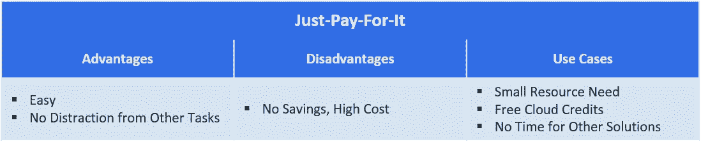
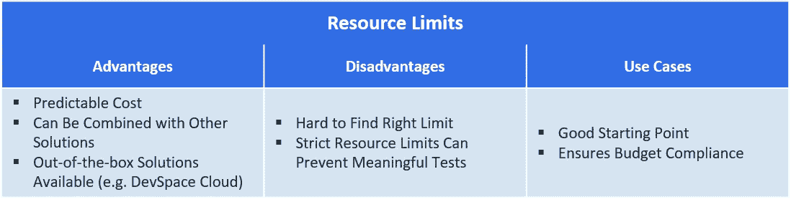
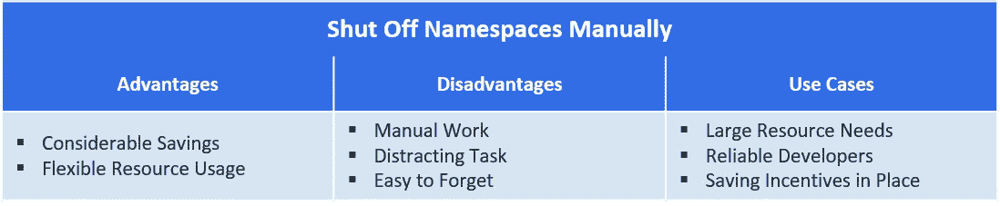
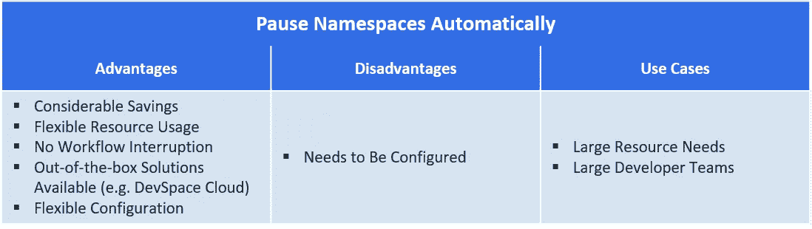

# 如何处理基于 Kubernetes 开发的计算资源成本

> 原文：<https://levelup.gitconnected.com/how-to-deal-with-computing-resource-cost-for-kubernetes-based-development-f723aef01660>

比较不同方法来节省云计算开发的计算资源成本。

随着 DevOps 范式和容器编排技术 Kubernetes 的兴起，越来越多的开发人员不仅在部署中使用 Kubernetes，而且在开发过程中也使用它。这就带来了一个问题，即如何让开发人员在不花费过多资金在计算资源上的情况下做到这一点，尤其是在公共云中。在这篇文章中，我将比较处理这个问题的不同方法。

# 本地或云开发

首先，您需要决定应该使用哪一个 Kubernetes 开发环境。原则上有两种选择:使用开发者电脑的本地资源或者使用云资源。虽然本地开发对于较简单的应用程序和个人或较小的团队来说是一种选择，但是云环境对于较大的团队和非常复杂的应用程序也是可行的。关于为开发者提供访问 Kubernetes 的不同方法的比较，[请参考我关于这个主题的帖子](https://devspace.cloud/blog/2020/01/09/access-to-kubernetes-for-developers)。

# 简单的方法:地方发展

节省计算资源成本的最简单方法是只使用本地计算机上可用的资源。如果有可能在本地 k8s 环境下运行你的应用，比如使用 [minikube](https://github.com/kubernetes/minikube) 这样的工具，你不会为此付出任何代价(如果你的电脑使用更频繁，忽略稍微高一点的电费)。然而，您可能需要为所有开发人员配备非常强大的计算机，它们将被大量使用，这可能会导致购买更好的硬件的一些成本。

由于本地开发在计算资源方面受到限制，因此它只能用于较简单的应用程序，并且更适合小型团队，因为它需要在每台计算机上设置和维护 Kubernetes，这导致了大型团队的大量维护开销。然而，简单的应用程序和小团队通常也不会在云环境中造成高成本，从而降低了问题的紧迫性。

总的来说，这种方法当然非常便宜，对于没有太多资源需求的团队来说是一种可能的解决方案，对于想要尝试 Kubernetes 的业余程序员来说也很有吸引力。然而，对于企业来说，这通常不是一个可行的解决方案。

# 真正的问题是:基于云的开发

许多公司已经在使用基于云的开发，[也就是说，他们允许开发者访问云来运行和测试他们的软件](https://devspace.cloud/blog/2019/12/12/cloud-development-new-standard)。这可能有两个原因:有时，他们不得不这样做，因为他们需要本地计算机上不可用的额外云计算资源。对于较大的应用程序、微服务架构或需要 GPU 的应用程序，如机器学习应用程序，尤其如此。第二个原因是企业希望使用云开发。这可能是因为它在团队中更容易维护，或者对于没有 k8s 知识的开发人员来说更容易使用，所以他们可以在这种环境中更高效地工作。

正如我在[的另一篇文章](https://devspace.cloud/blog/2020/01/09/access-to-kubernetes-for-developers#2-provide-developers-access-to-kubernetes-in-the-cloud)中所描述的，让开发者访问 Kubernetes 集群有两种可能:给每个开发者一个自己的集群或者与许多开发者共享一个集群。给每个开发人员一个自己的集群有几个缺点。其中之一是它在使用资源方面效率不高，因为必要的 Kubernetes 功能必须并行运行多次，并且不能共享，这是对资源的浪费。为此，共享一个集群([多租户](https://loft.sh/blog/kubernetes-multi-tenancy-best-practices-guide/))在计算资源的使用方面更有效，这就是为什么我在下面假设这种方法。

然而，一个共享集群也可能需要相当多的资源，尤其是如果多个开发人员想要在其上并行开发复杂的软件。处理这个问题有不同的方法:

# 应对高云计算开发成本的方法

## 1.付钱吧

第一种解决方案是只支付云资源的成本。当然，这是一个非常简单的方法，但是虽然听起来很琐碎，但在某些情况下它仍然是一个好的选择。这些情况包括您从公共云提供商那里获得了大量云积分(在某些情况下[您可以获得 100，000 美元](https://cloud.google.com/developers/startups/)甚至更多)，因此您实际上并没有为此“付费”。创业公司通常可以获得这些信用，但如果其他问题更重要，即使没有信用的公司也可能选择简单地付出代价，而不试图优化任何东西。例如，假设一家初创公司希望尽快发布新产品，因此不想处理产品开发之外的其他问题。如果相关成本的绝对值不是很高，那么只支付云资源也是有意义的，因此在优化方面的投资不会有回报。

然而，这种简单化的方法显然没有以任何方式进行优化，并且从长远来看会变得非常昂贵。

“付费购买”方法的优点、缺点和使用案例

## 2.建立资源限制

第二种方法是通过实现技术限制或禁止使用超过预先指定的资源量的规则来限制资源使用。这种方法会为你的花费设定一个最高限额，所以你可以确定每个月的花费不会超过这个限额。通过使用[信息亭](https://github.com/kiosk-sh/kiosk)或[阁楼](https://loft.sh/)等解决方案，可以确保资源限制的技术实施。

使用这种方法，将限额设置为正确的数量是很重要的，否则您可能会花费过多，或者会减慢开发流程。当你只是设定开发者应该如何处理云资源的规则时，你还需要注意团队中的每个人都遵守这些规则，否则它们将变得毫无用处。

虽然这种解决方案可以为您节省一些成本，并为您的云账单设置一个上限，但它仍然没有优化。在某些情况下，可能需要比允许的更多的资源，例如测试一个新的特性，而在其他情况下，可能已经用比允许的更少的资源执行了任务。

总的来说，这种方法是一个很好的起点，易于实施，主要优点是总成本可以预测。对于您的工作流，它仍然没有优化，但它可以与下面两个解决方案之一相结合。

“资源限制”方法的优点、缺点和使用案例

## 3.手动关闭名称空间

第三种方法是指示所有开发人员一旦不再需要就删除或缩小名称空间，并在恢复工作时重新启动或扩大名称空间。这可以节省大量成本，因为在大多数情况下，不需要计算资源，但您仍然必须支付它们，例如在晚上、周末、假日或会议期间。由于使用了容器和 Kubernetes，通常可以在开发过程中删除容器并重新启动它们。使用这种方法，您可以节省大量成本，同时，它不会以任何方式限制您的开发人员，因为他们仍然可以在需要时按自己的意愿进行扩展。

然而，这种解决方案也有一些缺点:首先，每次关闭后重新启动应用程序会花费一些时间。其次，这个解决方案是通过要求开发人员来实现的，所以你必须依赖他们来实际执行。不幸的是，缩减和关闭资源是一项很容易被遗忘的任务，尤其是在突发事件发生时，例如周末开始前的自发会议。它也可以被看作是一个“令人讨厌”的任务，因为开发人员看不到这样做的任何好处，但是当他们想继续工作时，这反而会导致他们等待。为此，激励他们可靠地完成这项任务可能是有意义的，这又会导致管理层付出一些额外的努力。

“关闭名称空间”方法的优点、缺点和用例

## 4.自动暂停名称空间

与第三种解决方案相关的是在一段时间不活动后自动暂停名称空间的方法。这可以通过 [loft 的睡眠模式](https://loft.sh/docs/sleep-mode/basics)来实现。此睡眠模式会自动将 Kubernetes 副本集、部署和状态集调整为零，资源配额中的 pod 数量将设置为 0，并且命名空间中的所有现有 pod 都将被终止。

可以配置名称空间暂停所需的不活动时间，因此您可以单独决定它们是否应该暂停较短的休息和会议，或者只是在周末和假日暂停。可以在单个命名空间、用户或集群级别设置此配置。只要用户是活动的，即通过 loft API 服务器发出请求，loft 就会识别这一活动，因此不会将名称空间发送到睡眠模式。当开发人员再次开始使用暂停的名称空间时，该名称空间也将自动继续工作。

如果您适当地配置这种睡眠模式，通过考虑您的应用程序的规格和单个开发人员的工作行为，它将成为降低您的云计算成本的“智能”方法。因此，您可以节省高达 70%的云成本，而不会限制开发人员的工作。它也很容易实现，因为开发人员不需要调整他们的正常工作流程，但只有 loft 必须安装到集群中，并且睡眠模式必须在其图形用户界面中配置一次。

“暂停名称空间”方法的优点、缺点和用例

# 结论

云计算成本可能是采用 Kubernetes 进行开发的一个障碍。然而，这是一个相当战略性的决定，成本不应该是使用云进行开发或不使用云的主要原因，尤其是有很多方法可以在很大程度上降低相关成本。

哪种处理云成本的方法最适合您取决于您的具体情况以及该问题的紧迫性。如果您在本地开发，您根本不会面临这个问题，但是如果您使用云开发，如果您的成本不是很高，并且您有其他更优先的问题，那么不立即采取行动可能是正确的方法。然而，从长远来看，节省计算资源通常是值得的。为此，您可以为开发人员设置严格的限制，要求他们自动关闭他们的环境或暂停他们的名称空间。特别是设置技术限制和自动暂停名称空间的组合可以为您节省大量成本，并在不影响 [Kubernetes 开发工作流](https://loft.sh/blog/kubernetes-development-workflow-3-critical-steps/)的情况下设置最大限制。这两个都可以通过在您的 Kubernetes 集群上安装 loft 来实现。

由[麦肯齐·马尔科](https://unsplash.com/@kenziem?utm_source=unsplash&utm_medium=referral&utm_content=creditCopyText)在 [Unsplash](https://unsplash.com/s/photos/dollar?utm_source=unsplash&utm_medium=referral&utm_content=creditCopyText) 上拍摄的照片

*最初发布于*[*https://devspace . cloud*](https://devspace.cloud/blog/2020/01/08/computing-resource-cost-for-cloud-development-with-kubernetes)*。*