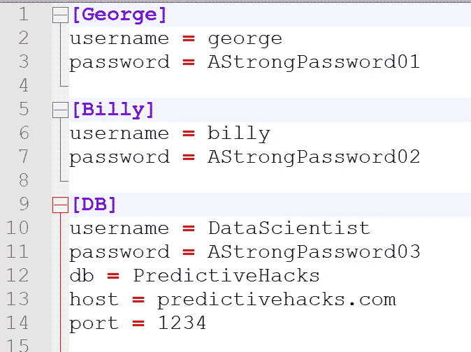

# 如何在 Python 中处理配置和凭证文件

> 原文：<https://levelup.gitconnected.com/how-to-deal-with-configuration-and-credential-files-in-python-db4412506b5e>

## 在一个文件中处理不同连接的有效方法！

[](https://jorgepit-14189.medium.com/membership) [## 用我的推荐链接加入媒体-乔治皮皮斯

### 阅读乔治·皮皮斯(以及媒体上成千上万的其他作家)的每一个故事。您的会员费直接支持…

jorgepit-14189.medium.com](https://jorgepit-14189.medium.com/membership) 

数据科学家和数据工程师可能需要同时访问许多系统。例如，在 ETL/ELT 工作中，有机会从 Hadoop、BigQuery、MySQL、PostgreSQL、Redshift、Snowflake 等不同来源中提取和存储数据。此外，可能有不同的用户拥有不同的凭据，最后，可能有不同的环境，如测试、试运行和生产环境。在本帖中，我们将解释如何使用一个配置文件在 Python 中处理不同的凭证。

# configparser 模块

构建 [configparser](https://docs.python.org/3/library/configparser.html) 模块是为了在一个文件中处理不同的凭证。让我们看看如何以编程方式创建配置文件。我们的目标是创建不同连接的凭证。

## 创建配置文件

```
import configparserconfig = configparser.ConfigParser()# Connection for the user George
config['George'] = {'username': 'george',
                     'password': 'AStrongPassword01'}# Connection for the user Billy
config['Billy'] = {'username': 'billy',
                     'password': 'AStrongPassword02'}# connection to the database
config['DB'] = {'username': 'DataScientist',
                'password': 'AStrongPassword03',
                'db': 'PredictiveHacks',
                'host': 'predictivehacks.com',
                'port':1234}# write the 
with open('my_config.ini', 'w') as configfile:
    config.write(configfile)
```

运行脚本后，创建了“ **my_config.ini** ”文件，如下所示:



或者，我们可以使用文本编辑器创建配置文件。例如“ **my_config.ini** ”:

```
[George]
username = george
password = AStrongPassword01[Billy]
username = billy
password = AStrongPassword02[DB]
username = DataScientist
password = AStrongPassword03
db = PredictiveHacks
host = predictivehacks.com
port = 1234
```

## 使用配置文件

让我们看看如何使用 Python 获得凭证。首先，我们将看看如何获得配置文件的所有连接。

```
import configparserconfig = configparser.ConfigParser()# read the configuration file
config.read('my_config.ini')# get all the connections
config.sections()
```

**输出:**

```
['George', 'Billy', 'DB']
```

现在，我们将获得“乔治”的用户名和密码

```
username = config.get('George', 'username')
password = config.get('George', 'password')print(f'The username is {username} and the passowrd is {password}')
```

**输出:**

```
The username is george and the passowrd is AStrongPassword01
```

或者，您可以按如下方式获取凭据:

```
username = config['George']['username']
password = config['George']['password']print(f'The username is {username} and the passowrd is {password}')
```

**输出:**

```
The username is george and the passowrd is AStrongPassword01
```

显然，按照与上面相同的逻辑，我们可以获得其他连接的凭证，如“ **Billy** ”和“ **DB** ”。

最初发布于[预测黑客](https://predictivehacks.com/?all-tips=how-to-deal-with-configuration-and-credential-files-in-python)