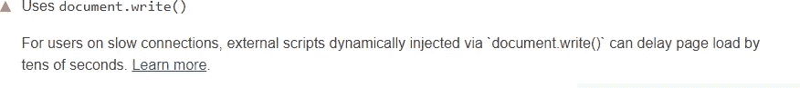

# React 和 Next.js 中如何处理 document.write()

> 原文：<https://levelup.gitconnected.com/how-to-deal-with-document-write-in-react-and-next-js-31f0c1215e43>

## 使用 PostScribe 异步加载同步外部脚本


照片由[萨法尔·萨法罗夫](https://unsplash.com/@codestorm?utm_source=medium&utm_medium=referral)在 [Unsplash](https://unsplash.com?utm_source=medium&utm_medium=referral) 拍摄

当开发一个 [React](https://reactjs.org/) 或 [Next.js](https://nextjs.org/) app 时，你可能需要通过 HTML `[<script>](https://developer.mozilla.org/en-US/docs/Web/HTML/Element/script)`标签导入外部 JavaScript 文件。在处理广告的时候尤其如此。

这里的问题是那些外部脚本经常使用`[document.write()](https://developer.mozilla.org/en-US/docs/Web/API/Document/write)`语句。这不仅有限制，而且不鼓励使用，并在浏览器控制台中报告警告。在某些情况下，它甚至可能因为速度原因被浏览器阻止，使导入的外部脚本被破坏。

由于您通常不能更改这些外部脚本的代码，这很容易成为一个令人头痛的问题。幸运的是，有一个解决方案！

让我们看看 PostScribe 库如何在 JavaScript 和 TypeScript 中帮助解决 React 或 Next.js 中的问题。

# 为什么应该避免使用 document.write()

在这篇 2016 年的文章中，谷歌探究了为什么`document.write()`对网速慢的用户来说是个问题。详细来说，这条语句可以让一个网页的加载时间变慢几十秒。发生这种情况是因为在浏览器能够呈现网页之前，它需要生成整个 [DOM](https://en.wikipedia.org/wiki/Document_Object_Model) 树。如果 HTML 解析器遇到一个脚本，它必须在继续之前停止并启动它。

问题是，如果脚本用`document.write()`动态注入另一个脚本，解析器被迫等待新的外部资源被下载。这可能导致一次或多次网络往返，并延迟网页的呈现时间。

这是一个现代浏览器可以根据用户的连接速度选择阻止`document.write()`执行的问题。换句话说，你不能完全依赖它。

当使用且未被阻止时，Chrome DevTools 控制台会用以下消息警告您:

```
[Violation] Avoid using document.write().
```

同样，这是 Firefox DevTools 控制台在使用它时打印的内容:

```
An unbalanced tree was written using document.write() causing
data from the network to be reparsed.
```

[Google Lighthouse](https://developers.google.com/web/tools/lighthouse/) 也不喜欢它，并将使用以下消息报告未被阻止的`document.write()`语句:



谷歌灯塔错误信息

解决`document.write()`的方法实际上很容易找到。您应该简单地用显式 DOM 操作语句替换任何`document.write()`语句，比如`[.appendChild()](https://developer.mozilla.org/en-US/docs/Web/API/Node/appendChild)`。另一方面，您可能无法访问这些外部脚本，也无法更改它们的代码。在这种情况下，[后置](https://github.com/krux/postscribe)就是解决方案。

# 解决 document.write()问题

> 远程脚本，尤其是广告，会阻止页面在加载时做任何其他事情。它们对加载时间的贡献很大%,这会影响您的底线。*异步*广告不阻塞页面，可以在核心内容之后投放。
> 
> 为什么异步投放广告这么难？因为它们可能包含对期望同步处理的`document.write`的调用。PostScribe 允许您异步交付同步广告，而无需修改广告代码。—[postscripter 的官方 GitHub 页面](https://github.com/krux/postscribe)

让我们假设`https://external-domain.com/ads.js`是您使用`document.write()`的外部脚本文件。这将负责在`<div id="#adv"></div>` HTML 元素中加载广告。

将`<div id="#adv"></div>`添加到您的 DOM 并使用下面的代码行导入外部脚本会导致前面提到的问题:

```
<script src={"https://external-domain.com/ads.js"} />
```

现在让我们看看如何避免它们。

首先，您需要使用以下命令安装 PostScribe:

```
npm install --save postscribe
```

这样，`[postscribe](https://www.npmjs.com/package/postscribe)` npm 库将被添加到项目的依赖项中。点击了解更多`postscribe` [。](https://github.com/krux/postscribe)

现在，您可以定义一个与`postscribe`异步加载外部脚本的`ExternalAd` React 组件，如下所示:

只有当`<div id="adv"></div>`元素被加载时，这个组件才会在`<div id="#adv"></div>` DOM 元素中加载`https://external-domain.com/ads.js`外部脚本。这是因为它使用它的 React 引用作为`[useEffect()](https://reactjs.org/docs/hooks-effect.html)`钩子内部的标志。点击了解更多关于 React 参考[的信息。](https://reactjs.org/docs/refs-and-the-dom.html)

现在，你可以随时使用这个组件，使用下面的 [JSX](https://reactjs.org/docs/introducing-jsx.html) 语句:

```
<ExternalAd />
```

由于有了`postscribe`，外部资源现在被异步加载，浏览器应该不会再阻塞它，尽管它可能仍然会抱怨`document.write()`。

## 在打字稿中制作后抄件

以下 import 语句在 TypeScript 上不起作用:

```
import postscribe from "postscribe"
```

这是因为 PostScribe 在编写时似乎不支持 TypeScript。幸运的是，解决这个问题非常简单。您需要做的就是创建一个`postscribe.d.ts`文件，如下所示:

这将帮助 TypeScript 加载`postscribe`没有问题。点击了解更多关于这个变通办法的信息。

# 结论

在本文中，我们了解了为什么`document.write()`对于慢速连接的用户来说是一个问题，为什么它应该作为结果使用，以及如何防止现代浏览器在加载外部资源时阻止它。所有这些都要感谢 PostScribe，它允许您异步加载同步资源并解决`document.write()`带来的问题，而不必修改外部资源的代码，这通常不是一个选项。

感谢阅读！我希望这篇文章对你有所帮助。请随意留下任何问题、评论或建议。