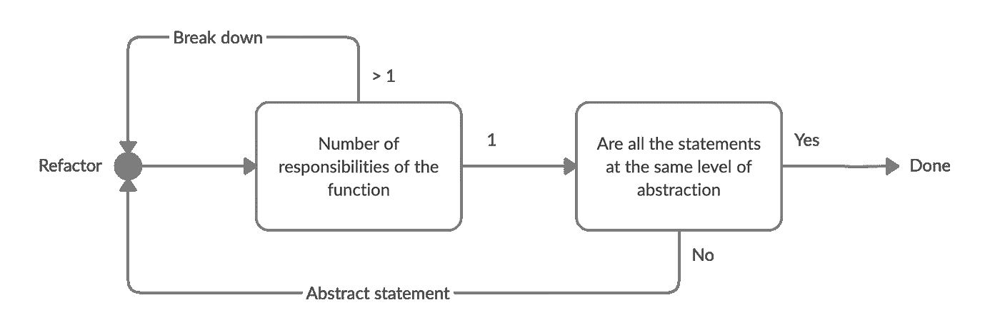

# 作为程序员如何应对过度思考

> 原文：<https://levelup.gitconnected.com/how-to-deal-with-overthinking-as-a-programmer-5e8b53c08742>

照片由 [Andrea Piacquadio](https://www.pexels.com/@olly?utm_content=attributionCopyText&utm_medium=referral&utm_source=pexels) 从 [Pexels](https://www.pexels.com/photo/photo-of-a-woman-thinking-941555/?utm_content=attributionCopyText&utm_medium=referral&utm_source=pexels) 拍摄

我仍然记得当我大学毕业后找到第一份工作时，那种感觉是多么的不可思议和难以抗拒。我渴望吸收每一点知识，在自己的领域做到最好，但很快意识到“完美”的代码并不存在。

我开始注意到自己陷入了几个小时，有时甚至几天的困境，我称之为“代码瘫痪”。如果你像我一样是一个过度思考者，你甚至可能遇到过类似的情况，你发现自己被困在分析情况及其参数，而不是采取行动；这被称为“分析瘫痪”。

> 代码瘫痪是在软件开发环境中由于过度思考而导致生产力受损的一种情况。

# 问题是

代码瘫痪是一种常见的现象，在很多决策情况下都会发生；它们的范围可以从大的架构决策，到简单地编写一个小的条件语句。

让我们考虑下面的任务:向您提供一个数组`Account`，并要求您编写一个函数，将所有余额为负的`Account`的`state`设置为`'inactive'`，并返回一个更新后的数组。

您可能会想到的一个可能的解决方案是:

它像预期的那样工作，但是我们先`filter`数组，然后将`Account`更新到正确的`state`怎么样:

但是，等等，为什么我们要迭代两次，而我们可以`reduce`它:

看起来棒极了！但是如果用包含百万个条目的数组`Account`来调用该函数会怎么样呢？在这种情况下，我们最好使用本地的`for`循环…

虽然这可能是一个非常简单的任务，但在过度思考者的头脑中，它会很快升级。编写代码的艺术从来都不是非黑即白的，实现的正确性取决于多种因素，例如:

*   代码库模式
*   特定语言的习语
*   可读性和性能之间的平衡

# “解决方案”

好吧，那我们该怎么处理？

来自 [Pexels](https://www.pexels.com/photo/pensive-ethnic-man-listening-to-answer-in-paper-cup-phone-3760607) 的 [Andrea Piacquadio](https://www.pexels.com/@olly) 的照片

坏消息是，这是无法回避的。直到今天，这仍然是我不断奋斗的目标。但是我已经开发了一个简单的框架来帮助我在陷入这种思维循环时尽快处理这种情况。我尽可能保持简单，否则我将永远不会坚持，我们开始吧:

# 1.有明确的目标

我们常常不知道如何构建一个特性或服务，因为我们不知道首先需要构建什么。确保你有所有的要求，你完全理解他们。这也是一个戴上“用户帽子”问问自己的好机会:

*   解决方案是否解决了问题并满足了最初强加的用户需求？
*   考虑到时间限制，这是最有效的解决方案吗？

# 2.不管发生什么，都要让它成功！

不，说真的，假装没人会去读你的代码，然后写出你想到的任何东西，让它尽可能的实用。一旦测试用例通过，或者最低限度的功能工作，停下来，离开你的笔记本电脑！

# 3.开始重构

在我看来，这是最难的一步，代码重构本身就值得一整篇文章、一本书，甚至一整个库。以下是我处理重构过程时的一般思维过程，用状态图表示:

请注意，这不是一个“一刀切”的场景，而是一个很好的切入点，如果你不知道从哪里开始。

软件设计原则有很多，但个人认为最重要最实用的是[单责任原则](https://en.wikipedia.org/wiki/Single-responsibility_principle) (SRP)。

> 函数应该做一件事。他们应该做好这件事。他们应该只做这件事。
> 
> —鲍勃叔叔

SRP 有助于保持您的功能小而易管理。现在，让我们通过浏览状态图来尝试重构前面例子中的代码。

第一步是问我们自己:`deactivateAccounts`函数有多少职责？

答案是 **2** :

1.  过滤掉负余额的`Account`。
2.  将他们的`state`设置为`"inactive"`。

如前所述，我们的第一步行动是将`deactivateAccounts`分成如下两块:

注意`deactivateAccounts`现在将如何去激活所有的`Account`而不管它们的`balance`。这是有意的，因为可能从不同模块调用`deactivateAccounts`的人永远不会期望它只去激活负`Account`。主函数的一个更具描述性和准确性的名称是`deactivateNegativeAccounts`。

回到状态图:每个功能有多少职责？现在答案是每人一个:

*   `filterByNegativeBalance`只是通过`balance`过滤账户。
*   `deactivateAccounts`只是更新了`state`。

太棒了。我们可以进入下一步:所有的语句都在同一抽象层次吗？

*   `filterByNegativeBalance`我们只是在`balance`上调用了一个`getter`，所以我们在这里很好。
*   `deactivateAccounts`这个函数真的需要知道如何去激活一个`Account`吗？不完全是，所以我们应该抽象出`state`更新并封装在类`Account`中。

以下是完整的重构代码:

搞定了。如前所述，重构代码是一个巨大的话题，如果你想了解更多，我强烈推荐罗伯特·c·马丁的《干净的代码》。

# 4.寻求反馈

准备好了没有，不要害怕伸出手。如果你有机会在一家大公司工作，那么你团队中的每个人，尤其是你的经理，都会希望你成功。这符合他们的最佳利益。还不确定？将你的 CL 呈现为“草稿”，他们不需要知道它实际上是你完成的作品:)

# 5.重复

重复几次第 3 步和第 4 步，问题越复杂，需要的迭代次数就越多。但是对迭代的次数设置一个硬限制，并对你的步骤设置时间限制，以确保你不会陷入无限的重构循环，这是非常重要的。这将有助于在完成任务和推出干净易读的代码之间取得平衡。

# 仅此而已！

还有一件事，在这个过程中至少走一次 5 分钟的路。我说真的，站起来离开你的桌子！这里涉及到一些生物学因素，散步增加了大脑的血流量，让你的大脑重新调整，带着新的视角回来。

这个小框架在我的职业生涯中极大地帮助了我对抗代码瘫痪，现在仍然如此，我希望它也能帮助你。感谢阅读！