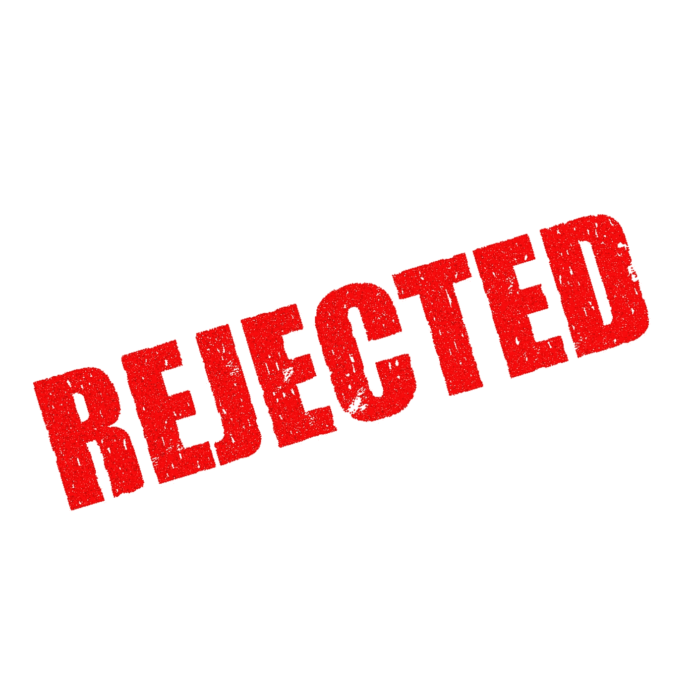
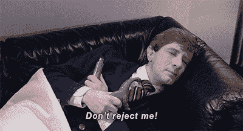

# 如何应对拒绝

> 原文：<https://levelup.gitconnected.com/how-to-deal-with-rejection-c9f63f1f5de0>

我们都曾在生活中被拒绝过，无论是工作申请、学校申请、合同申请、恋爱申请、签证申请等等。无论你目前面临哪种拒绝，事实仍然是拒绝会让人受伤，而且是不可避免的。

虽然拒绝通常是生活的一部分，但有些类型的拒绝可能比其他类型的更难处理。

拒绝最难的部分是让你相信你在某件事上失败了，这让你觉得自己不够好。

或者，当拒绝到来时，不要再对自己太苛刻，你可以把它作为一个提升自己的机会，为即将到来的下一个大机会做准备。

拒绝让人心碎，它也会摧毁你的自尊和自信。这让你质疑自己的价值和能力。但是拥有正确的心态会改变你对拒绝的感觉。

我记得当我刚从大学毕业，没有任何工作经验，开始我的前端开发职业生涯时，我一直在寻找提高技能的机会。

我做了 50 多份申请，我没有从一些申请中得到反馈，这实际上并不好，而一些，我得到了建设性的反馈，这帮助我从不同的角度看待拒绝。

我是如何面对拒绝并坚持申请直到我最终得到一个职位的，这将在后面讨论。

> 在这里阅读我的故事👉👉:[我是如何从一名会计学生转变为前端开发人员的。](/how-i-transitioned-from-an-accounting-student-to-a-front-end-developer-1ab3ab1cf9e8)

有很多方法可以帮助你应对拒绝，让你成为一个更强更好的人。

# **应对拒绝的方法**

# 🔵**停止过度思考**

人们以不同的方式处理拒绝，对一些人来说这是他们一生中的艰难时刻，而一些人把它作为生活的一部分，继续前进。在被拒绝的那段时间，有些人认为自己陷入了抑郁，他们开始责怪自己，他们也开始觉得自己是个失败者。但现在不是开始思考和责怪自己的时候，而是善待自己并继续前进的时候。

# **🔵养成健康的习惯**

当拒绝发生时，我们往往会因为那些可能导致我们被拒绝的事情而自责。许多人开始养成不健康的习惯，这可能是痛苦的结果。养成健康的习惯，比如均衡饮食、经常锻炼、保持水分，可以帮助你保持强壮。

# **🔵花时间和你爱的人在一起，做你喜欢的事情。**

你处理拒绝的时间是和你爱的人、你爱的事、你喜欢做的事一起度过的最好时间。这有助于你暂时转移注意力。做你喜欢的事情有不同的方式，就我个人而言，我喜欢看电影，尝试新的食物食谱等等。这有助于我在经历拒绝阶段时放松和转移注意力。

# 🔵对内心的批评家说不。

内心的批评是在你脑海中嘀咕或低声抱怨你是多么无能、低效、没有吸引力、不聪明，或者也许你在生活中是不成功的。所以你被拒绝了。当你注意到这个声音开始在你的脑海中响起时，在它对你的思维过程产生负面影响之前关闭它。

你可以用电影《王座游戏》中的一句名言“不是今天”来关闭内心的批评

# 🔵给自己时间疗伤

休息一下是可以的，休息一天，或者脱离你的正常日程安排也不是一个坏主意。给自己时间去愈合和处理。但是确保你不要走极端，花几天时间坐在家里沉浸在痛苦中。从长远来看，这只会让你感觉更糟。

# 🔵保持乐观

在此期间保持积极是最难做到的事情之一。

当你仍处于情绪混乱或有点震惊时，试图强迫乐观或向前迈进通常不会有什么效果。

但是你可以通过列出你的优势和价值观以及一些你已经实现的事情来保持乐观，即使看起来你无法实现。你可以通过积极肯定自己来开始新的一天，从而保持积极的心态。

# 🔵把它当作一个机会

有时候拒绝可能是一个重要的警钟，可以帮助你改善生活。

如果说从拒绝中学到了一项重要的技能，那就是永远不要让它阻止你未来的努力。被拒绝只是生活中不可避免的一部分，毕竟，我们认识的每个成功人士都经历过。

# 🔵记住拒绝是暂时的，不是永久的(如果你坚持下去的话)。

你需要时刻记住的一点是,‘No’中的字母 N 和 O 并不意味着*没有机会*，而是意味着下一个机会。这完全取决于你如何看待和感知生活。

让我们来看看一些成功的故事，人们是如何被拒绝几次，直到最终被接受。

***我会留下赛斯·戈丁*** 的一段话

> *“他们没有拒绝你，*
> 
> 他们拒绝了一份申请，他们拒绝了一份商业计划，他们拒绝了一张纸。
> 
> *他们不认识你”。*

请在评论区告诉我你是如何处理拒绝的。

感谢阅读😊😊