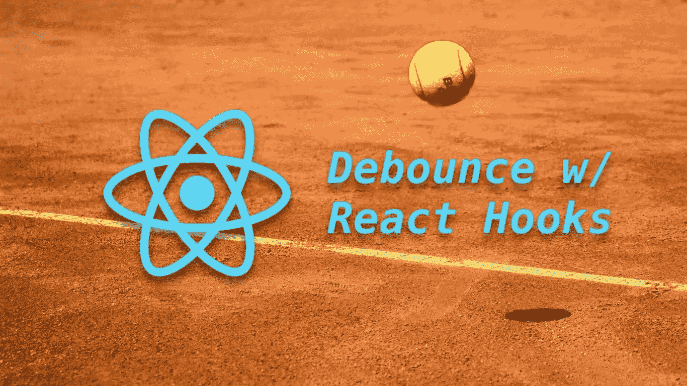
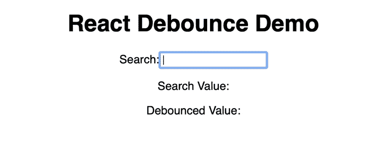

# 如何用 React 钩子去抖道具

> 原文：<https://levelup.gitconnected.com/how-to-debounce-props-with-react-hooks-20db02af53be>

## 使用 useCallback、useEffect 和 useState 对用户输入和道具进行去抖。此外，学习如何创建自己的 *useDebounce* 自定义反应钩。

塞缪尔-埃利亚斯·纳德勒在 [Unsplash](https://unsplash.com/s/photos/bounce?utm_source=unsplash&utm_medium=referral&utm_content=creditCopyText) 上的照片

如果你正在阅读这篇文章，你可能知道去抖用户输入意味着什么，并且想知道如何在你的 React 应用中使用它。以防你读到这篇文章的标题时说，“去抖——听起来很酷。那是什么？”我将讨论什么是去抖，以及为什么你的应用程序需要去抖。如果您知道这是什么，并且只想查看代码，请向下滚动。

这篇文章展示了三个去抖的例子:

1.  在用户输入时消除其抖动
2.  从父组件快速改变的道具去抖动
3.  编写一个自定义的去抖钩子——useDebounce()

> *去抖是一个用来防止耗时任务触发过于频繁的功能。*

耗时的任务可能包括从服务器获取数据、处理信用卡付款或进行一些复杂的计算。这些任务由一些用户动作启动，如单击按钮或在输入框中键入内容。在 JavaScript(和 React)中，这些用户动作触发事件，这些事件触发执行我们耗时任务的函数。

现在，公平地说，还有其他技术可以防止这些任务过于频繁地启动。作业运行时，您可以在第一次单击后禁用按钮。您还可以使用`onBlur`事件，该事件仅在用户将光标移出文本框时触发。

有时候你不能(或者不想)使用那些方法。

> *你想要一个函数说“当 x 在一段时间内没有变化时，做这件事。”这就是去抖功能的作用。*

对于用户输入，如果我们在输入字段上使用`onChange`事件，那么每当用户按下一个键时，该事件就会被触发。如果我们有一个事件处理程序附加到这个事件上，那么它会在用户每次按键时运行。我们可能不想把每一次击键都发送给服务器。所以我们*去抖*这个事件的处理，它说“当用户停止输入 1 秒钟，然后发送搜索到服务器。”

在 React 中，每当道具改变时，组件就会被重新渲染。如果父属性的道具变化很快，你可能不想在每次道具变化时在组件中产生效果。如果是这种情况，你可以用`useEffect`和`useCallback`钩子去抖处理道具变化。

# 1.去抖用户输入示例

完整的代码示例可以在这里找到:[https://codesandbox.io/s/react-debounce-demo-0cewm](https://codesandbox.io/s/react-debounce-demo-0cewm)

为了设置这个示例，让我们创建一个组件，该组件带有一个供用户输入内容的输入框和一个回显来自文本框的当前值的输出。

如果你运行这个应用程序，当你在输入框中输入时，“搜索值”会随着每次按键而更新。这里我们只是设置组件的状态。 *handleChange* 函数是我们希望将搜索发送到服务器的地方，但是在每次击键时都这样做太多了。

> *进入*去抖*。*

现在运行应用程序，您可以同时看到值和去抖值。如果您在搜索框中键入内容，您可以看到只有在您停止键入 1000 毫秒后，去抖值才会更新。

有两件神奇的事情让这个成功了:

**首先是 lodash 去抖功能。** Lodash 是一个 JavaScript 实用程序库(见[https://lodash.com](https://lodash.com))，它有几个方便的函数(它导出为下划线“_”)。洛达什 *_。去抖()*函数有两个参数。一个是您实际想要运行的函数(只是不要太频繁)，另一个是等待值停止变化的时间(以毫秒为单位)。这意味着你可以调用 *_。去抖()*想跑多少次就跑多少次，它会等到你最后一次调用它之后 X ms 再运行内部函数。

第二个是 useCallback()钩子。你可能会奇怪为什么不能直接用 *_。*手柄中的去抖()*改变*功能。这就说得通了，对吧？每次您在输入框中输入内容时，都会调用 *handleChange* 函数，因此将 *_。去抖()*在那里，它应该被反复调用，直到你停止输入，当 1000 毫秒的时间到了，它应该更新*去抖状态*值。

> 但是这不起作用。

要使这个工作，你必须把 *_。在一个 *useCallback* 钩子中调用去抖()*函数。这与 React 如何在幕后工作有关。本质上，每次组件渲染时，每个`const`函数(如 *handleChange* )都会被重新创建。

> *没错，每次你在输入栏中键入一个字符，它都会触发 change 事件，从而触发* handleChange *函数，该函数设置状态(setState)，该函数触发重新渲染，该函数* ***重新创建 handleChange 函数！***

所以问题在于 *_。去抖*函数(当放在 *handleChange* 函数内部时)不是*的同一个实例。去抖*函数从一个渲染到下一个渲染，因此它从不触发其内部函数，该函数设置*去抖状态*值。

> *输入 useCallback()。*

*useCallback* 钩子“记忆”一个函数。这是一种奇特的说法，即 *useCallback* (一个函数本身)的参数将是呈现之间的同一个实例，这解决了上面描述的问题。

# 2.要不要反跳一个道具？

有时，输入的道具可能变化很快，在我们的组件中，我们可能想要去抖动那个单独的道具，以(再次)防止一些耗时的任务过于频繁地运行。

这里有完整的代码示例:[https://codesandbox.io/s/react-debounce-prop-demo-8ui6c](https://codesandbox.io/s/react-debounce-prop-demo-8ui6c)

对于这个例子，我们将修改上面的文件，将输入框的值传递给一个名为`DebounceViewer.`的子组件

我们传递给这个子组件的值会随着每次击键而改变，因此我们将在`DebounceViewer`组件中对道具进行反跳，如下所示:

去抖的解决方案非常相似，我们仍然把 *_。 *useCallback* 钩子中的去抖()*函数，原因与第一个例子中所列的相同。

在这里，神奇的部分是我们添加了 *useEffect* 钩子，每当`val`道具改变时调用我们的去抖函数。注意到`[val]`数组是 *useEffect* 调用的第二个参数。你可能知道每次渲染一个组件后都会调用 *useEffect* 。第二个参数告诉 React 仅在数组中的道具发生变化时运行该效果。在我们的例子中，我们只有一个道具(“val”)；然而，可以有任意数量的附加属性，并且只有当“val”改变时才会调用去反跳。

# 3.自定义 useDebounce()挂钩

让我们更进一步。上面的例子对于显示的特定组件中的去抖输入或道具非常有用，但是如果我们想要一个可以在任何地方使用的*可重用的*去抖功能呢？

> 让我们创建自己的定制挂钩吧！

完整的代码示例可以在这里找到:[https://codesandbox.io/s/react-debounce-hook-demo-3kxy1](https://codesandbox.io/s/react-debounce-hook-demo-3kxy1)

定制的 React 钩子并没有那么难。钩子是一个使用其他钩子的 JavaScript 函数。这是唯一的标准。这是我们定制的去抖钩子的样子。将以下内容添加到一个单独的文件中(我将我的文件命名为 debounce-hook.ts)。

我们设置钩子来接收一个可选的初始值，并返回一个对当前值的引用和一个更新该值的函数。这与 *setState* 签名相匹配，因此使用起来很直观。另一个参数是去抖等待时间。注意我们已经移动了洛达什 *_。*这里的去抖()【函数】用来自定义钩子。

以下是如何使用我们的新定制挂钩:

> *你现在有了一个完全*可重复使用的*自定义去抖钩子，你可以在你的应用程序中使用它。*

看看我们如何使用 *useDebounce* 钩子，就像我们使用 *setState* 钩子一样？现在我们可以直接在 *handleChange* 函数中调用 *useDebouncedState* 函数。记住，每次在输入框中输入内容时都会调用这个函数，只是现在我们的反跳钩子会等待更新它的输出。

感谢阅读！请留下反馈，让我知道你是否喜欢这篇文章。我在 Medium 和 [No Deploy Friday](https://nodeployfriday.com) 上还有其他关于 DevOps、云架构和 web 开发的文章。

*原载于 2020 年 9 月 7 日 https://nodeployfriday.com**T21*[。](https://nodeployfriday.com/posts/react-debounce/)