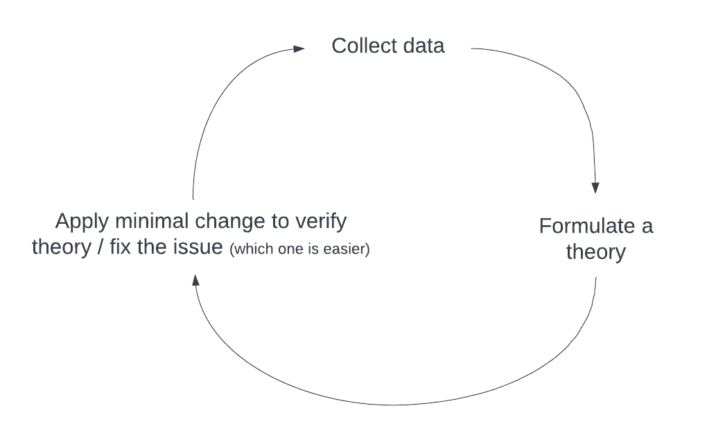
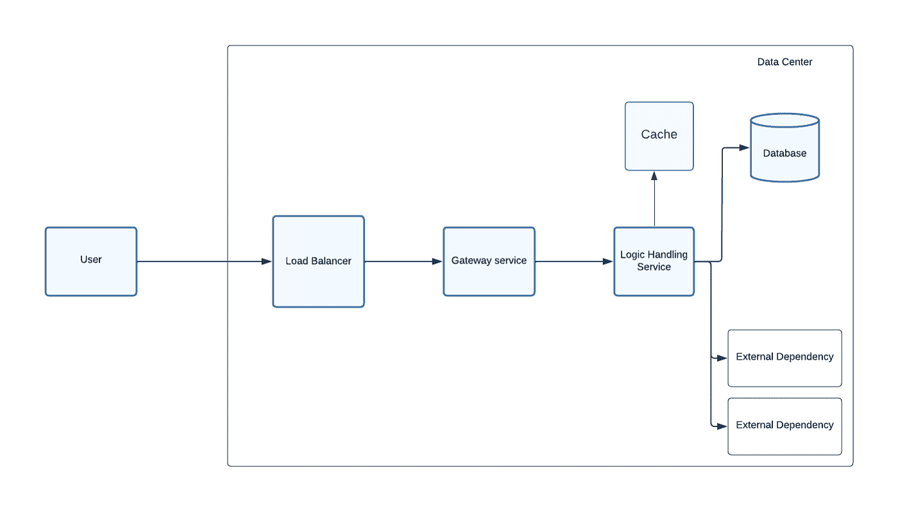
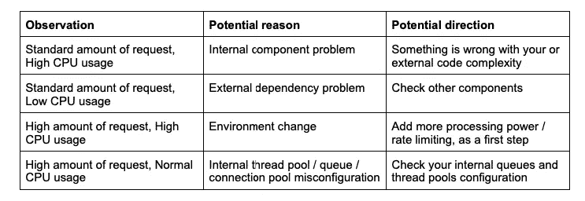

# 如何调试一个缓慢的服务？调查并解决后端性能问题。

> 原文：<https://levelup.gitconnected.com/how-to-debug-a-slow-service-investigate-and-resolve-backend-performance-issues-aa6487257526>

这是一个美丽的星期五，天气很好，阳光明媚，鸟儿在歌唱。你决定在提前一周结束前最后一次检查你的电子邮件应用程序。app 里第一封邮件的标题写着“ ***预警！用户配置文件服务传入请求 p95 延迟升高*** *。你看到你的傍晚计划是如何在你面前消失的…*

梅尔·普尔在 [Unsplash](https://unsplash.com?utm_source=medium&utm_medium=referral) 上拍摄的照片

有时发现和解决后端系统中的性能问题可能很棘手，尤其是当请求处理流程中涉及多个服务和数据库时。获得和练习性能调查技能可以帮助您节省大量时间，包括在生产中断的重大事件期间，您必须在半夜找到修复方法。拥有这样的技能也有助于通过案例面试——在面试中，你被介绍并被要求解决公司过去发生的事件。在本文中，我将尝试编写一个完整的指南，介绍如何调查和修复分布式后端系统中的性能问题。我将使用 Java 作为例子，但是逻辑和技术应该适用于几乎任何后端系统。对本文影响最大的是谷歌网站可靠性工程书籍，以及我在 Yandex 和 Spotify 排除性能问题的许多经验。

# 思维模式:收集、分析、修复

在我们进入任何技术细节之前，重要的是要对如何调查性能问题建立一个正确的心态，修复损坏的生产系统可能会有压力，许多事情可能会产生误导，并且很容易花费不必要的时间编写解决方案，却发现问题出在其他地方。为了避免这样的问题，让我分享一个我在处理性能问题时通常遵循的圈子。

你首先从不同的角度看待一个问题，了解一个情况，并根据数据制定一个可能的解释，然后对代码库/环境做一个小小的改变，以验证这个解释是否有意义。这在高层次上听起来很容易，但是每一步都有陷阱，当你更深入时最好避免。

你从收集数据开始，在这样做的时候，最好不要有任何理论在头脑中，这样你就不会有偏见并寻找该理论的证实，而是思想开放并广泛地看待所有可能的指标。令人惊讶的是，您不希望花费太多的时间来收集数据，事实上，您不希望在任何步骤上花费太多的时间来快速保持反馈循环，并允许自己在每个步骤上犯错误，很快意识到您犯了一个错误，并在下一次迭代中解决它们。

找到一个最喜欢的理论，依附它，并开始拒绝所有其他的理论，这也是很有诱惑力的。这里正确的方法应该是优先考虑所有竞争的理论，并行地研究它们(如果可能的话)。通常，优先考虑*可能性较小的*理论要花一分钟来验证，而不是花几天来验证一个好的候选人——即使*可能性较小的*理论被证明是错误的，你仍然可以在下一次迭代中获得更多数据，让你以后做出更好的决定。

当计划修复时，最好的第一个方法是最快的方法。引入另一个缓存集群或重新设计数据库模式可能很诱人，从长远来看，这可能是一个好的解决方案，但如果您的理论是错误的呢？或者，当您应用复杂的更改时，您的用户应该有较慢的体验吗？对我来说，正确的做法通常是——用最快的修复方法减轻影响，确认你的理论，然后再进行适当的补救。

# 收集数据

# 理解系统架构—多层应用

一旦您注意到一个性能问题，很容易就会跳到您每天工作和维护的服务中，并开始从它的角度来看问题。而且有时候效果非常好，你很快就发现了一个问题，但是这并不是一个详尽的分析，这样的方法不会帮助你发现和理解每一个性能问题。更全面的方法是查看系统架构，并从那里开始。幸运的是，大多数后端系统都有相同的想法——一些组件可能缺失，一些共享多个角色，但是从性能调查的角度来看，这并没有太大的区别。

首先，总有一些您无法控制的外部请求——您可以测量它们的数量或应用某种形式的速率限制，但您无法以不间断的方式立即影响此类请求的频率或模式。这些请求可能来自实际用户，也可能是由您不拥有和不了解的另一个系统触发的。

首先，合理的做法是理解这种请求的性质，并将其隔离:

*   什么样的请求比以前花费的时间更长？
*   什么是业务用例？
*   请求的频率和数量如何随时间变化？
*   你需要调用什么外部依赖来处理这样的请求？

一旦隔离了请求——就该检查代码了，对吗？有时候这很有诱惑力，但是我尝试在接触代码之前在这里增加一个额外的步骤。

# 了解组件及其度量标准

在将搜索范围缩小到代码之前——查看处理中涉及的所有组件是合理的，特别是如果您在仪表板上为每个组件聚集了指标。如果您在云中——它们已经存在于托管组件中，如 Postgres 的负载平衡器，或者您的组织有一个自托管的 Grafana 实例，其中包含所有相关的图表。

无论您正在检查哪个组件，关键指标总是相同的:CPU / Mem 使用情况、请求数量和延迟、处理池/队列大小。如果您没有在仪表板上安装它们，添加它们总是一个好主意，您也可以尝试使用 Linux 工具，如 [**top**](https://unix.stackexchange.com/questions/145247/understanding-cpu-while-running-top-command) 或 [**tcpdump**](https://unix.stackexchange.com/questions/19485/how-to-monitor-incoming-http-requests) 来立即获取一些数据。检查每个组件上的可用指标，从负载平衡器一直到您的数据库，会让您更好地理解问题。

在检查指标时，您可能会发现缺少一些粒度—可能您没有跟踪请求外部系统需要多长时间，或者请求在队列中等待了多长时间。添加更多的指标并确保将来添加它们的过程简单明了总是一个好主意。

# 附加分析器与手动工具

像 [JDK 任务控制](https://docs.oracle.com/en/java/java-components/jdk-mission-control/8/user-guide/whats-new-jdk-mission-control.html#GUID-88BD49F3-D00F-48B8-89C0-365D5656AB83)这样的剖析器可以迅速给你很多关于你的系统正在发生什么的信息:你的线程有多忙，方法执行的频率以及运行它们需要多长时间。分析器是非常强大的工具，肯定应该用于调查问题，但是它们提供的数据应该只在它们运行的上下文中理解。即使问题的根本原因在于不同的系统，概要分析器仍然会向您显示您所连接的服务的一些热点和瓶颈。即使问题存在于同一服务的不同实例中，profiler 仍然会显示健康实例的指标。此类指标通常会产生误导，因此在分析某个实例并查看数据后，最好提出以下问题:

*   问题是在探查器运行期间出现的吗？
*   问题是否发生在运行的实例探查器上？
*   某些方法速度慢的原因是什么——是因为代码没有优化，还是因为触发方法调用的请求数量太多？
*   是瓶颈导致了问题，还是方法恰好是运行中最慢的方法？

在我的职业生涯中，我看到许多时间被浪费，因为档案结果在上下文中不被理解:

*   人们会花时间将微优化应用于哈希代码或哈希函数等热门方法，而不理解请求模式，这样的优化不会带来任何性能改进
*   人们会花时间改变架构，将某些逻辑提取到一个单独的服务中，只是因为分析器显示该方法最慢，而真正的问题是请求的频率，而不是代码本身

除了使用概要分析器之外，手动添加关于某些方法的指标也是合理的。如果您怀疑该方法很慢并且会导致问题，那么可以在它周围添加一个计时器，收集服务的所有实例的频率/执行时间，并确保数据的时间范围很宽。另外，在其他重要方法周围添加类似的计时器，例如外部服务或数据库调用、连接等待时间或队列中的时间——通过这样做，您可以将所有主要步骤放在一起比较，并在提交任何更改之前更好地了解系统正在发生什么。

# 形成一种理论

# 缩小搜索范围

在您的调查迭代中，理解传入请求模式和内部组件依赖关系的相同逻辑适用于不同的级别。您首先将它应用于整个系统，然后将您的关注点缩小到组件。规模可以不同，但同样的问题适用:什么样的请求比以前花费更长的时间，什么是用例，请求的频率和数量如何随时间变化，什么是外部依赖？在系统级别，传入请求可以由用户触发，而外部请求可以表示您组织外部的实际系统，在组件级别，内部请求可以来自另一个组件。规模变了，但模式没有变。

另一个好主意是查看您的版本控制存储库中最近的变更，如果您看到最近合并了一些可疑的东西——首先关注受影响的组件。

一旦您收集了指标，就该分析它们了。每种情况都不同，但有非常相似的模式。这些模式可能是寻找方向的好方法，但它们不可能 100%描述所有情况:

**观察**

当代码运行时，您的代码和第三方代码没有区别，流行的框架出现性能问题的可能性很低，但可能是您错误地使用外部代码导致了问题。对所有代码一视同仁，对于开源软件，不要害怕看源代码。

# 专注于验证

一个好的理论也是简单的(记住[奥卡姆剃刀](https://en.wikipedia.org/wiki/Occam%27s_razor))。一个好的理论是可以被验证的。试着只考虑你需要首先验证的步骤，而不去想你需要做什么改变来解决问题。处理性能问题很少是进行大变革的好时机——如果您一直想引入新组件或尝试新技术，然后突然出现一个性能问题，需要您一直想要的变革，这通常好得不像是真的。或许事实如此，或许你只是选择了证据来证实你的偏见。更好的方法是首先只关注解释，然后采取行动来验证它，然后才考虑解决方案。

# 后退一步

很容易缩小搜索范围，将重点放在受问题影响最大的一个组件上，并尝试仅在组件的上下文中考虑问题。您看到其中一个服务的 CPU 使用率很高，所以问题一定出在这个服务上。这确实是一个好的开始，但是不要孤立地考虑一个组件，而是将原因和结果分开:“是的，服务中有很高的 CPU 使用率，但是是什么在外部导致了它？”。如果你在单个组件上花费太多时间，你的理论会变得越来越复杂，你得到的数据会变得越来越难以解释——这是一个后退一步，从更高的层面重新评估情况的信号。

# 应用修复

# 缓解措施

在知道生产中断、用户受到影响的情况下进行修复是很有压力的。所以，你首先要做的修复是小的。当你有更好的修复方法时，你甚至可以扔掉它们。所以，尽量让它们快速高效而不是完美无缺。它们可以是任何东西:过度扩展组件、通过替换部分代码来禁用某个功能、引入负载均衡器进行激进的速率限制、创建缓存以及为用户提供陈旧数据。这里的目标是稳定系统，并给你一个机会来寻找合适的解决方案。

在应用缓解措施时，要记住的一件事是分别应用它们。取决于你对自己的理论有多有信心，继续寻找证实可能是好的。如果您同时应用了多个修复，您将无法确定哪个修复真正有帮助，并且以后计划补救将更加困难。

另一件要记住的事情是，如果你修复了这个问题，你就不能再调查它了。如果可能的话，让一个损坏的实例保持损坏状态总是好的，这样您可以仔细查看它。或者至少确保您有一些数据，如日志、指标和线程转储——如果您还没有找到问题的根本原因，那么在问题解决后找到它将会困难得多。

# 补救措施

你的理论越接近现实，你就能更好地应用长期解决方案。在选择要应用的补救措施时，最好将它们与可能发生的其他潜在性能问题联系起来。当你的公司成长，请求量增加，一年后会发生什么？

在应用需要几个月才能实施的修复之前，最好在公司内部分享问题、你的解释和可能的解决方案。如果您的公司在多个领域使用相同的技术组合，就有机会找到类似的案例和可能的解决方案。

# 结论

调查和解决性能问题可能会非常有压力，但是如果有正确的策略，也会非常有趣。我多年来使用的策略有简单而明确的步骤:收集多个组成部分的数据，分析并制定可能的解释，优先考虑并验证它们，直到你找到一个你有信心的，首先应用简单的缓解措施，然后设计并讨论可能的补救措施。

只要我独立地迈出每一步，并以开放的心态处理它们，而不是试图确认我的旧偏见——调查和解决性能问题总是一个有趣的挑战。我希望你也能喜欢这个！感谢您的阅读。