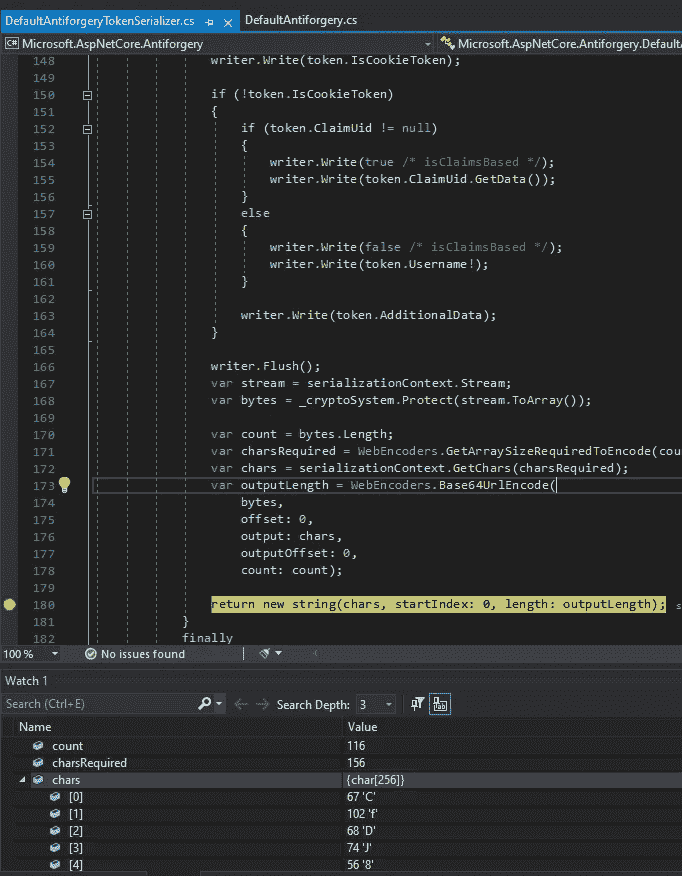

# 如何调试 ASP.NET 核心源代码

> 原文：<https://levelup.gitconnected.com/how-to-debug-asp-net-core-source-code-448544c16473>

## 了解引擎盖下发生了什么

在 [Unsplash](https://unsplash.com/photos/jz8-BDbVobc) 上 [mecdjino](https://unsplash.com/@mecdjino) 拍摄的照片

这是我花了很长时间才学会的，而且互联网上也没有太多的帮助。

所以我写这篇文章是想给你一些帮助，这是我在试图解决这个问题时所希望的。

# 为什么？

也许你只是好奇事情在幕后是如何工作的，或者你发现了一个 bug，或者需要一些你无法访问的代码。不管你的理由是什么，这篇文章将帮助你跳过我遇到的所有问题。

# 怎么会？

调试源代码的方法有很多。这里有三种流行的方法:

1.  [。网状反射器](https://marketplace.visualstudio.com/items?itemName=vs-publisher-306627.NETReflectorVisualStudioExtension)
2.  [微软符号服务器](https://docs.microsoft.com/en-us/visualstudio/debugger/specify-symbol-dot-pdb-and-source-files-in-the-visual-studio-debugger?view=vs-2019)
3.  参考[源代码](https://github.com/dotnet/aspnetcore/blob/master/docs/BuildFromSource.md)

前两者的问题是它们很慢，并且很难在“监视”窗口中查看局部变量的值。

这是因为即使您选择“取消 JIT 优化”并在调试模式下生成，代码也是优化的:

在本文中，我将向您展示如何通过引用源代码来进行调试。

# 你需要什么版本？

**第一件事是考虑你要调试什么版本的 ASP.NET 核心。**

我不假思索地下载/构建了具有. net6.0 代码的 master 分支，并想知道为什么它不能与我的 ASP.NET Core 5 项目一起工作。

在下一步中，您需要检查正确的分支，该分支具有与您在应用程序中使用的 ASP.NET 核心相同的版本。

# 签出并构建

在继续之前，请确保您**直接在 c 盘**中创建一个文件夹来克隆源代码。否则你会得到文件路径太长的错误。

**然后按照这些** [**指令**](https://github.com/dotnet/aspnetcore/blob/master/docs/BuildFromSource.md) **(或者** [**这些**](https://github.com/dotnet/runtime/blob/main/docs/workflow/README.md) **如果你想调试运行时)。**

确保你**阅读了整篇文章**。我怎么强调都不为过。我冲进去，试图从 Visual Studio 中构建解决方案。您需要从命令行进行构建。如果你仓促行事，这只是许多可能出错的事情之一。

如果您遇到错误，请在使用谷歌之前阅读[故障排除](https://github.com/dotnet/aspnetcore/blob/master/docs/BuildErrors.md)部分。

# 将所需的项目/dll 添加到解决方案中

## 添加项目

在 VS 中右键单击您的解决方案，并选择 Add -> Existing Project。

然后选择。您希望调试的代码的 csproj 文件。

在我的例子中，我需要调试防伪代码:

然后，您可以在解决方案中看到该项目:

## 添加 dll

除了上一步之外，还必须添加 dll。

如果将项目引用添加到。csproj，而不是添加 dll，当你调试时，你将不能查看一些局部变量的值。

您将看到以下错误:

> 无法获取局部变量或参数的值，因为它在此指令指针处不可用，可能是因为它已被优化掉了

为了确保您可以在监视窗口中查看这些值，您需要**添加 dll 而不是引用项目**。

该 dll 将位于以下文件夹中:

`C:\aspnetcore\artifacts\bin\<ProjectOfInterestHere>\Debug\<Version>`

例如:

`C:\aspnetcore\artifacts\bin\Microsoft.AspNetCore.Antiforgery\Debug\net5.0`

通过右击您的主项目，并选择 Add -> Project Reference -> Browse 来添加 dll。

# 添加断点，享受调试！

现在你已经准备好了。添加断点，运行应用程序，并在"监视"窗口中查看变量值。

我希望这篇文章对你有所帮助。如果你需要帮助，请留言。

# 运行时间

如果你想用。NET Core 运行时 repo，这里的指令是[这里的](https://github.com/dotnet/runtime/blob/main/docs/workflow/README.md)。

# 资源

 [## 。NET Reflector Visual Studio 扩展- Visual Studio 市场

### NET Reflector VSPro 允许您直接在 Visual Studio 中单步调试任何第三方代码和程序集，甚至…

marketplace.visualstudio.com](https://marketplace.visualstudio.com/items?itemName=vs-publisher-306627.NETReflectorVisualStudioExtension)  [## 设置符号(。pdb)和调试器中的源文件- Visual Studio

### 程序数据库(。pdb)文件，也称为符号文件、地图标识符和项目源代码中的语句…

docs.microsoft.com](https://docs.microsoft.com/en-us/visualstudio/debugger/specify-symbol-dot-pdb-and-source-files-in-the-visual-studio-debugger?view=vs-2019)  [## 点网/aspnetcore

### 本文档概述了如何在 aspnetcore repo 中本地构建源代码以用于开发目的。有关更多信息…

github.com](https://github.com/dotnet/aspnetcore/blob/master/docs/BuildFromSource.md)  [## 点网/aspnetcore

### 本文档介绍常见的构建错误以及如何解决这些错误。警告 BUILD001:对“...”的引用已被移除…

github.com](https://github.com/dotnet/aspnetcore/blob/master/docs/BuildErrors.md)  [## 如何强制 ASP.NET 5 源代码不优化

### 感谢贡献一个堆栈溢出的答案！请务必回答问题。提供详细信息并分享…

stackoverflow.com](https://stackoverflow.com/questions/65264454/how-to-force-asp-net-5-source-code-to-not-be-optimized)