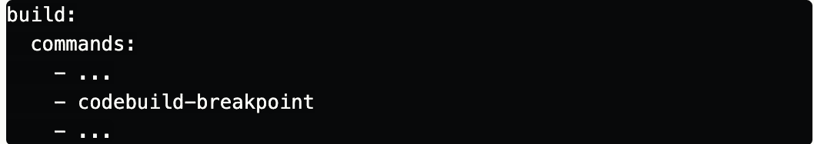
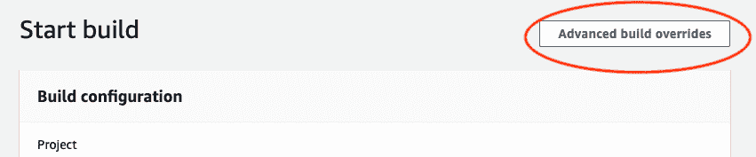
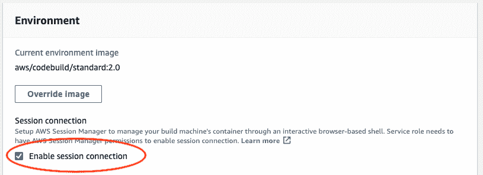
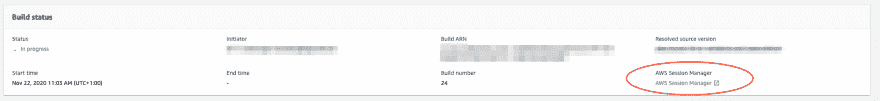
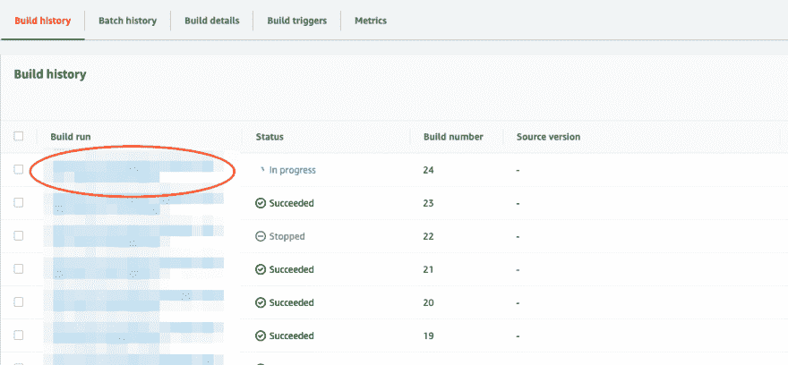

# 如何:调试和跟踪 AWS 代码构建中的问题

> 原文：<https://levelup.gitconnected.com/how-to-debug-trace-problems-aws-codebuild-ad73c8e62bb8>

## 让故障诊断代码构建更容易的指南！

*由 DPG 媒体的 AWS 云解决方案架构师 Gert Leenders 为您带来*

**遵循 DPG 媒体的“除非 AWS”策略，将我们的构建转移到 AWS CodeBuild 和 AWS CodePipeline 只是时间问题。将我们的遗留管道迁移到 AWS CodeBuild 被证明是一项非常简单的工作。出于这个原因，开发团队很快采用了 CodeBuild。**

然而，总的来说，有一个关于代码构建的抱怨:解决`buildspec.yml`中的问题很困难，主要是因为无法访问远程会话。

直到去年 7 月，AWS [宣布 AWS CodeBuild](https://aws.amazon.com/about-aws/whats-new/2020/07/aws-codebuild-now-supports-accessing-build-environments-with-aws-session-manager/) 的 AWS 会话管理器访问。这很奇怪，但似乎这个令人敬畏的功能的发布没有引起人们的注意！？也许那是因为新闻稿似乎错过了正确的语义？如果你没有使用正确的词语，这绝对是一个很难找到的帖子——即使对谷歌来说也是如此。祈祷这篇文章能带来更多的关注:-)

通过启用远程访问，AWS 会话管理器最终为 AWS 代码构建带来了调试功能。除了会话管理器访问，新的 CodeBuild 命令`codebuild-breakpoint`是这个新特性的关键。额外的调试功能使代码构建的故障排除变得不那么麻烦。它还结束了本地构建会成功，但远程代码构建会失败的噩梦——将您置于一个乏味的试错是唯一出路的境地。

# 实践中的 AWS 代码构建

1.  将使用 AWS 会话管理器的权限添加到 AWS 代码版本:

```
CodeBuildServiceRole:
  Type: AWS::IAM::Role
  Properties:
    AssumeRolePolicyDocument:
      Statement:
        - Effect: Allow
          Principal:
            Service:
              - codebuild.amazonaws.com
          Action:
            - sts:AssumeRole
    Path: /
    Policies:
      - PolicyName: log-access
        PolicyDocument:
          Statement:
            - Effect: Allow
              Action:
                - logs:CreateLogStream
                - logs:PutLogEvents
                - logs:CreateLogGroup
              Resource:
                - !Sub arn:aws:logs:${AWS::Region}:${AWS::AccountId}:log-group:/aws/codebuild/*
      - PolicyName: ssm-access
        PolicyDocument:
          Statement:
            - Effect: Allow
              Action:
                - ssmmessages:CreateControlChannel
                - ssmmessages:CreateDataChannel
                - ssmmessages:OpenControlChannel
                - ssmmessages:OpenDataChannel
              Resource: "*"
            - Effect: Allow
              Action:
                - s3:GetEncryptionConfiguration
                - s3:PutObject
              Resource:
                - arn:aws:s3:::your-log-bucket-name
                - arn:aws:s3:::your-log-bucket-name/*      ...
```

*备注:如果使用亚马逊 S3 存储您的日志，上面提到的代码构建策略只需要 S3 权限。万一它丢失了，你会得到一个 SSM 会话，提示被卡住，没有任何进一步的反馈。因此，如果使用 S3 存储您的日志，一定要有正确的策略。*

2.给你的`buildspec.yml`添加一个断点



3.为调试启动生成

*   使用“高级生成覆盖”开始生成



*   在“高级设置”下选择“启用会话连接”



# 使用 Web 控制台启动远程会话



# 使用 CLI 启动远程会话

1.  获取构建 ID(也称为构建运行)



2.使用生成 Id 获取 sessionTarget


依我看，目前`batch-get-builds`的文档还不够。如果您没有使用正确的设置或者如果您没有使用 CLI 的最新版本，使用 CLI 获取`sessionTarget`可能会很棘手。因此，我请求将文档更改为:

> 复制`sessionTarget`属性值。注:`sessionTarget`仅在输出为`json`或`table`时可用。如果输出设置为`text`，则寻找`DEBUGSESSION`。如果输出中缺少该属性，请将您的 CLI 更新到较新的版本。

3.复制完`sessionTarget`值后，您可以使用以下命令开始新的远程会话:


4.调试您的构建:-)

你都准备好了。要停止调试会话，只需执行`$ codebuild-resume`。

下次见！

更多信息？另请查看此链接:[https://docs . AWS . Amazon . com/code build/latest/user guide/session-manager . html](https://docs.aws.amazon.com/codebuild/latest/userguide/session-manager.html)