# 如何像专家一样调试 Web 程序

> 原文：<https://levelup.gitconnected.com/how-to-debug-web-program-like-a-pro-ebc8995201bf>

## 用 VS 代码或 web DevTools 调试 Web 程序。


照片由[西格蒙德](https://unsplash.com/@sigmund?utm_source=medium&utm_medium=referral)在 [Unsplash](https://unsplash.com?utm_source=medium&utm_medium=referral) 拍摄

如果你还没看过我发表的调试系列第一篇: [*如何用 VS 代码调试 Node.js 程序？*](/want-to-become-a-senior-frontend-developer-you-must-master-debugging-f577ee569687) 最好提前看完，里面涵盖了用 VS 代码调试的基础知识。这篇文章是第二篇，我将重点介绍如何在 web DevTools 和 VS 代码中调试 Web 程序，所以请跟我来。

# 使用 Web DevTools 调试

既然要调试 web 程序，那就先介绍一下如何在 Web DevTools 中调试。市面上的浏览器有很多，但是他们对 DevTools 的使用都差不多，下面就和我一起看看 chrome 浏览器提供的调试方案吧。

Chrome DevTools 提供的调试功能可以在源代码面板上找到。

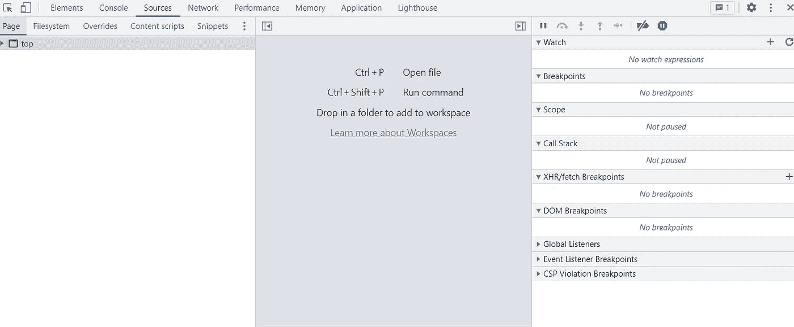

让我们从左边开始:

**页面**:页面窗格可以查看页面已经加载的所有资源。

**文件系统:**默认情况下，当您在“源代码”面板中编辑文件时，这些更改会在您重新加载页面时丢失。工作区可以将 DevTools 中所做的更改保存到文件系统中。

**Overrides:** Overrides 类似于 Workspaces，可以覆盖当前页面上的本地文件，页面刷新后仍然生效，但不会将更改映射到页面的源代码。这对于一些需要在线调试的场景很有用。

**Snippets:** Snippets 可以在浏览器环境中运行脚本。您可以使用此功能将一些库加载到当前环境中，然后可以在控制台面板中调用库中的方法。

接下来，让我们从左侧选择一个文件，并查看中间部分:

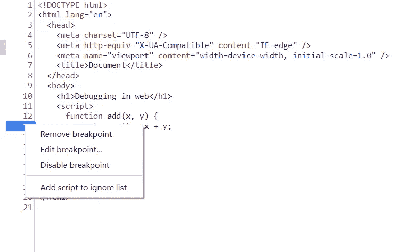

这里的操作类似于 VS 代码中的操作。用鼠标左键点击断点，鼠标右键可以设置特殊类型的断点，比如条件断点和日志点。如果不确定，可以查看[上一篇](/want-to-become-a-senior-frontend-developer-you-must-master-debugging-f577ee569687)。

最后，让我们看看右边的部分:

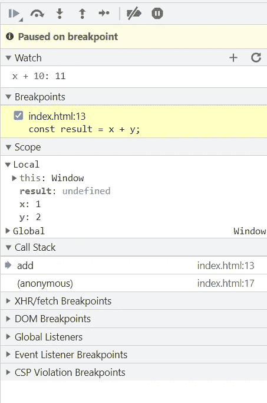

第一个是调试操作。前四个与 VS 代码中的效果相同，后三个是:

*   **步**步`**F9**`

这个选项允许我们逐行执行 JavaScript 代码，如果中间有函数调用，它也会进入函数，逐行执行，然后退出。

*   **停用断点** `**Ctrl+F8**`
*   **不要因为异常而暂停**

默认情况下，异常会直接抛出而不会暂停，我们可以点击这个选项在异常发生时暂停代码。VS 代码也提供了类似的特性。

接下来是**手表**块，和 VS 码的功能一样。

接下来是**断点**块，和 VS 代码的功能一样。

接下来是**作用域**块，与 VS 代码中的**变量**具有相同的特性。

接下来是**调用栈**块，和 VS 代码有相同的特性。

接下来是**XHR/fetch**断点块，可以输入指定的 URL 片段。一旦浏览器发送包含子片段的 XHR/获取请求，它将进入断点。如果输入为空，则为所有请求启用断点。

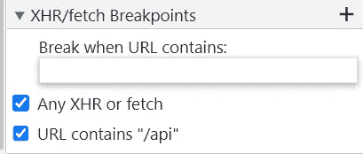

接下来是 **DOM 断点**块，要设置它，你需要去 Elements 面板。右键单击 DOM 元素可以查看以下选项。在监视 DOM 变化时，它会很有用。

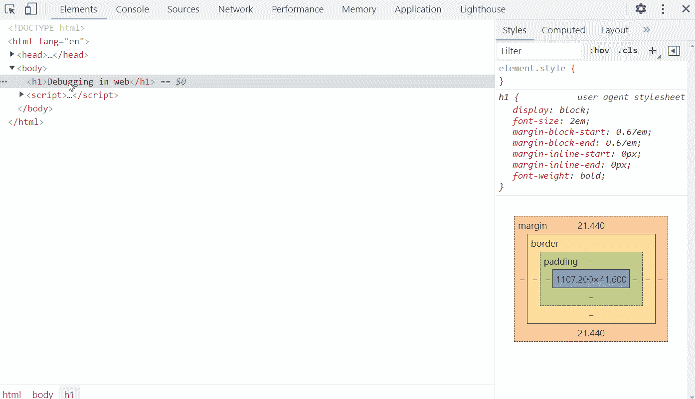

接下来是**全局监听器**块，它显示了所有绑定到窗口的事件。

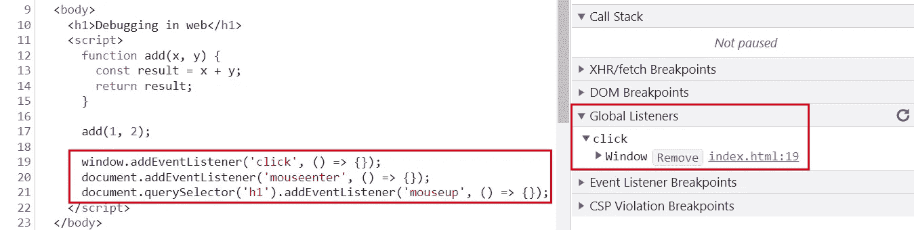

您可以找到相应的绑定代码，或者单击“删除”将其删除。但是注意这里是所有绑定到窗口的事件，文档或者特定的元素事件需要在元素面板中找到对应的元素，然后看右边的事件监听器。

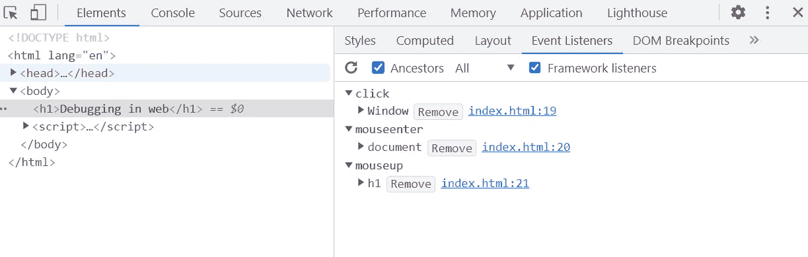

接下来是**事件监听器断点**块，你可以在这里打勾，触发相应的事件就会进入断点。

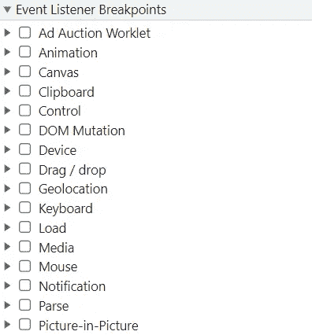

接下来是 **CSP 违反断点**块，当 [CSP](https://developer.mozilla.org/en-US/docs/Web/HTTP/CSP) 被违反时进入一个断点，这个[链接](https://developer.chrome.com/blog/new-in-devtools-89/#trusted-types-violations)是官方介绍。

以上都是关于 Web DevTools 中的调试，我们来看看如何在 VS 代码中调试 Web 程序。

# 用 VS 代码调试

我在[T3 中介绍过 VS 代码相关的调试特性如何用 VS 代码调试 Node.js 程序？](/want-to-become-a-senior-frontend-developer-you-must-master-debugging-f577ee569687) 。也适用于 web 程序，但是需要在 launch.json 中添加新的配置。

对于简单的 web 程序调试，您可以直接使用以下配置:

```
{
  "name": "Open index.html",
  "request": "launch",
  "type": "pwa-chrome",
  "file": "Your HTML file path"
}
```

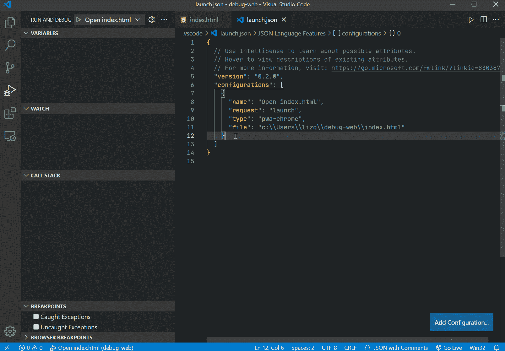

但是如果要调试 React 应用程序，这是不可行的，我们可以使用下面的配置来处理这种情况:

```
{
  "name": "Launch Chrome",
  "request": "launch",
  "type": "pwa-chrome",
  "url": "Your web service URL, such as [http://localhost:8080](http://localhost:8080)",
  "webRoot": "${workspaceFolder}"
},
```

特别注意这里的 **webRoot** 参数。`${workspaceFolder}`是 VS 代码中打开的文件夹的路径，如果不是你的 web 服务的根路径，需要修改。

下面这个例子，就是`${workspaceFolder}/react-app`。

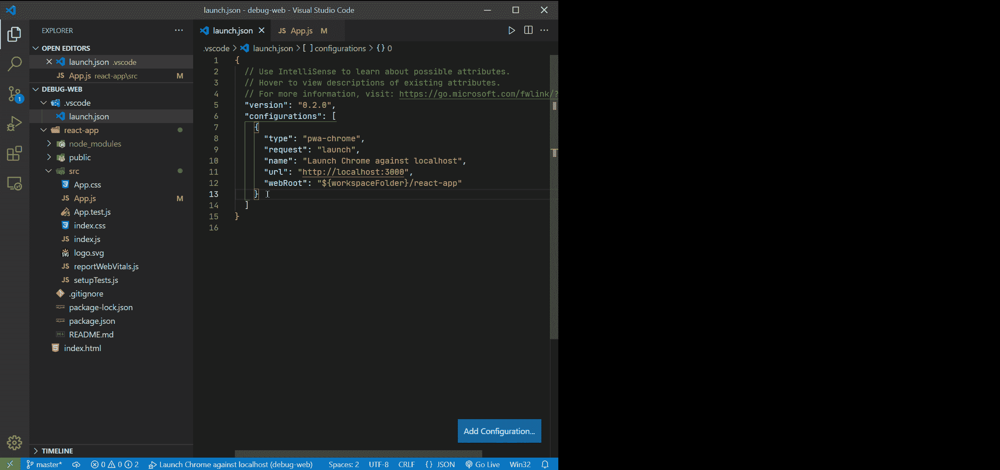

同样，我们也可以自己启动一个 HTTP 服务器，然后把 URL 填入 launch.json，也可以调试。

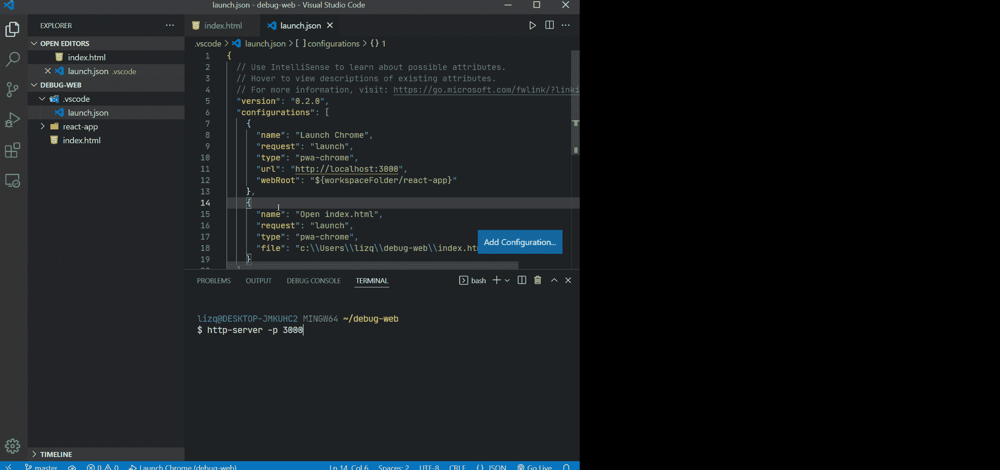

最后，我是李。我会继续输出前端技术相关的故事。如果你喜欢这样的故事，想支持我，请考虑成为 [*中会员*](https://medium.com/@islizeqiang/membership) *。每月 5 美元，你可以无限制地访问媒体内容。如果你通过* [*我的链接*](https://medium.com/@islizeqiang/membership) *报名，我会得到一点佣金。*

你的支持对我来说非常重要——谢谢。