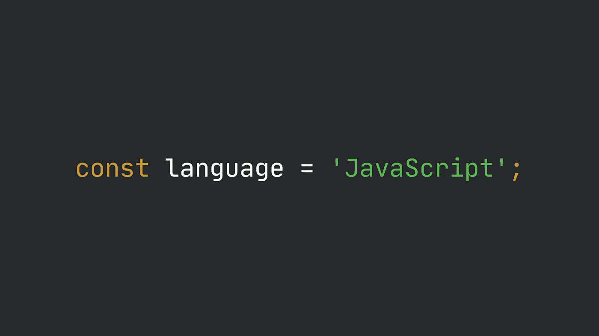

# 如何在 JavaScript 中声明变量

> 原文：<https://levelup.gitconnected.com/how-to-declare-a-variable-in-javascript-1898fac9fad>



变量是许多编程语言的核心，它们允许你存储东西并在你的代码中多次重用它们。但是变量到底是什么呢？让我们来了解一下！

# 变量和类型

变量**引用**到一个内存槽，你想要存储的“东西”被物理地放置在那里。您可以通过名称访问变量及其存储值，名称由开发人员定义。

所以，变量包含了你可以在编程时使用的东西。但是这到底是什么东西呢？根据您使用的编程语言，变量存储的值可能会有所不同。但首先，我们需要谈谈**数据类型**和**数据结构**。

数据类型是可能的值和对这些值可用的一组操作的组合。在 JavaScript 中，类型应用于值而不是变量，这就是为什么我们说 JavaScript 是松散类型的 T21。有许多不同的数据类型，但是您通常可以将它们区分为原始数据和非原始数据。

数据结构是一种更“复杂”的结构，用于组织数据并使其使用更简单。还有大量不同的数据结构，它们用于实现不同的目标。其中一些通常由编程语言提供本地支持。

尽管数据类型和数据结构之间存在差异，但开发人员通常将两者都称为“**类型**”。

# JavaScript 中的类型和数据结构

JavaScript 原生支持七种原始数据类型(`number`、`string`、`boolean`、`bigint`、`symbol`、`undefined`、`null`)加上一堆数据结构(`object`、`function`)。

如果您习惯于其他编程语言，您可能会注意到一些不同之处:

*   JavaScript 不区分整数和浮点数，它们都被分组在`number`数据类型下。另外，注意`bigint`是家族中的一个新成员，它还不被所有的浏览器支持
*   数组是缺失的，尽管 JavaScript 为它们提供了语法，但它们实际上是从`object`数据结构中派生出来的
*   `function`是一种类型:JavaScript 允许您像使用任何其他对象一样使用函数，它们甚至可以作为参数传递给其他函数或由函数返回，并且，就像数组一样，它们是从`object`派生的

大多数编程语言也允许自定义类型的定义，通常是通过类定义、枚举和其他构造。在这篇文章中，我不会关注自定义类型，我只知道 ECMAScript 6 规范引入了`class`关键字，这是一个很好的特性，可以取代过时的 JavaScript 面向对象编程模式。

# 声明变量

让我们回到你阅读这篇文章的原因，你如何在 JavaScript 中声明一个变量？如果几年前你问我这个问题，我会告诉你只有一种方法可以做到，但现在不是了。

直到 2016 年，声明变量的唯一方式是通过`var`关键字。今天我们也有`let`和`const`。

前者和后者的主要区别在于范围:

*   `var`变量有**函数作用域**，这意味着它们在声明它们的函数中可用，或者如果它们没有在任何函数中声明，则在全局作用域中可用

```
var name = 'John';function printName() {
  var name = 'Luke';
  var age = 22;
  console.log(name);
}console.log(name); // John
printName(); // Luke
console.log(age); // ReferenceError: age is not defined
```

*   `let`和`const`变量具有**块作用域**，这意味着它们在声明它们的块中可用，或者如果它们没有在任何块中声明，则在全局作用域中可用

```
let name = 'John';
let age = 28;if (name === 'Jhon') {
  const friend = 'Luke';
  let age = 22;console.log(friend) // Luke
}console.log(name); // John
console.log(age); // 28
console.log(friend); // ReferenceError: friend is not defined
```

> 小心！`*const*`关键字用于声明常量。因此，它们不能被重新分配。

如何区分函数和块？嗯，函数可以通过关键字`function`或箭头`=>`语法来识别:

```
function myFunctionName() {
  // This is the function
}() => {
  // This is the arrow function
}
```

而块由`{`和`}`符号定义:

```
{
  // This is a block
}if(myCondition) {
  // This is the if block
} else {
  // This is the else block
}
```

尽管仍然可以使用`var`来声明变量，但是现在使用它被认为是一种不好的做法，会导致不必要的行为和错误。

声明和赋值是两个独立的操作，可以在不同的时间执行。注意，变量“必须”在使用之前声明*或者赋值给它们。我将在下一章回到这一点。*

> 小心！虽然`*let*`变量可以随时重新赋值，但常量不能。声明和赋值必须同时进行，否则将会引发缺少初始化的错误。

# 提升

JavaScript 实现了一种称为*提升*的机制，它修改了作用域中变量、函数和类的可达性。在这一段，我将重点放在变量的提升。

让我们看看这几行:

```
function doSomething() {
  console.log(name);
  var name = 'John';
}doSomething();
```

如果您习惯于其他编程语言，您会认为这段代码会抛出某种引用错误。但是 JavaScript 却不是这样。在实际执行代码之前，引擎会将其修改为类似于下面的样子，并打印出`undefined`:

```
function doSomething() {
  var name;
  console.log(name);
  name = 'John';
}doSomething(); // Prints 'undefined'
```

这里发生了什么？变量**声明**已被移至函数顶部。后面的所有东西都可以引用它，不会抛出引用错误。另外，已声明但**未赋值的**变量采用`undefined`的值。

提升只适用于通过`var`关键字声明的变量。`let`和`const`声明不会被提升，试图在声明之前使用它们会导致引用错误。

# 命名变量

让我们花一些时间来讨论如何给变量命名。值得注意的是，并不是所有的字符都被接受，顺序也很重要。

变量名可以包含 ASCII⁵字母和数字、下划线和`$`符号，但是不能以数字开头。它们区分大小写，不允许使用保留字。

几个例子:

```
// Valid names
let person;
let Person;
let _animal;
let animal_name;
let animalName;
let $alien;
let alien1;// Invalid names
let 1person;
let a-person;
let class;
let function;
```

# 快速回顾一下

变量保存值，值可以有许多不同的类型。变量与类型无关，但值与类型有关。

声明变量有三种方式:`var`、`let`和`const`。`var`应避免使用，因为它太旧了，很容易导致错误和不必要的行为(由于范围和吊装)。

您只能使用 ASCII 字符的子集来命名变量，但名称不能以数字开头。

枚举是一种特殊的数据类型，其中所有成员都与常数值(通常是整数)相关联

范围定义了变量的可见性

全局作用域是最外部的作用域。在浏览器中，它用`window`对象来标识

⁴箭头函数是在 ECMAScript 6 规范中引入的，它与“常规”函数表达式有两点不同:它们的语法、效果以及与关键字`this`的绑定(更多信息请访问 [MDN 网站](https://developer.mozilla.org/docs/Web/JavaScript/Reference/Functions/Arrow_functions)

⁵ ASCII(美国信息交换标准码)是一种字符编码系统，它包括英语字母表的所有字母、从 0 到 9 的数字、标点符号和一些其他可打印和不可打印的特殊字符([阅读完整列表](https://www.ascii-code.com/)