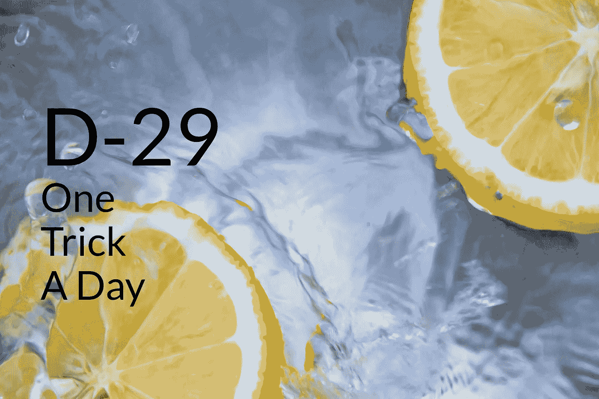
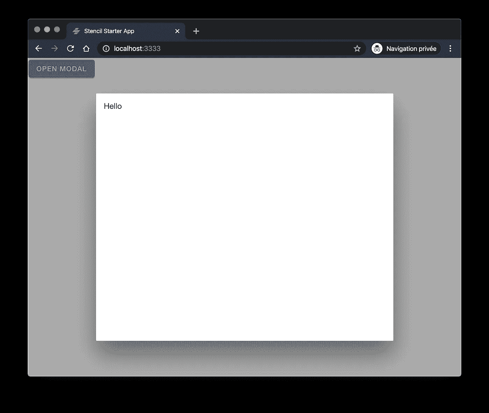
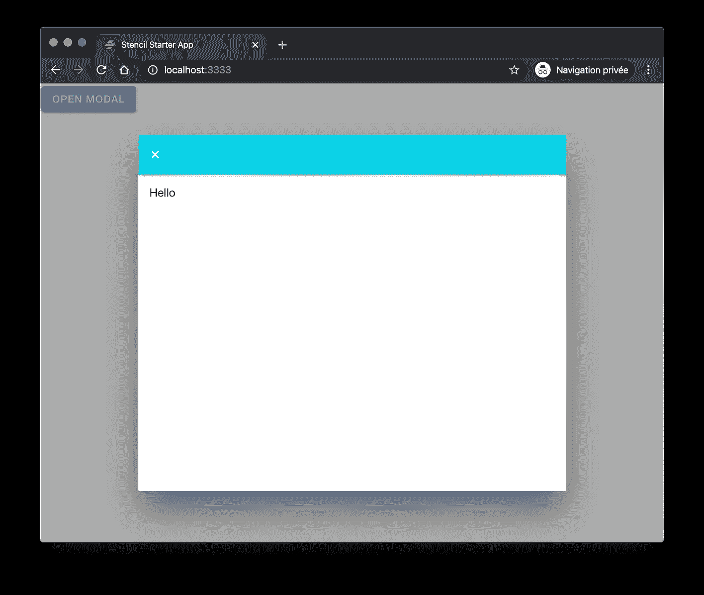
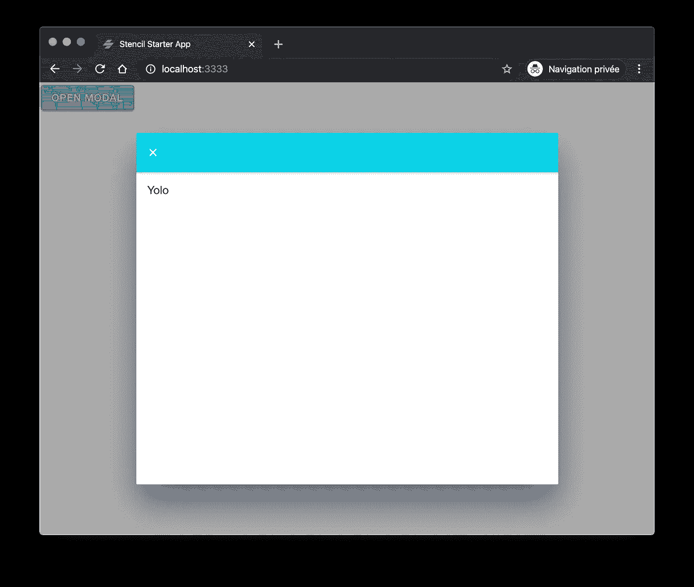
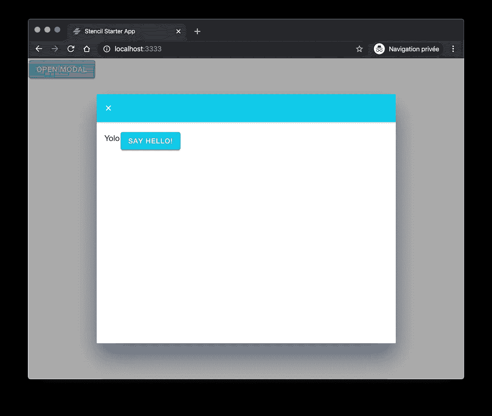
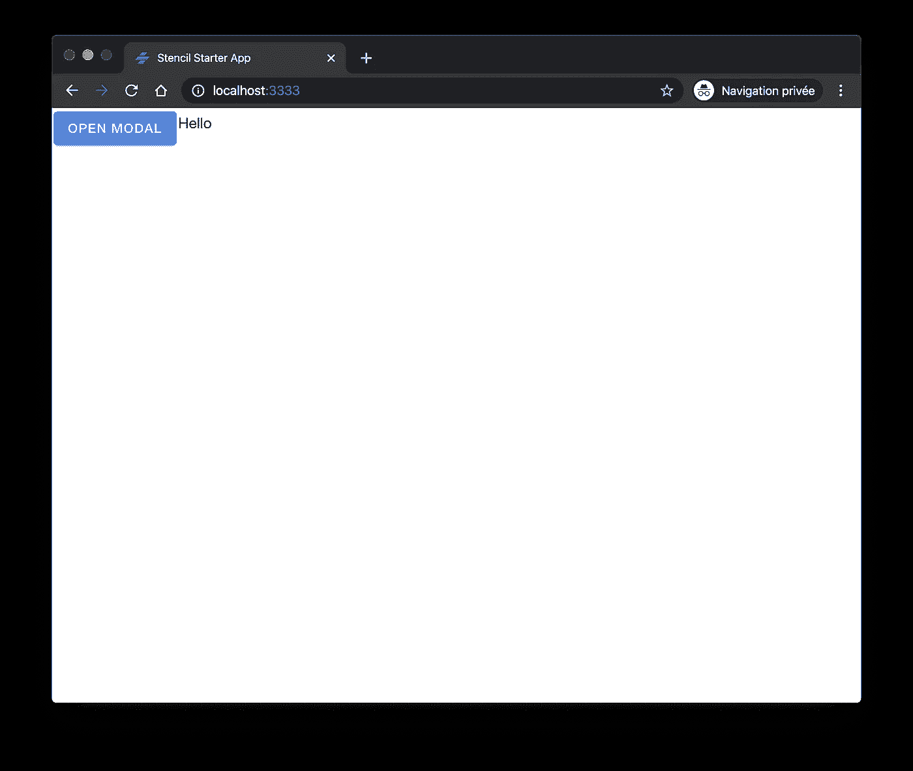

# 如何在模板中声明和使用离子模态

> 原文：<https://levelup.gitconnected.com/how-to-declare-and-use-ionic-modals-with-stencil-d5d97e69c930>

## 如何声明和使用带有模板的离子模式，包括传递参数、关闭动作和硬件后退按钮支持



照片由[蒂尔扎·范·迪克](https://unsplash.com/@tirzavandijk?utm_source=unsplash&utm_medium=referral&utm_content=creditCopyText)在 [Unsplash](https://unsplash.com/s/photos/free?utm_source=unsplash&utm_medium=referral&utm_content=creditCopyText) 上拍摄

我每天分享[一个窍门](https://medium.com/@david.dalbusco/one-trick-a-day-d-34-469a0336a07e)直到 2020 年 4 月 19 日新冠肺炎隔离期结束。离希望中的好日子到来还有 29 天。

本周，我们讨论了[模板](https://stenciljs.com)应用中[离子](https://ionicframework.com)模态的用法。我分享了我们在所有应用程序 [DeckDeckGo](https://deckdeckgo.com) 中实现的解决方案，这是我们用于演示的开源编辑器，看起来效果不错。

尽管相关的 Ionic Modal 文档是自解释的，并且有很好的文档记录，但是当涉及到普通 JavaScript 或现代前端框架时，没有任何关于模板使用的信息。

这就是为什么，总而言之，我想我可以分享一篇关于这个特定主题的文章。

# 控制器

如果你将 Ionic 与 React 或 vanilla Javascript 相比较，在模板中使用 Ionic 模态需要**控制器**，这可能是用法上的主要区别。

因为已经测试了 Ionic 的所有风格(除了 Vue ),这仍然是我最喜欢的解决方案，因为我感觉更舒服，但我不确定它在未来会保持这样，因为许多开发人员包括一些团队本身更喜欢其他没有控制器的解决方案。因此，如果你在不久的将来读到这篇文章，先检查一下这些是否仍然存在😉。

# 创建一个模型

模态本身就是一个组件。这就是为什么，如果我们想添加一个到我们的应用程序，我们首先创建一个新的组件，我宁愿不设置为阴影。这样做，就有可能轻松地继承 CSS 属性和应用程序的样式。

```
import {Component, Element, h} from '@stencil/core';

@Component({
  tag: 'app-modal'
})
export class AppRemoteConnect {
  @Element() el: HTMLElement;

  render() {
    return [
      <ion-content class="ion-padding">Hello</ion-content>
    ]
  }

}
```

# 打开一个模态

如介绍中所述，要在模板中使用模态，我们将使用控制器。诀窍是将模态标记名作为变量`component`的值传递。

```
import {Component, h} from '@stencil/core';

import {modalController} from '@ionic/core';

@Component({
  tag: 'app-home',
  styleUrl: 'app-home.css'
})
export class AppHome {

  private async openModal() {
    const modal: HTMLIonModalElement =
                 await modalController.create({
      component: 'app-modal'
    });

    await modal.present();
  }

  render() {
    return (
      <ion-content>
        <ion-button onClick={() => this.openModal()}
                    color="primary">
          <ion-label>Open Modal</ion-label>
        </ion-button>
      </ion-content>
    );
  }
}
```

如果一切都按照计划进行，一旦开始和打开，它应该看起来如下:



# 关闭模态

在本章中，我们将探讨关闭模态的不同方法。

## 模式标题中的按钮

为了从自身关闭模态，我们使用文档引用来找到最近的`ion-modal`元素，以便调用公开的方法`dismiss`来实现这样的目标。

```
import {Component, Element, h} from '@stencil/core';

@Component({
  tag: 'app-modal'
})
export class AppRemoteConnect {
  @Element() el: HTMLElement;

  async closeModal() {
    await (this.el.closest('ion-modal') as 
           HTMLIonModalElement).dismiss();
  }

  render() {
    return [
      <ion-header>
        <ion-toolbar color="secondary">
          <ion-buttons slot="start">
            <ion-button onClick={() => this.closeModal()}>
              <ion-icon name="close"></ion-icon>
            </ion-button>
          </ion-buttons>
        </ion-toolbar>
      </ion-header>,

      <ion-content class="ion-padding">Hello</ion-content>
    ]
  }

}
```

同样，如果一切正常，标题中的关闭按钮应该会显示出来。



## 硬件后退按钮支持

我已经有一段时间没有在 Android 上测试关闭模态的硬件后退按钮支持了，但我通常做的是在模态中添加一个导航监听器，它调用与我们之前定义的关闭函数相同的关闭函数。这种攻击是基于历史的，这就是为什么在加载模型时必须推送状态。

```
import {Listen} from '@stencil/core';async componentDidLoad() {
  history.pushState({modal: true}, null);
}@Listen('popstate', {target: 'window'})
async handleHardwareBackButton(_e: PopStateEvent) {
  await this.closeModal();
}
```

## 背景解散

默认情况下，可以通过点击背景来关闭模态。如果您希望禁用此选项，您必须在控制器级别指定它。

```
const modal: HTMLIonModalElement = await modalController.create({
  component: 'app-modal',
  backdropDismiss: false
});
```

# 传递参数

在这一章中，我们将参数从页面传递到模态，或者从另一个方向传递。

## 页面到模态

这可能是我尝试过的所有离子模态中最喜欢的。用模板传递参数超级容易。

要读取模态中的参数，我们只需定义属性(`@Prop()`)。

```
import {Component, Element, h, Listen, Prop} from '@stencil/core';

@Component({
  tag: 'app-modal'
})
export class AppRemoteConnect {
  @Element() el: HTMLElement;

  @Prop()
  greetings: string;

  @Listen('popstate', {target: 'window'})
  async handleHardwareBackButton(_e: PopStateEvent) {
    await this.closeModal();
  }

  async closeModal() {
    await (this.el.closest('ion-modal')
           as HTMLIonModalElement).dismiss();
  }

  render() {
    return [
      <ion-header>
        <ion-toolbar color="secondary">
          <ion-buttons slot="start">
            <ion-button onClick={() => this.closeModal()}>
              <ion-icon name="close"></ion-icon>
            </ion-button>
          </ion-buttons>
        </ion-toolbar>
      </ion-header>,

      <ion-content class="ion-padding">
           {this.greetings}
      </ion-content>
    ]
  }

}
```

然后我们通过控制器。

```
private async openModal() {
  const modal: HTMLIonModalElement = await modalController.create({
    component: 'app-modal',
    backdropDismiss: false,
    componentProps: {
      greetings: 'Yolo'
    }
  });

  await modal.present();
}
```

什么都没有了，什么都没有了，真的很容易。我喜欢这样的解决方案。



## 模式到页面

您可能需要将结果从模式传递到页面或调用组件。为此，我们使用函数`dismiss`，就像关闭模态函数一样，但是我们传递一个对象作为参数。

```
async closeModalWithParams(greetings: string) {
  await (this.el.closest('ion-modal')
        as HTMLIonModalElement).dismiss(greetings);
}<ion-button onClick={() => this.closeModalWithParams('Hello')}>
     Say Hello!
</ion-button>
```

在我们的例子中，我将这个新动作与一个新按钮链接起来。



最后，为了处理结果，我们监听模态的`onDidDismiss`事件，并继续处理作为回调传递的细节。

```
import {Component, h, State} from '@stencil/core';

import {modalController, OverlayEventDetail} from '@ionic/core';

@Component({
  tag: 'app-home',
  styleUrl: 'app-home.css'
})
export class AppHome {

  @State()
  private greetingsResult: string;

  private async openModal() {
    const modal: HTMLIonModalElement =
                 await modalController.create({
      component: 'app-modal',
      backdropDismiss: false,
      componentProps: {
        greetings: 'Yolo'
      }
    });

    modal.onDidDismiss().then(
          async (detail: OverlayEventDetail) => {
      this.greetingsResult = detail.data;
    });

    await modal.present();
  }

  render() {
    return (
      <ion-content>
        <ion-button onClick={() => this.openModal()} 
                    color="primary">
          <ion-label>Open Modal</ion-label>
        </ion-button>

        <ion-label>{this.greetingsResult}</ion-label>
      </ion-content>
    );
  }
}
```

为了呈现结果，我使用了一个状态作为演示目的。



请注意，您可以使用两种基本类型、复杂对象、回调或事件作为参数。

# 蛋糕上的樱桃

与`popovers.`的工作原理完全相同

# 看看它的实际效果

如果你有兴趣看模板应用程序中使用的离子模态，在你的下一张幻灯片中试试 [DeckDeckGo](https://deckdeckgo.com) 😁。

呆在家里，注意安全！

大卫