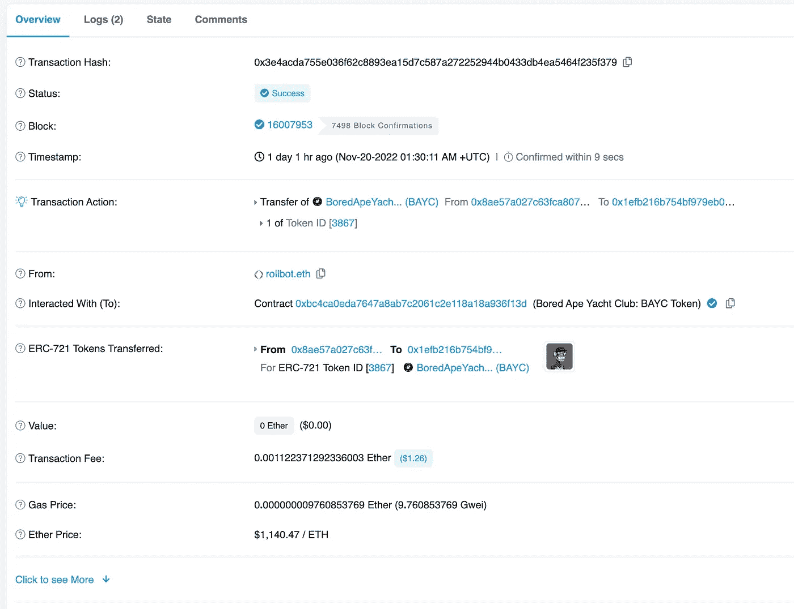
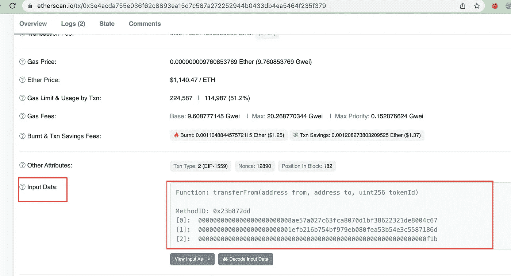

# 如何解码 Golang 中的以太坊交易

> 原文：<https://levelup.gitconnected.com/how-to-decode-ethereum-transactions-in-golang-659de0249a7d>

这个帖子是关于解码以太坊交易，输入数据，交易收据日志。


无聊猿游艇俱乐部

代码是用 Golang 编写的，可以在 [GitHub](https://gist.github.com/jerryan999/fb784e668e3f140619d22eaa391c3dd5) 上获得。

# 交易

交易是从以太坊帐户发送的签名消息。它们用于触发区块链上的状态变化。



交易示例

让我们来看看一个事务的基本结构。

## *来自*

发起者的以太坊地址

## *收件人*

目的地以太坊地址

## *值*

发送到目的地的乙醚量

## *数据*

可变长度二进制数据有效负载

## *气价*

气的价格(以魏为单位)发起人愿意支付。

## *气体极限*

发起者愿意为此交易购买的最大天然气量

## *随机数*

由起始地址发布的序列号用于防止消息重放。

# 解码交易基础信息

步骤 1:连接以太坊节点

```
import  (
    ...
    "github.com/ethereum/go-ethereum/ethclient"
)

const PROVIDER_URL = "https://ethereum.publicnode.com"

func main() {
    client, err := ethclient.Dial(PROVIDER_URL)
    if err != nil {
        log.Fatal(err)
    }
    //...
}
```

步骤 2:通过散列获取事务

```
import (
   ...
   "github.com/ethereum/go-ethereum/common"
)

func main() {
    // ...
    txHashStr := "0x3e4acda755e036f62c8893ea15d7c587a272252944b0433db4ea5464f235f379"
    txHash := common.HexToHash(txHashStr)

    var tx *types.Transaction
    tx, _, err := client.TransactionByHash(context.Background(), txHash)
    if err != nil {
        log.Fatal(err)
    }
    // ...
}
```

步骤 3:解析交易基础信息

```
import (
  ...
  "encoding/hex"

   "github.com/ethereum/go-ethereum/core/types"

)

func ParseTransactionBaseInfo(tx *types.Transaction) {
    fmt.Printf("Hash: %s\n", tx.Hash().Hex())
    fmt.Printf("ChainId: %d\n", tx.ChainId())
    fmt.Printf("Value: %s\n", tx.Value().String())
    fmt.Printf("From: %s\n", GetTransactionMessage(tx).From().Hex()) // from field is not inside of transation
    fmt.Printf("To: %s\n", tx.To().Hex())
    fmt.Printf("Gas: %d\n", tx.Gas())
    fmt.Printf("Gas Price: %d\n", tx.GasPrice().Uint64())
    fmt.Printf("Nonce: %d\n", tx.Nonce())
    fmt.Printf("Transaction Data in hex: %s\n", hex.EncodeToString(tx.Data()))
    fmt.Print("\n")
}

func GetTransactionMessage(tx *types.Transaction) types.Message {
   msg, err := tx.AsMessage(types.LatestSignerForChainID(tx.ChainId()), nil)
   if err != nil {
    log.Fatal(err)
   }
   return msg
}

func main() {
    // ...

    ParseTransactionBaseInfo(tx)
    // ...
}
```

# 解码交易输入数据



输入数据是事务对象中的数据字段，它是方法名和参数的编码数据。它是交易中最重要的部分，尤其是对于合同交易。

第一步:构造契约 **abi** (契约的接口)

```
import (
    ...
    "github.com/ethereum/go-ethereum/accounts/abi"
)

func GetLocalABI(path string) string {
   abiFile, err := os.Open(path)
   if err != nil {
      log.Fatal(err)
   }
   defer abiFile.Close()

   result, err := io.ReadAll(abiFile)
   if err != nil {
      log.Fatal(err)
   }
   return string(result)
}

func main() {
    // ...
    contractABI, err := abi.JSON(
                          strings.NewReader(GetLocalABI("abis/boredape.json"))
                        )
    if err != nil {
        log.Fatal(err)
    }

}
```

步骤 2:解码交易输入数据

```
func DecodeTransactionInputData(contractABI *abi.ABI, data []byte) {
   // The first 4 bytes of the t represent the ID of the method in the ABI
   // https://docs.soliditylang.org/en/v0.5.3/abi-spec.html#function-selector
   methodSigData := data[:4]
   method, err := contractABI.MethodById(methodSigData)
   if err != nil {
      log.Fatal(err)
   }

   inputsSigData := data[4:]
   inputsMap := make(map[string]interface{})
   if err := method.Inputs.UnpackIntoMap(inputsMap, inputsSigData); err != nil {
       log.Fatal(err)
   }

   fmt.Printf("Method Name: %s\n", method.Name)
   fmt.Printf("Method inputs: %v\n", MapToJson(inputsMap))
}

func main() {
    //...
    DecodeTransactionInputData(&contractABI, tx.Data())
    //...
}
```

# 解码交易收据

交易回单是交易执行的结果，包含了合同执行的日志。

第一步:获取交易收据

```
 func GetTransactionReceipt(client *ethclient.Client, txHash common.Hash) *types.Receipt {
   receipt, err := client.TransactionReceipt(context.Background(), txHash)
   if err != nil {
      log.Fatal(err)
   }

   return receipt
}
```

第二步:解码收据

```
 func DecodeTransactionLogs(receipt *types.Receipt, contractABI *abi.ABI) {
 for _, vLog := range receipt.Logs {
    // topic[0] is the event name
    event, err := contractABI.EventByID(vLog.Topics[0])
    if err != nil {
       log.Fatal(err)
    }

    fmt.Printf("Event Name: %s\n", event.Name)
    // topic[1:] is other indexed params in event
    if len(vLog.Topics) > 1 {
       for i, param := range vLog.Topics[1:] {
          fmt.Printf("Indexed params %d in hex: %s\n", i, param)
          fmt.Printf("Indexed params %d decoded %s\n", i, common.HexToAddress(param.Hex()))
     }
    }

    if len(vLog.Data) > 0 {
       fmt.Printf("Log Data in Hex: %s\n", hex.EncodeToString(vLog.Data))
       outputDataMap := make(map[string]interface{})
       err = contractABI.UnpackIntoMap(outputDataMap, event.Name, vLog.Data)
       if err != nil {
          log.Fatal(err)
       }
      fmt.Printf("Event outputs: %v\n", outputDataMap)
    }

   }
}

func main() {
  //...
  DecodeTransactionLogs(receipt, &contractABI)
  //...
}
```

如果你喜欢这篇文章，**请鼓掌**让其他人也能看到。💚