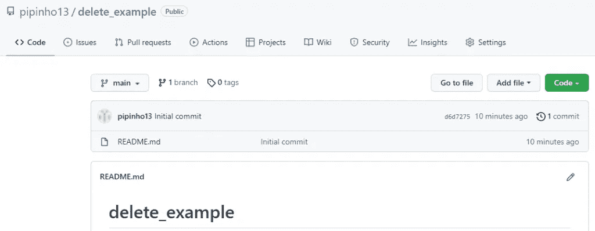
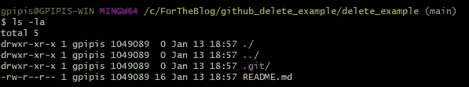
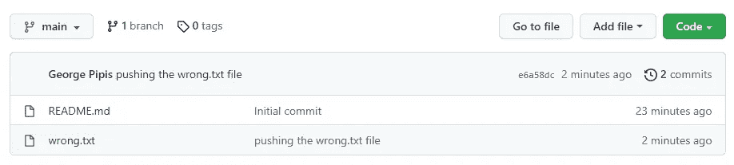
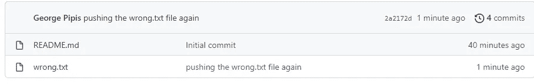

# 如何从远程 Git 存储库中删除文件

> 原文：<https://levelup.gitconnected.com/how-to-delete-a-file-from-a-remote-git-repository-75f772e49d8e>

## 如何从远程 Git Repo 中删除文件的示例

[](https://jorgepit-14189.medium.com/membership) [## 用我的推荐链接加入媒体-乔治皮皮斯

### 阅读乔治·皮皮斯(以及媒体上成千上万的其他作家)的每一个故事。您的会员费直接支持…

jorgepit-14189.medium.com](https://jorgepit-14189.medium.com/membership) 

当我们使用 Git 和 GitHub/GitLab 时，我们可能会意外地将一个文件推送到一个远程 Git 存储库，因此需要删除它。像往常一样，我们将使用走查示例。我们将创建一个远程 GitHub repo，然后在本地克隆它。



```
$ git clone [https://github.com/pipinho13/delete_example.git](https://github.com/pipinho13/delete_example.git)
```

然后，我们将工作目录更改为克隆的存储库，如我们所见，这里有 **README.md** 和**。git** 文件



现在，我们将创建一个名为“error . txt”的文件，并将其推送到远程 repo。

```
$ ls -ltratotal 6
drwxr-xr-x 1 gpipis 1049089  0 Jan 13 18:57 ../
-rw-r--r-- 1 gpipis 1049089 16 Jan 13 18:57 README.md
drwxr-xr-x 1 gpipis 1049089  0 Jan 13 18:57 .git/
drwxr-xr-x 1 gpipis 1049089  0 Jan 13 19:12 ./
-rw-r--r-- 1 gpipis 1049089 21 Jan 13 19:12 wrong.txt
```

我们来推一下“错了. txt”。

```
$ git add wrong.txt
$ git commit -m "pushing the wrong.txt file"
$ git push origin main
```



“error . txt”文件已添加到远程存储库中。

# 如何删除文件

现在，假设我们想从远程目录和本地文件系统中删除该文件。那么我们应该运行以下命令。

```
$ git rm wrong.txt
$ git commit -m "remove the wrong.txt file"
$ git push origin main
```

正如我们所看到的，该文件已经从本地文件系统和远程存储库中删除。


```
$ ls -ltra
total 5
drwxr-xr-x 1 gpipis 1049089  0 Jan 13 18:57 ../
-rw-r--r-- 1 gpipis 1049089 16 Jan 13 18:57 README.md
drwxr-xr-x 1 gpipis 1049089  0 Jan 13 19:23 ./
drwxr-xr-x 1 gpipis 1049089  0 Jan 13 19:24 .git/
```

# 如何从远程 Git Repo 中删除文件，但将其保留在本地

我们将通过创建“**错误. txt”**文件再次重复该过程，此时我们将仅从远程回购中删除它。

```
$ ls -ltra
total 6
drwxr-xr-x 1 gpipis 1049089  0 Jan 13 18:57 ../
-rw-r--r-- 1 gpipis 1049089 16 Jan 13 18:57 README.md
drwxr-xr-x 1 gpipis 1049089  0 Jan 13 19:24 .git/
drwxr-xr-x 1 gpipis 1049089  0 Jan 13 19:33 ./
-rw-r--r-- 1 gpipis 1049089 13 Jan 13 19:33 wrong.txt
```

我们来推送错误的. txt 文件。

```
$ git add wrong.txt
$ git commit -m "pushing the wrong.txt file again"
$ git push origin main
```



现在，让我们只从远程 repo 中删除“error . txt”文件。对于这个任务，我们必须使用标记" **cached"**

```
$ git rm --cached wrong.txt
$ git commit -m "remove the wrong.txt file only from remote repo"
$ git push origin main$ ls -ltra
total 6
drwxr-xr-x 1 gpipis 1049089  0 Jan 13 18:57 ../
-rw-r--r-- 1 gpipis 1049089 16 Jan 13 18:57 README.md
drwxr-xr-x 1 gpipis 1049089  0 Jan 13 19:33 ./
-rw-r--r-- 1 gpipis 1049089 13 Jan 13 19:33 wrong.txt
drwxr-xr-x 1 gpipis 1049089  0 Jan 13 19:38 .git/
```


瞧，我们只从远程回购中删除了“错误的. txt ”!

*最初发表于*[*https://predictivehacks.com*](https://predictivehacks.com/?all-tips=how-to-delete-a-file-from-a-remote-git-repository)*。*