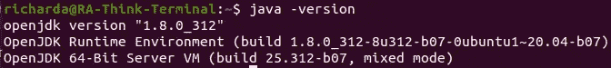
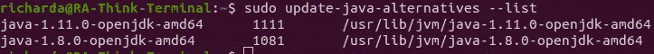
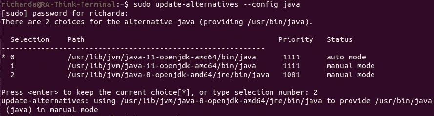
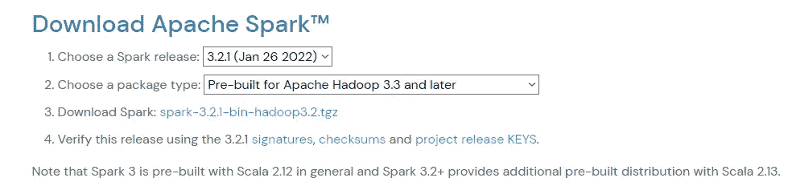
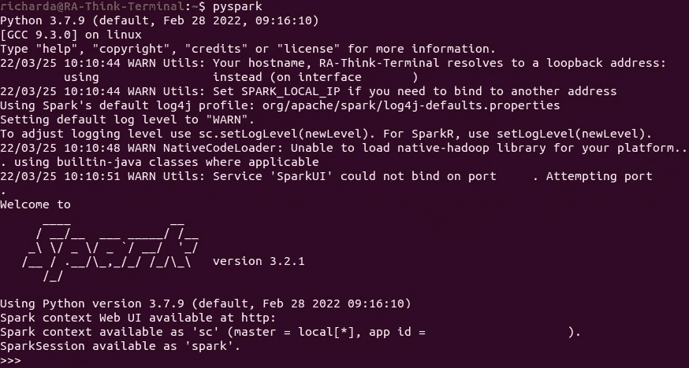
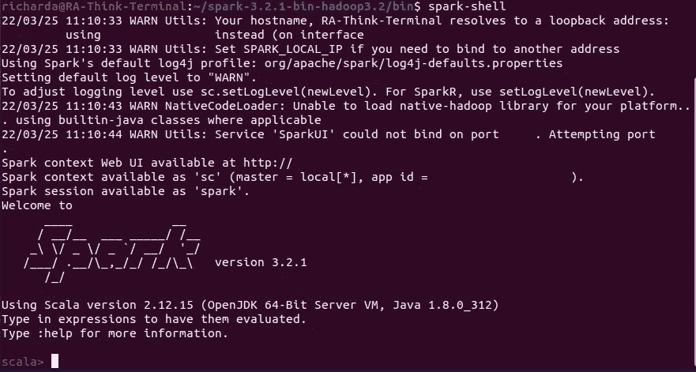
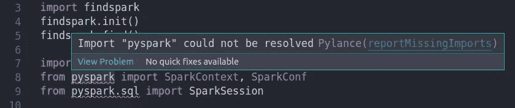

# Pyspark:如何在 Ubuntu 上删除和安装 Pyspark

> 原文：<https://levelup.gitconnected.com/how-to-delete-and-install-pyspark-on-ubuntu-4e1bbefa11a3>


照片由来自 unsplash.com 的 Jez Timms 拍摄

所以在过去的几天里，我在电脑上安装 PySpark 时遇到了一些问题。我试着尽可能多地查找教程，但在试图导入之后，都导致了 VS 代码中的`Pyspark is not defined`。我想当我试图解决这个难题时，最好在这里记录下这个过程。

**目录:**

*   删除 Pyspark 和所有相关包。
*   Pyspark 依赖项
*   安装和设置过程
*   结论

**删除 Pyspark，spark 相关包:**
在开始之前，我确保从我的机器上删除所有 Pyspark 和 Spark 的痕迹，这样我就可以重新开始。转到您的终端并运行这些命令。如果您从未在机器上安装 Spark 或 Pyspark，您可以跳过这一步。

→`pip uninstall pyspark`
→`pip uninstall findspark`
→`sudo apt-get remove --auto remove spark`
→可选(可做非此即彼)
→ `sudo apt-get purge`
→ `sudo apt-get purge --auto-remove spark`

首先我们卸载 Pyspark 和 Findspark。接下来，我们卸载 Spark，我们需要使用上面的最后三个命令，确保它及其所有依赖项和配置从系统中完全删除。第四个`sudo apt-get purge spark`和第五个`sudo apt-get purge --auto-remove spark`的区别在于，第四个命令只是删除配置和依赖包，而第五个命令删除 ***所有关于 Spark 包的*** 。

**Pyspark 依赖:**
Python:安装与您正在安装的 Pyspark 版本相对应的 Python 版本。

Java-Jdk:要运行 Pyspark，您需要 Java 8 或更高版本。

Apache Spark:由于 Pyspark 是一个位于 Apache Spark 之上的 Api 层，您肯定需要下载它。

环境变量:很重要，因为它让 Spark 知道所需的文件在哪里。

**安装过程:**

1.  **Java JDK:** 安装设置 Java-jdk:

    a .如果已经安装了 Java，检查 Java 版本:
    `java --version`或`java -version`



b.安装 Java-Jdk(只有在你没有安装正确版本的 Java 的情况下，我目前版本的 Spark 需要 java 8 以上):
`sudo apt install openjdk-8-jdk`

c.检查 java 版本:
`java --version`或`java -version`

d .如果您的默认 Java 版本不同，请更改版本:
—列出 Java 版本:`sudo update-java-alternatives --list`



—将您的 Java 版本设置为默认:`sudo update-alternatives --config java`
—`*`表示您的机器上运行的 Java-jdk 的当前默认版本。
—您可以通过在选择栏中输入数字来选择您喜欢的版本。在我的例子中，我正在寻找 Java 8，所以我将点击 2。



e.再次检查 java 版本，确保 Java 的默认版本已经更改。
`java --version`或`java -version`


f.将 java-jdk 路径添加到您的环境:
—在您的终端中键入`nano /etc/environment`并输入以下内容:

`JAVA_HOME="usr/lib/jvm/java-8-openjdk-amd64"`

—点击`ctrl + s`保存，点击`ctrl + x`退出。
—在终端类型`source /etc/environment`中输入一次，让 Bash 重新读取您的/etc/environment 文件。

2.**下载安装 Spark:** 链接:[https://spark.apache.org/downloads.html](https://spark.apache.org/downloads.html)
a .选择 Spark 版本和包类型:



**3。** **移动一下。tgz 文件从下载目录到一个你喜欢的容易访问的目录，对我来说这是我的主目录。**

**4。提取文件。**
`sudo tar -zxvf spark-3.2.1-bin-hadoop3.2.tgz`

**5。设置您的 Spark/Pyspark 环境变量:** —在您的终端中键入`sudo nano ~/.bashrc`。
—在文件末尾输入环境路径。bashrc 文件如下:

```
source /etc/environmentexport SPARK_HOME=/home/richarda/spark-3.2.1-bin-hadoop3.2
export PATH=$PATH:$SPARK_HOME/bin
export PYSPARK_PYTHON=/usr/local/bin/python3.7
export PYSPARK_DRIVER_PYTHON=/usr/local/bin/python3.7
#when running spark locally, it uses 2 cores, hence local[2]
export PYSPARK_SUBMIT_ARGS="--master local[2] pyspark-shell"export PYTHONPATH=$SPARK_HOME/python:$PYTHONPATH
export PATH=$PATH:$JAVA_HOME/jre/bin
```

—确保将 SPARK_HOME 的“richarda”替换为相应的用户名。
—点击`ctrl + s` 保存您的。bashrc 文件。
—点击`ctrl + x`退出。bashrc 文件，然后回到你的终端。
—键入`source ~/.bashrc`以便 Bash 可以重新读取您的。bashrc 文件。

**6。现在是关键时刻了！**
a .到你的终端键入`pyspark`如果你的 Spark shell 初始化了，那么恭喜你！



b.如果火花没有启动，不用担心！因为还有另一种方法来检查 Pyspark 是否安装正确。
—重启机器。
— `cd`进入你的星火目录> bin
— Type `spark-shell`。如果您的终端像这样启动:



..那你就可以走了。



**结论:**
—不再有`pyspark could not be defined`。如果您有一个 Pylance 错误，不要担心这个错误或警告。用 Pyspark 应该没问题，好好享受吧！我希望这篇 Pyspark 安装教程对你有用。