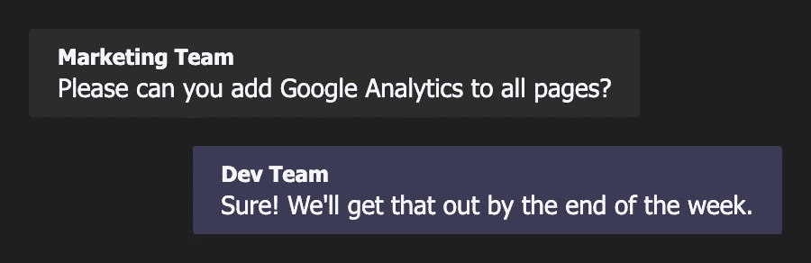
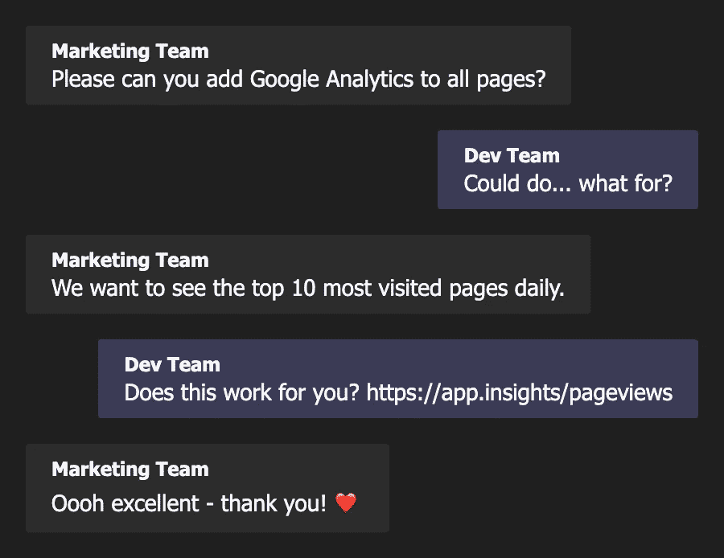
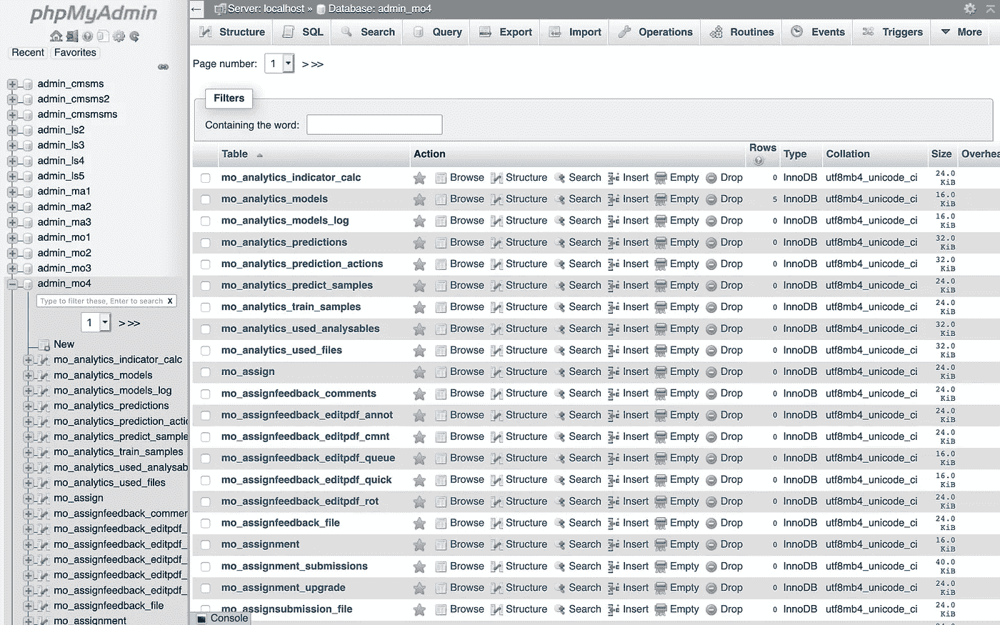
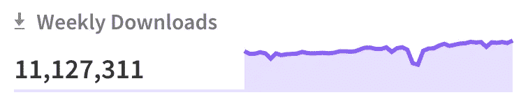
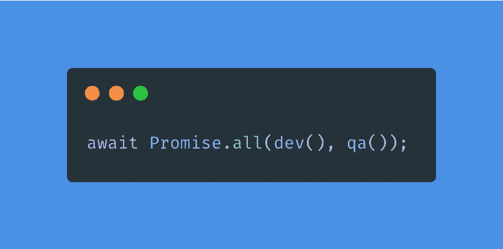

# 如何快速交付高质量产品

> 原文：<https://levelup.gitconnected.com/how-to-deliver-quality-quickly-c86b7e002708>

## 不妥协的高绩效开发团队需要什么

我真的谷歌了“快速”来填补这个空间。

很难在质量和周转时间之间取得平衡。当然没有灵丹妙药，但是如果你坚持某些原则，你会发现没有理由在这两者上妥协。

在过去的 10 年里，我参与了一系列备受瞩目的产品，并有幸领导了一个由才华横溢的前端团队组成的多元化团队。在很大程度上，这是令人难以置信的回报，但我也因为交付不够“快”而被高级管理层指责。

你可以通过关注人们经常问的问题来发现这一点。太多“有消息吗？”或者“这方面有什么进展吗？”通常是一个危险信号。它可能会很快演变成“这花了太长时间”或相当令人不快的“我们不能在这么简单的功能上花这么长时间”*不寒而栗*。

问题是，如果你感到有压力，就很容易过度补偿，开始淡化你的产品，以避免利益相关者的抱怨。

那么，你如何在保持交付的同时保持质量呢？在本文中，我将分享一些对我有用的例子，从需求收集一直到部署后的反馈——让我们开始吧！

# 整体情况

你的客户(包括内部和外部的)并不关心你个人或团队有多快。这完全是黑白分明的——一个特性要么存在于生产中，要么不存在。同样，他们关心的是整体的产品体验——而不仅仅是你做的那一点。

交付速度和质量被认为是非常高的水平，让所有工程师从这个角度思考是非常重要的。你必须在你的团队中灌输一种对整个开发过程的主人翁意识。当我说“开发过程”时，我不是指在你最喜欢的 ide 中完成的工作(如果这不是 [VS 代码](https://code.visualstudio.com/)，你就做错了)——我是指*整个*过程，从一个想法的构思一直到在生产中为客户服务。

不要自欺欺人地认为你只需要担心项目中“你的”部分——当从高层次上观察质量或速度时，你只和你最薄弱的环节一样强大。

让我们从开发过程的开始说起…

# 发现问题

当团队收到一个特性请求时，要警惕在收集需求时无意中接受了一个*解决方案*——这是一个容易陷入的陷阱。相反，你需要确保你准确地捕捉到了一个*问题。*

做到这一点的诀窍是永远记得问“为什么？”。考虑下面的对话:

好吧，一周似乎是一个合理的周转时间，但是问题真的被理解了吗？让我们再试一次，但是注意开发团队在问“为什么”:

诚然，这是一个微不足道的例子，但这里的关键点是开发团队知道一些营销团队不知道的产品知识。这种知识使他们能够立即满足需求，而不是花一周的时间在建议的解决方案上。

避免对每件事都说“是”，而是努力理解*问题—* 你的技术专长将使你能够找到最佳的*解决方案*。

# 把顾客放在第一位

如果你在前端领域有相当多的经验，那么你已经习惯了人们认为你的部分是容易的部分。我相信你一定听说过类似“你们能把这个弄漂亮点吗？”或者是我个人最喜欢的一个——“你就不能用 HTML 格式吗？”(说真的，有人对我这么说)。

在客户眼中，前端的*就是*产品。认为这是最后一分钟的“油漆舔”是一个坏主意。如果你想要哪怕是一丁点的机会来交付一个好的体验，你需要每个人都同意把 UX/用户界面的愿景作为一个优先事项，并且这应该驱动你之后做出的每一个技术决策。

您知道如果您从数据库开始并让它驱动前端设计会发生什么吗？您最终会得到一个看起来像 phpMyAdmin 的 UI——不好看。

无意冒犯 phpMyAdmin ❤

那么架构图呢？这应该会推动前端构建，对吗？有点…但肯定不是它自己。你实际上希望架构图是 UX/UI 视觉的技术实现。如果你不知道从客户的角度来看产品是什么样子，那么试图设计一个好的架构就是浪费时间。

说明产品愿景的最佳方式是什么？一个不错的老式模型。或者更好——原型。理想的情况是，让 UI 设计师尽早参与进来。如果没有，一支铅笔和一张餐巾纸就足够了。

以客户为先，从这里开始逆向构建。不断地参考 UX/用户界面的愿景将会提醒你什么是重要的，帮助你保持在正确的轨道上，并给你一个更好的机会去创造你的客户值得拥有的东西。

# 寻找最有价值球员

让我们弄清楚一件事:MVP(最低可行产品),尽管普遍认为,*不是*意味着交付不合格的产品。恰恰相反，它意味着交付尽可能少的*质量*。

想象自己在一家米其林星级餐厅，但你只有半个小时的餐桌。不管在规定的时间内有多少可以交付，你都会期待高质量的食物。想象一下，如果相反，餐馆决定给你尽可能多的东西，但让一切都比平时更糟糕——这将是完全不可接受的！

那个“橘子”其实是鸡肝鹅肝！

交付 MVP 非常像在顶级餐厅提供美味的开胃菜——相反，提供普通版本的整餐将是糟糕的客户体验。每次都追求质量胜于数量。

当分解一项任务时，保持小故事，这样你就可以快速交付有价值的东西。当你的顾客在等开胃菜时，不要浪费时间做主菜！

# 管理期望

我们围坐在五颜六色的豆袋上，急切地等待 Scrum Master 数“3… 2…1…”然后用一张计划扑克牌透露我们的估计的日子已经一去不复返了(老实说，直到刚才我才意识到那个仪式是多么怪异的居高临下！).但是这是一个很好的想法来得到一些评估。

我知道，“没有估计”亚达亚达亚达亚达，但我不是在谈论沟通一个“上线”的日期或分解成小时的工作。你只需要一件简单的 t 恤大小就能遮住后背(t 恤？掩护你的背部？看到我做了什么吗？).在我的团队中，我们会给出小、中或大的估价。小型最多一周，中型 1-2 周，大型超过 2 周。

提前提供这条简单的信息将会阻止人们编造他们自己的时间表并得出结论说你太慢了！这也可以防止他们打扰你更新，给你空间去构建一些令人敬畏的东西。

# 重新发明轮子

如果你和我一样，热爱自己的工作，那就很难抑制从头开始构建一切的冲动。但事实是，我们生活在一个很难想出一个全新的不存在的想法的时代。

不要误解我，我并不是说你应该毫不犹豫地接受外面的任何东西——我是一名 JavaScript 开发人员；我在 npm 上看到过一些血腥恐怖的事情——但是你*应该*关注真正兴风作浪的事情，并严肃对待。

看起来相当不错。

比如说…

你*可以*构建一个精心设计的部署管道，神奇地拆分你的代码，并从边缘将其部署为无服务器功能或静态文件……或者只需使用 [Vercel](https://vercel.com) 并点击一两次即可完成。

类似地，你*可以*构建一个声明式的、基于组件的、速度惊人的 UI 引擎……或者只使用 jQuery。我开玩笑的；保持镇静当然，我说的是反应(但是使用任何能让你的船漂浮的东西)。

不过，你明白了。仅仅因为你知道*如何*做某事并不意味着你*应该做，*尤其是如果已经有一个由行业专家构建的解决方案。在可能的情况下，让其他人做繁重的工作，让你自己解放出来，专注于他们没有做的事情，比如为你的客户创造最佳体验。

# 工作进展

啊，臭名昭著的在制品限制！这一点非常重要，但却经常被忽视——弄清楚在任何给定的时刻你想要有多少故事在进行中，然后*坚持*下去。

我见过太多次这样的错误，团队认为他们是有生产力的，因为他们同时在做 20 件不同的事情，而他们都完成了 90%。20 种不同的东西在完成 90%时，在生产中仍然是*虚无*——它的商业价值实际上为零。

相反，坚持一个小的 WIP 限制。当它满了，不要拿任何东西，直到一个正在进行的项目完成。如果你无所事事，帮助队友。如果没有人需要帮助，做一些其他有成效的事情(即使与工作无关)。

凤凰计划——一本奇妙的小说——比我更好地解释了这个原则。如果你没有一本，我建议你去买一本——它很值得！

> “在代码投入生产之前，实际上不会产生任何价值，因为它只是滞留在系统中的 WIP。”——凤凰计划，2013 年

一开始可能会觉得有点奇怪，但是如果你避免上下文转换，并且在特性上线之前遵守规则，你很快就会注意到生产力的提高。

# 不要把事情放到质量保证中

“搞定了，就在 QA”——听着耳熟？开发者(包括我自己)喜欢这个经典的状态更新。想想它实际上意味着什么...

如果没有在生产中为客户提供服务，就不算“完成”。这也不仅仅是在质量保证中——如果你足够幸运地与质量保证工程师一起工作，你会让人们把你的产品视为顾客(尽管他们非常迂腐)，这不应该是理所当然的。

在我目前的团队中，我们的板上根本没有“QA”栏，相反，我们有一个“进行中”栏，开发人员和 QA 工程师在那里一起工作。这强化了*所有*工程师都有责任让功能上线的想法。

据我所知，实现这种异步开发/ QA 场景的最佳方式是使用[基于主干的开发](https://trunkbaseddevelopment.com/)实践——这可能是一个完全不同的话题，所以我现在不打算深入讨论！

本质上，团队应该在整个特性开发过程中保证质量——QA 不是一个在特性“开发完成”后才加入的阶段。

# 接受反馈

良好的持续部署实践使我们能够增量地直接构建到产品中。这一过程有助于避免古老的“它在我的机器上工作”的论点，通常使世界变得更好。

与现实世界的架构相比，这显然是一个好主意。你不会在一个“测试”地点建造一栋公寓，然后试图将整个建筑搬到一个不同的地方——那将是疯狂的！

我认为这是一个被广泛认可的类比。然而，经常被忽略的一点是，在没有建筑师、项目经理或关键利益相关者反馈的情况下，孤立地建造一整栋公寓也是非常疯狂的。

产品开发也是如此。如果你不允许人们看到进展并做出改变，你将会在项目结束时陷入荒谬的“盛大揭幕”阶段，这肯定会产生两种形式的不想要的反馈:

1.  “必须的”——人们觉得有必要说一些*的话*，因为他们是第一次看到事物。因此，他们最终会刮擦桶底，并说这样的话，“这不是应该在折叠线以上吗？”。
2.  “有用但为时已晚”——人们给出了真正有价值的反馈，但现在做出改变为时已晚，所以你最终把它推迟到第二阶段。剧透:第二阶段永远不会发生。

如果您使用功能切换，您可以将它们视为建筑工地周围的建筑围板。一般公众无法进入，但主要利益相关者会定期受邀参观正在进行的工作。

不要害怕范围蔓延——如果你已经正确理解了问题并记录了 UX 愿景，你应该有足够的信心接受(并根据)沿途的反馈。

此外，不要担心在这个过程中发现了错误。这是件好事，你可以马上修好它。

> “人都会犯错。因此开发人员会犯错误。你赢或输都是错误的。”— [山姆·凯](https://medium.com/u/b6c0492ee160?source=post_page-----c86b7e002708--------------------------------)，[开发者——不要落入这些陷阱](https://jsamkay.medium.com/developers-dont-fall-for-these-traps-8523bbfee5d5)

我们都知道《生活大爆炸》的发行是有风险的，因为太多的发行可能会出错。因为同样的原因，大爆炸反馈是有风险的。接受及时的、增量的反馈将使您能够在第一次发布时交付更高质量的产品。去做吧——你的顾客会感谢你的。

# 结论

长话短说——对从请求到发布的整个过程负责，以客户为先，避免上下文转换，接受早期反馈。你这么说听起来很明显！也许是\_(ツ)_/

感谢阅读——我希望你能在这里找到有用的东西！如果你还没有这样做，我建议你将其中一些付诸实践。我很想知道它是否对你有用，所以请联系我，让我知道进展如何！