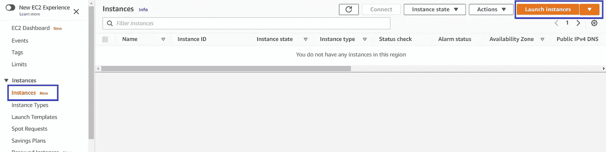
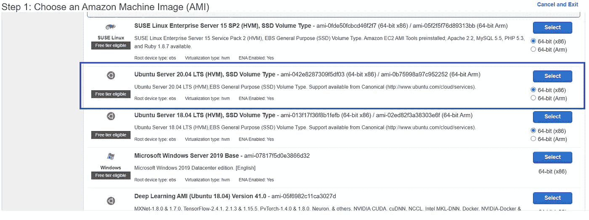
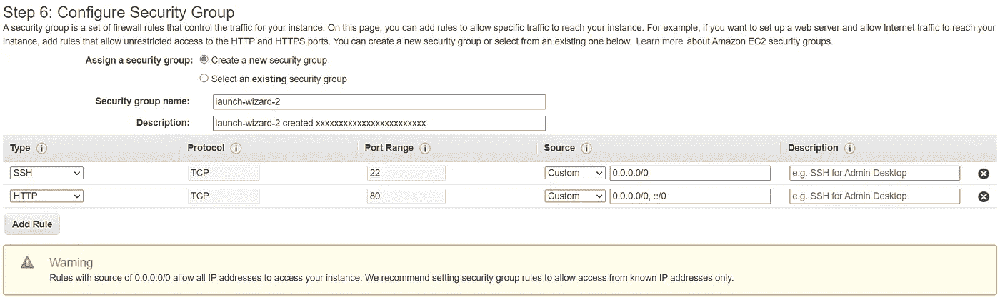
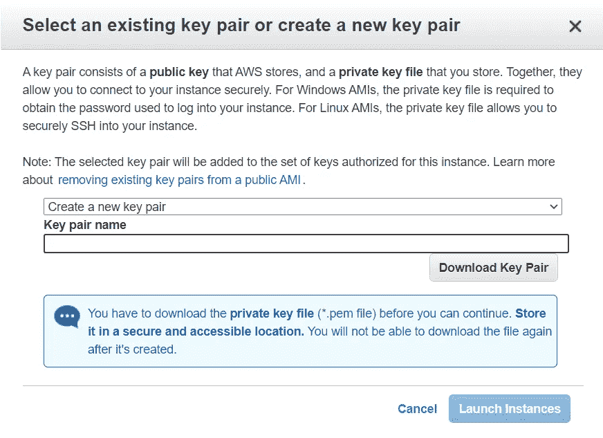
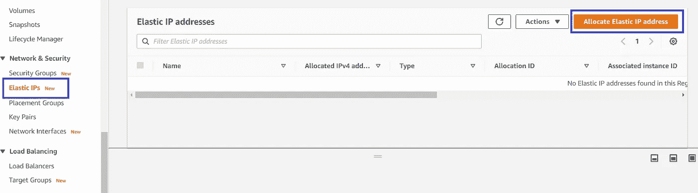

# 如何在 Amazon EC2 上部署 Flask 应用程序

> 原文：<https://levelup.gitconnected.com/how-to-deploy-a-flask-application-on-amazon-ec2-38837df3fa52>

在这篇简短的指南中，我将向您展示如何在 Amazon EC2 实例上轻松部署 flask 应用程序，并使它可以从任何地方访问。


Marc-Olivier Jodoin 在 [Unsplash](https://unsplash.com?utm_source=medium&utm_medium=referral) 上拍摄的照片

Flask 是一个用 Python 写的微型 [web 框架](https://en.wikipedia.org/wiki/Web_framework)。它不需要特定的库，使得构建 web 应用程序非常简单。由于这些原因，构建一个简单的 web 应用程序可能是一个有效的解决方案。

一旦构建了我们自己的应用程序，并随后在本地进行了调试，问题是"*我可以在哪里轻松地部署它？*”。[**亚马逊弹性计算云**](https://aws.amazon.com/ec2/) (亚马逊 EC2)是一种在云中提供安全、可调整计算能力的 web 服务。您可以轻松租赁和管理虚拟机，并且只需支付所需的时间。自您在 AWS 上注册以来，还有一个有效期为一年的免费层。所有这些都使得 EC2 成为这个目的的有效解决方案。

该指南将遵循以下步骤:

1.  如何创建 EC2 实例
2.  如何在创建的实例上部署您自己的 flask 应用程序

# 1.如何创建 EC2 实例

在 AWS 上创建新帐户后，您必须在“*服务”*下搜索“EC2”，然后在“*计算”*部分搜索。EC2 仪表板打开后，点击左侧列表视图中的*实例*，然后点击**启动实例** *。*



在下一页中，您可以选择您喜欢的机器图像。让我们选择符合*免费等级的 *Ubuntu 20.04 LTS* 。*



如果您有一个*免费等级*帐户，请选择一个 *t2.micro* 以获得 750 小时的免费使用时间。之后，对于没有特殊需求的应用程序，以下默认设置可能就可以了。

在启动实例之前，配置安全组是很重要的:如果您还没有一个安全组，那么您需要创建一个新的安全组，并且您可以更改它的名称以便与您的应用程序更好地关联。之后，除了用于 SSH 连接的端口 22 之外，还需要为 HTTP 协议打开一个端口。如果您想要发布应用程序，正确的选择是打开端口 80，但是应用程序需要 root 权限才能访问它，因此如果您没有这些权限，或者您不想发布应用程序，而只是将它部署在服务器上(可能是为了测试)，您可以选择端口 8080。



在 review 部分，您可以检查实例的详细信息，如果一切正常，请单击 ***启动*** 按钮。要通过 SSH 访问您的虚拟机，您必须创建一个新的密钥对并下载生成的*。pem* 文件(点击 [*此处*](https://en.wikipedia.org/wiki/Privacy-Enhanced_Mail) 了解更多关于 *pem* 文件)*。将这个文件存储在一个安全的地方是绝对必要的，因为这是访问你的虚拟机的唯一方法，此外，如果它落入坏人之手，有人可以访问你的实例！*



**密钥对下载后，您终于可以启动实例了！**

由于与正在运行的实例相关联是自由的，因此创建一个弹性 IP 并使用这个 IP 指向服务器是一个好主意。为此，您必须转到“弹性 IP”部分，分配一个新的弹性 IP 并将其关联到您的实例。拥有弹性 IP 的主要好处是，如果一个实例被关闭，您可以轻松地将它与另一个实例关联起来，以保持您的 web 应用程序可访问。



# 2.如何在创建的实例上部署您自己的 flask 应用程序

一旦创建了 ec2 实例并验证它正在运行，让我们看看如何从 *bash* 访问它并将 flask 应用程序的文件复制到 Ubuntu 服务器中。

## 部署到生产环境

在本指南中，我们讨论的是**部署**，但特别是在烧瓶应用中，区分这一术语和**生产**非常重要。当公开运行而不是在开发中运行时，不应该使用内置的开发服务器。开发服务器是由 Werkzeug 为了方便起见而提供的，但并没有设计得特别高效、稳定或安全。

更好的选择是使用生产 WSGI 服务器，例如[waste](https://docs.pylonsproject.org/projects/waitress/en/stable/)。如果您不想公开发布您的 web 应用程序，可以跳过这一小节的其余部分，否则我建议您安装 want 并使用这个 WSGI 服务器，而不是内置的服务器。

```
$ pip install waitress
```

在 *app.py* 中

如果不想用女侍，就用上面说的`app.run`功能。如果您在虚拟机中打开了端口 8080 而不是端口 80，请在函数中更改端口号。

## SSH 到虚拟机

首先，进入 bash 并定位。以前下载的 pem 文件。键入`chmod 600 ./<PEM_NAME>.pem`来限制对私钥的读写权限，这样只有用户/所有者可以读写，但是没有人可以执行。之后，您可以输入以下内容登录虚拟机

```
$ ssh -i path/<PEM-NAME>.pem ubuntu@<IP-ADDRESS>
```

## 虚拟机设置

现在你应该在 ubuntu shell 中了，可以开始安装依赖项了。特别是，有必要安装

*   python3
*   pip3
*   tmux
*   htop(显示重要的系统指标)

要做到这一点，你只需输入几行。

```
$ sudo apt update
$ sudo apt install python3 python3-pip tmux htop
```

现在，您可以创建一个包含您的应用程序的新文件夹。

```
$ mkdir deployedapp
```

## 将文件传输到 EC2 实例

打开您的 *bash* 的一个新标签，在您的本地机器上工作，这样您就可以保持活动的虚拟机会话。如果您还没有一个包含所有应用程序依赖项的 *requirements.txt* ，您可以很容易地创建它:移动到您的应用程序所在的文件夹并键入

```
$ pip freeze > requirements.txt
```

如果您使用的是虚拟环境，显然您需要首先激活它。

现在，您可以将您的应用程序传输到远程主机。

```
$ scp -ri path/<PEM-NAME>.pem path/to/your/application ubuntu@<IP-ADDRESS>:/home/ubuntu/deployedapp
```

## 部署应用程序

现在回到虚拟机外壳。如果您已经断开连接，请再次通过 SSH 访问它。检查您的应用程序文件夹和文件现在是否在 *deployedapp* 文件夹中。

使用 *tmux* 创建一个新的会话。

```
$ tmux new -s flasksession
```

现在一个新的 *tmux* 会话已经打开。安装您的需求(为每个项目创建一个新的虚拟环境总是一个好主意，但是在这种情况下，如果您的 flask 应用程序将是服务器上运行的唯一应用程序，您可以避免这样做)。

```
$ pip3 install -r requirements.txt
```

低于 1024 的 TCP/IP 端口号需要 root 权限才能在其上运行服务器，因此如果您使用端口 80，您需要使用关键字`sudo`。

在您部署的应用程序文件夹中

```
$ sudo python3 app.py
```

现在您的服务器正在运行。用 **Ctrl-b-d** 分离 *tmux* 会话(按 Ctrl-b，然后按 d)。要再次附加会话，您可以键入

```
$ tmux attach -t flasksession
```

要查看所有活动会话

```
$ tmux ls
```

最后，您可以按下 **Ctrl-c** 退出虚拟机，而您的应用程序将继续运行！

# 参考

*   [烧瓶文件](https://flask.palletsprojects.com/en/1.1.x/quickstart/)
*   简要的 tmux 指南