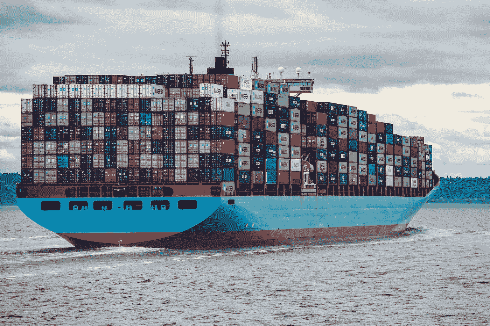

# 如何将 Lambda 函数部署为容器映像:Docker + SAM + ECR

> 原文：<https://levelup.gitconnected.com/how-to-deploy-a-lambda-function-as-a-container-image-docker-sam-ecr-2846809f90e1>



[伊恩·泰勒](https://unsplash.com/@carrier_lost?utm_source=unsplash&utm_medium=referral&utm_content=creditCopyText)在 [Unsplash](https://unsplash.com/s/photos/container?utm_source=unsplash&utm_medium=referral&utm_content=creditCopyText) 上拍照

正如标题所示，这篇文章将演示如何使用 Docker、SAM(无服务器应用程序模型)和 ECR(弹性容器注册中心)将 Lambda 函数部署为容器映像。

这篇教程将建立在[之前的文章](/deploy-a-python-cron-job-to-aws-lambda-with-sam-5d05f0c17a89)的基础上。因此，建议遵循，否则将假设 AWS Lambda 和 SAM 的先决知识。

我们继续吧。

# 先决条件:

*   IDE(即 PyCharm)
*   [安装并配置 AWS CLI](https://docs.aws.amazon.com/cli/latest/userguide/cli-chap-welcome.html)
*   [安装和配置 AWS SAM CLI](https://docs.aws.amazon.com/serverless-application-model/latest/developerguide/serverless-sam-cli-install.html)
*   [Docker 安装和配置](https://docs.docker.com/get-docker/)
*   本地编码的 Lambda 函数/应用程序

# 步骤 1:创建 Dockerfile 文件

让我们假设你的回购目录结构看起来像这样(从[这篇文章中可以看出)](/deploy-a-python-cron-job-to-aws-lambda-with-sam-5d05f0c17a89):

```
.
├── app.py
├── requirements.txt
├── samconfig.toml
└── template.yaml
```

注意，与[这篇文章](https://awstip.com/deploy-a-lambda-layer-and-function-together-via-sam-e95e29194ef7)不同，我们不会创建子目录或排除 requirements.txt 文件。

在同一个目录中，我们将创建一个 Dockerfile 文件。

这个 Dockerfile 可以叫做 **Dockerfile** (不需要文件扩展名)。

在此 Dockerfile 文件中，粘贴以下内容:

```
FROM public.ecr.aws/lambda/python:3.9ARG wd=/var/task/COPY app.py requirements.txt ${wd}RUN python3.9 -m pip install -r requirements.txt -t "${wd}"# Command can be overwritten by providing a different command in the template directly.
CMD ["app.lambda_handler"]
```

我们的目录现在应该是这样的:

```
.
├── Dockerfile
├── app.py
├── requirements.txt
├── samconfig.toml
└── template.yaml
```

现在，回到文档。里面发生了什么事？

FROM 命令从 Amazon 的 ECR(弹性容器注册表)中拉出“base”[图像](https://gallery.ecr.aws/lambda/python)。

ARG 命令不是必需的，但我插入它是为了给 COPY 和 RUN 命令创建一个变量。

COPY 命令将引用的文件( [app.py](http://app.py) 和 requirements.txt)“复制”到指定的路径，该路径为**/var/task**(**wd**变量的值)。在 AWS 文档的[中，您可能会发现它被引用为 LAMBDA_TASK_ROOT 环境变量。](https://docs.aws.amazon.com/lambda/latest/dg/images-create.html#images-create-from-base)

我特别需要用 ARG 命令创建自己的变量，这是有原因的，我们稍后会了解。

# 步骤 2:构建 Docker 映像

现在，如果您运行`sam build -u`来构建您的部署包，docker 文件实际上将被忽略。这是因为我们需要在我们的 **template.yaml** 中指定我们的包是一个图像。

下面显示了修改后的 **template.yaml** 的一个片段:

```
Resources:
  Function:
    Type: 'AWS::Serverless::Function'
    Properties:
      FunctionName: Weekly_Pocket_Readtime_Tagger
      Description: >
        Lambda function which tags unread articles (saved in the last 7 days) in my Pocket based on read-time.
      PackageType: Image
      Timeout: 300
```

以前，当我们的包是一个 Zip 文件时，相同的 **template.yaml** 片段看起来像这样:

```
Resources:
  Function:
    Type: 'AWS::Serverless::Function'
    Properties:
      FunctionName: Weekly_Pocket_Readtime_Tagger
      Description: >
        Lambda function which tags unread articles (saved in the last 7 days) in my Pocket based on read-time.
      Handler: app.lambda_handler
      Runtime: python3.9
      Timeout: 300
```

不同的是我们增加了*的*和**的**和*的*和**的句柄和运行时。**

除此之外，我们实际上需要引用我们的 DockerFile，这将通过下面的 **template.yaml** 片段来完成:

```
Metadata:
  Dockerfile: Dockerfile
  DockerContext: .
```

这将放在模板的函数层下。

Dockerfile 参数指定 Dockerfile 的名称，DockerContext 指定 Dockerfile 的路径。

现在您可以再次运行`sam build -u`，并且您应该看到(在您的终端输出中)从 docker 文件构建的图像。

它可能看起来像这样:

```
Building image for Function function
Setting DockerBuildArgs: {} for Function function
Step 1/5 : FROM public.ecr.aws/lambda/python:3.9
 ---> f1904097ad08
Step 2/5 : ARG wd=/var/task/
 ---> Using cache
 ---> 82b27994b22d
Step 3/5 : COPY app.py requirements.txt ${wd}
 ---> Using cache
 ---> 53814baeed22
Step 4/5 : RUN python3.9 -m pip install -r requirements.txt -t "${wd}"
 ---> Using cache
 ---> 10f84558dd04
Step 5/5 : CMD ["app.lambda_handler"]
 ---> Using cache
 ---> ae0d33704abe
Successfully built ae0d33704abe
Successfully tagged function:latest
```

为了在本地测试这个函数，运行`sam local invoke`,就像我们对待一个 Zip 包一样。

# 步骤 3:创建 ECR 存储库

因此，我们已经构建并测试了我们的映像，现在我们需要创建一个存储库，我们将在其中上传这个映像。

要创建 repo，请键入如下命令:

```
aws ecr create-repository --repository-name <REPO_NAME>
```

由于稍后您将需要使用 repo URI，您还可以在上面的命令后面附加一些 JMESpath 来解析响应中的 URI，如下所示:

```
aws ecr create-repository --repository-name <REPO_NAME> --query 'repository.repositoryUri' > repoUri.txt
```

这将把**存储库 yUri** 输出到一个名为 repoUri.txt 的文件中。

我们将在部署中使用这个储存库尤里。

# 步骤 4:部署 Docker 映像

运行`sam deploy -g`。您将会看到大多数相同的提示，就好像我们正在部署一个 Zip 一样，但是您还会**和**看到以下内容:

```
Looking for resources needed for deployment:
Managed S3 bucket: <SOME_BUCKET>
A different default S3 bucket can be set in samconfig.toml
Image repositories: Not found.
#Managed repositories will be deleted when their functions are removed from the template and deployed
Create managed ECR repositories for all functions? [Y/n]:
```

请注意最后一行的提示是:

`Create managed ECR repositories for all functions? [Y/n]:`

因此，在这里，我们可以用 **Y、**来响应，在这种情况下，AWS 将为我们创建一个 ECR 回购(使用一个不太好的名称)，或者我们可以用 **N** 来响应，并输入我们自己的回购 URI。我们将执行后者，因此输入 **N.**

下一个提示将是`ECR repository for Function:`,这是您粘贴之前的**储存库 yUri** 的地方。

进入 URI 并继续部署后，您可能会看到类似下面的内容:

```
092e319c29f0: Pushed 
a655d2aa16d4: Pushed 
d6b9d3aa40bb: Pushed 
a7690775ba55: Pushed 
159cfb847db8: Pushed 
4bc74a3077fd: Pushed 
4465b476f1b1: Pushed 
e5bfcec20402: Pushed 
function-ae0d33704abe-latest: digest: sha256:dcaa0ba9c4a7bf554e2eb2a9095e907853cf11d07dd8c0e5f43fc0bf8dad1303 size: 2000
```

这些 sha 中的每一个都是映像的不同层。

根据的解释:

> *Docker 图像由几层组成。每一层对应你* `*Dockerfile*` *中的某些指令。下面的指令创建一个图层:*`*RUN*`*`*COPY*`*`*ADD*`*。其他指令将创建中间层，不会影响图像的大小。***

**我推断前 6 层(共 8 层)是 Dockerfile 中的`FROM public.ecr.aws/lambda/python:3.9`命令的结果(通过运行`sam build`和`sam deploy`而不是本文前面的 COPY 或 RUN 命令)。反过来，我们可以假设第 7 层和第 8 层**分别来自复制和运行命令**。**

**现在，在图像标签上，我们可以从上面的终端输出看到是`function-ae0d33704abe-latest`。**

**第一部分，`function` **，**只是 template.yaml 中**函数**参数的小写形式。**

**`ae0d33704abe`段是一个 SHA 片段，根据[Github 问题注释](https://github.com/aws/aws-sam-cli/issues/2600#issuecomment-776129692)，它将始终是标签的一部分。**

**最后，`latest`是我们可以在 template.yaml 中指定的 Dockertag，但默认为 **latest。****

**如果您通过 Docker 构建和部署您的映像(我指的是运行 Docker 命令，而不是 SAM)，您将能够只使用最后一部分(即**最新**或另一个名称)来标记您的映像。这不在这篇文章的讨论范围之内。**

****将**在这篇文章的范围内是如何指定一个 Dockertag **在**模板. yaml 之外**

**如果我们预见到有几个标签对应于不同的图像，每次编辑 template.yaml 是不方便的。**

**那么，什么是替代方案呢？**

# **步骤 5:手动标记图像**

**在 template.yaml 中，在**资源**之前(在**描述**之后)，输入以下内容:**

```
**Parameters:
  Tag:
    Type: String
    Default: latest
    Description: Docker tag to build and deploy.**
```

**这创建了一个名为**标签**的参数，它可以在模板的其他地方被引用。**

**我们将[在 DockerTag 部分引用它](https://docs.aws.amazon.com/AWSCloudFormation/latest/UserGuide/intrinsic-function-reference-ref.html)作为**元数据的一部分，如下所示:****

```
**Metadata:
  Dockerfile: Dockerfile
  DockerContext: .
  DockerTag: !Ref Tag**
```

**你可能还记得，在这篇文章中，我们从来没有在模板中使用过 **DockerTag** 。因为它不在那里，默认为前面提到的**最新**，并且作为我们指定的新**标签**参数的一部分，我们也可以指定我们自己的**默认**标签(我们将保留它为**最新**)。**

**覆盖**标签**参数将是构建的一部分，我们的命令看起来像这样:**

```
**sam build -u --parameter-overrides 'Tag=TAG_GOES_HERE'**
```

**标记的名称将代替上面代码片段中的 **TAG_GOES_HERE** 。你可以在这里阅读更多关于`sam build`选项[的内容。](https://docs.aws.amazon.com/serverless-application-model/latest/developerguide/sam-cli-command-reference-sam-build.html)**

**在这个构建之后，您将像往常一样运行`sam deploy`,将函数部署为带有被覆盖标签的图像。**

# **结论**

**嗯，我们做到了！我们已经部署了一个 Lambda 函数作为容器映像，这将允许我们上传更大的部署包(即更大的函数或更大的依赖项)。我在使用像 Numpy 和 Pandas 这样的库部署一个函数时遇到了问题，所以这是一个很好的方法，如果你也在做同样的事情，它会派上用场，而且你还需要学习一些关于容器化的知识！**

**感谢阅读，我希望这有所帮助，并找到下面的参考资料，以探索更多！**

# **参考资料:**

*   **[AWS Lambda 的新增功能—容器图像支持](https://aws.amazon.com/de/blogs/aws/new-for-aws-lambda-container-image-support/?nc1=b_rp)**
*   **[通过 AWS SAM 对 AWS Lambda 使用容器映像支持](https://aws.amazon.com/blogs/compute/using-container-image-support-for-aws-lambda-with-aws-sam/?utm_source=pocket_mylist)**
*   **亚马逊弹性容器注册公共:一个新的公共容器注册**
*   **[在本地测试 Lambda 容器映像](https://docs.aws.amazon.com/lambda/latest/dg/images-test.html)**
*   **[用容器映像部署 Python Lambda 函数](https://docs.aws.amazon.com/lambda/latest/dg/python-image.html)**
*   **[AWS Lambda 基础图片 Github](https://github.com/aws/aws-lambda-base-images)**
*   **[从 AWS 基础图像创建图像](https://docs.aws.amazon.com/lambda/latest/dg/images-create.html#images-create-from-base)**
*   **[Docker 构建](https://docs.docker.com/engine/reference/commandline/build/)**
*   **[过滤 AWS CLI 输出](https://docs.aws.amazon.com/cli/latest/userguide/cli-usage-filter.html#cli-usage-filter-client-side)**
*   **[JMS path](https://jmespath.org/)**
*   **[带 SHA 的 SAM 图像标签](https://github.com/aws/aws-sam-cli/issues/2600#issuecomment-776129692)**
*   **[Docker 图像中的图层](https://dzone.com/articles/docker-layers-explained)**
*   **[山姆建造选项](https://docs.aws.amazon.com/serverless-application-model/latest/developerguide/sam-cli-command-reference-sam-build.html)**
*   **[Ref 固有函数](https://docs.aws.amazon.com/AWSCloudFormation/latest/UserGuide/intrinsic-function-reference-ref.html)**