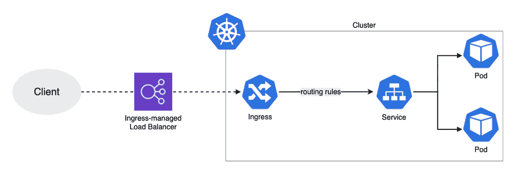
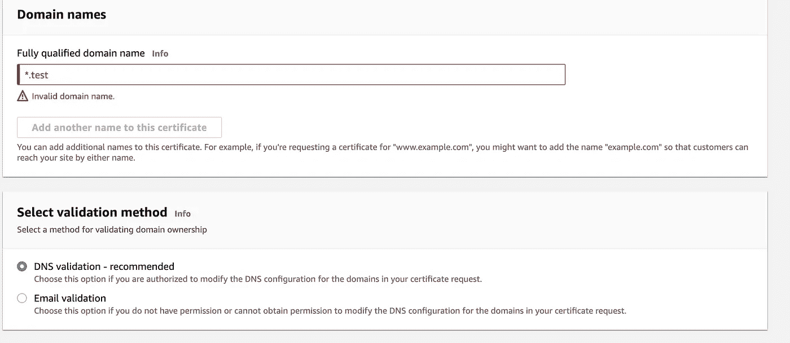
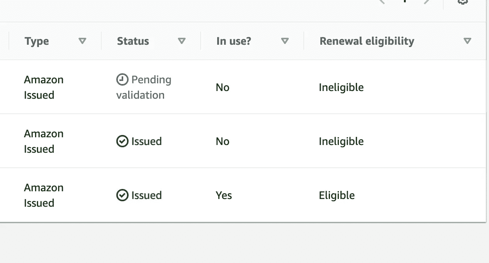
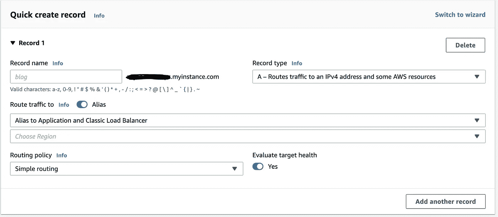

# 如何在 EKS 法盖特部署多容器(两层)Go 应用程序

> 原文：<https://levelup.gitconnected.com/how-to-deploy-a-multi-container-two-tier-go-application-in-eks-fargate-6266494f5bcf>

在这篇(另一篇)长文中，我们探索了在 EKS 法盖特部署 2 层 Go 应用程序的端到端场景。两层意味着我们将有一个后端应用程序容器(在 Go 中)与一个数据库(Postgres)容器交互。我们将通过在 EKS 建立两层应用程序和服务来服务通信的细微差别，以及处理 fargate 配置文件的复杂性来工作。

虽然这可能是特定于 Go 应用程序的，但目的是探索将任何多容器应用程序部署到 EKS 法盖特的通用步骤。大部分的 YAMLs 都有大量的注释来解释。在这个初学者教程中没有使用 Terraform，但是使用 Terraform 可以自动完成大多数步骤。

我们将执行以下步骤:

*   为 Go 应用程序创建一个 Docker 图像。
*   使用 Docker Compose 在本地测试容器。
*   创建 Kubernetes 资源:部署、PVC、状态集等。
*   在 ALB 创建入口和 TLS 终端。

# 步骤 0:先决条件

不用说，在我们开始做任何事情之前，我们需要设置好所有的环境。需要以下软件:

*   [码头工人](https://docs.docker.com/engine/install/)
*   [掌舵](https://helm.sh/docs/intro/install/)
*   [AWS 上的 EKS 集群](https://docs.aws.amazon.com/eks/latest/userguide/create-cluster.html)(注意:记住对于 Fargate，您[不能挂载 EBS 卷](https://docs.aws.amazon.com/eks/latest/userguide/ebs-csi.html)，并且 EFS [不允许在 Fargate](https://docs.aws.amazon.com/eks/latest/userguide/efs-csi.html) 上进行动态配置，因此我们将使用 EFS 的[静态配置)](https://docs.aws.amazon.com/eks/latest/userguide/efs-csi.html)

为了创建 fargate 集群，强烈推荐使用 EKSCTL ,因为它可以在正确的名称空间中创建必要的标签、pod 执行角色、Fargate 概要文件和许多其他后端手工工作，这样可以省去很多麻烦。如果您决定使用控制台创建，记得在之前做好[准备工作](https://docs.aws.amazon.com/eks/latest/userguide/fargate-getting-started.html):修补 CoreDNS，在 kube-system 中创建 fargate 配置文件，创建 podexecution 角色，创建私有子网，标记它们等等。最后，使用 1.21 版本，因为 1.22 已经删除了许多有用的注释。我使用以下命令创建:`eksctl create cluster --name YOUR_CLUSTER_NAME --version 1.21 --fargate`

您可以使用任何应用程序，但出于本教程的目的，我使用了一个简单的主应用程序上传到 Github repo [这里](https://github.com/gravito/simpleservice)。这是一个简单的 2 层应用程序，用于检查数据库连接。

它只有一个回答“text/plain”的“/live”端点；charset=utf-8 `。下面的响应可能是:
-`干得好:`:如果应用程序能够与 Postgres 数据库连接
-`正在运行`:如果在与数据库连接的过程中发生了一些错误

# 步骤 1:为 Go 应用程序创建一个 Docker 映像

正如你们中的一些人可能知道的，Docker 映像是从 Dockerfiles 创建的，Docker files 是一个文本文档，包含运行完全独立的软件二进制文件及其所有依赖项所需的所有步骤。

不用说，创建 Docker 映像的第一步是在本地测试它。这是理解具体构建步骤的重要一步，稍后我们将使用 Dockerfile 自动完成。

对于演示应用程序，幸运的是非常简单。我们需要做的只是编译二进制文件，运行它，它会自动连接到数据库。数据库配置分别取自 PORT 和 POSTGRES_URL。

## 在 EC2 上安装和设置 Go 和 Postgres:

这里不用费太多脑筋，只是在 EC2 中安装 Postgres 和 Go 来测试我们的 Docker 映像。我在这里提到了[的链接](https://www.how2shout.com/linux/install-postgresql-13-on-aws-ec2-amazon-linux-2/)。

```
-> sudo tee /etc/yum.repos.d/pgdg.repo<<EOF-> Adding Repo Info
[pgdg13]
name=PostgreSQL 13 for RHEL/CentOS 7 - x86_64
baseurl=https://download.postgresql.org/pub/repos/yum/13/redhat/rhel-7-x86_64
enabled=1
gpgcheck=0
EOF-> Installing and enabling Postgres
sudo yum update
sudo yum install postgresql13 postgresql13-server
sudo /usr/pgsql-13/bin/postgresql-13-setup initdb
sudo systemctl start postgresql-13
sudo systemctl enable postgresql-13-> Change password using below commands:
sudo passwd postgres-> Create database for backend. We used simpleservice.
sudo -u postgres psql
CREATE DATABASE simpleservice
\q
```

安装 Go 应用程序只需一个简单的步骤:

```
sudo yum install golang -y
```

现在让我们尝试运行 GoLang 应用程序并连接 Postgres。如果您仔细阅读自述文件，要构建这个演示应用程序，我们只需运行:“GO111MODULE=on go build”命令来构建 simple_service 二进制文件。我们现在只需运行二进制文件来启动服务器。

端口和数据库连接 url 在 config 文件夹中配置。使用您创建的用户名、密码和数据库名称更改 PostgresURL 的 envDefault 值，以连接到数据库。请注意，我们正在使用？sslmode =禁用查询字符串。总的网址是:

```
postgres://<user>:<pass>@<IP>/<dbname>?sslmode=disable
```

现在，当所有步骤都完成后，只需运行二进制:。/simple_service，然后使用 localhost:curl localhost:<port>/live 进行连接</port>

您应该得到如下的“做得很好:)”消息:

```
[ec2-user@ip-172-31-29-226 ~]$ curl localhost:8000/live
Well done :)
```

那么，我们为什么要通过所有的手动步骤来测试这个图像呢？这是因为我们将自动化所有这些步骤！让我们看看我们能怎么做。

## 创建 Docker 图像:

看看下面的 Docker 图片，这是一个 building a Go 二进制文件:

我们不会仔细检查每一条语句，因为大多数语句都可以在 Dockerfile reference [这里](https://docs.docker.com/engine/reference/builder/)找到。添加的注释是不言自明的。

关于 Go，我们需要 go mod 和 go sum 文件(第 11 行),并且需要从 go mod 和 sum 文件下载所有依赖项(第 14 行)。然而，正如 [Go 1.11](https://go.dev/doc/go1.11) 中介绍的那样，“go mod 下载”只有在原始 go mod 和 go sum 文件被更改的情况下才会重新运行。由于这些文件很少改变，我们在编译时节省了大量时间。然后，我们简单地将所有文件复制到工作目录中(第 17 行)。然后我们在第 20 行构建二进制文件。请注意，再次构建时间将会非常快，因为所有的依赖项都已经在前面的步骤中下载并缓存了(否则我们可以走远路，只构建二进制文件并每次下载所有的依赖项！).

我们利用多阶段构建来降低映像大小，并为其复制二进制文件和环境文件。通常的 docker 构建和 docker 推送会将图像上传到 dockerhub。请注意，根据该命名约定，非官方图像名称应该命名如下:`<username>/<image_name>:<tag_name>.`

```
docker build -t gravito/simple-service:latest .
docker push gravito/simple-service:latest
```

# 步骤 2:使用 Docker Compose 在本地测试容器

在我们进入 Kubernetes 的复杂世界之前，我们可以使用 Docker Compose 在本地测试图像。

我们可以使用 docker run 命令测试基本映像，并使用端口转发暴露主机上的 8080 端点。请注意，当卷曲本地主机时，您的连接将被拒绝，因为数据库容器没有运行:

```
# fetching image from dockerhub
docker pull gravito/simple-service:latest# running the image and port forwarding
docker run -it -p 8080:8080 gravito/simple-service:latest# using curl to access 8080 on localhost will give error as follows:Listening on port 8080
Sat Apr 23 13:31:27 2022 - error querying database: dial tcp 127.0.0.1:5432: connect: connection refused
Sat Apr 23 13:31:27 2022 - simple request
```

但是，如果我们还需要设置数据库容器，我们需要定义环境变量，然后定义到数据库容器的连接 URL，公开 5432 端口，设置数据库的用户名/密码，等等。对于我们的本地通用容器来说，这将是太多的工作。

这就是 Docker compose 将提供帮助的地方。Compose 是一个定义和运行多容器 Docker 应用程序的工具。使用 Compose，您可以使用 YAML 文件来配置应用程序的服务。然后，只需一个命令，您就可以从您的配置中创建并启动所有服务。这是测试多容器图像的有效方法。

在 Docker 合成文件下面找到:

同样，我们不打算详细说明 Docker Compose 是如何工作的，因为我们在这里使用它只是为了测试，因为实际代码无论如何都会在 Kubernetes 中运行。

然而，总结就是我们正在创建两个服务。一个前端，一个数据库。数据库服务将从 hub 中提取 postgres 映像(第 18 行),并使用环境变量创建我们的数据库(第 23 行),同时在端口 5432 上公开 DB(第 25 行)。临时存储由卷提供(第 27 行)。

前端将在本地构建容器(第 5 行)并公开端口 8080(与 DB config 相同)。请注意，DB config 环境变量是第 14 行和第 15 行中提供的连接字符串和端口。

对于 Docker Compose，环境变量从[中选取。本地的 env](https://docs.docker.com/compose/env-file/) 文件。因此，请确保您已经将所有相关的环境变量放入该文件中。

一旦设置了环境变量，文件就准备好了，只需运行:

```
docker-compose up -d
```

这将创建应用程序。使用 CURL 访问它:

```
curl [http://localhost:8080/live](http://localhost:8080/live) 
```

如果您需要编辑 docker 文件并返工，请首先运行以下命令进行拆除:

```
docker-compose down --remove-orphans --volumes
```

然后运行以下命令重新构建:

```
docker-compose up --build
```

# 步骤 3:创建 Kubernetes 资源:部署、PVC、Statefulsets 等。

现在我们终于来到了库伯内特斯。在我们部署这些资源之前，您必须了解这些资源是什么以及它们的作用。因此，在继续之前，请随意阅读这篇关于 Kubernetes 资源的非常详细和[全面的文章](https://medium.com/@shrut_terminator/the-all-mighty-guide-to-devops-interview-questions-kubernetes-edition-a33da07a3b00)，它是由您真正以用户友好的方式撰写的:)。

在我们开始部署资源之前，我们需要设计一些注意事项。所以我们有一个应用程序和一个数据库。所以自然地，我们需要保存数据。这将需要 StatefulSet +持久卷控制器+持久卷的组合。

接下来，我们需要存储所有用户名，密码和其他相关信息的秘密。然后，我们将需要通常的应用程序部署和内部服务来访问它们。

我们还需要入口将应用程序暴露在外面。为什么是入口，为什么不是负载平衡器服务？这是因为将来如果应用程序扩展并且我们添加了更多的单元，我们将需要为每个应用程序使用多个负载平衡器。相反，我们可以简单地使用入口对象并在内部路由到新的服务。有点像下面给出的:



为了连接到数据库，我们只需在应用程序的连接字符串中提供 postgres 服务名和端口号。这是通过使用内部服务机制来确保内部应用程序与数据库通信的关键。例如:

```
postgres://user:pass@<db-service-name>:<port-number-of-database-service>/dbname?sslmode=disable
```

考虑到这些因素，让我们开始创造一切。

## 设计存储解决方案:

您可能知道，对于 EKS，它需要容器存储接口(CSI)驱动程序来支持其存储。如前所述，Fargate 仅支持 EFS 静态配置，因此我们将使用它。

然而，好消息是 EFS 的 Fargate 不需要手动安装 EFS CSI 驱动程序的 T2。因此，我们只需要创建 EFS，并挂载正确的子网。按照“[创建 EFS 文件系统](https://docs.aws.amazon.com/eks/latest/userguide/efs-csi.html#efs-create-filesystem)”中的步骤，为 EFS 正确创建和配置挂载目标。

现在，我们只需从他们的 [github repo](https://github.com/kubernetes-sigs/aws-efs-csi-driver.git) 中复制样例配置模板。或者，您可以使用以下代码:

*   **持久卷**:

确保将“volumeHandle”(第 15 行)替换为适当的 EFS 文件系统 ID: `aws efs describe-file-systems --query "FileSystems[*].FileSystemId" --output text`

*   **持久卷索赔**:

*   **存储类**:

获得 PVC 将显示我们绑定如下:

```
kubectl get pvcNAME        STATUS   VOLUME   CAPACITY   ACCESS MODES   STORAGECLASS   AGEefs-claim   Bound    efs-pv   5Gi        RWX            efs-sc         5s
```

*   **机密:N** 注意敏感信息已被删除。请在使用 yaml 之前输入它。此外，由于某种原因，我不能在 Secrets 中使用嵌套变量:(。

**申请密码:**

注意第 16 行，确保提供我们稍后将为 Postgres 数据库创建的相同服务名。这确保了应用程序可以使用内部服务在内部连接到数据库。

**数据库的秘密:**

您可以使用“*描述机密*”调用来验证机密:

```
kubectl describe secrets  postgres-secretName:         postgres-secret
Namespace:    default
Labels:       <none>
Annotations:  <none>Type:  OpaqueData
====
POSTGRES_USER:      6 bytes
DATA_SOURCE_NAME:   70 bytes
POSTGRES_DB:        14 bytes
POSTGRES_PASSWORD:  6 bytes
```

## 设置数据库容器:

*   **Postgres 有状态集:**

首先，让我们部署数据库容器。为此，我们将使用 statefulsets。请看看下面的数据库 yaml 文件:

第 7 行到第 12 行是不言自明的，因为我们指定了这个 statefulset 将使用的服务，还指定了需要附加(或标记)到这个 statefulset 要附加到的所有 pod 的选择器。

从第 15 行到第 18 行，我们将相同的标签应用于我们在第 9 行中为 Statefulsets 选择的 pod。

第 21 行，我们使用 Dockerhub 中的 postgres 图像。第 26 行，我们引用了之前为环境变量创建的 postgres 秘密。

第 30 行到第 32 行，我们指定了用于数据库的存储解决方案。我们将使用前面定义的 PVC。对于 statefulset，需要在“卷”部分定义存储解决方案。我们在第 40 行中指定了这个部分。在第 43 行，我们指定了 PVC 名称作为我们要使用的存储解决方案。

Line #31 " *mountPath* "定义 postgres 数据在 Pod 中的实际存储位置。实际上，我们将提供的本地卷将映射到 pod 中的路径“ */var/lib/postgresql/data* ”。该路径取自 postgres Docker [网站](https://hub.docker.com/_/postgres)的默认环境变量 PGDATA。

为数据指定正确的 postgres 路径非常重要，否则容器将无法与其存储的数据库建立连接(您将得到`No PostgreSQL clusters exist`错误)。

最后，在创建这个 statefulset 之前，确保您的 EFS 已经正确安装了所有子网。如果您正确地遵循了之前的步骤，现在就不会有问题了。

*   **Postgres 服务:**

这里没有什么，只是为端口 5432 创建了一个内部服务:

## 设置应用程序容器:

非常简单。繁重的工作是在设置存储解决方案时完成的。现在，我们只需使用之前上传的映像创建一个内部服务和部署。

*   **部署 Yaml** :

*   **服务 Yaml** :

一切都应该很好地完成，并运行到这一点:

```
➜  kubectl get all                                                  
NAME                                         READY   STATUS    RESTARTS   AGE
pod/fullstack-app-postgres-bf57ff694-zsbs7   1/1     Running   0          6m57s
pod/fullstack-postgres-0                     2/2     Running   0          77mNAME                             TYPE        CLUSTER-IP      EXTERNAL-IP   PORT(S)    AGE
service/fullstack-app-postgres   ClusterIP   10.100.51.249   <none>        8080/TCP   6m25s
service/fullstack-postgres       ClusterIP   10.100.166.85   <none>        5432/TCP   18m
service/kubernetes               ClusterIP   10.100.0.1      <none>        443/TCP    158mNAME                                     READY   UP-TO-DATE   AVAILABLE   AGE
deployment.apps/fullstack-app-postgres   1/1     1            1           7mNAME                                               DESIRED   CURRENT   READY   AGE
replicaset.apps/fullstack-app-postgres-bf57ff694   1         1         1       7m1sNAME                                  READY   AGE
statefulset.apps/fullstack-postgres   1/1     77m
```

# 步骤 4:使用 Ingress 对外公开应用程序:

为了使用入口，我们需要入口控制器。对于 AWS Fargate，我们将使用 AWS 负载平衡器控制器来设置我们的入口。我们简单地按照 AWS 博客[这里](https://aws.amazon.com/premiumsupport/knowledge-center/eks-alb-ingress-controller-fargate/)(在测试负载平衡器部分之前)安装 AWS 负载平衡器控制器。

请注意，我们将只使用 Ingress 公开我们的内部应用程序服务，而不是数据库服务。内部应用程序使用我们秘密提供的 localhost 和 clusterIP 服务自动连接数据库。

记住这些事情，一旦配置了负载平衡器，就使用下面的入口 Yaml:

第 7 行到第 9 行是 Fargate 所需的注释。第 14 行是入口将路由到的实际路径。我把所有路径都放在这里，因为我们只有一个端点/live 可以工作。当我们添加新的端点时，我们可以在这里更新入口。第 16 行是要连接的后端服务。注意，在我们的应用程序中，只配置了/live API 调用。所有其他 API 将给出 404 未找到错误。

一旦应用了入口，我们可以按如下方式检查入口地址:

```
kubectl get ingressNAME          CLASS    HOSTS   ADDRESS                                                                 PORTS   AGEingress-app   <none>   *       k8s-default-ingressa-1234567890.us-east-1.elb.amazonaws.com   80      4m55s
```

使用浏览器中的地址访问我们的应用程序:

```
[http://k8s-default-ingressa-1234567890.us-east-1.elb.amazonaws.com/live](http://k8s-default-ingressa-1234567890.us-east-1.elb.amazonaws.com/live)Well done :)
```

## 使用 TLS 保护应用程序:

很高兴能走到这一步。到目前为止，我们使用 HTTP 连接到我们的应用程序。这是非常错误的，因为我们需要 HTTPS 并使用 TLS 保护我们的应用程序。

有 4 种主要的 TLS 终端。每个步骤都在附加的链接中提供:

*   负载均衡器处的[](https://aws.amazon.com/premiumsupport/knowledge-center/terminate-https-traffic-eks-acm/)**:最常见的场景，我们将在这里实现。这是使用公共信任的 ACM 证书完成的。该证书将被绑定到负载平衡器本身。**
*   **[**在入口**](https://aws.amazon.com/blogs/security/tls-enabled-kubernetes-clusters-with-acm-private-ca-and-amazon-eks-2/) :我们可以将整个 TLS 卸载到入口控制器为我们完成。通常使用私有 CA 完成。**
*   **[](https://aws.amazon.com/blogs/containers/setting-up-end-to-end-tls-encryption-on-amazon-eks-with-the-new-aws-load-balancer-controller/)**:端到端加密，最安全。再次使用私有 CA 实现。****
*   ****[**相互 TLS**](https://www.jetstack.io/blog/cert-manager-istio-integration/) :吊舱间 TLS 通信。通常通过使用 Istio、私有 CA 和证书管理器来完成。****

****对于我们的场景，首先我们需要购买自定义域，并在 Route53 中注册它。我已经准备好了。接下来，我们需要获得 ACM 证书。只需进入 AWS 控制台中的 ACM，请求一个公共 ACM 证书，输入您的域名，点击 DNS 验证，然后点击请求。****

********

****接下来，单击 Route53 窗口中的证书，并单击验证待定的“在 Route 53 中创建记录”。这将为 ACM 的验证创建 DNS 记录。一段时间后，在 ACM 窗口中，您可以看到证书已颁发。完成这一步后，只需复制证书的 ARN。****

********

****AWS 中剩下的最后一步是创建一个子域名，并将其与我们的 ELB 相关联。这很简单。转到 Route53 控制台，并选择您的域。在那里，“创建记录”，把你想要使用的域名，然后打开别名，指向你的 ALB。查看这个[博客](https://docs.aws.amazon.com/Route53/latest/DeveloperGuide/routing-to-elb-load-balancer.html#routing-to-elb-load-balancer-configuring)了解更多信息。****

********

****最后，在 Kubernetes 中，我们只需编辑现有的入口并添加证书注释，如[文档](https://kubernetes-sigs.github.io/aws-load-balancer-controller/v2.2/guide/ingress/annotations/#ssl)中所给出的。****

```
**kubectl edit ingress ingress-app**Add following annotation and save the file:** alb.ingress.kubernetes.io/certificate-arn: arn:aws:acm:us-west-2:xxxxx:certificate/xxxxxxx**
```

****一旦入口更新，您可以使用自定义域访问您的 ELB，它将只适用于 HTTPS！****

# ****结束了！****

****关于使用 Fargate 创建端到端二层 EKS 解决方案的文章到此结束。我们定义了一个 Dockerimage，在本地测试了它，然后设置了必要的 Kubernetes 资源。我们创建了必要的 EFS 解决方案，并围绕它创建了有状态工作负载。最后，我们使用 Ingress 公开了我们的应用程序，并使用自定义域和 TLS 保护它。本博客使用的所有回购和代码都可以在我的 github 回购[这里](https://github.com/gravito/simpleservice)找到。****

****在下一部分中，我们将通过使用 Jenkins 创建 CI/CD 解决方案来扩展该应用程序，并添加监控解决方案来使用 sidecar 代理抓取数据库指标。务必在此处检查后续部件[。](https://medium.com/@shrut_terminator/how-to-monitor-your-database-statefulsets-using-prometheus-grafana-and-enable-ci-cd-using-1b8a1447529a)****

****希望读者能更清楚地了解如何在 Fargate 上设置有状态工作负载。Fargate 是一个有趣的无服务器概念，看到它向前发展有多远将是令人兴奋的！现在快乐 Kubernetes:)。****