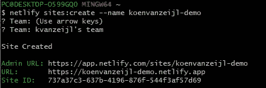
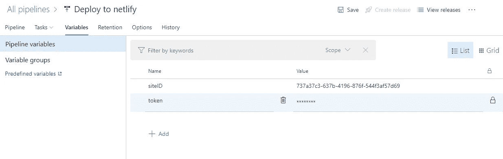

# 如何使用 Azure DevOps 部署 Netlify 网站

> 原文：<https://levelup.gitconnected.com/how-to-deploy-a-netlify-website-with-azure-devops-38839a787daf>

## 利用 Azure Pipelines 实现 web 开发和部署的自动化

# 介绍

在我之前的一个[故事](/a-website-with-a-custom-domain-for-less-then-1-for-a-year-fb1fff6f7759)中，我解释了如何使用 Netlify 免费托管网站——只需 1 美元就可以创建一个域名。然而，通常你也想用新的特性更新你的站点，或者在博客的情况下，添加新的故事。不幸的是，部署这个网站需要时间。那么，为什么不自动化您的网站部署过程呢？

当你在 GitHub 或 BitBucket 上托管你的源代码时，为你的网站创建一个 Netlify 发布管道是非常简单的。您从 Git 点击 **New site，选择您的存储库，定义构建过程，您就完成了。**

但是如果您为您的项目选择了一个不同的版本控制提供者呢？然后你需要做更多的研究。在这个故事中，我将向您解释如何使用 Azure DevOps 部署 Netlify 网站。

 [## 一个自定义域名的网站，一年的费用不到 1 美元

### 你刚刚编写了有史以来最好的网站，但是你如何发布你的网站和它的自定义域名，同时考虑…

levelup.gitconnected.com](/a-website-with-a-custom-domain-for-less-then-1-for-a-year-fb1fff6f7759) 

# 假设

在继续之前，让我们假设一些事情:

*   我们知道如何使用 Azure DevOps。
*   我们已经在 Azure DevOps 中建立了一个构建管道，它在每次代码签入时运行，并创建一个部署包作为管道的输出。
*   我们已经创建了一个发布管道，它有一个空的阶段，当主分支上发生新的提交时就会触发这个阶段。这个发布管道需要提取在构建管道中作为部署包发布的产品。

# 台阶

本指南分为三个不同的部分:

*   第 1 部分:在发布管道中使用 Netlify
*   第 2 部分:从 Netlify 获取访问令牌和站点 ID
*   第 3 部分:将所有东西放在一起

我们走吧！

# 第 1 部分:在发布管道中使用 Netlify

在新的空工单中，我们需要添加我们的净任务。这可以通过点击“代理作业”旁边的`+`图标，然后在搜索栏中输入“Netlify”来完成。您将从 Marketplace 弹出窗口中看到[该任务，您的组织需要安装该任务。](https://marketplace.visualstudio.com/items?itemName=aliencube.netlify-cli-extensions)

这个扩展只不过是一个封装了 [Netlify CLI](https://docs.netlify.com/cli/get-started/) 的包装器。在引擎盖下，这将运行命令行中的一切。因此，如果您喜欢自己运行脚本，请继续😊。然而，如果你喜欢用户界面，那么这个扩展就是为你准备的。

安装完扩展后，我们需要依次添加两个任务；**安装 Netlify CLI** 和**部署网站**。第一项任务将确保 Netlify CLI 安装在部署计算机上。该任务将在后台运行以下命令`npm install netlify-cli -g`。确保安装了 Netlify CLI 后，我们就可以发布我们的网站了。Netlify **部署网站**任务将请求两个参数来部署您的网站，一个站点 ID 和一个认证令牌。对于这些值，当我们从 Netlify 收到它们时，我们将在“变量”选项卡中使用发布变量。

要部署到 Netlify 的发布管道

在下一部分中，我们将从 Netlify 获得令牌，也称为个人访问令牌(PAT)。现在，您可以将该值留空。站点 ID 也是如此。为`siteID`创建一个 release 变量，现在将其留空，因为我们将在下一部分中获得这个变量。

我们还需要填写另一个字段，即“源目录”字段。这将是包含您已经从构建管道发布的网站的目录。对我来说是`$(System.DefaultWorkingDirectory)/_koenvanzeijl/drop`。您可以选择添加部署消息，以便在 Netlify 仪表板中更好地了解您的版本。

**部署网站**任务将在后台运行以下命令:

`netlify deploy "--auth={YOUR_TOKEN}" "--site={YOUR_SITE_ID}" "--dir={YOUR_DEFAULT_WORKING_DIRECTORY}\_koenvanzeijl\drop" --prod`

# 第 2 部分:从 Netlify 获取访问令牌和站点 ID

在这一节中，我们将重点关注从 Netlify 仪表板获取令牌和站点 ID 的部分。

## 创建网络生活网站

如果你还没有 Netlify 帐户，不要担心。您可以点击此处的创建一个。登录后，您将看到一个包含您的网站的仪表板，但现在可能是空的。如果你点击“从 Git 新建站点”按钮，你可以链接你的 GitHub/GitLab/BitBucket 库。

因为我们想从 DevOps 上传我们的网站，我们需要找到一种不同的方式。为此，我们需要在自己的机器上安装 Netlify CLI。您可以通过运行下面的命令来做到这一点:`npm install netlify-cli -g`。安装完 CLI 后，我们需要通过运行下一个命令`netlify login`来验证自己。这将打开一个浏览器窗口，要求您使用 Netlify 登录并授予对 **Netlify CLI** 的访问权限。

## 站点 ID

我们现在准备在 Netlify 中创建我们的网站，并获得我们的站点 ID。要创建一个站点，运行以下命令:`netlify sites:create --name <YOUR SITE NAME>`。在我的例子中，我创建了站点 koenvanzeijl-demo。运行该命令后，它会询问您要将站点添加到哪个团队。由于您可能只有一个团队，因此您可以选择第一个团队。输入回车，你的站点就创建好了！把这个`Site ID`留着以后用。如果出于某种原因，你错过了这个 ID，不要担心，你可以随时从他们的仪表板上得到它。在仪表板中，它被称为 **API ID。**

## 代币

现在，我们需要做的就是得到我们的令牌。我们可以在 Netlify 仪表板上轻松实现这一点。首先，点击你的头像，进入**用户设置**，然后点击**应用**，向下滚动到**个人访问令牌**。您可以在这里创建新的令牌。我建议给它起一个描述性的名字，这样你就可以知道它的用途，我把我的命名为“DevOps release token”。把这个令牌留给下一部分。

# 第 3 部分:将所有东西放在一起

在我们的最后一步，我们将结合一切来创建一个顺利工作的部署机器！我们将在发布管道的空变量中插入令牌和 siteID——您刚刚从 Netlify 获得的。

## 注意！

将这个变量隐藏起来很重要，所以我建议通过单击锁图标来隐藏这个变量。

调整 DevOps 版本变量

## 部署时间到了

现在是时候尝试您新创建的管道并部署您令人惊叹的网站了！创建一个发布，看看会发生什么。这是我的网站部署后的样子:

www.koenvanzeijl.nl

仅此而已！我们刚刚创建了一个 Azure DevOps 发布管道来将我们自己的网站部署到 Netlify。

# 结论

Netlify 提供了一些非常简洁的开箱即用的选项来自动发布你的网站。不幸的是，Azure DevOps 没有。这意味着我们需要创造自己的自动化机器。结果证明这是可以实现的。我们在 Netlify 中创建了一个网站，并使用个人访问令牌来推送我们的网站内容。

如果你在这个过程中遇到任何问题，请在评论区留下你的评论，我会尽力帮助你。

编码快乐！

[https://ko-fi.com/koenvanzeijl](https://ko-fi.com/koenvanzeijl)

 [## 一个自定义域名的网站，一年的费用不到 1 美元

### 你刚刚编写了有史以来最好的网站，但是你如何发布你的网站和它的自定义域名，同时考虑…

levelup.gitconnected.com](/a-website-with-a-custom-domain-for-less-then-1-for-a-year-fb1fff6f7759)