# 如何使用无服务器框架将 Node.js 应用程序部署到 AWS Lambda

> 原文：<https://levelup.gitconnected.com/how-to-deploy-a-node-js-application-to-aws-lambda-using-serverless-framework-cadd32e8409>

做一个开发者是很牛逼的。写代码，解决问题，为复杂的算法想出巧妙的解决方案是我们活着的目的。但是，篱笆这边的草并不总是那么绿。迟早，你需要弄脏你的手，部署你辛辛苦苦开发的应用程序。部署并不总是容易的。坦率地说，它们可能具有挑战性且耗时。这就是我们将在本教程中解决的问题。

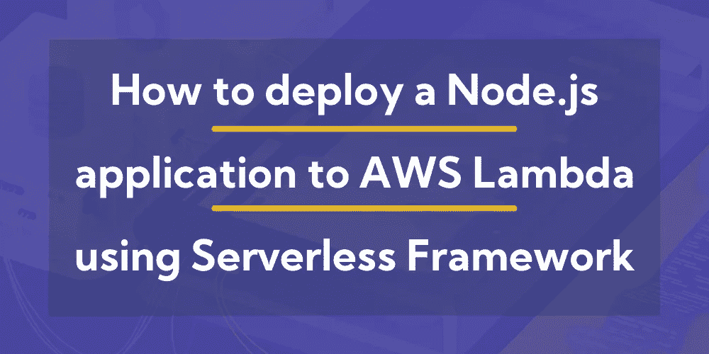

*对于可复制的代码片段，* [*参见原文*](https://dashbird.io/blog/how-to-deploy-nodejs-application-aws-lambda/) *。*

# 目标

今天，您将学习如何在无服务器框架的帮助下将 Node.js 应用程序部署到 AWS Lambda。

该演练还将涵盖部署应用程序生产版本的真实场景，包括环境变量、[适当的监控](https://dashbird.io/serverless-observability/)，当然还有[简单的调试](https://dashbird.io/aws-lambda-troubleshooting/)。哦，我多么喜欢看到漂亮的堆栈跟踪！

# 先决条件

本教程将需要你已经设置了一些简单的东西。不要担心，它不会很长，将涵盖只是基本的。

*   [AWS 账户](https://aws.amazon.com/console/) — AWS 有 12 个月的免费等级和大量的终身免费等级，所以不用担心会倾家荡产。
*   [Node.js 和 npm 已安装](https://nodejs.org/en/download/)——这里有一个快速参考，确保您已经安装了它们。
*   [安装了无服务器框架](https://hackernoon.com/a-crash-course-on-serverless-with-node-js-632b37d58b44#422a) —查看这是一个很好的参考，并遵循步骤 1–3。
*   [Dashbird 帐户](https://dashbird.io/features) —这将为我们提供所需的概述，以了解我们的应用程序发生了什么。

准备好了吗？我们走吧！

*对于可复制的代码片段，* [*参见原文*](https://dashbird.io/blog/how-to-deploy-nodejs-application-aws-lambda/) *。*

# 什么是 AWS Lambda？

AWS Lambda 是一项现收现付的无服务器计算服务，这意味着什么呢？好吧，你只需要把你的源代码部署到 AWS，他们会处理剩下的。太神奇了！不需要摆弄服务器、ssh 连接、Linux 或 Vim。但是，想知道更好的是什么吗？它可以自动扩展，并且没有停机时间。我会让它深入人心的…

AWS Lambda 的技术定义是“功能即服务”。你部署一些代码；它被调用，处理一些输入，然后返回值。简单！

等一下。我们需要提到一个至关重要的事实。所有 lambda 函数都是无状态的，这意味着它们不能存储持久数据。如果我刚才说了功能即服务，我们如何将整个 Node.js 应用程序部署到 AWS Lambda？

# 它是如何工作的？

仔细想想，其实也没那么复杂。单个 lambda 函数本质上只是一个微小的 Node.js 运行时环境。你可以在里面随心所欲地跑。这就是我们要做的，打包一个 Node.js 应用程序，并将其发送给 AWS Lambda。鬼鬼祟祟。

# 我们将部署什么？

我们将部署的代码只有 7 行，以使这个例子尽可能简单。但是，它可以和您在生产中使用的任何 Node.js 应用程序一样大，而且它会非常好用。耐人寻味…

# 我们如何部署它？

无服务器框架就像一匹骑着白骑士的马！托起；我可能会落后。

无论如何，这个优秀的框架使我们既可以像以前一样在本地开发应用程序，又可以用简单的命令部署它们。嗯…多告诉我一些。

# 让我们开始编码吧！

最重要的是。打开你的终端；我们需要安装一些软件包。耶，安装东西，爱死了！

# 1.安装和配置无服务器框架

*$ npm install -g 无服务器*

如果您在 Linux 上运行这个命令，那么在命令前面加上前缀`sudo`。

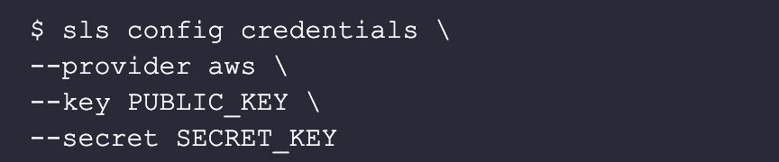

*对于可复制的代码片段，* [*参见原文*](https://dashbird.io/blog/how-to-deploy-nodejs-application-aws-lambda/) *。*

确保添加 IAM 用户的公钥和私钥，而不是我在上面指定的占位符。用户需要编程访问和管理权限。[这是 AWS 文档中的官方指南](https://docs.aws.amazon.com/IAM/latest/UserGuide/id_users_create.html#id_users_create_console)。

# 2.创建样板代码

让我们创建一个新文件夹，并给它一个唯一的名称。跳到您的终端，运行下面的命令。

*$ mkdir server less-nodejs-app****&&****CD server less-nodejs-app*

很好，现在剩下的就是运行 create 命令来为我们生成一些启动代码。这被称为无服务器服务。

*$ SLS create-t AWS-nodejs-n server less-nodejs-app*

在打开代码编辑器之前只需要一个步骤。

# 3.安装依赖项

就像你在上面的代码片段中看到的，我们需要先安装几个模块。幸运的是，只有两个，而且就像运行一个命令一样简单。

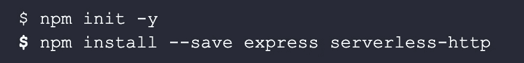

*对于可复制的代码片段，* [*参见原文*](https://dashbird.io/blog/how-to-deploy-nodejs-application-aws-lambda/) *。*

就是这样！让我们在代码编辑器中打开它，进行一些实际的编码。

# 4.真实编码

一旦打开代码编辑器，您会看到三个文件。忽略`.gitignore file`，让我先解释一下`handler.js`是什么，然后我将继续讨论`serverless.yml`。处理程序将保存你所有的应用程序逻辑，所有的代码。相比之下，`servereless.yml`是您将在 AWS 上创建的资源的配置文件。

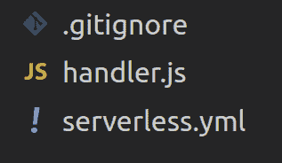

继续并将`handler.js`重命名为`app.js`，只是为了简化我们，让我们知道什么去哪里。

删除所有的起始代码，并将这段代码粘贴到`app.js`文件中。

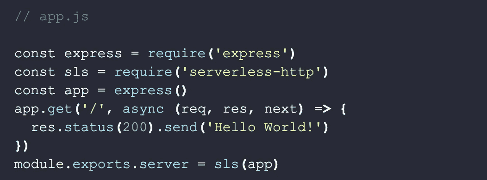

*对于可复制的代码片段，* [*参见原文*](https://dashbird.io/blog/how-to-deploy-nodejs-application-aws-lambda/) *。*

七行代码？看起来很眼熟吧？就像你习惯的那样。就是这样。信不信由你，没别的了。让我们继续进行`serverless.yml`。

再一次，删除所有的样板代码并粘贴进来。

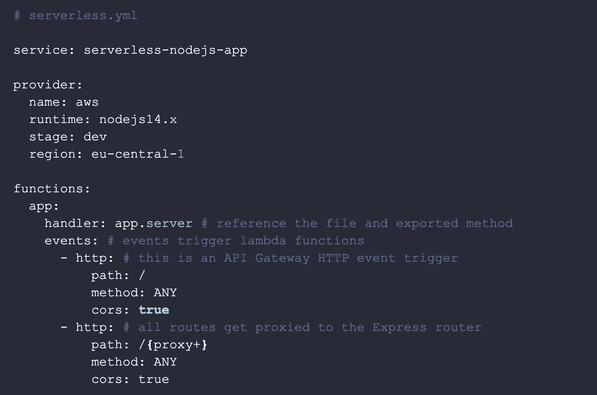

*对于可复制的代码片段，* [*参见原文*](https://dashbird.io/blog/how-to-deploy-nodejs-application-aws-lambda/) *。*

搞定了。剩下的就是部署它了。

# 准备部署！

切换回终端窗口。通过运行一个命令，您的应用程序将被部署。

*$ sls 部署*

无服务器框架现在将把所有东西打包成一个漂亮的包，从 *serverless.yml* 创建一个 CloudFormation 文件，并把它发送到 AWS S3。一旦创建了资源，部署了代码，您将在终端中看到发送给您的端点。

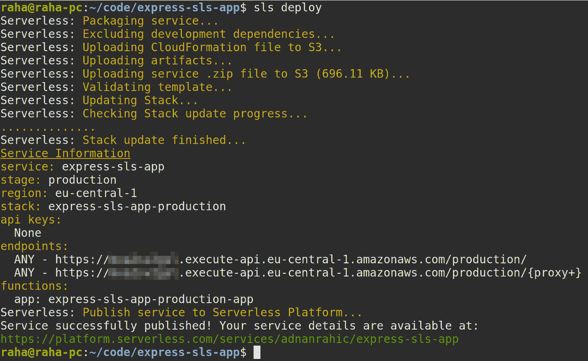

在浏览器中打开提供的网址，你会看到*“你好，世界！”*给你送回去。

# 部署到生产环境！

这很好，但是还没有准备好投入生产环境。不要担心！您会惊讶地发现，让它投入生产是多么简单。

# 1.为环境变量添加一个`secrets.json`文件

现在，让我们只在`secrets.json`中添加`NODE_ENV`。

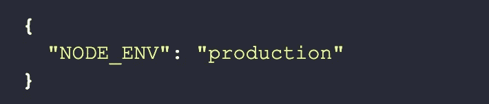

# 2.在`serverless.yml`中增加`secrets.json`的引用

就像添加秘密文件一样简单，在`serverless.yml`中引用该文件甚至更容易。

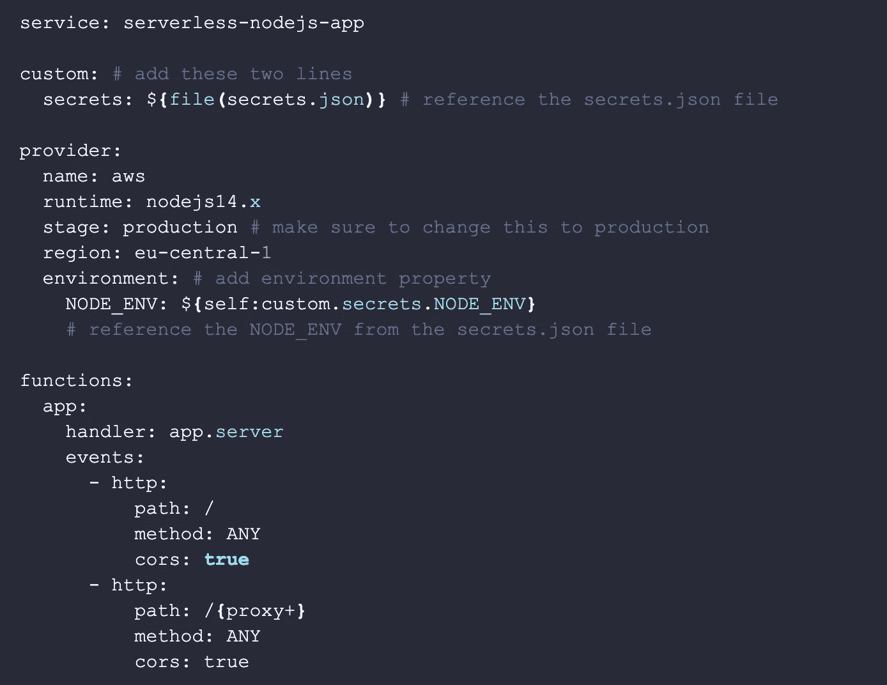

*对于可复制的代码片段，* [*参见原文*](https://dashbird.io/blog/how-to-deploy-nodejs-application-aws-lambda/) *。*

厉害了，就是这样！从服务中删除`node_modules`和`.serverless`文件夹，并再次运行 npm install，但这次使用`--production`标志。

*$ npm 安装—生产*

太好了！剩下的工作就是重新部署服务，一切就绪。

*$ sls 部署*

这就是我们的结局。

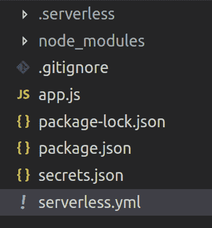

我想我们结束了？不完全是。

仅仅因为你用`--production`安装了 npm 模块，就让一个应用程序在生产环境中运行，这并不能解决问题。为了晚上能睡个好觉，我需要多一点。这就是适当的系统洞察力和监控工具发挥作用的地方。

让我展示给你看。

# 如何洞察你的系统？

所有无服务器应用程序的首要问题是它们的分布式本质。简单明了地说，要对所有正在发生的事情有一个总体的了解是不可能的。更不用说出问题的时候调试有多难了。

为了平息我的恐惧，我使用 [Dashbird](https://dashbird.io/) 。这是一个简单的监控工具，不需要我修改任何代码，也没有任何开销。因此，也没有性能命中。不错！

谢天谢地，他们有合理的文档，这使得入职过程变得轻而易举。继续并遵循他们的[快速入门指南](https://dashbird.io/docs/quickstart/setting-up-dashbird/)。不过，别忘了回来。

一旦完成，所有的请求将开始一个接一个地堆积，您应该会看到类似这样的内容。

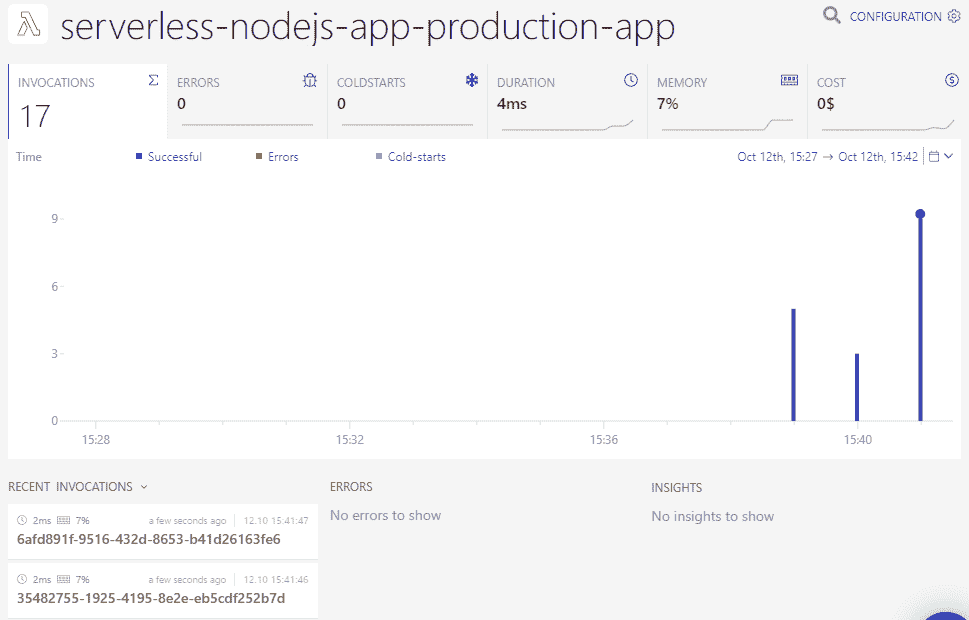

函数详细信息将为您提供函数如何随时间变化的概述，因此这里汇总了多个调用。

如果单击左下方最近的一次调用，将会深入到跟踪和记录数据的调用级别的详细信息。

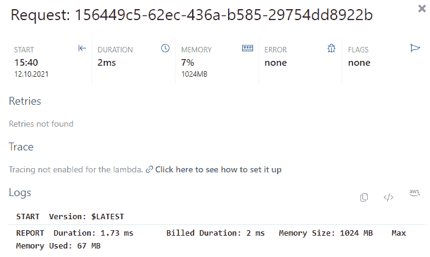

# 包扎

这很有趣！

Lambda 太牛逼了！当与 HTTP 事件触发器(如 [API Gateway](https://dashbird.io/knowledge-base/api-gateway/what-is-aws-api-gateway/) )、开发工具(如无服务器框架)和观察工具(如 [Dashbird](https://dashbird.io/) )相结合时，事情就变得如此简单。

我们上面编写的这个简单的 API 示例只是一个概念证明。但是你能明白这一点。它为您提供了一个起点，您可以在此基础上创建出色的生产应用程序！

如果你错过了上面的任何步骤，[这里有所有代码的库](https://github.com/adnanrahic/express-sls-app)。

*延伸阅读:*

[如何使用 AWS Lambda 检查 NFT 供应](https://dashbird.io/blog/nft-aws-lambda-serverless-blockchain/)

[如何测试无服务器应用](https://dashbird.io/blog/how-to-test-serverless-applications/)

[六大 AWS Lambda 监控工具](https://dashbird.io/blog/top-aws-lambda-performance-monitoring-tools/)

[如何解决无服务器冷启动](https://dashbird.io/blog/can-we-solve-serverless-cold-starts/)

[AWS Lambda Node.js 错误和异常](https://dashbird.io/event-library/aws-lambda/aws-lambda-node-js-errors-and-exceptions/)