# 如何使用 AWS 代码构建将节点 Typescript 应用程序部署到 AWS Elastic Beanstalk

> 原文：<https://levelup.gitconnected.com/how-to-deploy-a-node-typescript-app-to-aws-elastic-beanstalk-using-aws-code-build-f67c36e48f06>

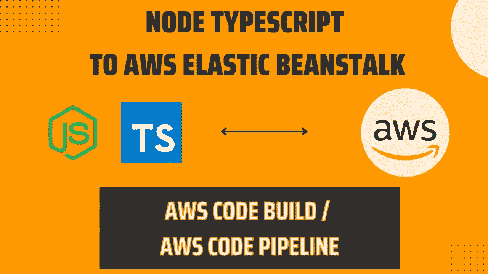

在 Javascript 开发人员一生中的某个时刻，您可能会开始质疑自己所有的人生决策，因为您没有用 Typescript 开始那个项目

给你一个建议，如果你在做一个大项目，使用打字稿

无论如何，我必须将项目迁移到 Typescript🤒。我认为这次迁移非常值得，它有助于发现一些错误；有些我甚至不知道存在😅

现在是本文的核心，在迁移之后，即使我在 package.json 文件中指定了一个构建命令，AWS 上的部署还是失败了。

经过大量的头脑风暴，有问题的 StackOverflow 答案和花时间在可怕的 AWS 文档上；我后来找到了解决方案，那就是在我的 AWS 代码管道中添加一个构建阶段

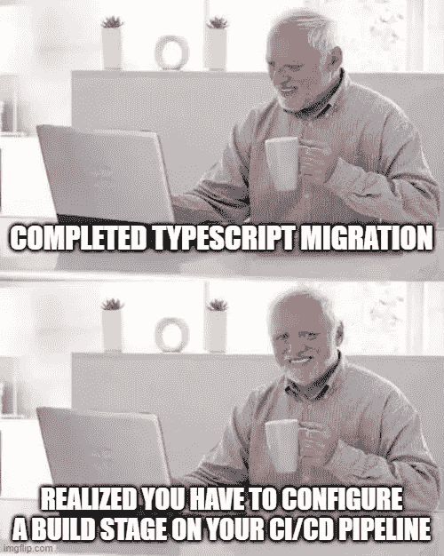

我将介绍如何在构建阶段使用 AWS CodeBuild 设置 AWS 代码管道

先决条件

*   AWS 帐户

**阶段 1:设置您的构建配置**

首先，让我们看看 YAML 的档案

脚本的第一部分相当简单；它安装所需的依赖项，然后运行您的构建命令

*工件:文件:*指定您想要发送到 AWS Elastic Beanstalk 的文件或文件夹

*discard-paths:* 选项如果设置为 *yes* 将会把所有的人工文件放在一个文件夹中，忽略它们当前的目录结构，你肯定不希望这样

你可以在这里阅读更多关于其他构建配置的信息

**第二阶段:在 AWS Elastic Beanstalk 上创建您的应用**

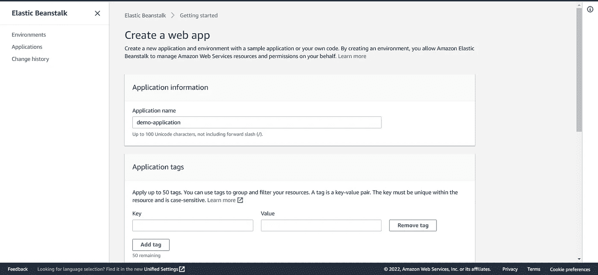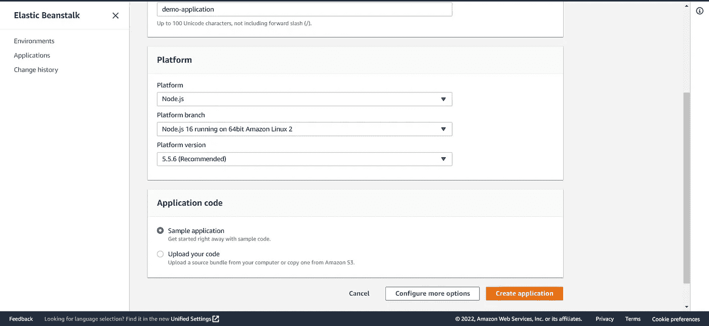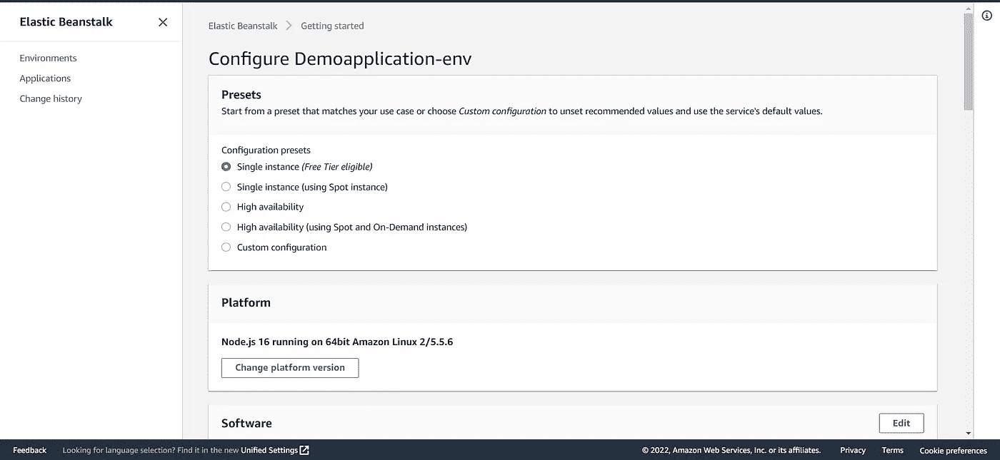

根据提示创建应用程序

**阶段 3:设置 AWS 代码管道——在构建阶段使用 AWS 代码构建**

我们用默认设置创建一个新的代码管道，并将其链接到我们的 GitHub 存储库

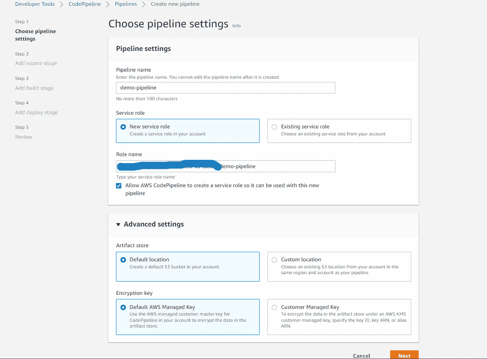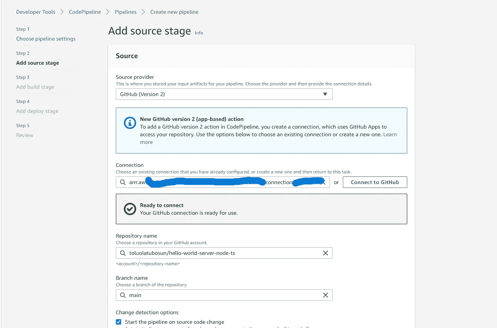

现在让我们配置构建阶段；为此，您必须创建一个新的代码构建项目

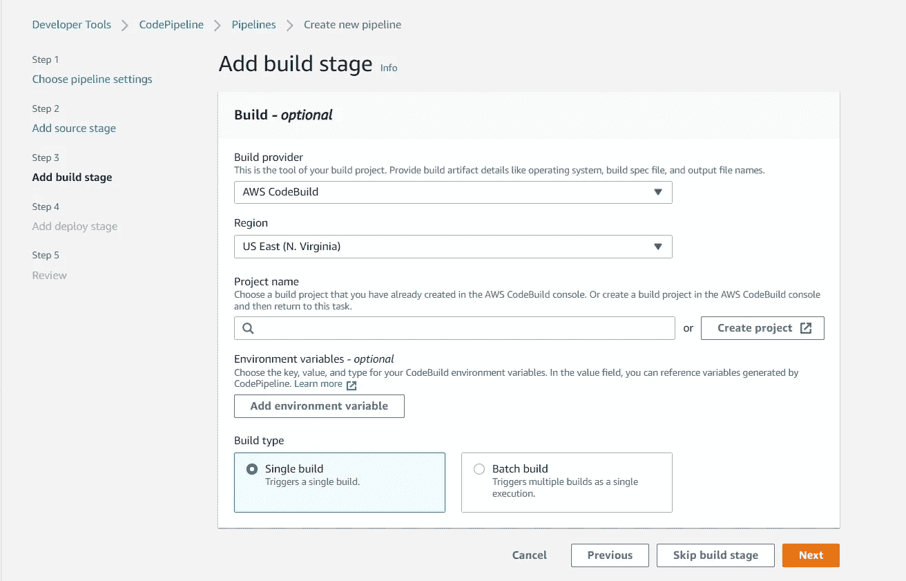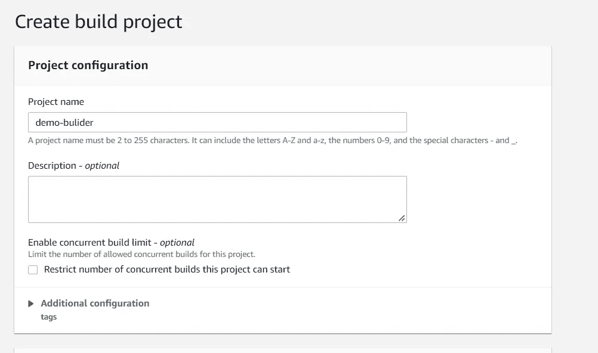

确保您为项目使用了正确的运行时。检查[这里的](https://docs.aws.amazon.com/codebuild/latest/userguide/available-runtimes.html)

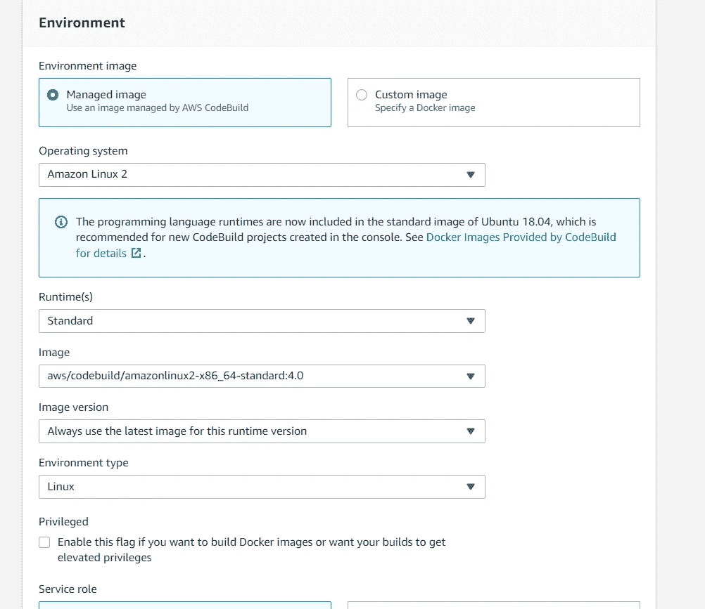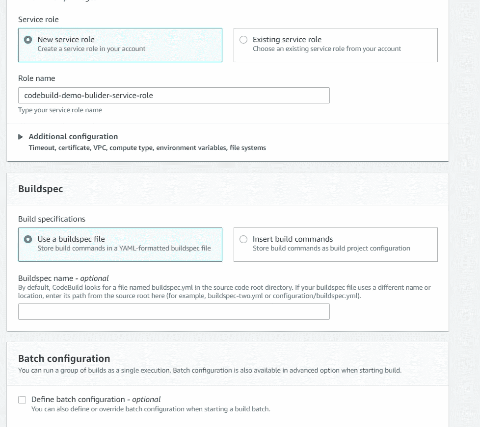

您可以选择启用日志，如果是第一次使用，您可能应该这样做(您可以在以后关闭它)

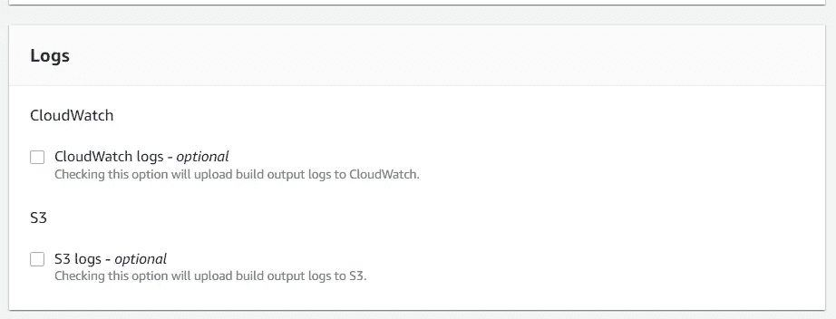

现在我们将管道指向我们的弹性 Beanstalk 应用程序

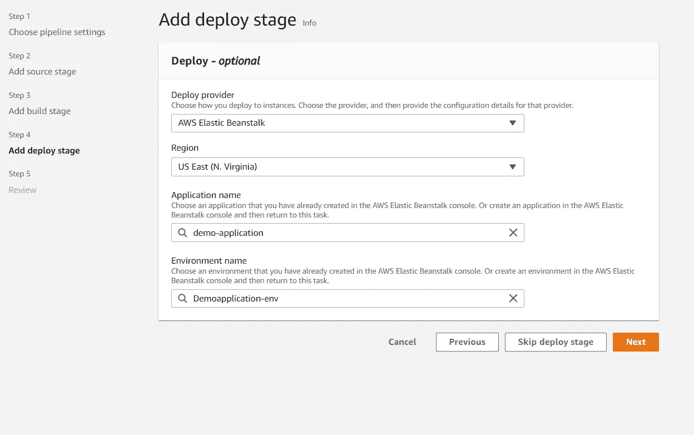

这就是🕺🕺

一旦构建完成，我们将看到我们编译的 typescript 应用程序🚀

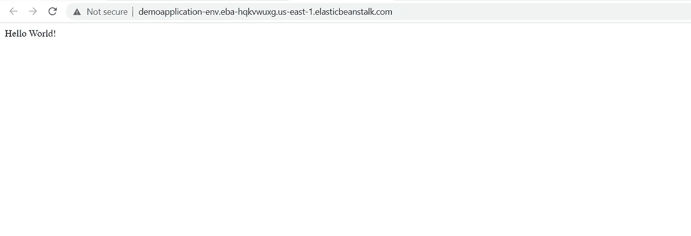

这是我的 GitHub 的链接，带有演示代码。[此处](https://github.com/toluolatubosun/hello-world-server-node-ts)

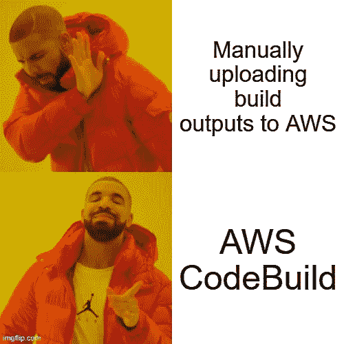

感谢您阅读完这篇文章🙌

在 [Twitter](https://twitter.com/king_tolu_7) 上关注我并访问我的[网站](https://toluolatubosun.com/)😁…下次再见，✌️