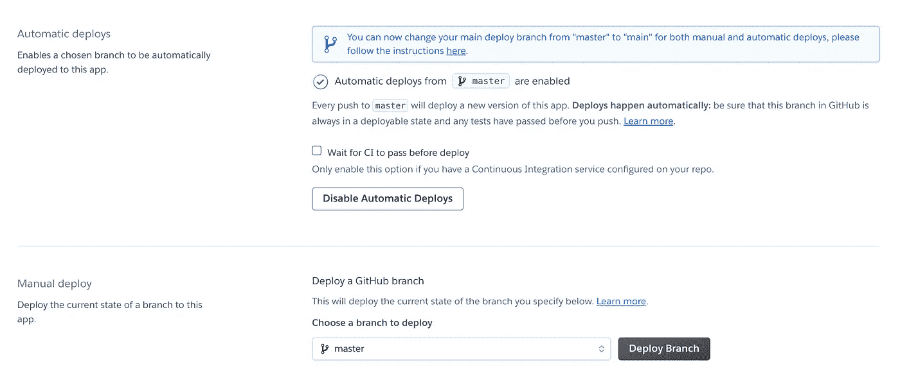

# 如何在 Heroku 上部署 Python + Flask API

> 原文：<https://levelup.gitconnected.com/how-to-deploy-a-python-flask-api-on-heroku-2e5ddfd943ef>

#解释喜欢我 m5


照片由[泰勒 B](https://unsplash.com/@carstyler?utm_source=medium&utm_medium=referral) 在 [Unsplash](https://unsplash.com?utm_source=medium&utm_medium=referral) 拍摄

哦，你去过那里，是吗？您的 Python + Flask 脚本在您的本地环境中创造了奇迹，但是部署就是不行。到处都是混乱的指令。您的脚本既不复杂也不重要，不值得 AWS 头痛。您只是想要一个简单、快速、方便的解决方案来让它上线运行。有人告诉你 Heroku 是一个伟大的想法，但你无法找到好的和简洁的指示，就如何做到这一点，而不失去一夜的睡眠。

不再恐慌。我是来救援的！


上船吧

我们将从头开始用 Python + Flask 创建一个简单的脚本，将其推送到 GitHub 存储库，然后部署到 Heroku 上。我们将使用`python3`和`pip3`来安装依赖项，但是同一个系统应该可以与其他 Python 和 pip 版本一起工作。

所以，让我们开始吧！

# 1.在 GitHub 上创建回购

首先，我们需要我们的工作代码在 GitHub 上可用，因为这是我们将它链接到 Heroku 的方式。在我们的例子中，让我们称我们的库为`medium-greeting-api`。


我们全新的仓库

# 2.创建 venv

虚拟环境帮助我们创建一个特定于我们正在进行的项目的本地环境。Athreya Anand 写了一篇很好的更长的解释，说明为什么我们应该在每个 Python 项目中使用它们。

在项目文件夹中，在终端上写下:

```
python3 -m venv venv/
```

您的文件夹现在应该看起来像这样:


# 3.启动静脉

在终端上键入以激活虚拟环境:

```
source venv/bin/activate
```

您现在应该看到您的终端看起来像这样:


看左边的(venv)——这意味着它现在被激活了！

# 4.安装烧瓶和 gunicorn

*Flask* 是一个针对 Python 的微型 web 开发框架，易学易用。它被称为微框架，因为它是轻量级的，只提供 web 开发所必需的组件，比如路由、请求处理、会话等等。

*Gunicorn* 是一个 Python HTTP Web 服务器网关接口(WSGI ),它与我们的 Python web 应用程序代码接口，以提供动态内容。换句话说，它是确保 web 服务器和 Python web 应用程序能够相互通信的桥梁。

让我们使用`pip3`来安装它们:

```
pip3 install flask gunicorn
```

# 5.创建。gitignore 文件

我们需要忽略`.gitignore`上的`/venv`文件夹，这样它就不会被推送到我们的 GitHub 库。您的`.gitignore`文件应该是这样的:

# **6。创建 api.py 文件**

让我们最终创建我们的小应用程序！在本例中，我们将创建一个简单的 API，该 API 返回一条带有用户提供的名称的消息。

要测试它，您只需在终端上键入:

```
python3 greeting.py
```

在您的浏览器上，您应该在索引页面上看到以下内容:


索引页

如果我们发送参数`?name=Deborah`，这是预期的结果:


有用！

# 7.创建 requirements.txt

`requirements.txt`文件用于指定运行我们的项目需要哪些 Python 包。通常情况下，`requirements.txt`文件位于项目的根目录下。

要创建它，我们只需在终端上键入:

```
pip3 freeze > requirements.txt
```

确保你仍然在你的`(venv)`环境中。结果文件应该如下所示:

# 8.创建 Procfile

Heroku 应用程序应该包含一个`Procfile`，这个**指定了应用程序在启动**时执行的命令。你可以使用一个`Procfile`来声明各种各样的进程类型，比如你的应用的 web 服务器、工作进程、时钟进程，以及在部署新版本之前运行的任务。Heroku 的`Procfiles`的完整文档可以在[这里](https://devcenter.heroku.com/articles/procfile)找到。

在我们的例子中，我们的`Procfile`应该是这样的:

# 9.将项目推送到 GitHub

现在您已经拥有了在 Heroku 上部署所需的所有文件，您可以将它们推送到 GitHub。在这个阶段，您的存储库应该是这样的，包含这 4 个文件:


# 10.将 GitHub 的知识库链接到一个新的 Heroku 应用程序

该部署了！在 Heroku 上，我们只需要将您的帐户连接到您的 GitHub 帐户，并将存储库链接到新的 Heroku 应用程序。


搜索项目的存储库

一旦完成，我们就可以开始部署。在 Heroku 的部署设置中，您可以启用自动部署，然后点击手动部署上的`Deploy Branch`进行首次部署。



在我们的例子中，我们的应用程序现在托管在[https://medium-greeting-api.herokuapp.com](https://medium-greeting-api.herokuapp.com/getmsg/?name=Debbie)上。如果你导航到它，并尝试发送你的名字作为请求，例如，【https://medium-greeting-api.herokuapp.com/getmsg/? name=Deborah ，我们应该得到添加了 Deborah 名字的消息作为响应。


工作！

瞧啊！我们现在已经在 Heroku 上部署了一个运行正常的 Python + Flask API，只需不到 15 分钟。


好哇

你有什么问题或者在这个过程中遇到什么困难吗？请在下面留下评论，我会帮你解决的。我希望这个教程已经足够清楚了，所以现在你可以部署一堆 Heroku APIs 了！

如果你有兴趣看到更多这样的教程，你可以在这里查看我的#ExplainLikeI'm5 系列[的其余部分](https://medium.com/@ithos)。编码快乐！

黛比 x