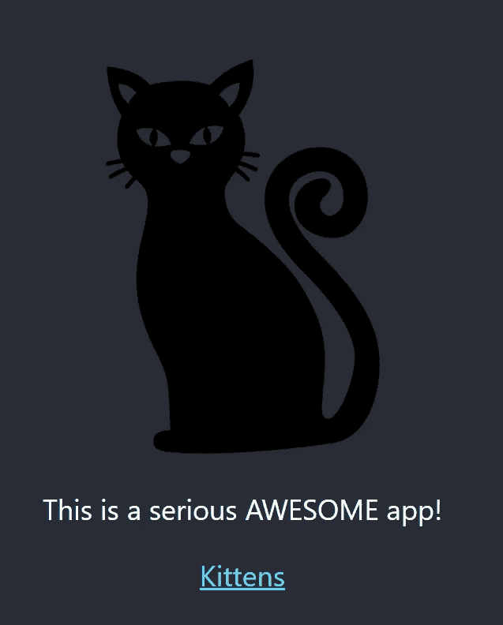
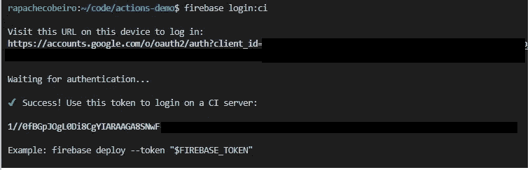
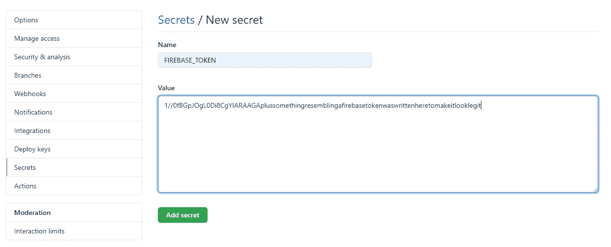
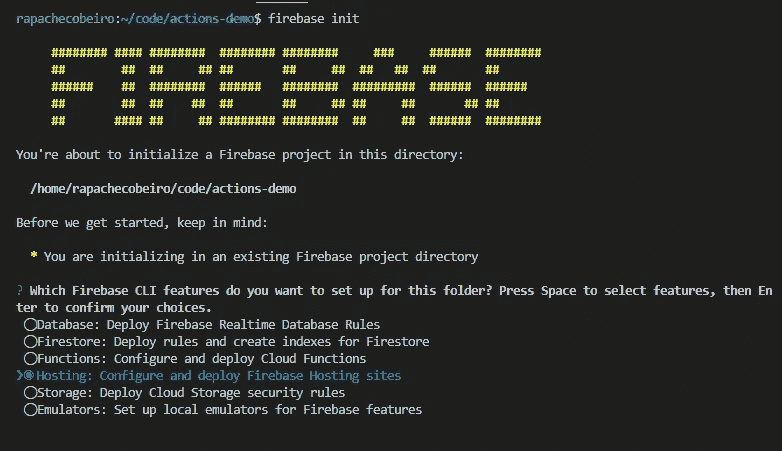
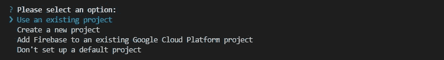
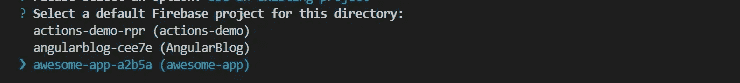
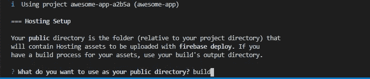
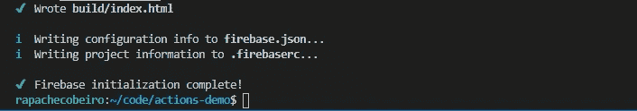
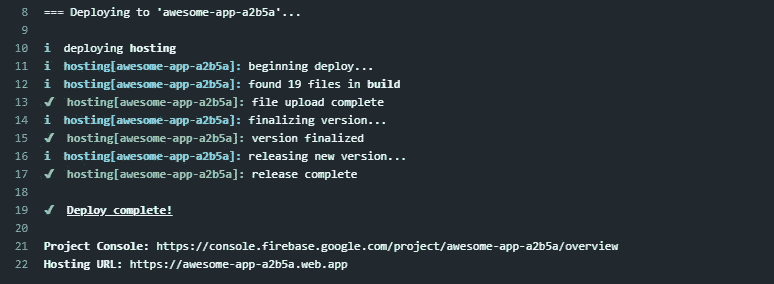
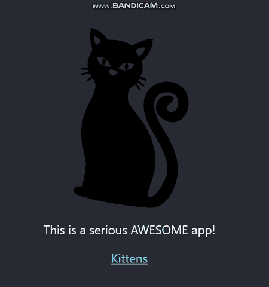

# 如何使用 GitHub 操作将 React 应用程序部署到 Firebase(一步一步)

> 原文：<https://levelup.gitconnected.com/how-to-deploy-a-react-app-to-firebase-using-github-actions-step-by-step-11367e0627d5>


GitHub Octocat

GitHub Actions 提供了一种方法来自动化你想对你的存储库做的任何事情。它可以用来在每次你发出一个 pull 请求时自动测试你的项目，或者在每次发布时发布一些代码到 GitHub 包中。可能性是无限的。

因此，在本文中，我将向您介绍 GitHub Actions 最明显的功能:以自动化的方式将您的应用程序部署到生产环境中，这样您就再也不用手动执行了。

# 我们到底要做什么？

请记住，本教程的目标是部署，而不是正在部署的应用程序，我们将只使用设置 React 应用程序时已经提供的模板来设置 React 应用程序，并做一些修改以使其更加个性化。

然后，我们将在 Firebase 上建立一个项目，并提取一些凭证，这样我们就可以使用托管功能来最终——猜猜会发生什么？—托管我们的应用程序并使其在互联网上可用。

最后，我们将编写我们的工作流文件，提交给 GitHub，坐下来，看自动化的神奇就发生在你的眼前。

# 设置 React 应用程序

这一部分对大多数读者来说可能是不必要的，但我会把它留在这里给那些以前可能从未接触过 React 并想一睹其风采的人。如果这对你来说就像吃一颗糖，请跳到下一节。

然后系好安全带，打响指，经历以下步骤:

1.  确保你已经在本地安装了 NPM(说明[此处](https://www.npmjs.com/get-npm)
2.  确保您已经在本地安装了 NPX:

```
npm install -g npx
```

3.打开一个你选择的终端，选择一个你想让你的项目存在的文件夹，为你的项目决定一个名字(在本教程中我将使用 **awesome-app** ，并使用 NPX 来构建你的应用程序的模板:

```
npx create-react-app awesome-app
```

4.一切就绪后，去喝杯咖啡，然后回到办公桌，进入最近创建的 awesome-app 文件夹，使用以下命令启动应用程序:

```
cd awesome-app
npm start
```

等着瞧吧……太棒了！你现在是一个网站的骄傲拥有者！就在你的浏览器中运行，带有动画 React 标志等等。这对于我们的演示来说已经足够了，但是如果您愿意的话，可以继续编辑 src/App.js，使其更加个性化。作为一个爱猫的人，我的是这样的:



用旋转猫反应 App

现在，既然我们已经有了 React 应用程序，让我们深入研究 Firebase。

# 建立 Firebase 项目

在本节中，让我们稍微关注一下 Firebase，如何在云上设置一个项目，下载 CLI 工具，提取访问令牌，并在 React 应用程序上完成一些配置，以便为托管做好准备。

## 在云中创建项目

导航到[https://firebase.google.com/](https://firebase.google.com/)并登录(我假设你已经注册了一个账户。我说的对吗？).然后点击右上角的“转到控制台”。

单击“添加项目”在 Firebase 上创建一个新项目，并按照说明进行操作，直到您的项目准备就绪，并且您可以看到以下屏幕:


Firebase 项目主页

厉害！很简单，你的 Firebase 项目在云上有了一席之地！现在，让我们确保我们已经准备好了凭据。

## 提取 Firebase CI 令牌

为了自动将应用程序推送到 Firebase，我们需要提取一个 Firebase 令牌，用于在运行我们的工作流时验证我们的帐户。

为此，我们需要安装 firebase-tools，就像从您的终端运行这个简单的命令一样简单:

```
npm install -g firebase-tools
```

然后，运行以下命令提取您的令牌:

```
firebase login:ci
```

这将在您的浏览器中打开一个新选项卡，要求您向 Firebase 进行身份验证(如果没有，请按照显示的 URL 进行身份验证)。完成后，令牌将打印到您的终端:



## 将令牌存储在 GitHub 秘密中

作为开发人员的最佳实践，以加密的方式存储秘密凭证总是一个好主意，确保只有您(或您的团队)可以访问或修改它。GitHub 为您提供了一种存储加密秘密的好方法，可以轻松地在工作流中使用。

在存储库的主页中，单击“设置”选项卡，单击“机密”，然后单击“新建机密”。在接下来的文本框中，在 name 字段中为您的秘密取一个有意义的名字(我将使用显而易见的 FIREBASE_TOKEN)，并将 Firebase token 粘贴到 value 字段中。请注意，该变量将被加密，您将再也看不到它，只能删除它或插入一个新值。



GitHub 秘密

## 为 Firebase 配置您的应用程序

回到 React 应用程序的根目录，我们现在需要用几个文件对其进行配置，Firebase 将使用这些文件来了解如何正确地部署和托管应用程序。

我们可以通过运行这个简单的命令轻松做到这一点:

```
firebase init
```

这将在您的终端中启动一个进程，询问您几个关于您希望如何配置您的应用程序的问题。在第一个屏幕中，仅选择主机选项(您可以稍后更改所有配置):



然后“使用现有项目”:



并选择您使用 Firebase UI 创建的项目:



因为我们将部署一个 React 应用程序，所以为您的公共目录键入“build”。这是我们的 React 脚本稍后在构建应用程序时将创建的文件夹的名称:



最后，您可以将您的应用程序配置为单页面应用程序(同样，您可以稍后更改此配置)，配置将会完成，为您编写了两个新文件:

*   。firebaserc:项目的基本配置。现在它只有项目名称；
*   firebase.json:附加配置。告诉 Firebase 关于公共文件夹、要忽略哪些文件/文件夹，以及重写配置以使应用程序成为单页应用程序。



现在，每一项配置都已准备就绪，您可以开始使用 GitHub 工作流了。

# 编写工作流文件

女士们，先生们，那就是我们编写第一行 YAML 代码来描述我们的工作流程并见证自动化工作的神奇之处的时候了。

按照以下两种方法之一创建工作流文件:

*   单击 GitHub 存储库上的 Actions 选项卡，然后从 marketplace 中选择一个操作；或者
*   创建一个. yml 或。文件夹中的 yaml 文件称为。github/workflows，从项目的根目录中。您可以给它起任何名字，但在这里我们将谦虚地称它为 deploy.yml:

```
.github/workflows/deploy.yml
```

现在是编码的时候了(或者复制粘贴，这里不做判断)，工作流应该是这样的:

虽然手头有代码总是好的，但实际了解到底发生了什么总是好的，所以我在这里将给出一个小的分解:

*   第 1 行:您的工作流的名称。它可以是字面上的任何字符串，尽管保持它与您正在做的事情相关是个好主意(一如既往)。
*   第 3–6 行:“on”字段建立了工作流运行的条件。在这种情况下，它将在每次出现与存储库的主分支相关的“推送”事件时运行。
*   第 8 行:您可以在“jobs”字段下定义任意数量的作业，它们将被并行或顺序执行。
*   第 9 行:作业的名称。它可以是任何名称。
*   第 10 行:定义作业将在哪种环境中运行。可以是 Windows Server 2019、Ubuntu (16.04、18.04 或 20.04)、macOS Catalina 10.15。
*   第 11 行:“步骤”字段列出了作业中要运行的任意数量的步骤。
*   第 12 行:“actions/checkout@v2”是来自 GitHub marketplace 的一个动作，它基本上将你的存储库克隆到工作流容器中，并使它可供你使用。
*   第 13–15 行:“actions/setup-node@v1”是 marketplace 中的另一个动作，它为您设置了 node 和 NPM，因此您不必担心安装它们。
*   第 16 行:这将为您的应用程序安装所有依赖项，类似于“npm install”所做的，但是以一种针对 CI/CD 工作流的优化方式。
*   第 17 行:这将执行一个 React 脚本，在您的应用程序上构建一个优化版本，并将所有优化的文件放在一个名为“build”的文件夹中，这是我们将发送到 Firebase Hosting 的唯一内容(根据 firebase.json 配置)。
*   第 18–21 行:对于本教程，我们决定使用 Actions Marketplace 上的 action“w9jds/firebase-action @ v 1 . 5 . 0”。此操作将安装 firebase-tools 并执行您喜欢的任何命令，您必须将该命令作为参数传递给“with ”,并带有“args”键。在我们的例子中，我们想要的只是对主机进行一次部署，因此称为“仅部署主机”。
*   第 22–23 行:对于每个步骤，您都可以传递将在给定步骤的环境中设置的变量，这些变量可用于正在执行的命令。在这种情况下，firebase-actions 要求将我们在上面提取的 firebase 令牌设置为环境变量，因此我们通过引用前面用语法$ { { secrets }设置的秘密来满足这一要求。 <secret_name>}}。</secret_name>

好吧，对于不多的代码行来说，这是一个很大的解释，但我想提供一个 GitHub Actions 语法的小纲要，一旦你爱上这个可爱的工具，它将在未来对你非常有用。

关于 GitHub 动作语法的完整参考，请访问[https://docs . GitHub . com/en/Actions/reference/workflow-syntax-for-GitHub-Actions](https://docs.github.com/en/actions/reference/workflow-syntax-for-github-actions)。

# 执行它！

现在我们都准备好见证自动化的神奇魔力了！召集你的朋友，做一次烧烤，确保每个人都有饮料，烟花以安全的方式燃放。

当你觉得是时候了，提交并把你所有的改变推送到 GitHub。就是这样！你已经实现了自动化！

您可以检查工作流运行的日志和详细信息，甚至可以实时检查，方法是单击存储库主页的 Actions 选项卡，然后在结果列表中单击您的工作流，最后单击您的作业名称(在我们的示例中为:“build”)。

您可以展开 Firebase 操作步骤，并检查部署的详细信息:



最后，只需跟随主机 URL 上显示的链接(上例中的第 22 行)，就能见证 React 应用的现场直播:



我们完事了。为你迈出自动化的步伐而骄傲！如果这是一个真实的应用程序，将林挺动作称为[这个](https://github.com/marketplace/actions/lint-action)，并编写一些测试来确保任何提交都不会中断生产，这肯定是一个好主意。

无论如何，你可以用 GitHub Actions 做很多事情，我希望这篇教程鼓励你在所有的开发活动中追求自动化。

我希望你喜欢这篇文章。非常感谢您的阅读！