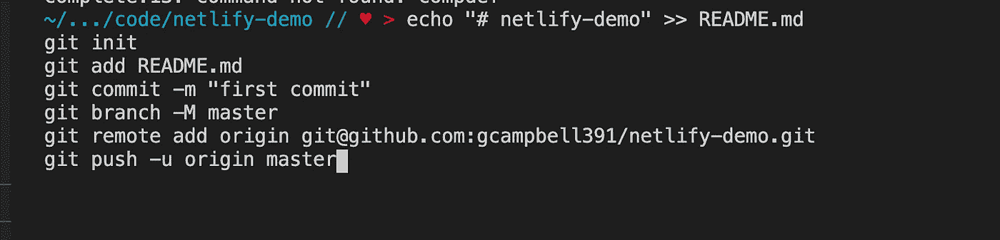
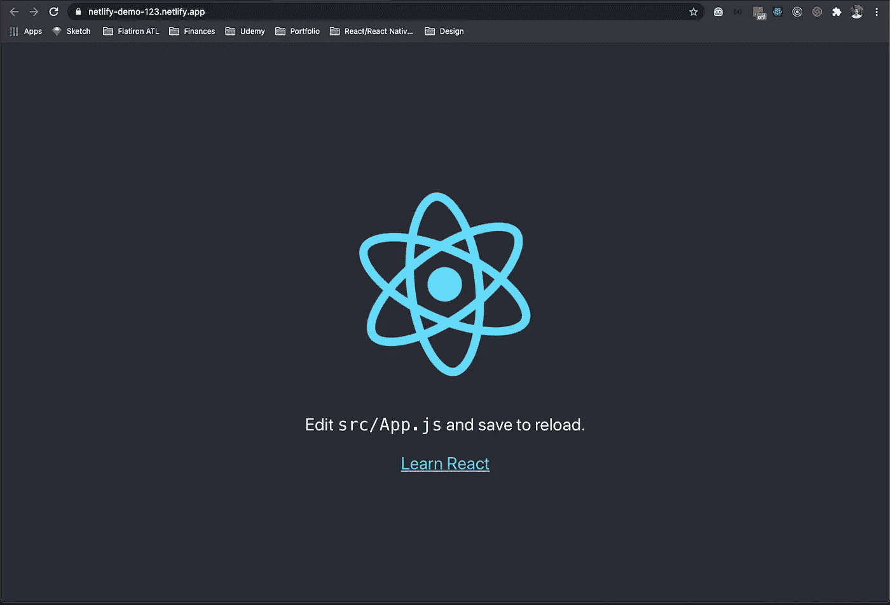

# 如何使用 Netlify 部署 React 应用程序并通过 Github 设置持续部署

> 原文：<https://levelup.gitconnected.com/how-to-deploy-a-react-app-with-netlify-set-up-continuous-deployment-via-github-53859dcdaf40>


到目前为止，我只使用 Heroku 来部署我的 web 应用程序。今天，当我决定扩展业务，尝试不同的部署服务时，情况发生了变化。我喜欢 Heroku，它非常容易使用，但我讨厌我的应用程序在 30 分钟不活动后就进入睡眠状态，除非你按月付费。睡眠中的应用程序需要 30 秒才能“醒来”，从客户的角度来看，这感觉像是永远。

在目睹许多其他开发人员使用这个服务来托管他们的应用程序之后，我决定尝试 Netlify。我看到了一些关于 Netlify 的非常好的评论，据我所知，我的应用程序不会再休眠了！😴 😊这里有一个[链接](https://dev.to/ogurinkaben/13-reasons-why-you-should-be-using-netlify-kgl#:~:text=Asset%20Optimization,with%20just%20a%20few%20clicks.)到我读过的一篇文章，标题是“你应该使用 Netlify 的 13 个理由”。在本文中，我将向您展示如何创建一个 React 应用程序，将其部署到 Netlify，将项目添加到 Github，最后将 Github repo 连接到 Netlify 应用程序。这将允许连续部署。每次我们向 Github 推送更新时，Netlify 应用程序都会更新到最新的项目或回购。我们可以开始了吗？

## 步骤 1:创建 React 应用程序并

我们将从创建一个新的 react 应用程序开始。我将把我的应用程序命名为“netlify-demo”。下面是创建 React 应用程序的命令。这一步应该是熟悉而简单的。

```
npm install -g create-react-app //This step can be skipped if needed
create-react-app netlify-demo
cd netlify-demo
npm run build
```

下面是输入上述命令后您的终端的屏幕截图。


## 步骤 2:安装 Netlify CLI 并部署

是时候安装 Netlify CLI 了，以便从终端将我们的应用程序部署到 Netlify。下面是我们需要执行的下一个命令。

```
npm install netlify-cli -g
netlify deploy
```

进入 netlify deploy 后，会提示您一个问题。选择“创建和配置新网站”。下面是截图。


选择第二个选项，然后选择 enter

为团队选择一个名称。我会选择基因坎贝尔的三队，这是默认提供的选项。


随便输入你喜欢的！

接下来，我们将被提示输入一个网站名称。这个可以以后再更新。我将输入“netlify-demo-123”。


如果站点名称可用并且在参数范围内，将提示您另一个问题。我们必须输入一个发布目录。输入"。/build”，然后按回车键。


这应该完成该过程，您将能够在网站草稿 URL 访问您的 live 应用程序。


将此 url 复制并粘贴到您的浏览器中即可查看该应用程序！下面是我的应用在浏览器中的截图。


你可以在 url 中看到我的书名，前面附有一串随机字符。这只是为了测试。您部署的应用程序 url 将看起来更干净。

现在，我们已经为 Netlify 部署设置了我们的应用程序！接下来，我们将在 Github 上创建一个 repo，并将我们的项目推送到 Github。

## 步骤 3:创建 Github repo 并推进当前项目

我现在将导航到 Github 的网站来访问我的帐户。我将为演示创建一个新的回购。


完成表格以创建新的回购。


接下来，只需按照显示的说明进行操作。复制并粘贴第一个选项。


我现在将使用下面的快捷方式从终端打开 Visual Studio。


一旦 Visual Studio 打开，打开终端并粘贴上面的命令(它们可以一次全部输入)。



如果您在命令完成运行后运行 git status，您会注意到 netlify 文件夹还没有提交。我们将运行下面的命令，然后 Github 就完成了。

```
git add .
git commit -m'add netlify folder'
git push
```

在浏览器中刷新 repo，您应该会看到所有的更新。


如果是这样，我们可以进入最后一部分，将回购与 Netlify 应用程序连接起来。

## 步骤 4:设置 Netlify 应用程序的部署设置

前往 Netlify 的网站，访问您的个人仪表板。您应该会在站点部分看到您的应用程序。单击应用程序。它应该看起来像下面的图像。


我们将单击“站点设置”来访问部署设置。选择构建和部署。你的屏幕应该看起来像下面的截图。


接下来，选择“链接站点到 Git”。选择“Github”。在列表中选择正确的回购协议。如果您愿意，可以使用搜索过滤器。我绝对做到了！


找到正确的回购后，点击它。下面是我如何配置我的构建的截图。


我为这个分支选择主人。如果没有在 build 命令中添加下面的" CI=" to "npm run build ",我很难让我的 react 应用程序运行。这里有一个链接，指向帮助我找到问题和解决方案的文章。如果您的表单看起来像我上面的，请单击“部署站点”。

现在，您应该会回到项目概述屏幕。


您会注意到应用程序名称下的 site deploy 正在进行中。当站点正在构建和部署时，您可以单击黄色文本来查看实际的终端。如果部署成功，带有 web 应用程序链接的绿色文本将替换应用程序名称下的黄色文本。


请注意，该 url 比网站草稿 URL 更干净

单击链接访问 web 应用程序。



就这样，我们把一切都安排好了！现在，每次我们为这个项目提交新的 git 提交时，Netlify 都会提取并部署最新的回购。最后一步，我将展示一个例子。

## 步骤 5:对项目进行一些更改，推进提交，并查看结果

为了快速演示，我将删除 App.js 文件中 header 标记内的所有内容。我将把删除的内容替换为 h1 标签，上面写着“哟，我们做到了！”。下面是我提交并推送到 Github 之前的修改截图。


我现在将添加、提交和推送更新到 Github。命令运行完毕后，导航回 Netlify 网站。单击仪表板中的 Deploys 部分，您应该会看到一个新的构建正在进行。您还可以看到与更新相关联的 my commit 消息。


构建完成后，让我们刷新 live app 链接。


哇哦！我们的实时应用程序现在运行在最新版本上。如果您将来想要对应用程序进行更改，只需添加、提交并推送您的更改到 Github 即可。Netlify 会处理剩下的！

我希望这篇文章对你有帮助，并且容易理解。如果您有任何问题，请随时通过 LinkedIn 联系我。你也可以在这里查看我的作品集网站。祝您愉快！