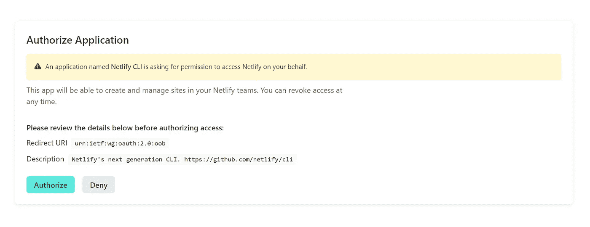
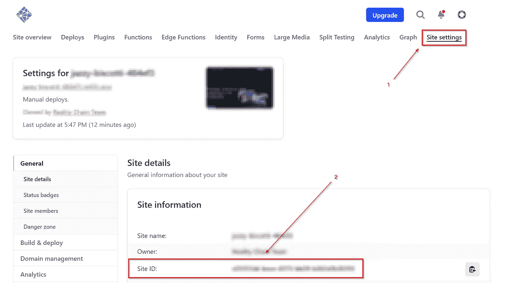
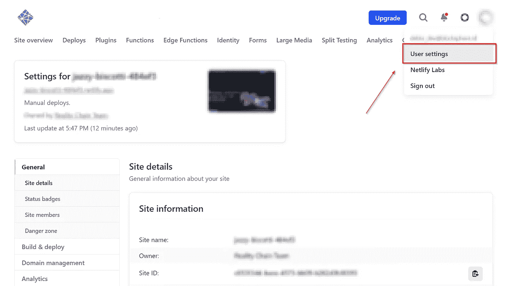
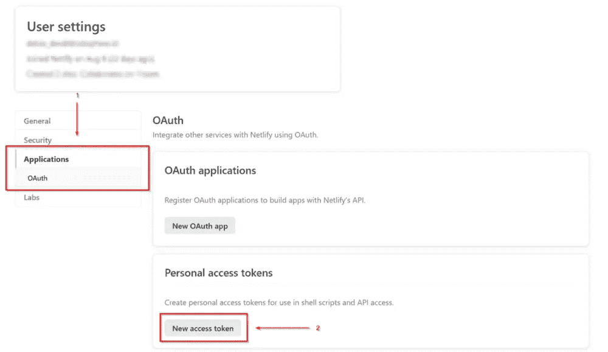
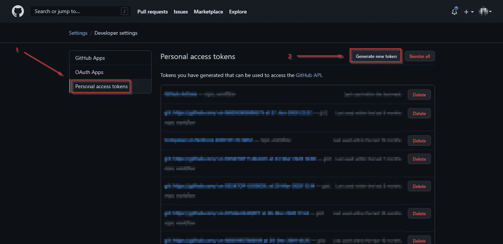
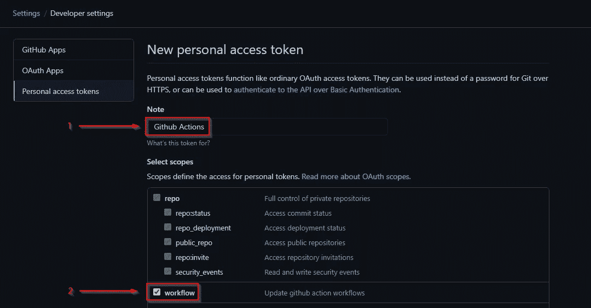
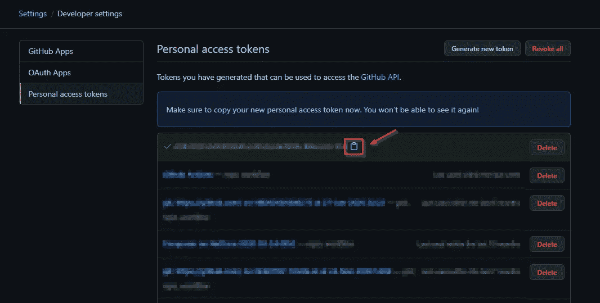
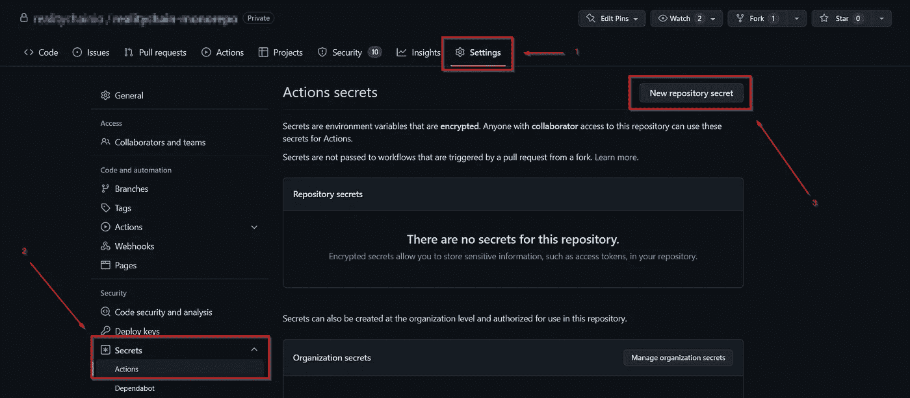
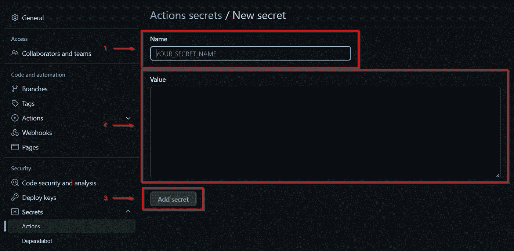

# 如何使用 Lerna 和 GitHub 操作将 React Monorepo 部署到 Netlify

> 原文：<https://levelup.gitconnected.com/how-to-deploy-a-react-monorepo-to-netlify-using-lerna-and-github-actions-2a4ff4ad4c84>

## 如何使用 Lerna 和 GitHub 操作将简单的 React 应用 Monorepo 部署到 Netlify 的分步指南


照片由[сергейхристинич](https://www.pexels.com/@82664875/)从 [Pexels](https://www.pexels.com/photo/a-triple-head-dragon-sculpture-in-a-park-8846839/)

部署 web 应用从未如此简单。随着持续集成和交付(CI/CD)解决方案越来越多地为全球开发人员所用，您没有理由不使用它们。自动化可以为您节省宝贵的时间；停止对服务器的 SSH-ing，让我们开始使用它。

托管你的前端 app 非常容易。你只需要用 JavaScript 编写应用程序。通常是一个框架，构建它，并上传到 Netlify 或 Vercel 之类的托管服务。在本教程中，您将学习如何将 React 应用程序部署到 Netlify，但是有一个问题。您将使用 Lerna 和 Github 操作从 Monorepo 部署此应用程序！

现在，事不宜迟，让我们开始吧。

# 创建您的网络生活网站

本节将介绍如何使用 Netlify CLI 建立空白 Netlify 站点。然后，它将由 npm 为我们安装。在我的场景中，npm 安装的主机操作系统是 Ubuntu 20.04。

## 1.安装 Netlify CLI

通过运行以下命令安装 Netlify CLI:

```
npm install netlify-cli -g
```

安装完成后，运行以下命令验证它是否已正确安装:

```
netlify
```

## 2.从 CLI 登录 Netlify

Netlify 要求您在使用 CLI 之前验证自己。

```
netlify login
```

然后，您将被重定向到:



授权 CLI。

## 3.创建空白网站

完成登录后，使用此命令创建一个空白站点:

```
netlify sites:create --name *<site name>*
```

## 4.检索您的站点 ID 和个人访问令牌

您的站点 ID 和个人访问令牌是持续远程开发所必需的。



在站点设置-作者图片中检索站点 ID。

您可以通过以下方式检索您的站点 ID:

1.  进入站点设置。
2.  复制 API ID 值。

下一步将获得个人访问令牌。



进入用户设置-作者图片。

转到用户设置。



获取一个新的访问令牌—作者的图片。

您必须制作一个新的访问令牌:

1.  转到应用程序选项卡。
2.  点按“新访问令牌”

你需要屏幕上显示的访问令牌。复制并保存它。

# 检索 GitHub 访问令牌

个人访问令牌是自动化 GitHub 操作部署所必需的。你需要在这里打开你的 [GitHub 开发者设置](https://github.com/settings/tokens)。



GitHub 开发者设置。图片由作者提供。

打开您的开发者设置页面:

1.  转到“个人访问令牌”页面。
2.  为 GitHub 操作创建一个新的令牌。



生成新的个人访问令牌。图片由作者提供。

配置您的个人访问令牌:

1.  输入令牌的名称。
2.  检查工作流程以访问 GitHub 操作。
3.  滚动到页面底部。
4.  单击“生成令牌”按钮。



令牌已成功生成。图片由作者提供。

复制并保存访问令牌以备后用。

# 设置存储库机密

在我们获取了访问令牌和站点 ID 之后，我们将把它们保存在存储库 secret 中。

**注意:**为什么我们需要使用存储库机密？以防止敏感 id 或令牌被推送到存储库。



打开您的存储库设置—作者图片。

在存储库设置中:

1.  单击左侧选项卡上的 Secrets➜Actions。
2.  点按“新存储库密码”



创造一个新的秘密。图片由作者提供。

在“新密码”页面上，输入密码名称和值。完成后，点击“添加密码”按钮。您已经添加了三个秘密:GitHub 个人访问令牌、Netlify 个人访问令牌和 Netlify 站点 ID。

# 创建 CI/CD 工作流

在 monorepo 中，您必须更有创造性地利用 Lerna 来安装和构建您的应用程序。在根`package.json`文件中添加脚本是一个可行的解决方案。

因为您将使用 Yarn，所以您运行`yarn`来安装带有`ignore-scripts`和`silent`标志的根`package.json`文件的依赖项，以便在不执行安装后脚本的情况下进行安装，并抑制安装的输出。

运行`lerna bootstrap`将会在子包中安装所有的依赖项。

最后，运行`lerna run build`将会运行子包中每个`package.json`文件中的每个`build`脚本。

下一步是使用 GitHub 操作来建立 CI/CD 工作流。它要求我们创建一个 YAML *工作流。*

GitHub 操作工作流触发对主分支的推/拉请求。

假设所有部署都将来自主分支，那么您必须在推送到主分支以开始您的工作流之后启动构建。

使用 Lerna 安装和构建 React web 项目的工作流

你可以在建造的时候使用 borales 的动作来执行纱线。您可以在这里查看[纱线动作详情](https://github.com/Borales/actions-yarn)。

构建的结果将位于`./packages/react-webapp/build`文件夹中(假设您将自己的 React 子包命名为`react-webapp`)。

将 React web 构建推送到 Netlify 的工作流。

在最后一个工作流程中，您可以访问我们之前保存在存储库设置中的秘密。成功构建后，手动将文件上传到 Netlify。下面是 nwtgck 中的一个片段，您可以使用。你可以在这里查看[网络行动包](https://github.com/marketplace/actions/netlify-actions)。

以下要点允许您复制完整的工作流程:

React web 工作流的全部要点

您应该已经完成了 CI/CD 工作流。将流程保存在内。尝试通过将您的 YAML 文件推送到`.github/workflows`来自己执行它！

# 摘要

使用 GitHub Actions，我们成功地为 React 构建了一个 CI/CD 管道。总结我们的行动:

1.  做一个全新的网络生活网站。
2.  从 Netlify 获取站点 ID 和个人访问令牌。
3.  获取 GitHub 个人访问令牌。
4.  设置存储库设置以包含机密。
5.  使用 Lerna 创建了一个脚本来安装和构建 React。
6.  在`.github/workflows`目录下创建一个 GitHub 动作 YAML 文件。

瞧啊。您已经完成了教程。现在您已经有了一个打开的剧本，您可以使用 GitHub 操作来发布后续的使用 Lerna 的 React/JavaScript web 应用程序。

# 分级编码

感谢您成为我们社区的一员！在你离开之前:

*   👏为故事鼓掌，跟着作者走👉
*   📰查看更多内容请参见[升级编码刊物](https://levelup.gitconnected.com/?utm_source=pub&utm_medium=post)
*   🔔关注我们:[Twitter](https://twitter.com/gitconnected)|[LinkedIn](https://www.linkedin.com/company/gitconnected)|[时事通讯](https://newsletter.levelup.dev)

🚀👉 [**将像你这样的开发人员安置在顶级初创公司和科技公司**](https://jobs.levelup.dev/talent/welcome?referral=true)