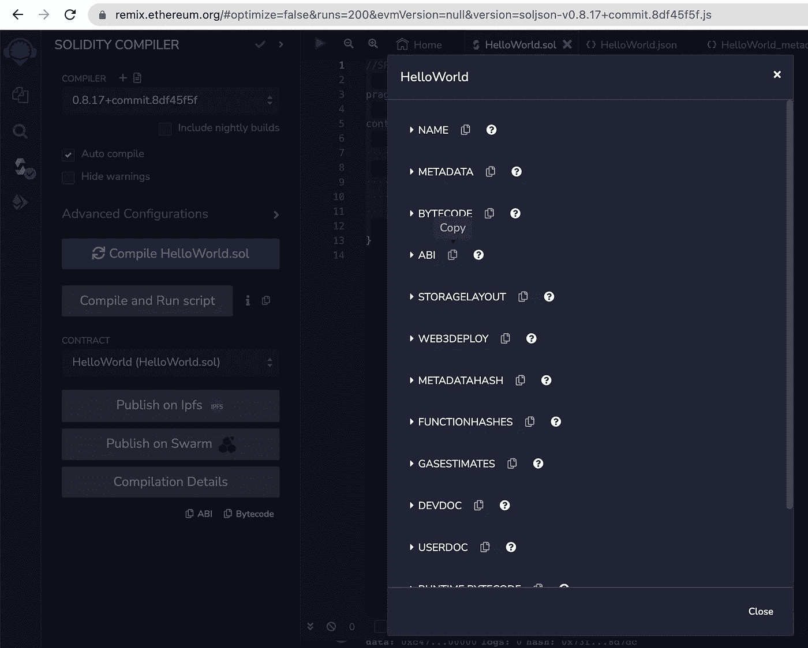

# 如何部署智能合同

> 原文：<https://levelup.gitconnected.com/how-to-deploy-a-smart-contract-ff7392e842b4>

## 使用 Remix IDE 将 Solidity 智能合约部署到区块链孟买多边形中


来自 Adobe Stock 的许可图像

在我以前的文章中，我解释了如何在 Polygon Mumbai testnet 上创建一个地址，用一些 test MATIC 为它提供资金，创建一个 ERC20 令牌(“加密货币”)，并使用 Web3/Ethers 在 Svelte 中开发一个 web 应用程序来访问帐户和令牌合同。下一步是创建我们自己的智能合约，并将其部署到我们的分布式应用程序(DAPP)的区块链中。

[](https://medium.com/coinmonks/developing-dapps-with-svelte-and-web3-using-polygon-matic-part-1-c3cc13adc4e4) [## 使用 Polygon MATIC 开发具有 Svelte 和 Web3/Ethers 的 DAPPs 第 1 部分

### 如何开始使用 Polygon 的孟买测试网

medium.com](https://medium.com/coinmonks/developing-dapps-with-svelte-and-web3-using-polygon-matic-part-1-c3cc13adc4e4) [](https://medium.com/coinmonks/developing-dapps-with-svelte-and-web3-ethers-using-polygon-matic-part-2-7a17af83ee6d) [## 使用 Polygon MATIC 开发具有 Svelte 和 Web3/Ethers 的 DAPPs 第 2 部分

### 如何开始使用 Polygon 的孟买测试网

medium.com](https://medium.com/coinmonks/developing-dapps-with-svelte-and-web3-ethers-using-polygon-matic-part-2-7a17af83ee6d) 

如果你觉得这些文章有用，那就为它们鼓掌吧。

## 在可靠性中创建我们的智能合同

为了演示这一点，我们将使用“hello world”智能契约和 [Remix](https://remix.ethereum.org/) 在线 IDE。

我们需要创建一个名为 HelloWorld.sol 的智能契约，如下所示。

```
//SPDX-License-Identifier: MIT

pragma solidity ^0.8.17;

contract HelloWorld {

    string public name = "Hello World";

    function setName(string memory _name) public {
        name = _name;
    }

}
```

我不打算详细介绍这个合同在做什么。如果你对在 Solidity 中开发智能合约感兴趣，我推荐由[圣保罗·莫莱斯](https://medium.com/u/17924367acd4?source=post_page-----ff7392e842b4--------------------------------)撰写的文章。我有几个区块链认证，我觉得他解释概念的方式比我学的一些课程材料要好。

就本文而言，您需要知道的是，有一个名为“ **name** 的公共变量，在部署契约时，该变量最初将被设置为“ **Hello World** ”。然后，您可以使用“ **setName** ”函数来更改该公共变量的状态。

## 混合智能合约

如果你不熟悉 [Remix](https://remix.ethereum.org/) ，它是一个在线 Solidity IDE。它叫[以太坊混音](https://remix.ethereum.org/)，但不要让名字骗了你。这是一个非常强大的工具，可用于处理各种不同的区块链。在我们的例子中，我们将使用 Metamask 将我们的智能契约部署到 Polygon Mumbai testnet(如前几篇文章所示)。

当你登录时，它看起来像这样。


作者截图

您首先要做的是删除那些示例项目文件和文件夹，例如“**”。deps** 、**工件**、 **UniSwap.sol** 、 **UniSwapV3.sol** 。我们不需要这些。将它们全部删除，并用我上面提供的合同代码创建一个名为“ **HelloWorld.sol** ”的新文件。


作者截图

在“**文件浏览器**面板的左侧有 4 个图标。用绿色勾号点击第三个。这将把你带到“ **SOLIDITY 编译器**”面板。编译器应该自动切换到 0.8.17(这是现在最新的版本)。确保勾选“**自动编译**”，并点击“**编译 HelloWorld.sol** ”。默认情况下，这是将智能合约部署到 Remix 虚拟机中，这是一个模拟的区块链。


作者截图

点击下方的**编制详情**，复制 **ABI** 。ABI 是合同的应用程序二进制接口。这是开发人员如何与合同交互的一种蓝图。



作者截图

看起来是这样的…

```
[
 {
  "inputs": [],
  "name": "name",
  "outputs": [
   {
    "internalType": "string",
    "name": "",
    "type": "string"
   }
  ],
  "stateMutability": "view",
  "type": "function"
 },
 {
  "inputs": [
   {
    "internalType": "string",
    "name": "_name",
    "type": "string"
   }
  ],
  "name": "setName",
  "outputs": [],
  "stateMutability": "nonpayable",
  "type": "function"
 }
]
```

正如你所看到的，我们有我们的公共变量" **name** "和我们的函数" **setName** "在那里被清楚地定义。如果你读过我以前的文章，你可能记得我们已经使用 ABI 与 ERC-20 令牌进行了交互。

```
{
   constant: true,
   inputs: [
     {
       name: "_owner",
       type: "address",
     },
   ],
   name: "balanceOf",
   outputs: [
     {
       name: "balance",
       type: "uint256",
     },
   ],
   payable: false,
   type: "function",
}
```

如果您单击底部的最后一个图标，将会转到“**部署&运行事务**”面板。你会注意到环境说“ **Remix VM (London)** ”。如果我们单击“ **Deploy** ”，我们的智能合约将被部署。这时可以在**下展开它，展开合同**。我们将在蓝色按钮上看到我们的公共变量“ **name** ”，在橙色按钮上看到“**set name**”function。


作者截图

你可以尝试一下。如果你点击“**名称**，你会看到它返回到“ **Hello World** 的初始状态。


作者截图

然后，我使用“**设置名称**”函数将“**名称**”设置为“**迈克尔**”。然后我点击“**名称**”，你会看到它现在返回“**迈克尔**”。


作者截图

现在这是开始变得更加令人兴奋的地方。确保您的元掩码已解锁，并且您在 Mumbai Testnet 上的资金帐户处于活动状态。


作者截图

将“**环境**更改为“**注入提供者—元掩码**”。这将提示您在元掩码中使用哪个帐户。


作者截图

当你选择了帐户，它会问你是否想连接，我们会这样做。


作者截图

现在尝试再次部署您的合同。这一次，您将看到它打开您的元掩码，并要求您确认交易以及它将花费多少测试成本。


作者截图

您仍然会看到在区块链中部署智能合约需要一些时间，当它完成时，您会收到合约地址和事务哈希。

这一切都可以在[孟买多边形扫描](https://mumbai.polygonscan.com/)上得到证实。

合同:
**0x AAA 93 e 333 b 0 faff 0 abcb 0d 853 DCD 64 DCCA 95981**
[https://Mumbai . polygonscan . com/address/0x AAA 93 e 333 b 0 faff 0 abcb 0d 853 DCD ca 95981](https://mumbai.polygonscan.com/address/0xaaa93e333b0faff0abcb0d853dcd64cdcca95981)

交易哈希:
**0x 650d 824 a 5 E3 c 0d 774 f 5 e 6 FD 40 be 77 c 6664 e 6 ACB 5a 726 f 37d 09907341d 12a 5158** [https://Mumbai . polygonscan . com/tx/0x 650d 824 a 5 E3 c 0d 774 f 5 e 6 FD 40 be 77 c 664 e 6 ACB 5a 726 f 37d 0990733](https://mumbai.polygonscan.com/tx/0x650d824a5e3c0d774f5e6fd40be77c6664e6acb5a726f37d09907341d12a5158)


作者截图

## 摘要

这是结束本文的一个很好的地方。我们已经在 Mumbai Polygon testnet 中部署了我们的智能合约，我们已经在 [polygonscan](https://mumbai.polygonscan.com/) 中验证了交易散列和合约创建，并且我们拥有所有重要的 ABI，我们将使用它从我们的 web 应用程序与我们的智能合约进行通信。

我希望你觉得这篇文章有趣并且有用。如果你想随时了解情况，请别忘了关注我，注册我的[电子邮件通知](https://whittle.medium.com/subscribe)。

# 迈克尔·惠特尔

*   ***如果你喜欢这个，请*** [***跟我上媒***](https://whittle.medium.com/)
*   ***更多有趣的文章，请*** [***关注我的刊物***](https://medium.com/trading-data-analysis)
*   ***有兴趣合作吗？*** [***我们上 LinkedIn***](https://www.linkedin.com/in/miwhittle/) 连线
*   ***支持我和其他媒体作者*** [***在此报名***](https://whittle.medium.com/membership)
*   ***请别忘了为文章鼓掌:)←谢谢！***