# 如何将应用程序部署到 AWS Fargate

> 原文：<https://levelup.gitconnected.com/how-to-deploy-an-application-to-aws-fargate-cd3cfaccc537>

通过弹性容器服务和应用程序负载平衡器逐步将应用程序部署到 AWS Fargate。


照片由[Á·加萨·德平](https://unsplash.com/@agathadepine?utm_source=medium&utm_medium=referral)在 [Unsplash](https://unsplash.com?utm_source=medium&utm_medium=referral) 上拍摄

管理应用服务器可能会成为一项单调乏味的任务。您需要修补、供应、配置和扩展虚拟机集群来运行容器。还有一个术语你可能听过很多，那就是无服务器。

关于无服务器的一点定义:

> [Serverless 是一种云原生开发模式，允许开发人员构建和运行应用程序，而无需管理服务器。](https://www.redhat.com/en/topics/cloud-native-apps/what-is-serverless)

我们说无服务器，并不是说没有服务器。这意味着服务器是从应用程序开发中抽象出来的。配置、维护、供应、修补和扩展基础设施等所有任务都由云提供商处理。

无服务器有几个优点:

*   降低成本
*   需要担心的事情更少
*   增强的可扩展性
*   更加注重用户体验

拥有这些优势，并不意味着无服务器计算是所有应用程序的灵丹妙药。当专用服务器似乎更好时，使用无服务器计算也有缺点。例如，如果您有一个运行时间较长并且执行繁重计算任务的应用程序，那么使用专用服务器会更好。因为在无服务器的情况下，很有可能你会付出比预期更多的钱。

说了这么多，让我们直接跳到将应用程序部署到 AWS Fargate 的分步指南。

# 先决条件

要阅读本文，您需要一个 AWS 帐户。如果您使用的是免费层，也没关系。我们将在本文结束时清理我们的服务，因此您不会收到账单。

另外，确保您的本地机器上安装了 Docker 引擎。我们将把 docker 映像推送到 ECR，并使用 ECS 将其部署到 AWS Fargate。

注意，您可以将 Fargate 与 ECS 或 EKS 一起使用。但是在本文中，我们将重点讨论如何利用 ECS。

要将映像推送到私有 ECR 存储库，您必须配置您的 AWS CLI。如果您已经进行了配置，可以跳到下一部分。

首先，生成一个访问密钥。单击 AWS 管理控制台左上角的帐户名称。然后选择*安全凭证*。

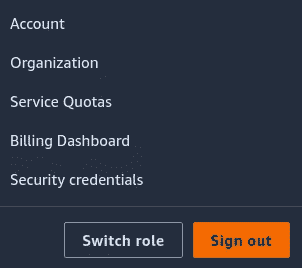

你将被重定向到 IAM 管理控制台，然后你应该点击*“创建访问密钥*”。将生成一个访问密钥，您可以将其下载为包含您的访问密钥 id 和秘密访问密钥的 CSV 文件。确保这些数据是保密的。

现在，假设您已经安装了 AWS CLI。如果还没有，可以按照这个文档:[https://docs . AWS . Amazon . com/CLI/latest/user guide/getting-started-install . html](https://docs.aws.amazon.com/cli/latest/userguide/getting-started-install.html)

在您的终端上，键入`aws configure`。系统会提示您填写访问密钥 id、秘密访问密钥、默认区域名称和默认输出格式。如果一切正确，登录过程将会成功，您可以开始了。

# 简单的代码

出于演示目的，我选择使用 Python FastAPI 编写代码，因为它具有易于设置的特性。但是用哪种编程语言或库来编写应用程序并不重要。

现在，我们需要安装 fastapi 和 uvicorn。要安装它们，您可以运行以下命令。

```
pip install fastapi uvicorn
```

注意:最有可能的是，您应该使用一个虚拟环境，这样您就不会有一个混乱的全局 Python 环境。

让我们在`main.py`文件中写一个代码。

极其简单！然后通过运行命令`pip freeze > requirements.txt`生成包含应用程序依赖项的`requirements.txt`。

是时候写文档了。

通过查看这个 docker 文件，我们知道我们的应用程序将在端口 8000 上运行。我们稍后在配置应用程序负载平衡器时需要这些信息。

# 构建和推动

转到 ECS 页面并选择“存储库”部分。

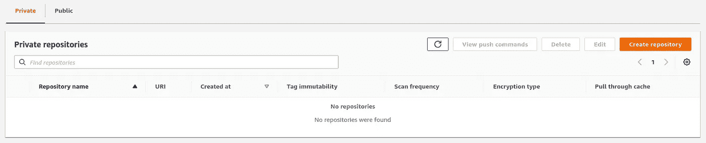

单击“*创建存储库*”，为了简单起见，您应该只提供存储库名称。

查看新创建的存储库的详细信息，有一个按钮“*查看推送命令*”。听起来很容易，但基本上你可以遵循所有这些步骤。首先，您需要检索一个认证，并将 Docker 客户机认证到您的注册中心。然后构建一个 Docker 映像，并使用存储库的 URL 对其进行标记。最后，将其推送到存储库。

我们有它，我们有我们的图像存储在 AWS ECR。

# 部署到法盖特

好了，我们现在进入这篇文章的主题了。

## 创建任务定义

仍在与之前相同的页面上，导航到 ECS 上的任务定义。我们可以在任务定义中指定几种配置，比如要使用的 Docker 映像、容器的 CPU 和内存、实例类型、网络模式等。

点击*新建任务定义*后，需要提供几个字段。注意:下面您看到的是新 ECS 控制台的用户界面。

*   提供任务定义系列名称，例如 fastapi-fargate-task。
*   集装箱名称和图像 URI(您可以在 ECR 存储库中看到这一点)。
*   因为我们的应用程序运行在端口 8000 上，所以我们需要将容器端口设置为 8000。
*   您可以以键值对的形式或从文件中提供环境变量。
*   然后单击下一步。

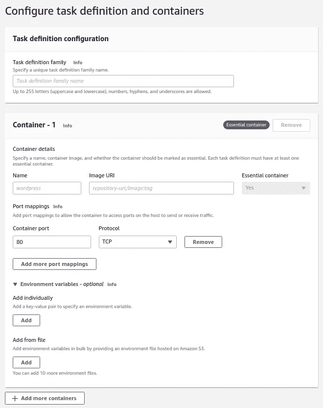

要填写的其他字段。

*   为应用程序环境选择 AWS Fargate。
*   选择 Linux 作为 OS。
*   任务大小选择 1vCPU 和 2 GB 内存。
*   如果添加多个容器，可以为其他容器提供任务大小。
*   对于任务角色，您可以将其留空。但是如果需要向其他 AWS 服务发出 API 请求，就需要选择 ecsTaskExecutionRole。
*   然后复习，创造。

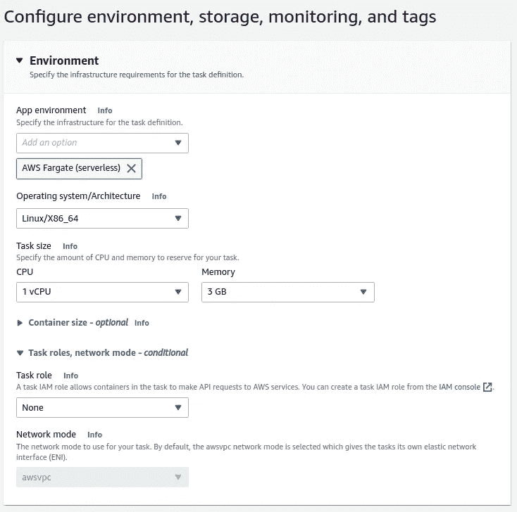

## 创建集群

我们很幸运，创建一个集群没有很多字段要填充。您应该提供一个群集名称，选择 VPC 和子网。

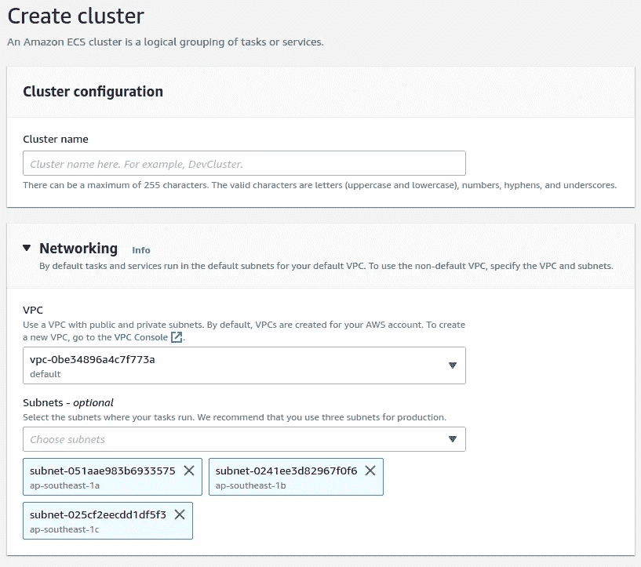

默认情况下，集群是为 AWS Fargate 配置的。所以就让它保持原样吧。

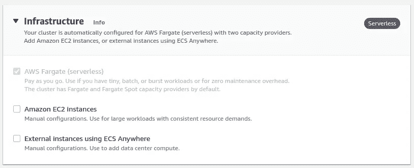

## 负载平衡器和目标组

让我们转到 EC2 控制台。这里，我们需要设置一个负载平衡器和目标组。一个负载平衡器将位于我们的 Fargate 服务之前，并将用户请求从公共互联网重定向到我们的服务。

在 EC2 控制台上，在左侧抽屉中查找“*负载均衡*，选择“*负载均衡器*”。然后点击*创建负载均衡器*。

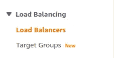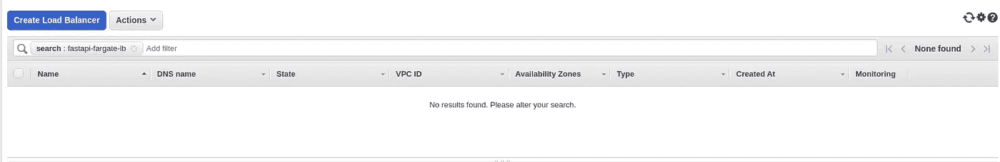

您将看到负载平衡器类型的选项。现在，选择应用程序负载平衡器。

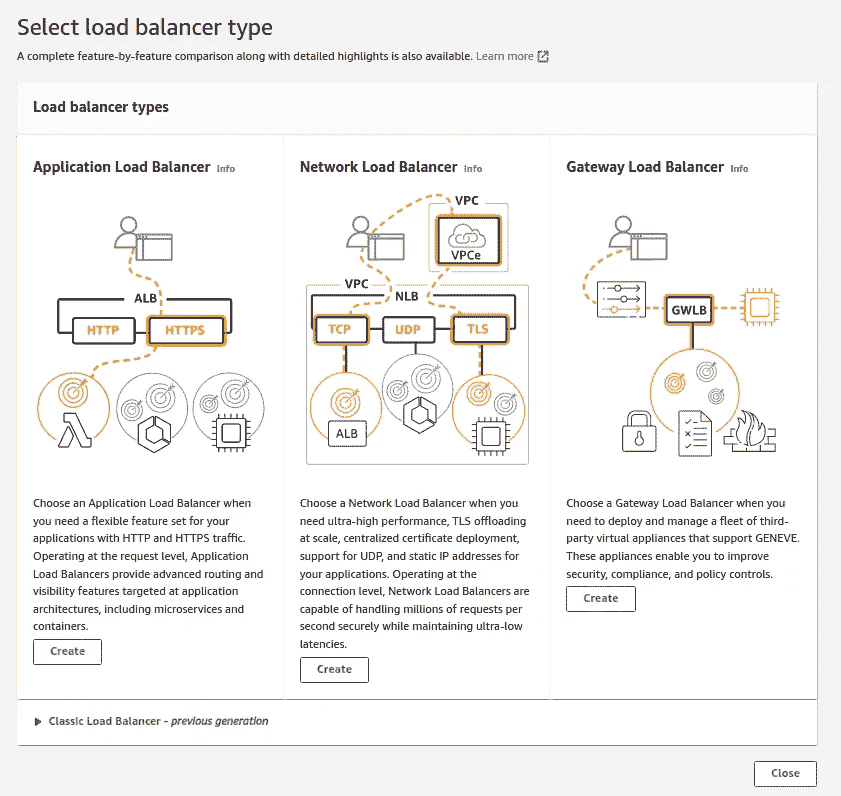

对于基本配置:

*   提供负载平衡器的名称，例如:fastapi-fargate-lb。
*   对于“方案”,选择“面向互联网”。
*   同样，对于 IP 地址类型，让 IPv4 被选中。

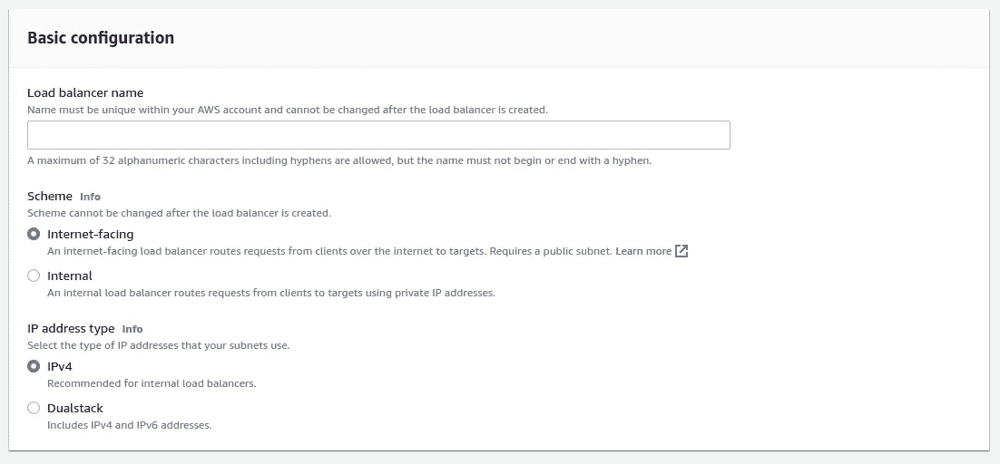

对于网络映射:

*   让我们使用默认的 VPC。
*   对于映射，您可以选择至少两个可用性区域。在创建 ECS 群集服务时，我们必须选择相同的内容。对于本例，您可以选择 1a 和 1b。

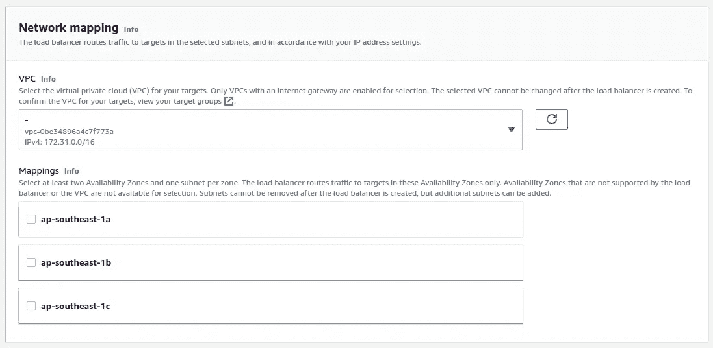

接下来，我们需要创建一个安全组。在另一个选项卡中打开“*创建新的安全组*”。

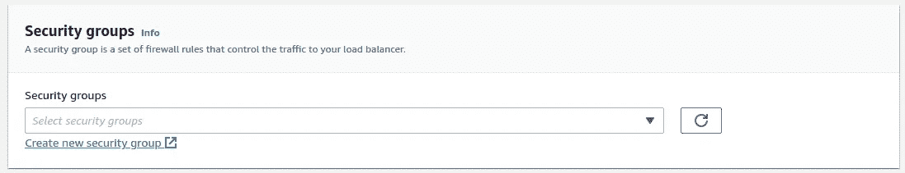

填写有关安全组名称和描述的详细信息，例如:fastapi-fargate-lb-sg 和 FastAPI Fargate ALB 安全组。注意 LB 代表负载平衡器，SG 代表安全组。那就让 VPC 保持原样。

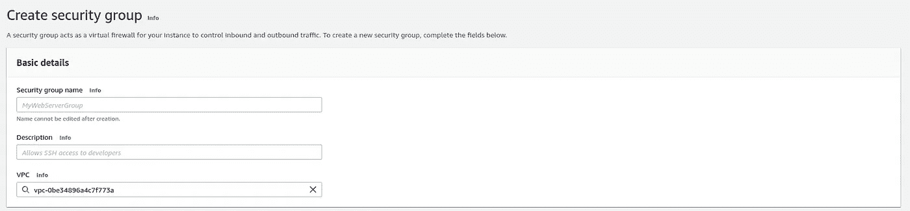

对于入站规则，我们需要添加一个新规则。

*   单击“添加规则”,并选择 HTTP 作为“类型”和“任意位置的源”。通过这样做，我们允许从任何地方通过 HTTP 互联网访问我们的负载平衡器。
*   保留出站规则不变。
*   最后，单击“*创建安全组*”。

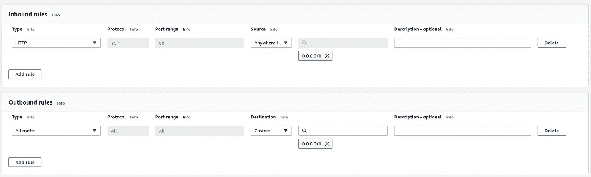

回到安全组。如果您单击刷新图标，您将看到新创建的安全组。那就选那个。


现在，我们需要创建目标群体。像我们创建安全组时一样，在另一个选项卡中打开“*创建目标组*”。

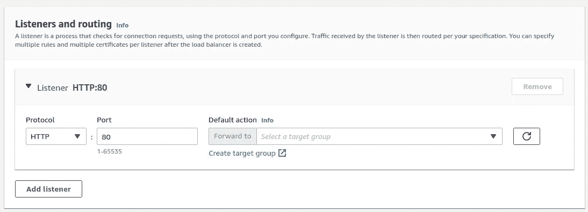

对于基本配置:

*   选择 IP 地址作为目标类型。
*   提供目标组名称，例如 fastapi-fargate。
*   请记住，我们的应用程序运行在端口 8000 上。这意味着我们需要选择协议 HTTP 和端口 8000。
*   然后让其余的保持原样，并单击下一步。

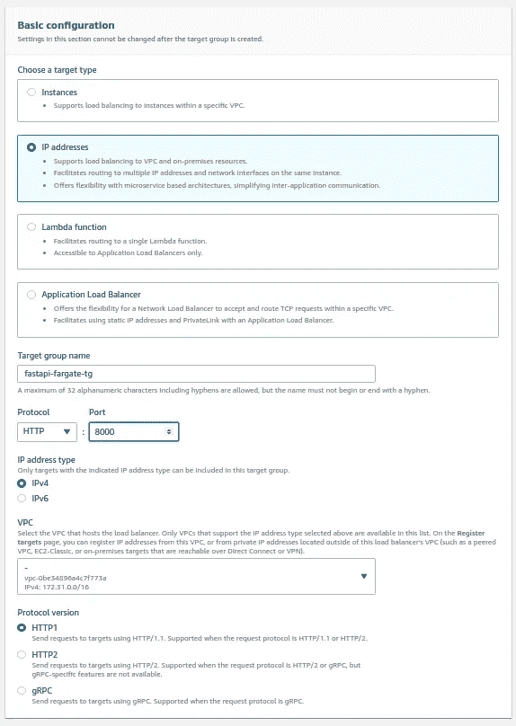

之后，将有一个关于注册目标的部分。我们现在不需要做任何事情。当我们创建集群的服务时，我们将把负载平衡器和目标组附加到 Fargate 实例。

回到我们必须选择目标群体的时候。单击刷新，然后您可以选择新创建的目标组。然后跳到页面底部，点击创建。

## 创建 Fargate 服务

在 EC2 控制台中花了一些时间之后，我们需要返回 ECS 控制台，在之前创建的 ECS 集群中创建一个服务。所以，选择我们的集群。

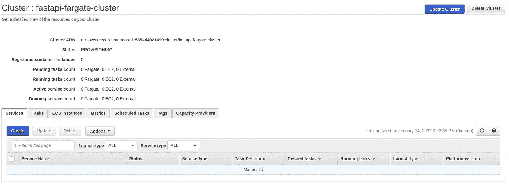

注意:我关闭了新的 ECS 控制台 UI。当创建一个集群的服务时，我认为新的外观感觉有点不稳定。因此，我选择使用旧的。

单击“创建”后，您将看到如下图所示的页面。

*   对于启动类型，选择 Fargate。
*   对于 OS 家族，选择 Linux。
*   之前，我们已经创建了一个任务定义，我们将在这里使用它。选择那个，包括任务定义修订。
*   填写服务名称。
*   对于任务数，该值指定将创建多少个 Fargate 实例。因此，最终的架构将由一个负载平衡器和三个服务组成。
*   然后选择下一步。

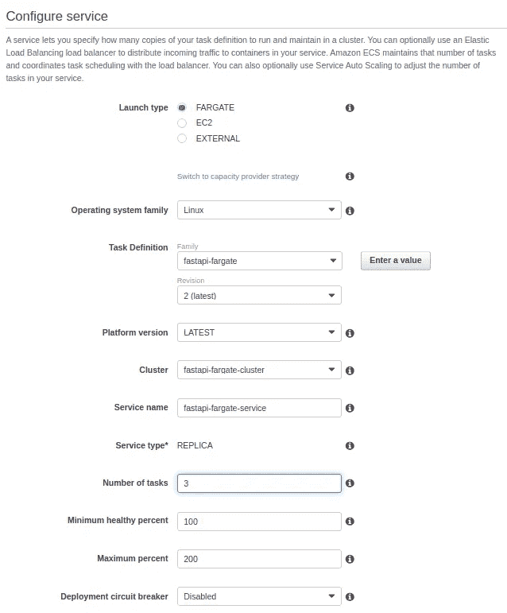

接下来，配置网络。

*   选择默认 VPC。
*   选择子网。确保使用与负载平衡器中相同的子网。
*   对于安全组，单击编辑。会有一个左边的抽屉被打开。

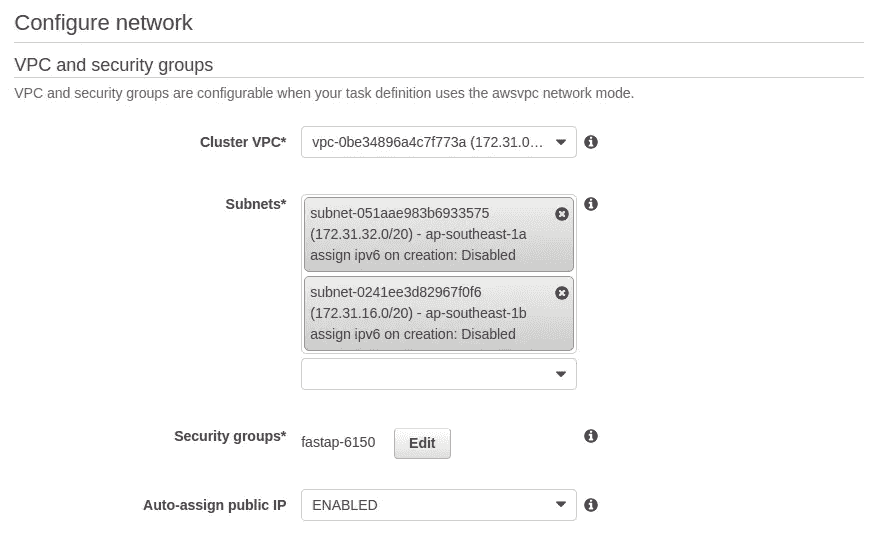

在这里，通过填写安全组名称来创建一个新的安全组。让入站规则保持原样。然后单击保存。

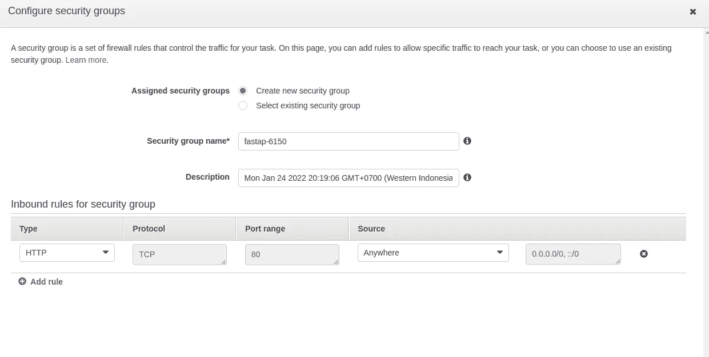

现在，我们需要将我们的服务附加到负载平衡器。

*   对于负载平衡器类型，选择应用程序负载平衡器。
*   对于负载平衡器名称，请选择我们的负载平衡器。
*   对于容器名和端口，看起来您已经选择了正确的容器名和端口。但是你仍然需要点击*添加到负载均衡器*。

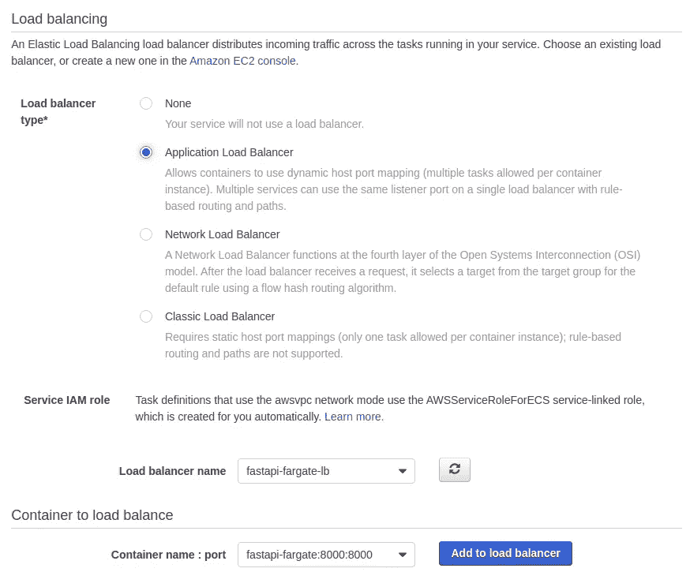

*   对于生产侦听器端口，选择端口 80。
*   对于目标名称，选择先前创建的目标组。

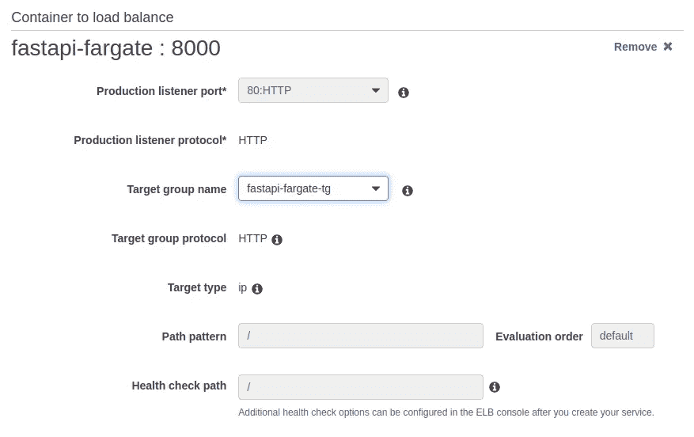

您可以转到下一步来设置自动缩放。我跳过这一个，所以不管我们的服务处理多少负载，只有三个服务。最后，查看并创建。

## 修改服务的安全组

为了确保一切按预期运行，我们需要修改 ECS 服务的安全组，以允许负载平衡器访问。通过单击安全组 id 转到服务的安全组。

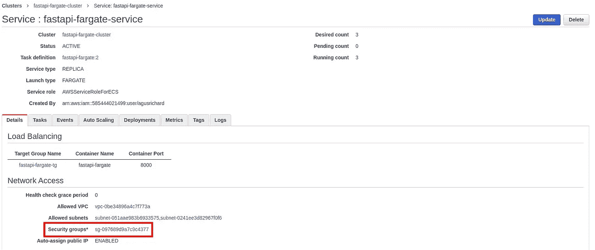

编辑此安全组的入站规则以允许负载平衡器访问。为此，请选择所有 TCP 访问和来源为自定义。之后，为源的值选择负载平衡器安全组，如下图所示(或者您可以将负载平衡器的安全组 id 复制到该字段中)。

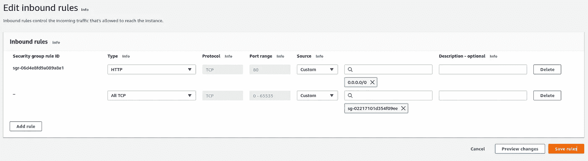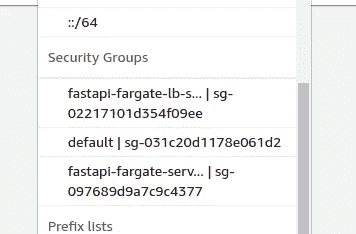

## 最后

好了，这是最后一个。我保证！

回到我们的负载平衡器，在新标签页中打开 DNS 名称。

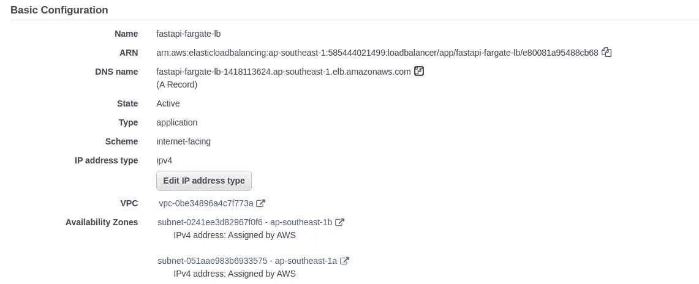

现在，你可以在屏幕上看到“你好，世界”。多有意思啊？:)

# 结论

在结束本文之前，如果您不想收到账单，您应该清理之前创建的 AWS 服务。这是你需要清理的东西的列表:

*   停止所有群集任务
*   删除群集的服务
*   删除集群
*   删除 ECR 储存库
*   删除负载平衡器
*   删除安全组

如果您想保留安全组和 ECS 任务定义，也没关系。但是你也可以清理它们。

好吧，我祝贺你成功晋级最后一轮。仅部署容器化的应用程序就有足够多的步骤。我们来回走了好几次。设置这个，然后创建那个。

如果我们不得不一遍又一遍地做这件事，那将是一项多么乏味的任务。你想一遍又一遍地这样做吗？当然，我不知道。

因此，CI/CD 将与这项技术齐头并进。那么作为代码的基础设施将会使它变得越来越好。我们将在下一篇文章中看到后续内容。

本文代码:[https://github . com/agusrichard/AWS-workbook/tree/master/fastapi-fargate](https://github.com/agusrichard/aws-workbook/tree/master/fastapi-fargate)

感谢您的阅读和快乐编码！

# 资源:

*   [https://www . red hat . com/en/topics/cloud-native-apps/what-is-server less](https://www.redhat.com/en/topics/cloud-native-apps/what-is-serverless)
*   【https://learntocodewith.me/posts/serverless-architecture/ 
*   [https://www . cloud flare . com/learning/server less/what-is-server less/](https://www.cloudflare.com/learning/serverless/what-is-serverless/)
*   [https://AWS . Amazon . com/blogs/compute/building-deploying-and-operating-contained-applications-with-AWS-fargate/](https://aws.amazon.com/blogs/compute/building-deploying-and-operating-containerized-applications-with-aws-fargate/)