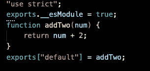
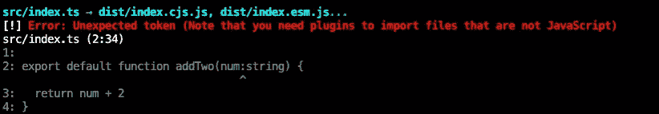

# 如何部署 NPM 软件包

> 原文：<https://levelup.gitconnected.com/how-to-deploy-an-npm-package-d75843fb77f1>

使用 Typescript 和 Rollup.js


由[杰西·拉米雷斯](https://unsplash.com/@jesseramirezla?utm_source=medium&utm_medium=referral)在 [Unsplash](https://unsplash.com?utm_source=medium&utm_medium=referral) 上拍摄

# 步骤 1:创建一个项目

如果你已经有一个项目，请随意跳到第 2 步。

让我们从一个简单的项目结构开始:一个/src 目录，我们将在其中导出 index.ts 和 package.json。

```
/src
    -index.ts
package.json
```

我们将导出一个名为`addTwo`的简单函数。将以下内容添加到 index.ts 文件中。

```
export default function addTwo(num:string) {
    return num + 2
}
```

现在，我们将开始安装我们的依赖项。

# 步骤 2:安装 Typescript

```
npm i -D typescript
```

因为这是一个 typescript 项目，所以我们应该包含一个 *tsconfig.json* 文件来指定根级别和任何编译器选项。我们将使用下面这个简单的例子。

```
//these options specify where we want our types to be build to 
//aswell as specifying what not to include in the compilation 
//we do not want to include our built files in dist(we will configure this in a later step) or our node_modules{
    "compilerOptions": {
        "declaration": true,
        "declarationDir": "dist/types",
    },
    "exclude": ["dist", "node_modules"]
}
```

试试跑步

```
tsc
```

如果一切顺利，您应该在/src 目录中有一个新的 index.js 文件。



现在快跑

```
tsc --emitDeclarationOnly
```

您现在应该有一个新的/dist 目录，其中包含一个 *index.d.ts* 文件。这些是你喜欢的类型。


现在，让我们安装 rollup.js

# 步骤 3:安装 Rollup.js 和插件

Rollup 将您的现代模块化代码编译回其他支持的格式，如 CommonJS、AMD 和 life-style 脚本。我们将需要[节点解析](https://github.com/rollup/plugins/tree/master/packages/node-resolve)插件，以便 rollup 可以定位我们的模块。

```
npm i -D rollup @rollup/plugin-node-resolve
```

您的 *package.json* 现在应该是这样的:

```
{
    "name": "rollup-typescript-starter",
    "version": "1.0.0",
    "main": "dist/index.cjs.js",
    "module": "dist/index.esm.js",
    "dependencies": {},
    "devDependencies": {
        "@rollup/plugin-node-resolve": "^7.0.0",
        "rollup": "^1.29.0",
        "typescript": "^3.9.3"
    },
    "scripts": {
        "build": "rollup -c"
    },
    "files": [
         "dist"
    ]
}
```

现在让我们向根目录添加一个 *rollup.config.js* 文件。

```
import pkg from './package.json';const extensions = ['.js', '.ts']export default [// CommonJS (for Node) and ES module (for bundlers) build.{
    input: 'src/index.ts',
    output: [
        {
            file: pkg.main,
            format: 'cjs'
         },
        {
            file: pkg.module,
            format: 'es'
        }
    ],
    plugins: [
        resolve({
            extensions //specifies the extensions of files that the plugin will operate on
        }),
    ]
}
```

现在让我们添加尝试构建我们的代码。

```
npm run build
```

发生了什么事？



因为我们使用 rollup 而不是通过 typescript 编译器(`tsc`)进行构建，所以我们必须配置一种通过 rollup 移除类型的方法。巴贝尔进来了！

# 第四步:安装巴别塔

首先，我们安装巴别塔。

```
npm i -D @babel/core
```

现在让我们安装 typescript 预置。这将从 typescripts 文件中移除这些类型。

```
npm i -D @babel/preset-typescript
```

接下来，向根目录添加一个. babelrc 文件。

```
{"presets": ["@babel/preset-typescript"]}
```

最后，安装 rollup babel 插件。这将允许 rollup 使用 babel 来传输我们的 typescript 文件并删除类型。

```
npm i -D @rollup/plugin-babel
```

更新 rollup.config.js 文件

```
import resolve from '@rollup/plugin-node-resolve';
import pkg from './package.json';
import babel from 'rollup-plugin-babel'const extensions = ['.js', '.ts']export default [// CommonJS (for Node) and ES module (for bundlers) build.{
    input: 'src/index.ts',
    output: [
        {
            file: pkg.main,
            format: 'cjs'
         },
        {
            file: pkg.module,
            format: 'es'
        }
    ],
   plugins: [
         resolve({
              extensions
         }),
         babel({
             exclude: 'node_modules/**',
             extensions
         }),
   ],
},
```

现在让我们再次尝试构建

```
npm run build
```


不错！

# 第五步:发布

好的，在我们发布之前，我们要确保我们也构建了自己的类型，这样安装这个包的人就可以使用它们了。

记住这个命令。

```
tsc --emitDeclarationOnly
```

让我们将它添加到 package.json 中的构建脚本中，并且在每次构建之前清理/dist 目录，以确保我们每次都有最新的构建。

```
{
    "name": "rollup-typescript-starter",
    "version": "1.0.0",
    "main": "dist/index.cjs.js",
    "module": "dist/index.esm.js",
    "dependencies": {},
    "devDependencies": {
        "@rollup/plugin-node-resolve": "^7.0.0",
        "rollup": "^1.29.0",
        "typescript": "^3.9.3"
    },
    "scripts": {
        "build": "rm -rf dist && rollup -c && tsc --emitDeclarationOnly"   
    },
    "files": [
         "dist"
    ]
}
```

现在让我们添加发布脚本。

```
{
    "name": "rollup-typescript-starter",
    "version": "1.0.0",
    "main": "dist/index.cjs.js",
    "module": "dist/index.esm.js",
    "dependencies": {},
    "devDependencies": {
        "@rollup/plugin-node-resolve": "^7.0.0",
        "rollup": "^1.29.0",
        "typescript": "^3.9.3"
    },
    "scripts": {
        "build": "rm -rf dist && rollup -c && tsc --emitDeclarationOnly",
        "prepublish:public": "npm run build && npm run bump-version",
        "publish:public": "npm publish --access public",
    },
    "files": [
         "dist"
    ]
}
```

“prepublish:public”前面的“pre”前缀表示此脚本将在“publish:public”脚本之前运行。

现在要发布到 npm 存储库，请运行:

```
npm run publish:public
```

恭喜你！现在，您的软件包在 npm 注册表中可用。