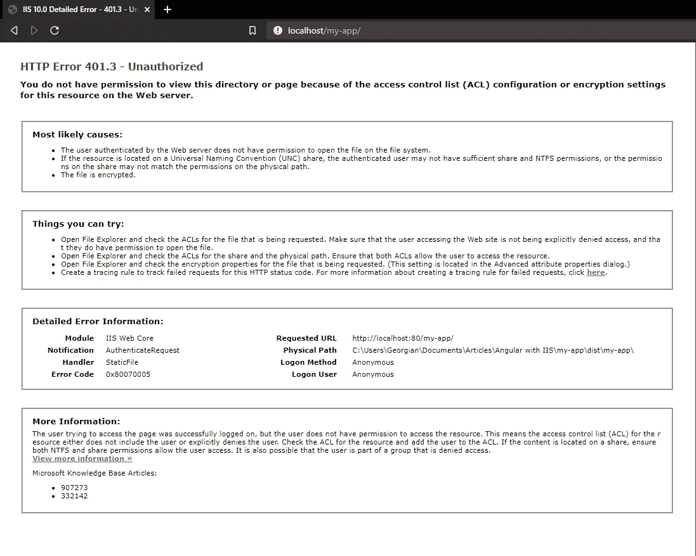

# 如何将 Angular app 部署到 IIS Web 服务器—完整设置

> 原文：<https://levelup.gitconnected.com/how-to-deploy-angular-app-to-an-iis-web-server-complete-setup-337997486423>


由[塔达斯·萨尔](https://unsplash.com/@stadsa?utm_source=unsplash&utm_medium=referral&utm_content=creditCopyText)在 [Unsplash](/s/photos/microsoft?utm_source=unsplash&utm_medium=referral&utm_content=creditCopyText) 上拍摄的照片

如果你有一个 Angular 应用程序，你需要把它部署到一个 IIS 服务器上，你可以这样做。

本文包含了完整的设置，但是如果您已经配置了一些东西，并且您只对某些特定的信息感兴趣，这里是我们将在本文中讨论的内容。

## 目录:

1.  我们想要达到的目标
2.  启用 IIS 并安装 URL 重写
3.  将 Angular 配置为在开发版本中输出文件
4.  在 IIS 中添加新的应用程序
5.  IIS 权限
6.  配置`deploy-url`和`base-href`
7.  IIS 配置文件

# 1.我们想要达到的目标

我们有一个基于 Angular 的应用程序，其中包含我们在本地系统上使用命令`npm run start`开发的路线，这将为我们创建一个开发服务器，并在端口`localhost:4200`为应用程序提供服务。


带开发服务器的 Angular 应用程序(npm 运行开始)

要求是我们现在需要从 IIS web 服务器而不是本地虚拟开发服务器运行这个应用程序。

> 这只是一个简单的场景。以下配置也可以应用于生产版本。

# 2.启用 IIS

默认情况下，IIS web 服务器是不启用的，因此我们需要手动启用。

1.  在 Windows 中，导航到**控制面板** > **程序** > **程序和功能** > **打开或关闭 Windows 功能**(屏幕左侧)。
2.  选择**互联网信息服务**复选框。选择确定。


> IIS 安装可能需要重新启动系统。

然后打开它，只需在搜索栏中搜索 **IIS 管理器**。


我们还需要 IIS URL 重写模块。你可以在他们的[官方页面](https://www.iis.net/downloads/microsoft/url-rewrite)上找到。

# 3.将 Angular 配置为在开发版本中输出文件

将 Angular 与默认的开发服务器`ng serve`一起使用时，输出在内存中，不会写入磁盘。

要使用我们自己的服务器，我们需要使用`ng build --watch`，它会像`ng serve`一样监视文件，但会将它们写入磁盘，而不会运行服务器。

因此，更新`package.json`文件并在`scripts`中再添加一个命令，它将执行这个命令。


如果我们运行这个命令，我们将在`dist`文件夹中看到我们应用程序的开发版本。

# 4.在 IIS 中添加新的应用程序

现在，我们已经配置了 Angular 以在监视模式下构建文件，并将它们写入磁盘，我们需要进入 IIS 管理器并添加一个新的应用程序。


在 IIS 中添加新的应用程序

工作流程如下:

*   复制输出文件的文件路径，在我们的例子中是来自`dist/my-app`的文件
*   **在**默认网站>** **上右键**添加应用**
*   在**别名**字段中填入您希望为申请提供服务的路线(`localhost/my-app`

> 可能需要重新启动 IIS。

# 5.IIS 权限

此时，如果我们打开浏览器并尝试访问应用程序`localhost/my-app`，我们将看到如下内容:



发生这种情况是因为 IIS 服务器无法访问我们的文件夹。

IIS 还创建了 **IUSR** 作为通过 IIS 访问文件的默认用户。因此，我们需要确保 **IUSR** 和 **IIS_USRS** 拥有文件/文件夹的读取权限。

为此，**右击文件夹**->-**属性**->-**安全选项卡>-**查看 IUSR 和 IIS_USRS 是否在组或用户名列表中，如果没有，

**点击编辑**->-**添加**->-**高级**->-**立即查找** - >选择 **IUSR** 点击确定


# 6.配置`deploy-url`和`base-href`

一旦我们的文件的权限被授予 IIS，我们就可以重新打开应用程序。
然而，我们实际看到的是一个空白页和几个控制台错误。


我们的 Angular 应用程序是在`localhost/my-app`下提供的，但是如果我们看一下开发者的工具，我们可以看到应用程序的文件是直接从`localhost`请求的。

我们用`http://localhost/styles.css`代替`http://localhost/my-app/styles.css`，其余的文件也是如此。

问题是 Angular 已经构建了我们的应用程序，假设文件将从主路径`/`加载。

为了解决这个问题，我们需要在构建应用程序时指定`deploy-url`和`base-href`值。

`base-href`由路由使用，`deploy-url`用于资产。

在`package.json`中，用以下命令更新`build:dev`脚本


# 7.IIS 配置文件

让我们再次构建应用程序，看看我们有什么。


此时，工作流程应该是这样的。应用程序应该按预期工作，但是路由应该只在应用程序内部工作。

如果我们访问一个像`localhost/my-app/two`这样的路由并在那里刷新页面，或者如果我们在浏览器中输入这个 URL，我们将会在一个 404 IIS 页面上结束。

之所以会出现这种情况，是因为 IIS 只被配置为理解`localhost/my-app`并将这个 URL 映射到`our_app_path/dist/my-app`。

它不知道`localhost/my-app/two`或我们申请的任何其他途径。

为了解决最后一个问题，我们需要配置 IIS 将所有来自`localhost/my-app/*`的请求重定向到我们的应用程序。

必要的配置也记录在角度部署页面的[服务器配置](https://angular.io/guide/deployment#server-configuration)部分。

对于 IIS，我们需要创建一个名为`web.config`的新配置文件，内容如下:


[原始](https://carbon.now.sh/?bg=rgba%28171%2C+184%2C+195%2C+1%29&t=seti&wt=none&l=htmlmixed&ds=true&dsyoff=20px&dsblur=68px&wc=true&wa=true&pv=56px&ph=56px&ln=false&fl=1&fm=Hack&fs=14px&lh=133%25&si=false&es=2x&wm=false&code=%253C%253Fxml%2520version%253D%25221.0%2522%2520encoding%253D%2522utf-8%2522%253F%253E%250A%253Cconfiguration%253E%250A%250A%253Csystem.webServer%253E%250A%2520%2520%253Crewrite%253E%250A%2520%2520%2520%2520%253Crules%253E%250A%2520%2520%2520%2520%2520%2520%253Crule%2520name%253D%2522Angular%2520Routes%2522%2520stopProcessing%253D%2522true%2522%253E%250A%2520%2520%2520%2520%2520%2520%2520%2520%253Cmatch%2520url%253D%2522.*%2522%2520%252F%253E%250A%2520%2520%2520%2520%2520%2520%2520%2520%253Cconditions%2520logicalGrouping%253D%2522MatchAll%2522%253E%250A%2520%2520%2520%2520%2520%2520%2520%2520%2520%2520%253Cadd%2520input%253D%2522%257BREQUEST_FILENAME%257D%2522%2520matchType%253D%2522IsFile%2522%2520negate%253D%2522true%2522%2520%252F%253E%250A%2520%2520%2520%2520%2520%2520%2520%2520%2520%2520%253Cadd%2520input%253D%2522%257BREQUEST_FILENAME%257D%2522%2520matchType%253D%2522IsDirectory%2522%2520negate%253D%2522true%2522%2520%252F%253E%250A%2520%2520%2520%2520%2520%2520%2520%2520%253C%252Fconditions%253E%250A%2520%2520%2520%2520%2520%2520%2520%2520%253Caction%2520type%253D%2522Rewrite%2522%2520url%253D%2522.%252Findex.html%2522%2520%252F%253E%250A%2520%2520%2520%2520%2520%2520%253C%252Frule%253E%250A%2520%2520%2520%2520%253C%252Frules%253E%250A%2520%2520%253C%252Frewrite%253E%250A%253C%252Fsystem.webServer%253E%250A%250A%253C%252Fconfiguration%253E)

这个`web.config`文件必须包含在我们的构建中，所以它必须放在`dist/my-app`中。

为了自动完成这项工作，让我们将这个文件放在`src`文件夹中，并更新`angular-cli.json`文件，如下所示:


将`assets`从`arhitect.build`上取下，放入`configuration.development`和`configuration.production`中。

这样，我们可以在开发版本中加载`web.config`文件，并从生产版本中跳过它。

如果您的用例在开发和生产构建中都有它，那么在`architect.build`中保留原始资产并附加`src/web.config`。

最后，由于我们引入了新的配置选项，让我们最后一次更新`build:dev`脚本:

```
"build:dev": "ng build --watch --deploy-url /my-app/ --base-href /my-app/ --configuration=development"
```

如果我们在开发模式下再次构建应用程序，我们应该看到文件`web.config`在我们的发行版中被复制，现在应用程序完全按照预期工作。

# 结论

部署 Angular 应用程序的过程与任何其他基于框架的应用程序没有太大的不同。同样的步骤需要重复，不同的只是你做的方式。

如果你想了解更多，那么看看这篇[相关文章](https://itnext.io/how-to-deploy-angular-app-in-production-cpas-2-affb711d18fc)。