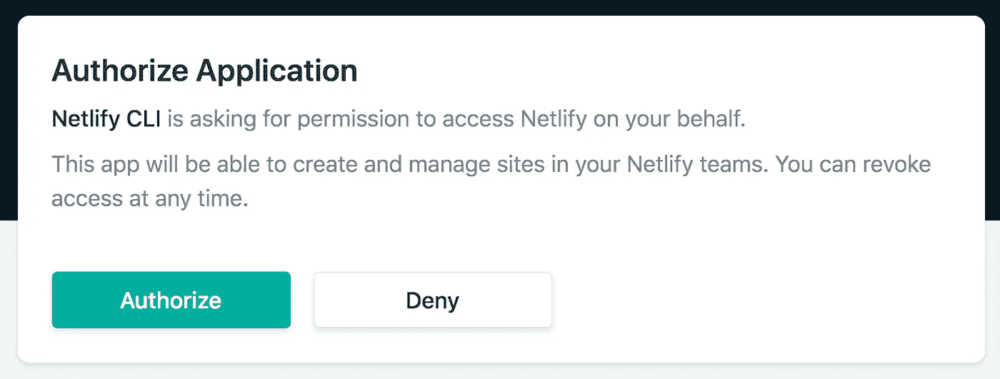

# 如何使用 CI/CD 和 Azure 管道将 Flutter Web 部署到 Netlify

> 原文：<https://levelup.gitconnected.com/how-to-deploy-flutter-web-to-netlify-using-ci-cd-and-azure-pipelines-3831ed096ded>

## 从 Firebase 到 Netlify，一个关于使用 Azure 管道将 Flutter web 部署到 Netlify 的全面指南


Birger Strahl 在 [Unsplash](https://unsplash.com?utm_source=medium&utm_medium=referral) 上拍摄的照片

多年来，开发 web 应用程序变得越来越容易。有了 Flutter，这变得非常容易和有趣。但说实话，部署它有时是一种痛苦。大多数服务还没有为 web 上托管的 Flutter 项目做好准备。当然， ***有些是*** 但是需要一点修修补补。

> 我不介意修修补补，我的意思是…为什么不呢？

在本教程中，我将与您分享如何使用 Azure DevOps 管道在您的 Flutter web 部署上实现 CI/CD。最棒的是，我们将使用 Netlify！为什么我听起来很兴奋？因为说实话，Netlify 非常好用。现在，事不宜迟，让我们开始吧。

# 安装依赖项

在开始之前，我们需要预先安装所需的依赖项。

## 1.安装 Flutter 插件

嗯，你可以使用 DevOps 的 [Flutter 插件](https://marketplace.visualstudio.com/items?itemName=aloisdeniel.flutter)一个开发者已经为我们制作了这个工具。谢谢，[Alois](https://marketplace.visualstudio.com/publishers/aloisdeniel)做了这么繁重的工作！我们可以使用这个工具来达到我们的目的。


获取 Flutter 扩展，它是免费的。图片作者。

点击该按钮后，屏幕上会显示:


在您的组织中安装它。图片作者。

现在你要做的是:

1.  选择您想要安装的**组织**。
2.  单击安装。

## 2.安装 Nelitfy 插件

为 DevOps 安装 [Netlify 插件](https://marketplace.visualstudio.com/items?itemName=aliencube.netlify-cli-extensions)。谢谢， [Aliencube](https://marketplace.visualstudio.com/publishers/aliencube) 做了这么繁重的工作！我们可以使用这个工具来达到我们的目的。


获得 Netlify 扩展，这是免费的。图片作者。

点击该按钮后，屏幕上会显示:


在您的组织中安装它

现在你要做的是:

1.  选择您想要安装的**组织**。
2.  单击安装。

# 创建您的网络生活网站

本节将讨论如何使用 Netlify CLI 创建空的 Netlify 站点。我们将使用 npm 为我们安装它。在我的例子中，我使用 Ubuntu 18.04 作为 npm 安装的主机操作系统。

## 1.安装 Netlify CLI

要安装 Netlify CLI，您只需运行:

```
npm install netlify-cli -g 
```

安装完成后，通过运行以下命令检查安装是否正确:

```
netlify
```

## 2.从 CLI 登录 Netlify

在开始使用 CLI 之前，Netlify 需要您验证自己的身份。

```
netlify login
```

然后会打开一个浏览器窗口:



授权 CLI，图片来自 [Netlify 文档](https://docs.netlify.com/cli/get-started/#obtain-a-token-via-the-command-line)

## 3.创建空白网站

完成登录后，使用以下命令创建一个空白站点:

```
netlify sites:create --name *<site name>*
```

## 4.检索您的站点 ID 和个人访问令牌

要远程运行持续开发，您需要站点 ID 和个人访问令牌来帮助您


在网站设置中检索网站 ID。图片作者。

通过以下方式检索您的站点 ID:

1.  进入站点设置。
2.  复制 API ID 值。

下一步是检索个人访问令牌。


转到用户设置。图片作者。

转到用户设置。


获取新的访问令牌。图片作者。

要获得访问令牌，您必须创建一个新令牌:

1.  转到应用程序选项卡。
2.  点击**新建接入令牌**。

复制并保存下一个屏幕上显示的访问令牌，并保存它，因为您以后会需要它。

# 创建 CI/CD 管道

这部分是我最喜欢的，因为它使用了 Azure DevOps。老实说，我喜欢使用 UI(例如经典编辑器)的管道构建体验。但是你会问，如何使用 Azure DevOps 构建 Flutter 项目呢？

## 1.创建 CI 渠道

如果你使用的是 Azure DevOps，我们无法像 Github、Gitlab 或 Bitbucket 那样从 Netlify 端附加 CI/CD 管道。所以，我们必须自己动手(在一点帮助下做得很好)。


在 Azure DevOps 中创建自己的 CI 管道的步骤。图片作者。

首先，创建您的管道:

1.  点击左侧窗格中的**管道**。
2.  打开**管道**目录。
3.  点击**新建管道**。

Azure DevOps 的美妙之处在于，他们有一个用户界面来处理所有这些，所以你根本不需要使用 YAML。虽然您可以从用户界面生成 YAML 代码。使用经典编辑器，你没有两个记住 YAML 语法，可以很容易地使用可视化的部署步骤。


Meme from [imgflip](https://imgflip.com/memegenerator)

你可以在其他服务中使用 YAML 进行配置，但是让我们面对现实吧，使用 UI 要好得多。要使用 UI 启用管道配置，请在创建管道时单击下面的小**使用经典编辑器**链接:


点击下面的小**使用经典编辑器**链接。图片作者。

选择经典编辑器后，配置您的项目:


图片作者。

需要这些配置来说明您将在管道中使用哪个项目，从以下内容开始:

1.  选择 Azure Repos Git，从 Azure DevOps 中选择存储库。
2.  选择您的团队项目。
3.  选择要配置项的存储库。
4.  选择存储库分支。
5.  单击“继续”。


选择一个空作业。作者提供的图像。

选择**清空作业**按钮，为我们的颤振展开配置创建一个新的开始。


在管道中安装颤振的步骤。作者提供的图像。

**代理工作 1** 出现后，您需要:

1.  点击 **+** 按钮，在管道中增加新任务。
2.  搜索**颤振安装**。
3.  点击**颤振安装**。


添加测试(可选)。作者提供的图像。

在添加了颤振安装之后，我们可以添加颤振测试任务，以便在构建和部署之前在我们的管道中进行测试。但是因为我准备了一个小应用程序，而且我专注于部署，所以我不会将测试添加到任务列表中。


为颤振添加两个命令。作者提供的图像。

接下来，向管道添加两个**颤振命令**任务。仅供参考，任务是有意可视化我们的 CI/CD 管道如何连接的阶段形式。

> 让我们面对现实吧，使用用户界面要好得多。


更改第一个颤振命令任务。作者提供的图像。

第一个**颤振命令**任务将是启用 web 配置(即允许 web 项目的构建)。

1.  点击**颤振命令**任务。
2.  将显示名称更改为**颤振启用网页**(可选)。
3.  添加颤振参数以启用腹板配置:

```
config --enable-web
```


构建一个网络项目。作者提供的图像。

为了构建网络项目，我们必须使用**颤振命令**任务手动运行它。

1.  点击**颤振命令**任务。
2.  将显示名称更改为**颤振运行建立网**(可选)。
3.  添加颤振参数来构建网络项目:

```
build web
```


复制文件。作者提供的图像。

在**新增任务复制文件**:

1.  点击 **+** 按钮，添加新任务。
2.  搜索**复制文件**。
3.  添加**复制文件**任务。


将生成结果复制到生成工件目录。作者提供的图像。

在我们构建项目之后，构建文件将需要被复制到工件目录:

1.  点击**复制文件**任务。
2.  将源文件夹更改为 **$(构建。来源目录)/构建/网站**。
3.  将目标文件夹更改为 **$(构建。ArtifactStagingDirectory)** 。


添加“发布生成工件”任务。作者提供的图像。

向**添加新任务发布构建工件**:

1.  点击 **+** 按钮，添加新任务。
2.  搜索**发布建造神器**。
3.  添加**发布构建工件**任务。


更改工件名称。作者提供的图像。

在添加了**发布构建工件**任务之后，您可以在发布之后更改工件的名称，在本例中，我将其更改为**ci-工件**。


保存 CI 管道。图片作者。

完成所有工作后，保存 CI 管道。

**TL；如果你想使用 YAML，你可以复制并粘贴这个 YAML 文件到这里:**

## 2.创建 CD 管道

持续部署部分将用于将我们的构建直接推送到 Netlify。这部分和 React、Vue、Next、Flutter Web 等大多数 JAMStack apps 类似。Clyde D'Souza 的一篇文章影响了这一部分。但是当然，我稍微修改了一下，因为我们正在使用的项目是一个颤振项目。


创建新的发布管道。图片作者。

打开发布管道，点击屏幕左侧的发布选项卡:

1.  点击标签左侧的**管道**。
2.  打开**释放**。
3.  点击**新建**。
4.  点击**新发布管道**。


创建一个空工单。图片作者。

创建一个空工单。


将 CD 管道与 CI 管道连接起来。图片作者。

将 CD 管道与 CI 管道连接起来:

1.  添加一个工件。
2.  选择您的项目。
3.  选择您的 CI 渠道
4.  添加管道。


启用连续部署触发器。图片作者。

使连续部署触发器在成功构建后启动:

1.  点击闪电图标打开触发页面。
2.  点击**启用**按钮。


将任务添加到 CD 管道。图片作者。

向新的 CD 管道添加新任务:

1.  打开你的**任务**标签。
2.  点击 **+** 按钮。
3.  搜索**提取文件**。
4.  将任务添加到管道中。


根据构建 Id 提取文件。图片作者。

根据构建 Id 提取工件。


添加网络生活任务。图片作者。

向新的 CD 管道添加新任务:

1.  点击 **+** 按钮。
2.  搜索 **Netlify** 。
3.  将**安装 Netlify CLI** 任务添加到管道中。


添加网络部署任务。图片作者。

向新的 CD 管道添加新任务:

1.  点击 **+** 按钮。
2.  搜索 **Netlify** 。
3.  将**部署网站**任务添加到管道中。

要将我们的 CD 管道连接到我们的 Netlify 站点，我们需要有我们的访问令牌和我们的站点 ID。我们利用管道变量使其更易访问，并为令牌提供保密性。


添加两个管道变量来保存您的访问令牌和站点 id。图片作者。

点击两次 **+添加**按钮。


插入变量名及其相应的值。图片作者。

您将看到 4 个输入框。将变量名放在左边的框中，将值放在右边的框中。为了方便起见，将访问令牌变量命名为 PAT，将另一个变量命名为 SiteID。


更改部署参数。图片作者。

更改部署配置:

1.  点击**部署到网络**。
2.  插入您的访问令牌。
3.  插入站点 ID。
4.  选择构建源目录。

你的 CD 管道应该完成了，保存管道，自己试着运行吧！你可以在这里查看我部署的虚拟站点[。](https://miniature-flutter-milkstore.netlify.app/#/)

# 摘要

在本教程中，您已经学习了如何使用 CI/CD 和 Azure DevOps 进行 web 部署。然后我们在 Netlify 上部署了这个站点。

总结一下我们所做的工作:

*   安装了 Flutter 和 Netlify 依赖项。
*   在 Netlify 上创建了一个空白网站。
*   已从 Netlify 中检索到授权令牌和站点 ID。
*   准备 CI/CD 管道。

现在，当您想要自动化部署时，就有了一个开放的行动手册可以使用。在下一篇教程中，我们将探讨如何利用 [Github 动作为 Flutter Web 和 Netlify 创建 CI/CD 管道。](https://link.medium.com/mI4Cq5Y9Acb)