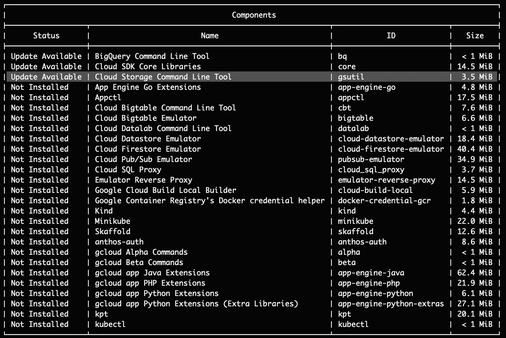

# 如何将 React 应用部署到 Google 云存储中

> 原文：<https://levelup.gitconnected.com/how-to-deploy-react-applications-to-google-cloud-storage-59ac226409d6>


在 2020 年初，我工作的公司开始将我们的应用从我们的内部环境迁移到云中，所以我们选择了 [Google 云平台](https://cloud.google.com/)，因为我们已经在我们的 auth 系统中使用 Firebase SDK。

GCP 文档推荐通过[应用引擎](https://cloud.google.com/appengine)部署静态应用，但是在运行一些测试后，我们发现在应用引擎中运行一个简单的静态应用的成本会很高(非常高)。

由于我们通过 NGINX 运行这个应用程序来提供静态文件，我们希望消除这个“额外”层，完全从云存储中提供服务(也就是谷歌的“S3”)。

# 说够了，让我们开始吧

假设你已经有一个静态应用程序(可以内置在你最喜欢的库中，如 React、Angular 或 Vue)，你需要在你的机器上安装 Cloud SDK。如果您希望使用 CI/CD 环境部署您的应用程序，您将需要一个安装了 Cloud SDK 的 docker 映像。Cloud SDK 是一组命令行工具，用于与您的 GCP 项目进行交互。

*   **如果要从自己的机器上部署:** [如何安装云 SDK](https://cloud.google.com/sdk/docs/downloads-interactive) 。
*   **如果使用的是 CI/CD:**[docker hub Cloud SDK 镜像](https://hub.docker.com/r/google/cloud-sdk/)。

确保您安装了**云存储命令行工具**，在您的终端中运行以下命令:

```
gcloud components list
```

输出将类似于以下内容:



# 获取服务帐户密钥

为了在本地或通过 CI/CD 使用 Cloud SDK，您需要一个服务帐户密钥文件。它可以在你的 GCP 面板中获得。

1.  在主菜单中，转到 **IAM & Admin** 部分；
2.  转到**服务账户**；
3.  点击**+创建服务账户**；
4.  根据需要填写字段；
5.  下载一个 **sa-key.json** 文件的选项会出现，下载并保存到你想要的任何地方。
6.  转到 **IAM** 部分，确保您的服务帐户拥有以下两种权限之一:**存储管理**或**存储对象管理**(或两者都有)。

# 设置您的项目

现在转到您的项目文件夹，我们将开始部署过程。您可以在本地终端中运行以下命令，或者将它们放入**中。yml** 文件(如果你用的是 CI/CD 的话)。

```
gcloud auth activate-service-account key-file path/to/your/sa-key.json
```

这个命令将允许我们使用之前生成的服务帐户密钥与我们的 bucket
进行交互，而不需要使用我们的个人凭证进行身份验证。

如果你正在使用 CI/CD 来部署你的应用，我真的建议你把你的 **sa-key.json** 的内容存储在一个环境变量中。**千万不要将你的服务账户文件放在你的应用程序源代码中。**你的使用环境变量的 YML 脚本应该看起来像下面的例子。


```
gcloud config set project YOUR_PROJECT_ID
```

此命令将为后续命令设置活动项目。项目 ID 是您在 GCP 的项目名称。

```
gsutil rm gs://YOUR_BUCKET_NAME/**
```

可选:上面的命令从存储桶中删除所有旧文件。当您希望在推送新的缓存文件之前删除旧的缓存文件时，这很有用。您可以对整个存储桶、特定文件夹或文件执行此操作，例如:

```
gsutil rm gs://YOUR_BUCKET_NAME/static/**
gsutil rm gs://YOUR_BUCKET_NAME/*.cache.js
```

警告:小心使用 **rm** 命令，确保在运行它们之前知道自己在做什么。

```
gsutil cp -r build-folder/* gs://YOUR_BUCKET_NAME
```

最后，我们将把本地文件同步到我们的存储桶。确保不要忘记 **-r** 参数，因为它将允许我们的本地文件夹和子文件夹被递归地发送到 bucket。

就是这样！

现在你所要做的就是通过你的域名注册服务将你的域名(如果你有)连接到云存储。