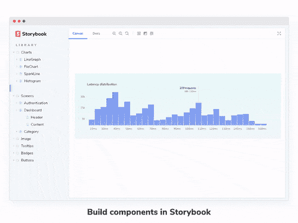
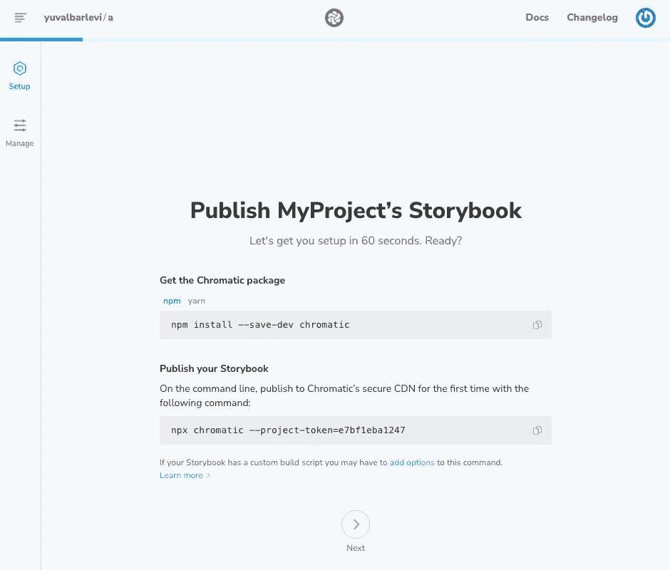
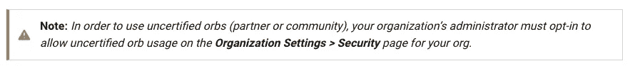

# 如何使用彩色和圆形图标部署故事书

> 原文：<https://levelup.gitconnected.com/how-to-deploy-storybook-with-chromatic-and-circleci-84be5ed51507>

## 让 CircleCI 只部署特定的文件更改可能会很棘手。在本文中，我们将看到如何使用 Chromatic 和 [CircleCI](https://circleci.com/) 为 [Storybook](https://storybook.js.org/blog/why-storybook-in-2022/#:~:text=Storybook%20keeps%20track%20of%20stories&text=That%20helps%20you%20focus%20development,node%20process%20from%20the%20app.) 创建一个自动化的持续部署过程。

# TL；速度三角形定位法(dead reckoning)

如果你正在寻找的只是如何只对特定的文件变化进行部署——参见下面的 **Bash 脚本拯救**部分。

## 介绍

这里的重点是仅当相关文件发生更改时才运行部署过程，这在使用 CircleCI 时可能很棘手。这里的假设是你已经熟悉了 [CircleCI 基础](https://circleci.com/docs/concepts/)。

故事书是提高用户界面组件质量的好方法。它为您的组件提供了可视化的交互式文档，使保持一切一致和最新变得容易。除了在本地运行之外，您还可以使用故事书



[Chromatic](https://www.chromatic.com/) 是故事书用户的专用平台，它自动收集 UI 反馈、视觉测试和文档，将故事书体验提升到一个全新的水平。Chromatic 的文档为创建自动化流程提供了简单的指导。文档涵盖了很多服务，比如 [GitHub Actions](https://github.com/features/actions) 、 [CircleCI](https://circleci.com/) 、 [Tarvis CI](https://www.travis-ci.com/) 等等。

一旦你打开了一个彩色帐户，你就可以创建一个项目并获得一个项目令牌。使用您的项目令牌，您可以通过终端上的一个命令来部署您的故事书。

```
npx chromatic --project-token=YOUR_PROJECT_TOKEN
```



创建一个彩色项目后，您可以用一个命令部署您的故事书。

在接下来的步骤中，我们将看到如何自动化这一过程。

## 基本流程

因为常见的情况是，您想要将 storybook-deploy 作业添加到现有的 CircleCI 配置中，这里假设您已经有了一个基本的 CircleCI 作业并正在运行。如果没有，您可以通过 [CircleCI quickstart](https://circleci.com/docs/getting-started/) 轻松设置。这些步骤包括注册 CircleCI 并为您的项目创建一个 [config.yml](https://circleci.com/docs/introduction-to-yaml-configurations/) ，它将包含您所有的 CircleCI 配置。

然后， [Chromatic documentation](https://www.chromatic.com/docs/circleci) 指定了如何将 storybook 部署添加到您的流程中，分两步:

1.  将您的[色度项目标记](https://www.chromatic.com/docs/setup)设置为 CircleCI 仪表板中的环境变量(在下面的示例中，命名为`PROJECT_TOKEN`)
2.  设置一个`storybook-deployment`作业并将其添加到您的工作流程中

```
# .circleci/config.yml

# Other required configuration

jobs:
  # Other jobs (build, deployment etc.)

  # 👇 Adds Chromatic as a job
  storybook-deployment:
    docker:
      - image: circleci/node:12
    working_directory: ~/repo
    steps:
      - checkout
      - restore_cache:
          keys:
            - v1-dependencies-{{ checksum "package.json" }}
            - v1-dependencies-
      - run: yarn install
        # 👇 Runs the Chromatic CLI
      - run: yarn chromatic --project-token=${PROJECT_TOKEN}

workflows:
  # example for a build and deploy workflow
  build-and-deploy:
    jobs:
       - build
       - deployment
       - storybook-deployment # 👈 Runs the Chromatic job above
```

就是这样！在这些步骤之后，当`storybook-deployment`被触发时，你的工作流应该将 Storybook 部署到 Chromatic。

# 高效地触发故事书部署

到目前为止，通过遵循官方文档，我们得到了一个基本的部署工作流程。
此时，只要`storybook-deployment`被触发，故事书就会被部署。然而，许多代码更改与 Storybook 无关。没有必要为一个自述文件的改变或者一个没有可视化方面的逻辑代码触发`storybook-deployment`。我们希望我们的工作流程更加智能。

在大多数情况下，只有当相关文件已经被更改时，才需要故事书部署**——这意味着我们的 UI 组件文件、我们的故事文件或者故事书配置文件。**

不幸的是， [CircleCI 对您的 git repo](https://discuss.circleci.com/t/how-to-avoid-ci-if-only-certain-files-change/44360/2) 中发生的事情一无所知。有几种方法可以绕过这个限制。

## 动态配置和路径过滤球体

就其本质而言，CircleCI 是静态的和确定性的，但是现在您可以绕过这个限制。2021 年，CircleCI 通过设置工作流引入了[动态配置。在](https://circleci.com/blog/introducing-dynamic-config-via-setup-workflows/)[在你的 Circle 仪表板](https://circleci.com/docs/dynamic-config/#getting-started-with-dynamic-config-in-circleci)中启用这个特性后，你可以开始为你的项目编写动态配置。[主要想法](https://circleci.com/docs/dynamic-config/#how-dynamic-config-works)是——创建一个“设置工作流”,它将创建您的管道配置的外观。[通过动态创建配置，现在可以使用全新的选项](https://circleci.com/blog/building-cicd-pipelines-using-dynamic-config/)。其中之一是路径过滤 orb。

[orb](https://circleci.com/docs/orb-intro/)是可重用的代码片段，有助于自动化重复的过程，加速项目设置，并使其易于与第三方工具集成。CircleCI 维护着一个包含认证、合作伙伴和第三方 orb 的 orb 注册表。[路径过滤](https://circleci.com/developer/orbs/orb/circleci/path-filtering) orb 可与动态配置一起使用，创建仅在某些文件发生变化时触发的工作流。这个球是经过认证的，这意味着它是由 CircleCI 团队编写和测试的，所以它应该是安全的。

然而，当我读到它时，我在想——“等等，对于这样一个简单的需求，听起来需要做很多工作，不是吗？我们想要的是防止`storybook-deployment`进入，除非故事文件已经被改变。我们真的需要这些吗？”

所以我一直在寻找其他选择。

## 使用社区球体

一个更简单的选择是使用社区球。 [Swissknife](https://circleci.com/developer/orbs/orb/roopakv/swissknife#commands-run_if_modified) 是一个社区 orb，它为您的工作流提供了许多常用功能，如 [run_if_modified](https://circleci.com/developer/orbs/orb/roopakv/swissknife#commands-run_if_modified) 。使用这个命令，您可以仅在某些文件被修改时运行一个步骤，这正是我们想要的。

然而，你应该记住以下来自 CircleCI 文档的关于球体的[说明](https://circleci.com/docs/orb-intro/)



> **注意:** *为了使用未经认证的 orb(合作伙伴或社区)，贵组织的管理员必须在贵组织的* ***组织设置>安全性*** *页面上选择允许使用未经认证的 orb。*

因为社区 orb 是由社区编写的，所以应该像对待任何开源代码一样对待这些 orb:考虑到安全性。虽然大多数开源代码都是出于好意编写的，但其中总是存在安全风险。

现在，我们都以这样或那样的方式使用开源代码，所以这并不意味着你不应该使用社区 orb。然而，尽量减少外部依赖性是一个好习惯，尤其是当涉及敏感数据时。

虽然 [Swissknife](https://circleci.com/developer/orbs/orb/roopakv/swissknife#commands-run_if_modified) 看起来是我们这个问题的一个很好的解决方案，但是仅仅使用它来阻止`storybook-deployment`发挥作用似乎有点矫枉过正，尤其是如果你到目前为止还没有在你的项目中使用过未经认证的球体(我就是这种情况)。考虑到这一点，我寻找了一个更简单的解决方案，并最终写了一个。

## 拯救脚本

在寻找解决方案时，我注意到 CircleCI 讨论上的一个[问题，它引导我找到了一个包含 bash 脚本](https://discuss.circleci.com/t/only-kicking-off-if-changes-are-to-a-specific-folder/9711)的[要点。主要思想简单而高效:使用 git 搜索特定路径中的变化:](https://gist.github.com/naesheim/18d0c0a58ee61f4674353a2f4cf71475)

```
# latest commit
LATEST_COMMIT=$(git rev-parse HEAD) # latest commit where path/to/folder1 was changed
FOLDER1_COMMIT=$(git log -1 --format=format:%H --full-diff path/to/folder1)if [ $FOLDER1_COMMIT = $LATEST_COMMIT ]; then
  # do something on change
else
 # do something on unchange
fi
```

`git log`命令[显示 git 提交日志](https://git-scm.com/docs/git-log)。我们可以用它来获得特定文件路径的最后一次提交。如果我们得到的提交等于最近的提交，这意味着最近的提交包含了**文件路径**中的变更。

我们来分析一下上面的代码:

1.  `rev-parse`是一个辅助命令，在我们的例子中用于获得[头](https://stackoverflow.com/questions/2304087/what-is-head-in-git)的提交散列。这个散列然后被保存到 ***最新提交*** 变量
2.  `git log`是用[下面的参数](https://git-scm.com/docs/git-log) :
    `-1` —限制提交输出的次数，所以我们只得到 1 次提交(最新的)
    `-format=format:%H`格式化日志消息，只从消息中返回提交哈希。
    `/path/to/folder1`我们文件的路径
    整个命令得到最后一次提交，包括对`/path/to/folder1`的修改，并保存到 ***文件夹 1_COMMIT*** 变量
3.  最后，我们比较两个哈希值。如果它们相等—最后一次提交包含`/path/to/folder1`中的更改

考虑到这一点，我们只能在某些文件发生变化时调用命令。在我的 React 应用程序中，仅当对以下路径之一进行了更改时，才需要部署:

*   `./.storybook` —故事书配置文件
*   `./src/stories` —故事文件
*   `./src/components` — UI 纯可视化组件，对应故事文件。

我更喜欢将这段代码放在一个单独的文件中，而不是直接放在 CircleCI 的`config.yml`中。我在`.circleci`目录中创建了一个名为`commit-check.sh`的文件。

完整的`commit-check.sh`文件如下所示:

```
set -u
STORYBOOK_DIR="./.storybook"
STORIES_DIR="./src/stories"
UIKIT_DIR="./src/components"# current commit
LATEST_COMMIT=$(git rev-parse HEAD)# latest commit where path "VAR" was changed
STORYBOOK_COMMIT=$(git log -1 --format=format:%H --full-diff $STORYBOOK_DIR)
STORIES_COMMIT=$(git log -1 --format=format:%H --full-diff $STORIES_DIR)
COMPONENTS_COMMIT=$(git log -1 --format=format:%H --full-diff $UIKIT_DIR)CHANGED=0
if [ $STORYBOOK_COMMIT = $LATEST_COMMIT ]; then
    echo "Commit check: files in $STORYBOOK_DIR has changed";
    CHANGED=1
fi
if [ $STORIES_COMMIT = $LATEST_COMMIT ]; then
    echo "Commit check: files in $STORIES_DIR has changed";
    CHANGED=1
fi
if [ $COMPONENTS_COMMIT = $LATEST_COMMIT ]; then
    echo "Commit check: files in $COMPONENTS_COMMIT has changed";
    CHANGED=1
fiif [ $CHANGED -eq 0 ]; then
    echo "Commit check: no storybook changes detected, halt CircleCI agent";
    circleci-agent step halt
fi
```

上面的脚本可以改进，但是为了简单起见，我没有改动。我发现限制进程的最简单的方法是当没有相关文件改变时停止它。CircleCI 包含一个特殊的命令— [步进停止](https://support.circleci.com/hc/en-us/articles/360015562253-Conditionally-End-a-Running-Job-Gracefully)。在文件末尾调用`step halt`命令:

```
circleci-agent step halt
```

`step halt`被调用，CircleCI 将停止当前步骤并结束当前作业。
我已经修改了`config.yml`，所以它将在`storybook-deployment`之前运行:

```
jobs:

  storybook-deployment:
    # ...
    steps:
      # ...
      - run:
          name: Check file diffs
          command: |
            # will end the process when deployment is not required
            .circleci/commit_check.sh
      - run: yarn install
      - run: yarn chromatic --project-token=${PROJECT_TOKEN}
```

就是这样！使用 bash，我们可以完全控制在部署 Storybook 之前检查什么，并且我们可以在不需要部署的时候结束工作。

# 资源

*   [彩色文档— CircleCI 集成](https://www.chromatic.com/docs/circleci)
*   [使用 bash 和 git 比较文件变化](https://gist.github.com/naesheim/18d0c0a58ee61f4674353a2f4cf71475)
*   [CircleCI 通过设置工作流程进行动态配置](https://circleci.com/blog/introducing-dynamic-config-via-setup-workflows/)
*   [CircleCI](https://support.circleci.com/hc/en-us/articles/360015562253-Conditionally-End-a-Running-Job-Gracefully) [—](https://www.chromatic.com/docs/circleci) [停步](https://support.circleci.com/hc/en-us/articles/360015562253-Conditionally-End-a-Running-Job-Gracefully)
*   [circle ci](https://circleci.com/docs/orb-intro/)[—](https://www.chromatic.com/docs/circleci)[宝珠介绍](https://circleci.com/docs/orb-intro/)