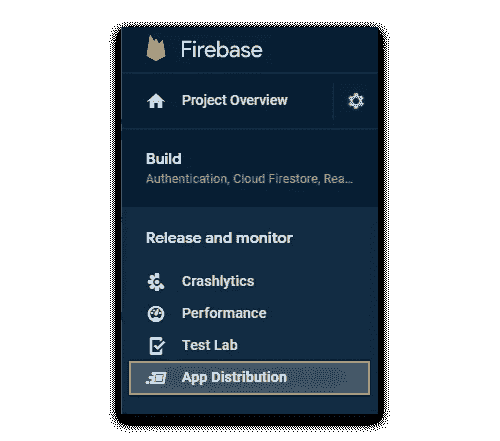
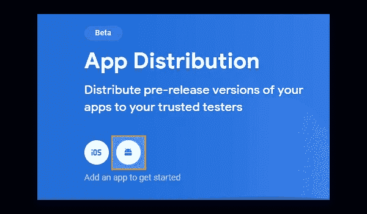
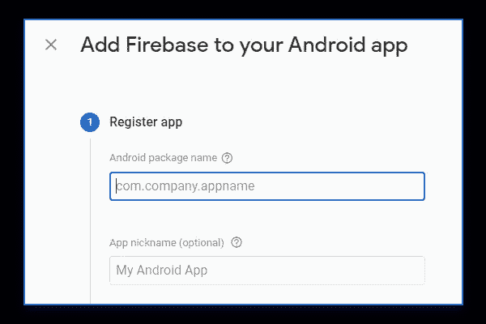

# 如何使用 GitHub 操作部署到 Firebase 应用程序发行版

> 原文：<https://levelup.gitconnected.com/how-to-deploy-to-firebase-app-distribution-with-github-actions-ef2061725cd5>

## 通过自动化您的测试分布，让您的生活更轻松

福托·冯[太空探索技术公司](https://www.pexels.com/de-de/@spacex?utm_content=attributionCopyText&utm_medium=referral&utm_source=pexels)冯[佩克斯](https://www.pexels.com/de-de/foto/himmel-nacht-weltraum-sterne-23764/?utm_content=attributionCopyText&utm_medium=referral&utm_source=pexels)

W 谁没经历过这个问题？您正在努力开发新的 Android 应用程序，并最终达到了您想要向利益相关方展示您的产品的状态。

一种广泛使用的方法是将你的应用上传到[谷歌 Play 商店](https://play.google.com/store)并使用[内部测试功能](https://play.google.com/console/about/internal-testing/)，例如，你可以将你的应用分发给一组可信的测试人员。

您还有机会发送一个直接下载链接到您上传的应用程序文件。

但是这通常是一个巨大的痛苦，特别是如果您没有持续集成(CI ),并且被绑定到手动构建、签名和上传您的文件的过程，并且在最坏的情况下，还要将各自的链接发送给每个测试人员。

这整个手动过程是对时间的巨大浪费。

在本文中，我想向您展示如何通过 Github 工作流设置 CI 来自动化这一过程，并通过[Firebase App Distribution](https://firebase.google.com/docs/app-distribution)自动将您的应用分发到测试组。

作为奖励，我将向您展示如何设置不同的环境类型，以便您拥有一个由 Firebase 发行版托管的开发和生产应用程序。

# 创建 GitHub 存储库

*如果你已经有你的项目在* [*Github 资源库*](https://github.com/) *中，你可以跳过这一步。*

如果你没有帐号，[注册 GitHub](https://github.com/join?ref_cta=Sign+up&ref_loc=header+logged+out&ref_page=%2F&source=header-home) 。成功创建您的帐户后，点击 GitHub 网页右上角的加号图标。

选择“ *new repository* ”并按照步骤创建公共或私有存储库，这取决于您的项目类型。

之后，按照介绍初始化项目文件夹中的 Git 存储库，并将其上传到 GitHub 上刚刚创建的远程存储库。

# 创建一个 Firebase 项目

如果你已经建立了一个 Firebase 项目，你可以跳过这一步。

用你的谷歌账户注册 [Firebase](https://firebase.google.com/) 。之后，去你的[火力基地控制台](https://console.firebase.google.com/?pli=1)。点击*“创建项目”、*，按照上述步骤创建一个新项目。

# 启用 Firebase 分发

现在你已经建立了你的项目，我们需要激活 [Firebase 应用程序分发](https://firebase.google.com/docs/app-distribution)。为此，点击[导航轨道](https://medium.com/codex/android-material-navigation-rail-d44eeb27d111)中的相应条目。

应用程序分发菜单项

由于本文中我们只讨论 Android 应用程序的部署，我们将选择下面屏幕上的 Android 图标。

Firebase 应用程序分发入门

作为第一步，Firebase 将要求您注册您的 Android 应用程序。如果你的项目只存在于本地，没有发布到 Google Play 商店，也不用担心。只需填写您的 Android 项目的包名，添加一个昵称，以便您以后仍然可以正确关联您的应用程序。

注册您的 Android 应用程序

点击*“注册应用”后，*将进入下一步*。*下载提供的 **google-services.json** 文件，并将其放入您的 Android 项目的 app 文件夹中。

> 注意:你可以通过各自的文件浏览器导航到应用程序文件夹，或者直接通过 Android Studio。如果你通过 Android Studio 来做，不要忘记将你的文件树视图切换到**项目**而不是 **Android**

## 将 Firebase 添加到您的 Android 项目

接下来，您需要将 Firebase 添加到您的 Android 项目中。首先，将以下依赖项添加到您的项目级 **build.gradle** 中，您可以在项目的根文件夹中找到它。

既然您已经将所需的资源添加到您的项目 **build.gradle** 中，您可以在应用程序级别的 **build.gradle** 中依赖它们。您可以在各自应用程序的模块中找到该文件。在大多数情况下，这个文件可以在**your-project-folder/app/build . gradle**下找到。在你的应用程序插件下面的某个地方应用 Firebase 应用程序分发插件。

之后，回到 Firebase 控制台中的 Firebase 应用程序分发选项卡，然后单击*“开始”*。现在，您应该可以看到您的项目的应用程序分发版本的概述。

# 创建一个测试组

为了以后将你的 Android 应用分发给一组测试人员，你需要指定谁应该能够访问你的应用。

因此，在 Firebase App Distribution 选项卡仍然打开的情况下，点击**“测试人员和小组”**。点击**“添加组”**，输入**测试团队**作为名称。添加一些您希望将应用程序分发到的电子邮件，然后继续本文的下一步。

# 设置您的 GitHub 秘密

在我们继续设置实际的 CI 之前，我们首先需要获取 Firebase-CI 权限令牌，并将其添加到 Github 库的 secrets 中。没有这一步，我们以后将无法通过持续集成与 Firebase 进行交互。

为此，请安装 [Firebase 命令行界面(CLI)](https://github.com/firebase/firebase-tools) 。当您成功安装了该工具并且可以通过终端访问它时，请键入以下命令。

您的浏览器将弹出，您需要登录与 Firebase 项目相关联的 Google 帐户。登录后，您的 Firebase 访问令牌将被打印到终端上。

复制令牌并打开 GitHub 存储库。转到**设置→机密。**添加一个名为 **FIREBASE_TOKEN** 的新秘密，并将复制的令牌设置为值。

我们想要添加的第二个秘密是您的 Firebase 项目的应用程序 id。您可以在 Firebase 控制台中找到您的应用 id，方法是转到左上角的**项目概述**，单击设置符号并导航到**项目设置**。

向下滚动到底部，复制应用 ID 并将其作为秘密添加到您的 GitHub 存储库中，名称为 **FIREBASE_APP_ID** 。

# 设置 GitHub 操作

现在我们终于到了本教程真正有趣的部分。设置持续集成。因为我们在 GitHub 仓库中托管我们的 Android 项目，我们可以利用 [GitHub 动作](https://docs.github.com/en/actions/learn-github-actions)。

通过使用 GitHub 动作，您可以轻松地设置自动化的工作流，从而促进您的整个开发过程。一个巨大的好处是，你可以将社区提供的 GitHub 动作叠加在一起，而不需要自己编写所有需要的脚本。甚至像谷歌这样的大公司也经常为他们的产品发布 GitHub Actions。

要设置 GitHub Actions 工作流来将 Android 应用程序部署到 Firebase 应用程序发行版，首先在项目的根文件夹中创建一个新文件夹，并将其命名为**。github** 。

在这个文件夹中，创建一个新文件，并将其命名为 **workflow.yml** 。

你在这里看到了什么？

**第 1 行**:为你的整个工作流程设置标题

**第 2–5 行**:通过这些行，您定义了您的工作流应该只在您推送到您的主分支时触发。因为合并总是包括推送，所以当您将您的开发合并到您的主分支中时，这个工作流也将被触发。

**第 7–26 行**:从这一行开始，您可以定义工作流程中应该包含的作业。

**第 8–26 行**:定义构建程序。

**第 9 行**:定义你的工作流在 ubuntu 发行版上运行。

**第 10 行:**从这一行开始，您定义工作流程中应该发生的单个步骤。每一步都可能独立失败。如果第 n 步失败，第 n + 1 步及以后的步骤将自动取消。

**第 11 行**:签出操作将您的存储库签出到您的`$GITHUB_WORKSPACE`下，以便后续的工作流步骤可以访问它。

**第 12–15 行**:用 JDK 1.8 建立您的工作流程，以便稍后构建您的 Android 项目。

**第 16–17 行**:将我们的 **gradlew** 转换为可执行。

**第 18–19 行**:建立我们的 APK 档案。请确保针对您所需的环境使用正确的 Gradle 任务。在这种情况下，工作流正在为开发环境构建一个调试版本。您可以在 Android Studio IDE 右侧的 Gradle 选项卡中查看可用的 Gradle 任务。

**第 20–26 行**:这里我们用的是 wzieba 的[Firebase-Distribution-Github-Action](https://github.com/wzieba/Firebase-Distribution-Github-Action)。如您所见，这里我们使用了在上一步中添加的秘密。确保您已经设置了正确的**文件**参数。它应该针对您的**的实际输出目录。apk** 文件。此外，验证**的名称。apk** 文件设置正确。您可能认识到,“groups”参数被设置为我们之前创建的测试组。

# 如何访问智能手机上的应用程序

如果您现在推送至您的主分支机构，将会自动触发工作流。该工作流将构建一个。apk 文件，并将其上传到您的 Firebase 应用程序分发项目。

因为您将 groups 参数设置为您的测试组，所以所有添加的电子邮件都将收到 Android 应用程序的邀请通知。然后，您可以下载 [App Tester app](https://firebase.google.com/docs/app-distribution/android/set-up-for-testing) 并访问您的应用。

# 结论

GitHub Actions 与 Firebase 应用程序分发相结合，提供了一种易于设置的方法，用于将您的 Android 应用程序提供给一组用户，您希望将您的应用程序用于测试目的。

通过使用预构建的 GitHub 动作来自动化这种部署，您可以节省大量时间和压力。

如果扩展我在这里展示的方法，您还可以设置更复杂的管道，集成代码质量或单元测试的测试步骤，等等。

***喜欢我的文章就鼓掌，关注更多！***

 [## 如何用 Spring Boot、Docker、Google Cloud Run 设置 MongoDB Atlas

### 立即开始您的谷歌云部署之旅

levelup.gitconnected.com](/how-to-set-up-mongodb-atlas-with-spring-boot-docker-and-google-cloud-run-60b51dfbddc0)  [## Android Studio Kotlin 实时模板

### 如何使用实时模板让 Android 开发人员的生活更加轻松

medium.com](https://medium.com/geekculture/android-studio-kotlin-live-templates-fb7397f36c39)