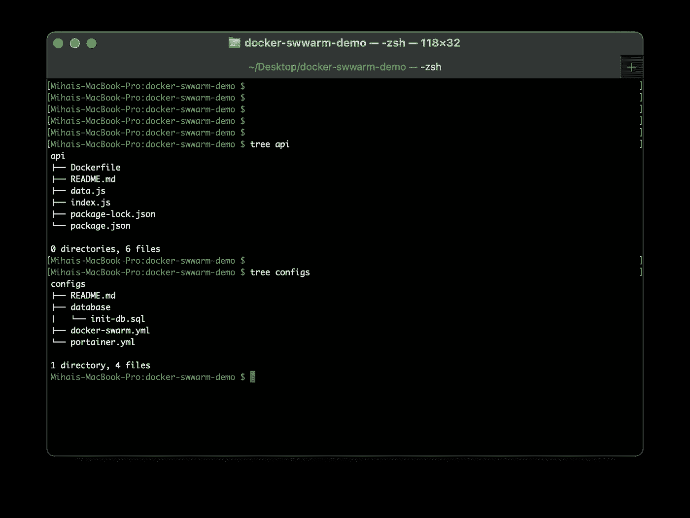
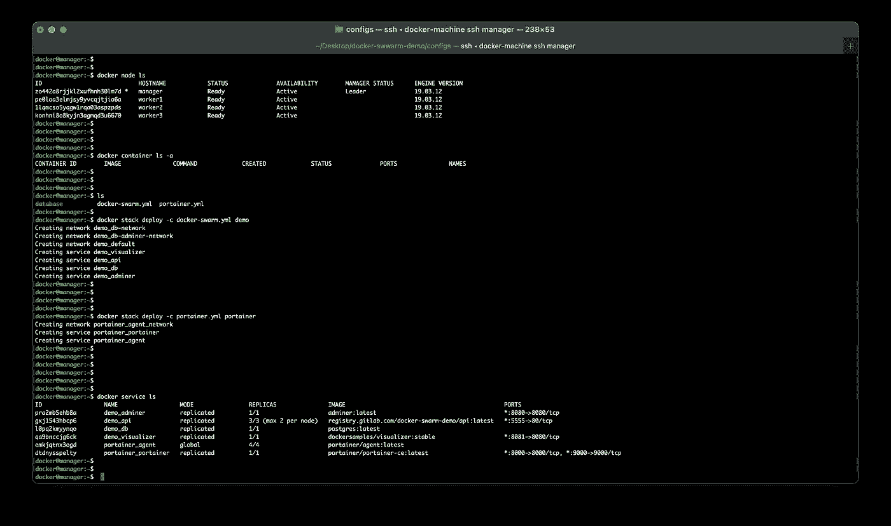
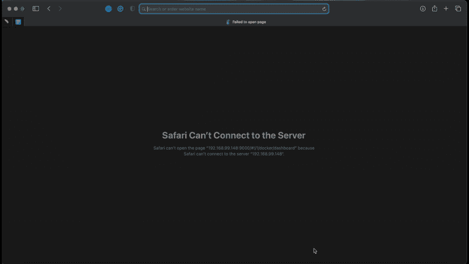
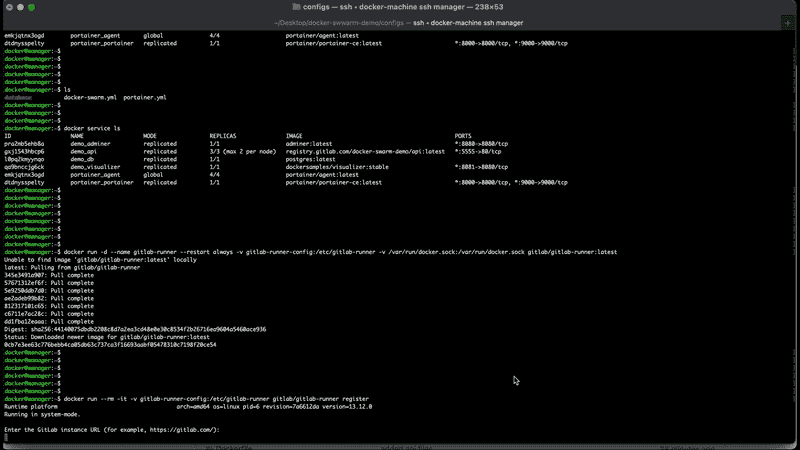
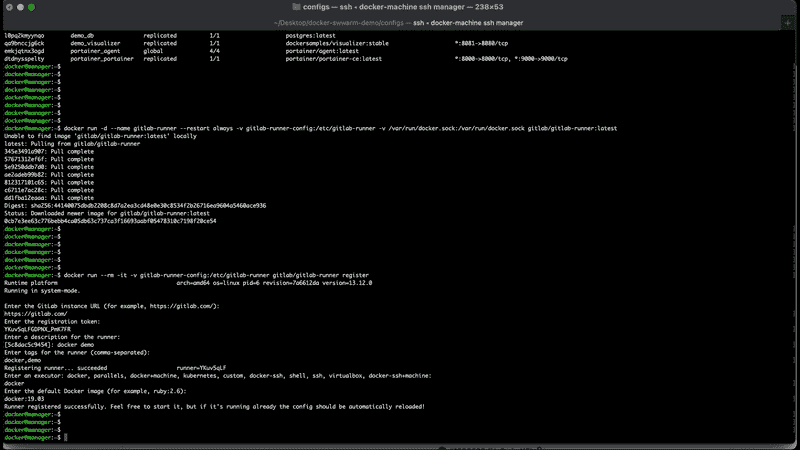
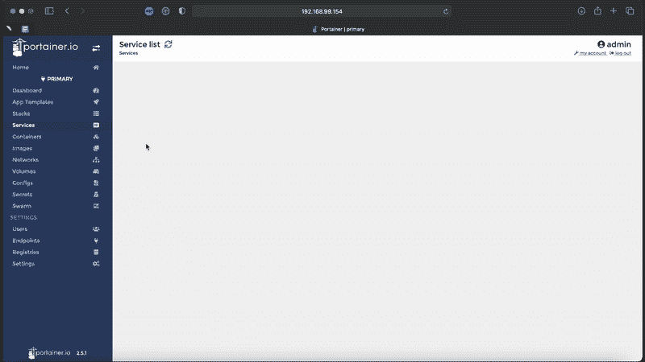
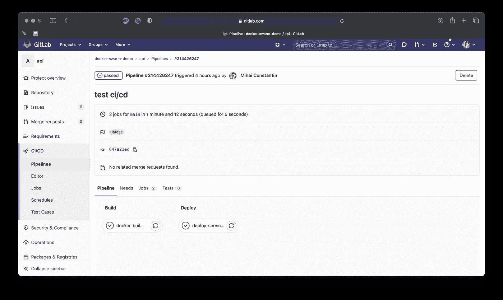

# 如何在 GitLab 中部署应用程序

> 原文：<https://levelup.gitconnected.com/how-to-deploy-your-application-in-gitlab-ddae3c11c93e>

## 使用 GitLab 管道测试您的应用程序


照片由[数码 Buggu](https://www.pexels.com/@digitalbuggu?utm_content=attributionCopyText&utm_medium=referral&utm_source=pexels) 从 [Pexels](https://www.pexels.com/photo/colorful-toothed-wheels-171198/?utm_content=attributionCopyText&utm_medium=referral&utm_source=pexels) 拍摄

在这个循序渐进的教程中，我将向你展示如何在 [GitLab](https://about.gitlab.com/) 中使用管道部署一个简单的应用程序。

这是关于在集群中部署应用程序的文章的第二部分。查看第一部分以获得更多说明。

[](/how-to-deploy-your-application-using-docker-swarm-598478446c03) [## 如何使用 Docker Swarm 部署应用程序

### 了解如何使用 Docker Swarm 将您的应用程序部署到集群中。

levelup.gitconnected.com](/how-to-deploy-your-application-using-docker-swarm-598478446c03) 

## 目录

∘ [项目结构](#4ec1)
∘[portainer](#69cb)
∘[创建并注册 git lab runner](#89c1)
∘[git lab ci/CD](#eaeb)
∘[测试管道](#d87e)
∘ [结论](#afa3)

## 项目结构

与第一部分相比，我们将代码分成一个组中的两个不同的存储库。我们有一个 api 存储库，其中包含我们的业务逻辑代码，还有另一个 repo，configs，其中包含 YML 文件和数据库初始化文件。



作者拍摄的照片:项目结构

## 便携式集装箱

此时，我们已经如上所述准备好了设置。除此之外，我们将为 [Portainer](https://www.portainer.io/) 创建另一个服务堆栈。这是在集群中可视化我们的服务的一个很好的工具。与 [visualizer](https://hub.docker.com/r/dockersamples/visualizer) 相比，它有很多管理容器化应用的特性。我们将使用 Portainer 将我们的 api 服务链接到 GitLab YML 文件，以自动触发管道。

下面详细介绍了 Portainer 的 YML 文件。我们有两个服务:一个代理和将在 manager 节点上运行的实际 portainer 容器。

现在，我们可以从 manager 节点执行以下命令:

```
docker@manager:~$ docker stack deploy -c portainer.yml portainer
```

正如您在下面的图片中看到的，我们所有的服务都在经理和三个工作人员内部启动并运行。



作者拍摄的照片:我们应用程序的所有服务都已启动并运行

我们可以在浏览器中检查服务是否被正确地放置到不同的机器上。



作者拍摄的截屏。我被迫将视频转换成 GIF 格式以便播放，所以请忍受这种怪异的质量。

## 创建并注册 GitLab Runner

首先，我们需要从 manager 节点创建一个 GitLab Runner，并将其注册到我们的应用程序中。

```
docker@manager:~$ docker run -d --name gitlab-runner --restart always -v gitlab-runner-config:/etc/gitlab-runner -v /var/run/docker.sock:/var/run/docker.sock gitlab/gitlab-runner:latestdocker@manager:~$ docker run --rm -it -v gitlab-runner-config:/etc/gitlab-runner gitlab/gitlab-runner register
```

注册过程可以在下面的视频中看到。我们使用来自 GitLab 帐户和 docker:19.03 的令牌。



作者拍摄的截屏。我被迫将视频转换成 GIF 格式以便播放，所以请忍受这种怪异的质量。

接下来，我们需要修改 gitlab-runner-config 卷中 config.toml 文件的内容。为此，我们需要 root 访问权限。我们将 privileged 属性设置为 true，并将/var/run/docker.sock 添加到卷数组中。之后，我们必须重置流道。这个过程显示在下面的视频中。



作者拍摄的截屏。我被迫将视频转换成 GIF 格式以便播放，所以请忍受这种怪异的质量。

## GitLab CI/CD

我们剩下要做的就是。我们管道的 gitlab-ci.yml 文件。我们坚持一个简单的方法，分为两个阶段:一个阶段用于构建，另一个阶段用于部署。我们只为主分支触发管道，并注意使用创建流道时使用的相同标记。

在部署阶段，curl 命令的 URL 取自 Portainer 仪表板的 api 服务。程序如下所示。



作者拍摄的截屏。我被迫将视频转换成 GIF 格式以便播放，所以请忍受这种怪异的质量。

## 测试管道

现在，我们已经准备好测试管道是否工作。我们只需要从主分支上的本地 api 存储库中推送一些更改。正如您在下图中看到的，2 阶段管道已成功运行。



作者拍摄的照片:测试管道

## 结论

教程到此结束。如您所见，在集群中部署应用程序不需要很多资源。例如，这可以在本地使用 [docker-machine](https://docs.docker.com/machine/) 来完成，也可以在云中使用 [Play with Docker](https://labs.play-with-docker.com/) 来完成。

感谢阅读我的文章。我希望你喜欢它并且学到一些新的东西。

在 [GitLab](https://gitlab.com/docker-swarm-demo) 上查看项目。